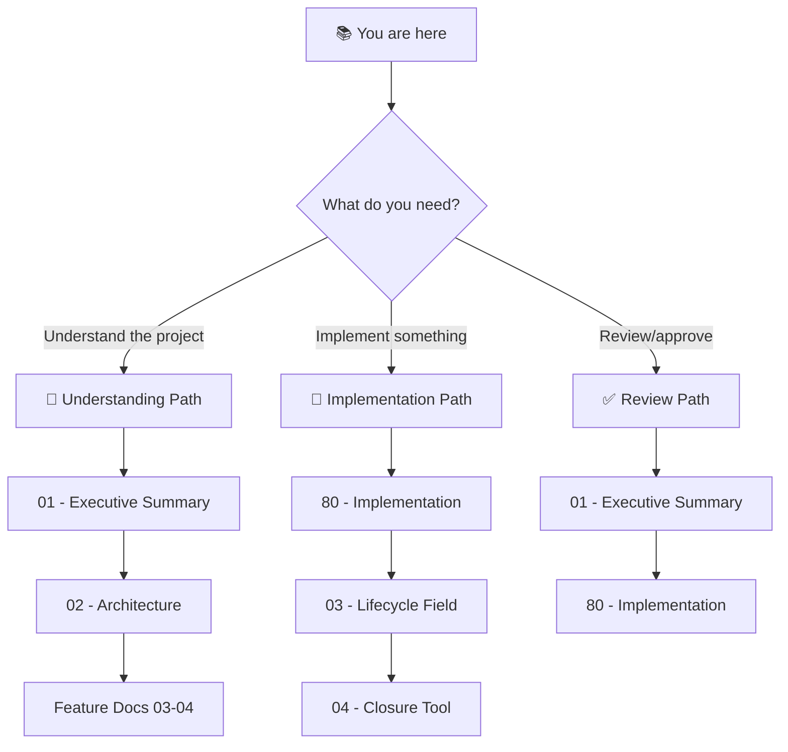

# 🎯 Layer Taxonomy & Production Readiness: Project Blueprint

> *With UV migration and framework modernization complete, focus on dependency closure validation and layer enforcement for production builds.*

**Document Type:** Technical Design Document / Project Blueprint  
**Version:** 5.0  
**Created:** 2026-01-07  
**Updated:** 2026-02-02  
**Status:** 🔄 Partially Complete

---

## 🔗 Prerequisite Blueprints (✅ COMPLETE)

> ✅ **[UV Migration](../uv_migration/00_index.md)** — COMPLETED 2026-02-01
> - Per-module pyproject.toml generation ✅
> - Root workspace configuration ✅
> - Path hack elimination ✅
>
> ✅ **[Framework Modernization](../framework_modernization/00_index.md)** — COMPLETED 2026-02-02
> - CLI entry point (`adhd` command) ✅
> - init.yaml sunset (all deleted) ✅
> - Bootstrap removal ✅

---

## 📊 Progress Overview

| Phase | Status | Goal |
|-------|--------|------|
| **PREREQ:** [UV Migration](../uv_migration/) | ✅ [DONE] | Per-module pyproject.toml, root workspace, **eliminate path hacks** |
| **PREREQ:** [Framework Modernization](../framework_modernization/) | ✅ [DONE] | CLI entry point, init.yaml sunset, bootstrap removal |
| P0: Layer Taxonomy | 🔄 [WIP] | `layer` field on all modules (3/15 done) |
| P1: Dependency Closure Tool | ⏳ [TODO] | `adhd deps --closure` command |
| P1: CLI Filter System | ⏳ [TODO] | `-i/-r/-x` flags with layer inheritance |
| P1.5: Tab Completion | ⏳ [TODO] | `argcomplete` for module names and filters (P2 priority) |
| P2: CLI Migration | ✅ [DONE] | New `adhd` entry point via pyproject.toml |
| P3: init.yaml Deprecation | ✅ [DONE] | All init.yaml files deleted, `[tool.adhd]` is source of truth |

### Status Legend

| Icon | Meaning |
|------|---------|
| ⏳ | TODO |
| 🔄 | WIP |
| ✅ | DONE |
| 🚫 | CUT |

---

## 📐 Planning Standards

This blueprint follows **HyperDream phasing rules**:

| Principle | Meaning |
|-----------|---------|
| **Walking Skeleton First** | Phase 0 proves plumbing works with hardcoded stubs |
| **Difficulty Honesty** | Each item labeled `[KNOWN]`, `[EXPERIMENTAL]`, or `[RESEARCH]` |
| **Research ≠ Foundation** | `[RESEARCH]` items never in Phase 0 |
| **No Side-by-Side Mess** | Transform ALL modules per phase, then remove old code |
| **Incremental Value** | Each phase delivers usable functionality |

---

## 📑 Document Index

### Prerequisite Blueprints (✅ COMPLETE)

| # | Document | Status | Purpose (When to Read) |
|---|----------|--------|------------------------|
| ↗️ | [UV Migration Blueprint](../uv_migration/00_index.md) | ✅ [DONE] | pyproject.toml generation, path hacks eliminated |
| ↗️ | [Framework Modernization](../framework_modernization/00_index.md) | ✅ [DONE] | CLI entry point, init.yaml sunset |

### This Blueprint

| # | Document | Status | Purpose (When to Read) |
|---|----------|--------|------------------------|
| 00 | [Index](./00_index.md) | — | **Navigation hub** — Start here if lost |
| 01 | [Executive Summary](./01_executive_summary.md) | ✅ | **Vision & scope** — Layer taxonomy & production readiness |
| 02 | [Architecture](./02_architecture.md) | ✅ | **System design** — pyproject.toml as single source, filter system |
| 04 | [Feature: Layer Taxonomy](./04_feature_layer_taxonomy.md) | 🔄 [WIP] | `[tool.adhd].layer` field — 3/15 modules done |
| 05 | [Feature: Dependency Closure Tool](./05_feature_dependency_closure_tool.md) | ⏳ [TODO] | **REMAINING WORK** — adhd deps --closure |
| 06 | [Feature: CLI Filter System](./06_feature_cli_migration.md) | ⏳ [TODO] | Unified filter system with layer inheritance |
| 07 | [Feature: init.yaml Deprecation](./07_feature_init_yaml_deprecation.md) | ✅ [DONE] | init.yaml deleted — **IMPLEMENTED** |
| 80 | [Implementation](./80_implementation.md) | 🔄 | **Task tracking** — P0 + P1 remaining |

---

## 💭 Vision Statement

> *"✅ UV migration complete. 🔄 Layer taxonomy in progress (3/15 modules). ✅ CLI uses `adhd` command. ✅ init.yaml deleted. ⏳ **Remaining: Complete layer field deployment, then build closure validation tool.**"*

---

## 🔑 Problems & Solutions Status

| # | Problem | Status | Solution |
|---|---------|--------|----------|
| 1 | **No Layer Selection** | 🔄 WIP | Modules have `[tool.adhd].layer` field (3/15 done) |
| 2 | **No Dependency Validation** | ⏳ **TODO** | `adhd deps --closure` validates |
| 3 | **Legacy CLI** | ✅ SOLVED | New `adhd` CLI entry point in pyproject.toml |
| 4 | **Dual Metadata** | ✅ SOLVED | init.yaml deleted, `[tool.adhd]` is source of truth |

> **Note:** Path hack elimination, pyproject.toml generation, and workspace setup are handled by the [UV Migration Blueprint](../uv_migration/) prerequisite.

---

## 🧭 How to Navigate This Blueprint

### Reading Order Decision Tree

### Document Purpose Quick Reference

| Doc | When to Read | One-Line Purpose |
|-----|--------------|------------------|
| **00 - Index** | First visit, lost | Navigation hub, project overview |
| **01 - Exec Summary** | Deciding whether to work on this | Goals, non-goals, scope, success metrics |
| **02 - Architecture** | Understanding system design | File responsibilities, uv workspace, three-layer model |
| **03 - Layer Taxonomy** | Implementing init.yaml changes | The `layer` field schema, validation |
| **04 - Closure Tool** | Implementing deps command | Cross-layer violation detection |
| **05 - uv Migration** | Setting up per-module pyproject.toml | uv workspace structure, extras |
| **06 - CLI Migration** | Implementing new CLI entry point | New `adhd` command, command mapping |
| **80 - Implementation** | Starting work, tracking progress | P0-P3 phased tasks, verification steps |

---

## [Custom] 🎨 Module Layer Classification

Quick reference for the three-layer loading model:

| Layer | Example Modules | Load When |
|-------|-----------------|-----------|
| **Foundation** | exceptions_core, yaml_reading_core, modules_controller_core, workspace_core, logger_util, config_manager | Always first |
| **Runtime** | session_manager, auth_manager, animenest_api_plugin | Production + Dev |
| **Dev** | questionary_core, module_creator_core, project_creator_core, hyperpm_core | Dev only |

See [02_architecture.md](./02_architecture.md) for full details.

---

**← Back to:** [Day Dream Index](../README.md)
