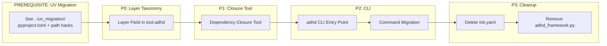

# 01 - Executive Summary

> Part of [Layer Taxonomy & Production Readiness Blueprint](./00_index.md)

---

## 🔗 Prerequisites (✅ COMPLETE)

> ✅ **[UV Migration](../uv_migration/)** — COMPLETED 2026-02-01
> - Per-module pyproject.toml generation ✅
> - Root workspace configuration ✅  
> - Path hack elimination (`sys.path.insert()` removal) ✅
> - Import path migration (`from managers.x` → `from x`) ✅
>
> ✅ **[Framework Modernization](../framework_modernization/)** — COMPLETED 2026-02-02
> - CLI entry point (`adhd` command) ✅
> - init.yaml sunset (all files deleted) ✅
> - Bootstrap removal ✅

---

## 📖 The Story

### 😤 The Pain (After UV Migration)

```
Remaining Problems (with UV migration complete):
┌─────────────────────────────────────────────────────────────────┐
│  1. NO LAYER SELECTION                                          │
│  ┌──────────────────────────────────────────────────────────┐   │
│  │  # Modules have pyproject.toml but no layer metadata     │   │
│  │  # Can't distinguish foundation vs runtime vs dev        │   │
│  │  # questionary_core loads in prod (it's for dev!)        │   │
│  └──────────────────────────────────────────────────────────┘   │
│  💥 Dev modules load in prod                                    │
│  💥 No way to mark modules as "don't install me in prod"        │
│                                                                 │
│  2. NO DEPENDENCY VALIDATION                                    │
│  ┌──────────────────────────────────────────────────────────┐   │
│  │  # Runtime module depending on dev module?               │   │
│  │  # Nothing validates cross-layer violations              │   │
│  └──────────────────────────────────────────────────────────┘   │
│  💥 Cross-layer violations go undetected                        │
│  💥 Prod builds might pull in dev dependencies accidentally     │
│                                                                 │
│  3. LEGACY CLI                                                  │
│  `python adhd_framework.py create-project` ◀── Not ergonomic   │
│  💥 Long invocation, no shell completion                        │
│  💥 Bootstrap magic still lingers                               │
│                                                                 │
│  4. DUAL METADATA FILES                                         │
│  ┌──────────────────────────────────────────────────────────┐   │
│  │  # init.yaml still exists with redundant metadata        │   │
│  │  # pyproject.toml has dependencies but not ADHD metadata │   │
│  └──────────────────────────────────────────────────────────┘   │
│  💥 Two sources of truth = confusion                            │
│  💥 Which file has the correct version?                         │
└─────────────────────────────────────────────────────────────────┘
```

| Who Hurts | Pain Level | Frequency | Root Cause |
|-----------|------------|-----------|------------|
| Production apps | 🔥🔥🔥 High | Every deploy | No layer separation |
| Module developers | 🔥🔥 Medium | Layer violations | No closure validation |
| New contributors | 🔥🔥 Medium | Onboarding | Dual metadata confusion |
| Anyone using CLI | 🔥 Low | Daily | Legacy invocation |

### ✨ The Vision

```
After This Blueprint (with UV migration already done):
┌─────────────────────────────────────────────────────────────────┐
│  1. LAYER SELECTION WORKS                                       │
│  ┌──────────────────────────────────────────────────────────┐   │
│  │  [tool.adhd]                                             │   │
│  │  layer = "runtime"  # or "foundation" or "dev"           │   │
│  └──────────────────────────────────────────────────────────┘   │
│  ✅ `uv sync` → foundation + runtime only                       │
│  ✅ `uv sync --extra dev` → all modules                         │
│                                                                 │
│  2. CROSS-LAYER VIOLATIONS DETECTED                             │
│  ┌──────────────────────────────────────────────────────────┐   │
│  │  $ adhd deps --closure session_manager                   │   │
│  │  ✅ session_manager [runtime]                            │   │
│  │    └─ config_manager [foundation] ✅                     │   │
│  │    └─ logger_util [foundation] ✅                        │   │
│  │  No violations found.                                    │   │
│  └──────────────────────────────────────────────────────────┘   │
│  ✅ Closure tool validates dependencies before deploy           │
│  ✅ CI fails if runtime module depends on dev module            │
│                                                                 │
│  3. MODERN CLI                                                  │
│  `adhd create-project` ◀── Clean, ergonomic                    │
│  ✅ Shell completion works                                      │
│  ✅ No bootstrap magic                                          │
│                                                                 │
│  4. SINGLE SOURCE OF TRUTH                                      │
│  ✅ init.yaml DELETED                                           │
│  ✅ All metadata in pyproject.toml [tool.adhd]                  │
└─────────────────────────────────────────────────────────────────┘
```

### 🎯 One-Liner

> With UV migration complete, we add layer taxonomy to pyproject.toml, build a closure validation tool, migrate to a modern CLI, and finally delete init.yaml—achieving production-only installs and a single source of truth.

---

## 🔧 The Spec

---

## 🌟 TL;DR

With UV migration complete (modules have pyproject.toml, path hacks eliminated), this blueprint adds layer taxonomy (`[tool.adhd].layer = foundation/runtime/dev`) for production-only installs, implements a closure validation tool to catch cross-layer violations, adds a unified CLI filter system with layer inheritance (`-i runtime` includes foundation), and finally deprecates init.yaml entirely.

**Key Additions:**
- **Layer Inheritance:** `-i runtime` filter includes both runtime AND foundation modules
- **Stateless Workspace:** `adhd workspace generate -i runtime` replaces `show_in_workspace` field
- **Filter Discovery:** `adhd list --show-filters` shows available filter values
- **Tab Completion:** `argcomplete` integration for module names and filter values (P2)

---

## 🎯 Problem Statement

After UV migration completes, these issues remain:

| Problem | Symptom | Root Cause |
|---------|---------|------------|
| **No Layer Selection** | Dev modules load in prod | No `layer` metadata |
| **No Cross-Layer Validation** | Runtime depends on dev module | No closure tool |
| **Legacy CLI** | `python adhd_framework.py` | No modern entry point |
| **Dual Metadata** | init.yaml still exists | Incomplete migration |

**The fix: Complete the migration with layer taxonomy, closure validation, CLI, and cleanup.**

---

## 🔍 Prior Art & Existing Solutions

| Library/Tool | What It Does | Decision | License | Rationale |
|--------------|--------------|----------|---------|-----------|
| uv workspaces | Monorepo package management | **ADOPT** | MIT | Fast, modern, editable installs eliminate path hack |
| Python extras_require | Optional dependency groups | **ADOPT** | N/A | Native Python, enables layer selection |
| Cargo workspaces | Multi-crate package management | REFERENCE | N/A | Inspiration for monorepo structure |
| `[project.scripts]` | CLI entry points | **ADOPT** | N/A | Standard Python CLI pattern |
| pyproject.toml metadata | Package metadata spec (PEP 621) | **ADOPT** | N/A | May replace init.yaml entirely |

---

## 🔄 Gradual Transformation Strategy

### The Anti-Pattern: Side-by-Side Mess

```
❌ WRONG: Supporting both systems indefinitely
┌────────────────────────────────────────────────────────────────┐
│  # Don't do this:                                              │
│  if os.path.exists("pyproject.toml"):                          │
│      # New way                                                 │
│  else:                                                         │
│      # Old way via init.yaml                                   │
│                                                                │
│  💥 Doubles testing surface                                    │
│  💥 Bug fixes need two implementations                         │
│  💥 "Which system is this module using?"                       │
└────────────────────────────────────────────────────────────────┘
```

### The Pattern: Progressive Transformation

```
✅ RIGHT: Each phase FULLY transforms, then we move on
┌────────────────────────────────────────────────────────────────┐
│  P0: uv Migration + Path Hack Elimination                      │
│      → Generate pyproject.toml for ALL modules                 │
│      → DELETE all sys.path.insert() hacks                      │
│      → Modules become real packages via editable install       │
│                                                                │
│  P1: Layer Taxonomy                                            │
│      → Add [tool.adhd].layer to ALL pyproject.toml             │
│      → Closure tool validates layer violations                 │
│      → Layer selection via uv extras works                     │
│                                                                │
│  P2: CLI Migration                                             │
│      → New `adhd` CLI entry point                              │
│      → All commands migrated                                   │
│                                                                │
│  P3: init.yaml Deprecation                                     │
│      → DELETE all init.yaml files                              │
│      → [tool.adhd] is the only metadata source                 │
└────────────────────────────────────────────────────────────────┘
```

**Key Principle:** No feature flag that keeps old behavior alive. Transform all, verify all, then remove old code entirely.

---

## 🔬 Can pyproject.toml Replace init.yaml Entirely?

### Current init.yaml Fields

| Field | Purpose | pyproject.toml Location |
|-------|---------|------------------------|
| `version` | Module version | `[project].version` |
| `type` | core/manager/util/plugin/mcp | `[tool.adhd].type` |
| `layer` | foundation/runtime/dev | `[tool.adhd].layer` |
| `repo_url` | Git source for module | `[tool.adhd].repo_url` |
| `feature` | Feature group (NEW) | `[tool.adhd].feature` |
| `tags` | Expandable tags | `[tool.adhd].tags` |
| `requirements` | ADHD module deps | `[project].dependencies` |
| `testing` | HyperRed test scope | `[tool.adhd].testing` |
| ~~shows_in_workspace~~ | ~~VS Code workspace~~ | **REMOVED** |
| ~~folder_path~~ | ~~Legacy~~ | **REMOVED** |

### Verdict: **YES, with [tool.adhd] section**

```toml
# managers/session_manager/pyproject.toml (COMPLETE REPLACEMENT)
[project]
name = "session-manager"
version = "0.1.0"
requires-python = ">=3.10"
dependencies = [
    "config-manager",
    "logger-util",
    "pydantic>=2.0",
]

[tool.adhd]
type = "manager"
layer = "runtime"
repo_url = "https://github.com/org/session_manager.git"
feature = "auth"  # Groups this module with other auth-related modules
tags = []  # Expandable, normally empty

[tool.adhd.testing]
has_tests = true
threat_model = "external"

[build-system]
requires = ["hatchling"]
build-backend = "hatchling.build"
```

### Migration Path

| Phase | init.yaml Status | pyproject.toml Status |
|-------|------------------|----------------------|
| P0 | **Unchanged** | **Create** for all modules + `[tool.adhd]` |
| P1 | **Unchanged** | **Add** `layer` field to `[tool.adhd]` |
| P2 | **Unchanged** | **Unchanged** |
| P3 | **DELETED** | **Only metadata file** |

**Recommendation:** Full deprecation of init.yaml in P3. All ADHD-specific metadata moves to `[tool.adhd]`.

---

## ❌ Non-Goals (Explicit Exclusions)

| Non-Goal | Rationale |
|----------|-----------|
| Compile-time tree-shaking | Standard Python doesn't support this |
| Auto-clone self-healing | Explicit is better than implicit; removed entirely |
| Side-by-side old/new code paths | Transformation must be complete per phase |
| Publishing to PyPI | Modules are local path deps, not public packages |
| Supporting Python <3.10 | uv requires modern Python |
| Keeping init.yaml forever | Deprecated in P3, replaced by pyproject.toml |

---

## ✅ Features Overview

> **Prerequisite:** [UV Migration Blueprint](../uv_migration/) must be completed first.

| Priority | Feature | Difficulty | Description |
|----------|---------|------------|-------------|
| P0 | Layer Taxonomy Field | `[KNOWN]` | Add `layer` field to `[tool.adhd]` in pyproject.toml |
| P1 | Dependency Closure Tool | `[KNOWN]` | `adhd deps --closure <module>` with layer violation detection |
| P2 | New `adhd` CLI Entry Point | `[KNOWN]` | `[project.scripts]` entry point in root pyproject.toml |
| P2 | CLI Command Migration | `[KNOWN]` | Migrate all commands from adhd_framework.py |
| P3 | Deprecate init.yaml | `[KNOWN]` | All metadata in `[tool.adhd]`, init.yaml deleted |
| P3 | Remove adhd_framework.py | `[KNOWN]` | Bootstrap/auto-clone logic fully removed |

→ See individual feature docs for details:
- [04_feature_layer_taxonomy.md](./04_feature_layer_taxonomy.md) — P0: layer classification
- [05_feature_dependency_closure_tool.md](./05_feature_dependency_closure_tool.md) — P1: closure validation
- [06_feature_cli_migration.md](./06_feature_cli_migration.md) — P2: new CLI
- [07_feature_init_yaml_deprecation.md](./07_feature_init_yaml_deprecation.md) — P3: cleanup

---

## [Custom] 📊 Success Metrics

> **Note:** Path hack elimination, import style, and onboarding metrics are tracked in [UV Migration Blueprint](../uv_migration/).

| Metric | Before | After |
|--------|--------|-------|
| Layer metadata | ❌ No `layer` field | ✅ All modules have `[tool.adhd].layer` |
| Cross-layer validation | ❌ None | ✅ `adhd deps --closure` catches violations |
| Dev tools in prod | ❌ Always loaded | ✅ Excluded via `--extra dev` |
| Metadata files | ❌ init.yaml + pyproject.toml | ✅ pyproject.toml only |
| CLI invocation | ❌ `python adhd_framework.py` | ✅ `adhd <command>` |

---

## [Custom] ⚰️ Assumption Graveyard

> **Note:** UV migration assumptions are tracked in [UV Migration Blueprint](../uv_migration/).

| Assumption | Risk Level | Validation Strategy |
|------------|------------|---------------------|
| pyproject.toml can hold all init.yaml data | 🔥 Low | `[tool.adhd]` is standard pattern |
| No runtime module depends on dev-only | 🔥🔥 High | Closure tool is P1 for validation |
| Layer classification is straightforward | 🔥 Medium | Audit and classify each module |
| CLI migration won't break workflows | 🔥 Medium | Feature flag for rollback |

---

## [Custom] 🔀 Phase Dependency Graph



**Why UV Migration is prerequisite:**
- Layer taxonomy needs somewhere to live → `[tool.adhd].layer` in pyproject.toml
- Closure tool needs to read metadata → reads from pyproject.toml
- No point adding `layer` to init.yaml then immediately moving it

---

## ✅ Executive Summary Validation Checklist

### Narrative Completeness
- [x] The Story section clearly states user problem and value
- [x] Intent is unambiguous to a non-technical reader
- [x] Scope is explicitly bounded via Non-Goals

### Technical Completeness
- [x] Prior Art section documents existing solutions
- [x] Features have difficulty labels
- [x] No `[RESEARCH]` items in P0

### Linkage
- [x] Features link to detailed feature docs
- [x] TL;DR is ≤3 sentences

---

**← Back to:** [Index](./00_index.md) | **Next:** [Architecture](./02_architecture.md)
