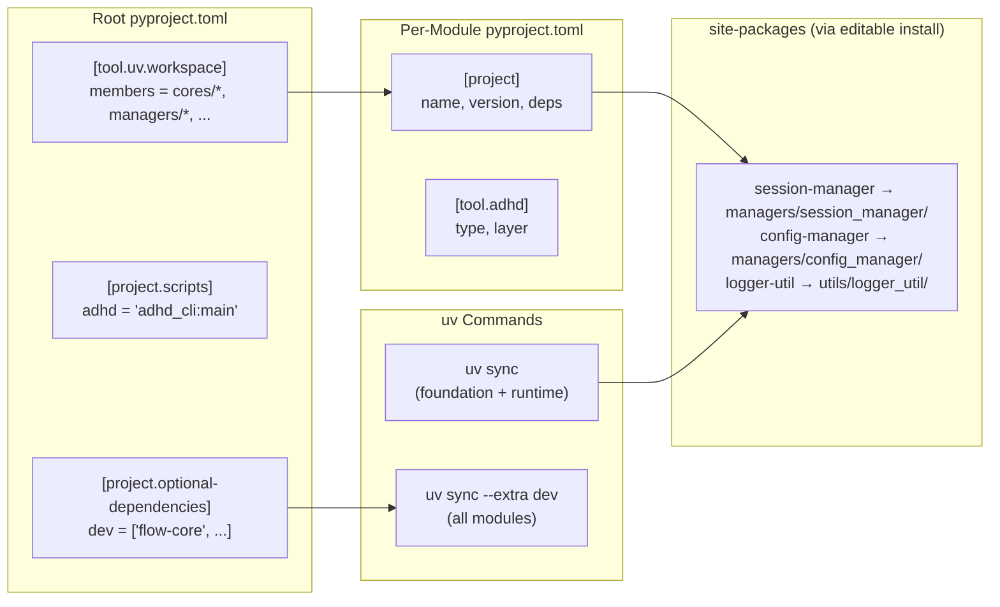
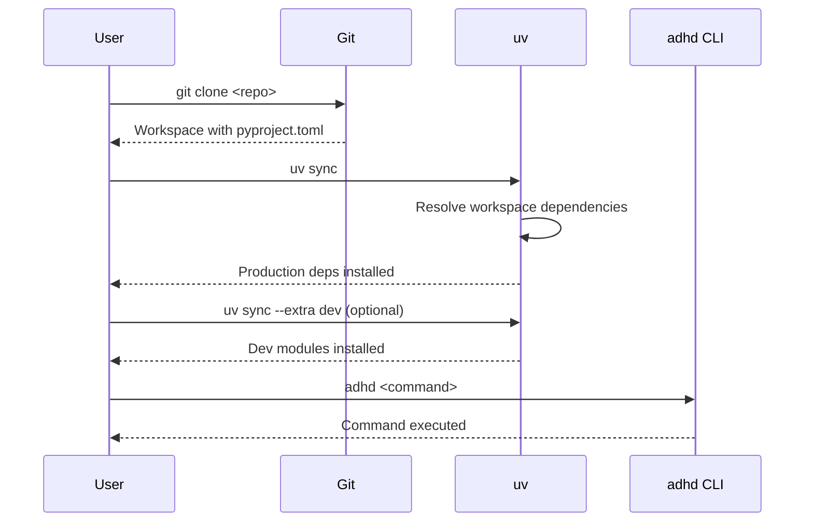
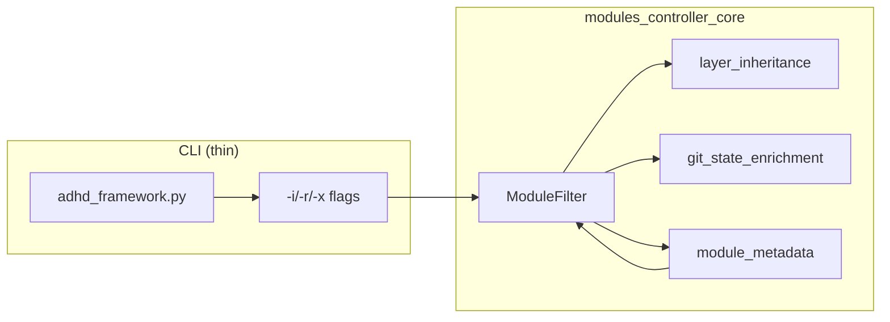

# 02 - Architecture

> Part of [Layer Taxonomy & Production Readiness Blueprint](./00_index.md)
>
> **Note:** Much of this architecture is now **implemented**. See [UV Migration](../uv_migration/) and [Framework Modernization](../framework_modernization/) for implementation details.

---

## 📖 The Story

### 😤 The Pain

```
Current Reality: A Tangled Web
┌───────────────────────────────────────────────────────────────────┐
│  THE PATH HACK (in 100+ files):                                   │
│  ┌─────────────────────────────────────────────────────────────┐  │
│  │  import os, sys                                             │  │
│  │  current_dir = os.path.dirname(os.path.abspath(__file__))   │  │
│  │  project_root = os.getcwd()  # 💥 Breaks from other dir!    │  │
│  │  sys.path.insert(0, project_root)                           │  │
│  │                                                             │  │
│  │  from managers.config_manager import ConfigManager          │  │
│  └─────────────────────────────────────────────────────────────┘  │
│                                                                   │
│  init.yaml (metadata + dependencies mixed):                       │
│  ├─ version: x.y.z                                                │
│  ├─ type: core                                                    │
│  ├─ requirements: [GitHub URLs]  ◀─ Custom DSL, not pip          │
│  └─ (no layer classification)                                     │
│                                                                   │
│  adhd_framework.py:                                               │
│  ├─ BOOTSTRAP_MODULES         ◀─ Hardcoded module list           │
│  ├─ clone-on-missing          ◀─ 💥 Magical self-healing         │
│  └─ All CLI commands          ◀─ Monolithic, not entry point     │
└───────────────────────────────────────────────────────────────────┘
```

| Who Hurts | Pain Level | Frequency |
|-----------|------------|----------|
| Every Python file | 🔥🔥🔥 High | Every import |
| Standalone module execution | 🔥🔥🔥 High | Every test |
| New contributors | 🔥🔥🔥 High | Onboarding |
| Production deployments | 🔥🔥 Medium | No layer selection |

### ✨ The Vision

```
After Migration: Clean Separation
┌───────────────────────────────────────────────────────────────────┐
│  NO MORE PATH HACKS:                                              │
│  ┌─────────────────────────────────────────────────────────────┐  │
│  │  # Just normal Python imports                               │  │
│  │  from config_manager import ConfigManager                   │  │
│  │  from logger_util import Logger                             │  │
│  │  from exceptions_core import ADHDError                      │  │
│  │                                                             │  │
│  │  # Works because: uv editable install = real packages       │  │
│  └─────────────────────────────────────────────────────────────┘  │
│                                                                   │
│  pyproject.toml (per-module) — SINGLE SOURCE OF TRUTH:            │
│  ├─ [project]                                                     │
│  │   ├─ name, version                                             │
│  │   └─ dependencies = [package names]   ◀─ Standard Python      │
│  └─ [tool.adhd]                                                   │
│      ├─ type = "manager"                 ◀─ ADHD semantics       │
│      └─ layer = "runtime"                ◀─ For layer selection  │
│                                                                   │
│  init.yaml: DELETED (P3)                                          │
│  adhd_framework.py: DELETED (P3)                                  │
└───────────────────────────────────────────────────────────────────┘
```

### 🎯 One-Liner

> pyproject.toml becomes the single source of truth for both Python packaging AND ADHD metadata (via `[tool.adhd]`), with uv editable installs eliminating all path hacks.

---

## 🔧 The Spec

---

## 🏗️ System Overview

### The Core Insight: Editable Installs

```
WHY the path hack exists:
┌──────────────────────────────────────────────────────────────────┐
│  Python import resolution: sys.path → site-packages              │
│                                                                  │
│  Current modules: Just folders, NOT installed packages           │
│  Therefore: Python can't find them without sys.path hack         │
└──────────────────────────────────────────────────────────────────┘

HOW editable installs fix it:
┌──────────────────────────────────────────────────────────────────┐
│  $ uv sync                                                       │
│  # Runs: pip install -e ./managers/session_manager               │
│  # Creates: site-packages/session_manager → symlink to folder    │
│                                                                  │
│  Now: `from session_manager import X` works ANYWHERE             │
│  Because: session_manager IS an installed package                │
└──────────────────────────────────────────────────────────────────┘
```

### File Responsibilities (Post-Migration)

| File | Purpose | Contains | Owned By |
|------|---------|----------|----------|
| `pyproject.toml` (per-module) | **SINGLE SOURCE** | version, deps, `[tool.adhd]` | uv + ADHD |
| `pyproject.toml` (root) | **Workspace** | members, `[project.scripts]`, extras | uv |
| `init.yaml` | **DEPRECATED (P3)** | Migrated to `[tool.adhd]` | — |
| `adhd_framework.py` | **DEPRECATED (P3)** | Replaced by `adhd` CLI | — |

### What Goes Where (Final State)

```
┌──────────────────────────────────────────────────────────────────┐
│  Q: "Where do I put...?"                                         │
├──────────────────────────────────────────────────────────────────┤
│  📦 Python metadata                  →  pyproject.toml [project] │
│     (name, version, dependencies)                                │
│                                                                  │
│  🎓 ADHD-specific metadata           →  pyproject.toml [tool.adhd]
│     (type, layer, shows_in_workspace)                            │
│                                                                  │
│  🧪 Testing scope                    →  pyproject.toml           │
│     ([tool.adhd.testing])                [tool.adhd.testing]     │
│                                                                  │
│  🔗 Repository URL                   →  pyproject.toml           │
│     ([project.urls].Repository)          [project.urls]          │
│                                                                  │
│  🛠️ CLI entry points                 →  pyproject.toml (root)    │
│     ([project.scripts])                                          │
│                                                                  │
│  🧪 Dev-only modules                  →  [optional-dependencies] │
│     (dev = ["flow-core", ...])                                   │
└──────────────────────────────────────────────────────────────────┘
```

### High-Level Architecture (Final State)



---

## 📊 Data Flow

### Bootstrap Changes

| Before | After |
|--------|-------|
| `adhd_framework.py bootstrap()` auto-clones | **REMOVED**: No auto-clone |
| `BOOTSTRAP_MODULES` hardcoded | **REMOVED**: uv handles deps |
| Custom `adhd_requirements` parsing | **REMOVED**: Standard pyproject.toml |

### New Setup Flow



### Module Installation Comparison

| Stage | Before (adhd_framework.py) | After (uv) |
|-------|---------------------------|------------|
| Clone | `git clone` | `git clone` |
| Bootstrap | `python adhd_framework.py` (auto-clones) | N/A |
| Install deps | Implicit, magical | `uv sync` |
| Install dev | Always installed | `uv sync --extra dev` |
| Run CLI | `python adhd_framework.py <cmd>` | `adhd <cmd>` |

---

## 🧩 Logical Components

### Layer Field Schema

| Attribute | Value |
|-----------|-------|
| **Purpose** | Classify modules into foundation/runtime/dev layers for semantic purposes |
| **Boundary** | init.yaml only; NO dependencies here (moved to pyproject.toml) |
| **Implemented By** | `init.yaml` schema update |
| **Depends On** | `yaml_reading_core` |
| **Exposes** | New `layer` field in init.yaml |

**Field Specification:**

```yaml
# init.yaml (post-migration)
type: core
layer: foundation    # NEW: Single value (foundation | runtime | dev)
repo_url: https://github.com/...
tags: [bootstrap, yaml]
# NO adhd_requirements - moved to pyproject.toml
```

---

### uv Workspace Structure

| Attribute | Value |
|-----------|-------|
| **Purpose** | Manage monorepo with multiple local packages |
| **Boundary** | Root pyproject.toml + per-module pyproject.toml |
| **Implemented By** | uv CLI |
| **Depends On** | pyproject.toml files |
| **Exposes** | `uv sync`, `uv sync --extra dev` |

**Root pyproject.toml:**

```toml
[project]
name = "anime-streamer"
version = "2.0.0"

[project.scripts]
adhd = "adhd_cli:main"

[project.optional-dependencies]
dev = [
    "flow-core",
    "project-creator-core",
    "questionary-core",
    "instruction-core",
    "vscode-kanbn-mcp",
]

[tool.uv.workspace]
members = [
    "cores/*",
    "managers/*",
    "plugins/*",
    "mcps/*",
    "utils/*",
]
```

**Per-Module pyproject.toml:**

```toml
[project]
name = "session-manager"
version = "0.1.0"
dependencies = [
    "config-manager",
    "logger-util",
    "pydantic>=2.0",
]
```

---

### Dependency Closure Tool

| Attribute | Value |
|-----------|-------|
| **Purpose** | Detect cross-layer violations before migration |
| **Boundary** | CLI tool, advisory (does not block loading) |
| **Implemented By** | `adhd deps --closure <module>` command |
| **Depends On** | `modules_controller_core`, init.yaml layer fields |
| **Exposes** | Cross-layer violation report |

**Validation Rules:**

| Source Layer | Can Depend On | Violation |
|--------------|---------------|----------|
| `foundation` | `foundation` only | ❌ `foundation` → `runtime` or `dev` |
| `runtime` | `foundation`, `runtime` | ❌ `runtime` → `dev` |
| `dev` | Any layer | ✅ No violations possible |

---

### CLI Filter System

| Attribute | Value |
|-----------|-------|
| **Purpose** | Unified module selection across all CLI commands |
| **Boundary** | Filter logic in `modules_controller_core`, thin CLI wrapper |
| **Implemented By** | `ModuleFilter` class in `modules_controller_core` |
| **Depends On** | Module metadata, git status |
| **Exposes** | `-i`/`-r`/`-x` flags, `--show-filters` |

**Component Location:**

| Logic | Location |
|-------|----------|
| Module discovery | `modules_controller_core` |
| `ModuleFilter` class | `modules_controller_core` |
| Layer inheritance | `modules_controller_core` |
| Git state detection | `modules_controller_core` |
| Workspace generation | `workspace_core` |
| CLI entry (thin wrapper) | `adhd_framework.py` |

**Layer Inheritance (Special Case for `-i` flag):**

```
┌──────────────────────────────────────────────────────────────────┐
│  -i foundation   = foundation ONLY                               │
│  -i runtime      = runtime + foundation                          │
│  -i dev          = dev + runtime + foundation (ALL)              │
└──────────────────────────────────────────────────────────────────┘
```

**Filter Flow:**



---

## 🏛️ Layer Taxonomy

### Layer Definitions

```
┌─────────────────────────────────────────────────────────────────┐
│                    ADHD Layer Taxonomy                          │
├─────────────────────────────────────────────────────────────────┤
│                                                                 │
│  ┌───────────────────────────────────────────────────────────┐  │
│  │  FOUNDATION (layer: foundation)                           │  │
│  │  ─────────────────────────────────────────────────────────│  │
│  │  • exceptions_core       • yaml_reading_core              │  │
│  │  • modules_controller_core  • workspace_core              │  │
│  │  • logger_util           • config_manager                 │  │
│  │                                                           │  │
│  │  Install: Always (via `uv sync`)                          │  │
│  └───────────────────────────────────────────────────────────┘  │
│                            ↓                                    │
│  ┌───────────────────────────────────────────────────────────┐  │
│  │  RUNTIME (layer: runtime — DEFAULT)                       │  │
│  │  ─────────────────────────────────────────────────────────│  │
│  │  • session_manager       • auth_manager                   │  │
│  │  • animenest_api_plugin  • anime_library_scanner_plugin   │  │
│  │  • external_media_manager  • secret_manager               │  │
│  │                                                           │  │
│  │  Install: Production + Dev (via `uv sync`)                │  │
│  └───────────────────────────────────────────────────────────┘  │
│                            ↓                                    │
│  ┌───────────────────────────────────────────────────────────┐  │
│  │  DEV (layer: dev)                                         │  │
│  │  ─────────────────────────────────────────────────────────│  │
│  │  • flow_core             • project_creator_core           │  │
│  │  • module_creator_core   • questionary_core               │  │
│  │  • hyperpm_core          • instruction_core               │  │
│  │  • vscode_kanbn_mcp      • (all MCPs)                     │  │
│  │                                                           │  │
│  │  Install: Dev only (via `uv sync --extra dev`)            │  │
│  └───────────────────────────────────────────────────────────┘  │
│                                                                 │
└─────────────────────────────────────────────────────────────────┘
```

### Layer Rules

| Layer | uv Installation | Depends On | Type Constraint |
|-------|-----------------|------------|-----------------|
| `foundation` | Always (`uv sync`) | `foundation` only | cores only |
| `runtime` | Always (`uv sync`) | `foundation`, `runtime` | any type |
| `dev` | Opt-in (`--extra dev`) | any layer | any type |

---

## [Custom] 🎨 Open Design Questions

### Q1: Orphan Detection

**Question:** How to detect modules with init.yaml but no pyproject.toml (or vice versa)?

**Proposed Solution (P1):**
- Validation hook checks for both files
- Warning: "Module X has init.yaml but no pyproject.toml"
- Error only if module is in workspace members

### Q2: Package Naming

**Question:** How to handle underscore→hyphen conversion for package names?

**Current State:**
- Folder names use underscores: `session_manager`
- pyproject.toml names should use hyphens: `session-manager`

**Proposed Solution:**
- Convention: pyproject.toml `name` uses hyphens
- `uv` handles the conversion transparently

### Q3: Rollback Strategy

**Question:** How to safely migrate with rollback option?

**Proposed Solution:**
- P2 feature flag: `ADHD_USE_LEGACY_CLI=1` keeps old bootstrapper
- P2→P3 gate: CLI parity test must pass before proceeding
- P3 is a separate PR with explicit "point of no return"

---

## ✅ Architecture Validation Checklist

### Diagram Completeness
- [x] File responsibilities table present
- [x] uv workspace diagram present
- [x] Layer taxonomy visually documented

### Component Clarity
- [x] Each component has Purpose, Boundary, Implemented By
- [x] Dependencies explicitly listed
- [x] Exposed interfaces defined

### Migration Path
- [x] Before/after comparison documented
- [x] New setup flow sequence diagram present
- [x] Rollback strategy defined

---

**← Back to:** [Executive Summary](./01_executive_summary.md) | **Next:** [Feature: Layer Taxonomy](./04_feature_layer_taxonomy.md)
