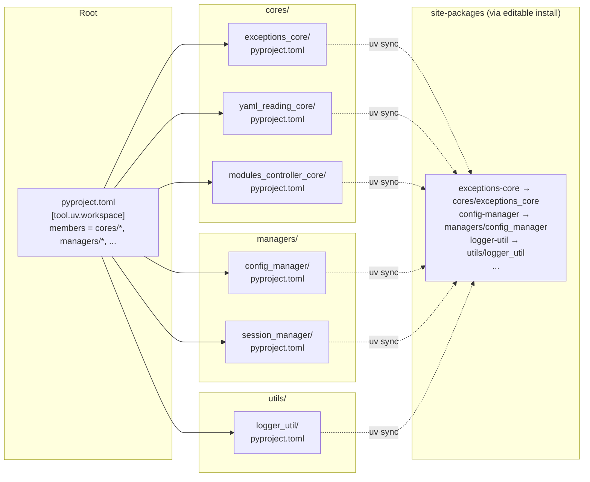

# 02 - Architecture

> Part of [UV Migration Blueprint](./00_index.md)

---

## 🏗️ System Overview

### Before vs After

```
BEFORE (Path Hack Hell):
┌──────────────────────────────────────────────────────────────────┐
│  managers/session_manager/session_manager.py                     │
│                                                                  │
│  # This block is in EVERY file                                   │
│  import os, sys                                                  │
│  current_dir = os.path.dirname(os.path.abspath(__file__))        │
│  project_root = os.getcwd()  # 💥 BREAKS from other directories  │
│  sys.path.insert(0, project_root)                                │
│                                                                  │
│  from managers.config_manager import ConfigManager               │
│  from utils.logger_util import Logger                            │
└──────────────────────────────────────────────────────────────────┘

AFTER (uv Editable Installs):
┌──────────────────────────────────────────────────────────────────┐
│  managers/session_manager/session_manager.py                     │
│                                                                  │
│  # Clean imports! No path hacks needed.                          │
│  from config_manager import ConfigManager                        │
│  from logger_util import Logger                                  │
│                                                                  │
│  # Works because uv editable install puts packages in site-pkgs  │
└──────────────────────────────────────────────────────────────────┘
```

---

## 🗺️ Target Structure



---

## 📁 File Structure

### Root pyproject.toml

```toml
[project]
name = "adhd-framework"
version = "3.0.0"
requires-python = ">=3.10"
description = "AI-Driven High-speed Development Framework"

[project.optional-dependencies]
dev = [
    # Dev-only modules listed here
    "instruction-core",
    "module-creator-core",
    "project-creator-core",
    "questionary-core",
]

[tool.uv.workspace]
members = [
    "cores/*",
    "managers/*",
    "plugins/*",
    "mcps/*",
    "utils/*",
]

[build-system]
requires = ["hatchling"]
build-backend = "hatchling.build"
```

### Per-Module pyproject.toml

```toml
# managers/session_manager/pyproject.toml
[project]
name = "session-manager"
version = "0.1.0"
requires-python = ">=3.10"

dependencies = [
    "config-manager",      # ADHD module (local dep via workspace)
    "logger-util",         # ADHD module
    "exceptions-core",     # ADHD module
    "pydantic>=2.0",       # PyPI dep
]

[project.urls]
Repository = "https://github.com/org/session_manager.git"

[tool.adhd]
type = "manager"
# layer will be added in future blueprint

[build-system]
requires = ["hatchling"]
build-backend = "hatchling.build"
```

---

## 🔄 How Editable Installs Fix Everything

### The Core Insight

```
PROBLEM: Python doesn't know modules are packages
┌──────────────────────────────────────────────────────────────┐
│  $ cd managers/session_manager                               │
│  $ python session_manager.py                                 │
│  ❌ ModuleNotFoundError: No module named 'config_manager'    │
│                                                              │
│  WHY: Python only searches:                                  │
│    1. Current directory                                      │
│    2. PYTHONPATH                                             │
│    3. site-packages                                          │
│                                                              │
│  config_manager is in managers/config_manager/               │
│  ...which is NOT in any of those places                      │
└──────────────────────────────────────────────────────────────┘

SOLUTION: Editable install puts symlinks in site-packages
┌──────────────────────────────────────────────────────────────┐
│  $ uv sync                                                   │
│  # This runs: pip install -e ./managers/config_manager       │
│  # Creates: site-packages/config_manager → ./managers/...    │
│                                                              │
│  $ cd managers/session_manager                               │
│  $ python session_manager.py                                 │
│  ✅ Works! config_manager is now in site-packages            │
│                                                              │
│  $ cd /literally/anywhere                                    │
│  $ python -c "from config_manager import ConfigManager"      │
│  ✅ Still works!                                             │
└──────────────────────────────────────────────────────────────┘
```

---

## 📝 Import Path Changes

### Migration Rules

| Old Pattern | New Pattern | Example |
|-------------|-------------|---------|
| `from managers.X import` | `from X import` | `from config_manager import ConfigManager` |
| `from cores.X import` | `from X import` | `from exceptions_core import ADHDError` |
| `from utils.X import` | `from X import` | `from logger_util import Logger` |
| `from plugins.X import` | `from X import` | `from animenest_api_plugin import AnimeNestAPI` |
| `from mcps.X import` | `from X import` | `from adhd_mcp import tools` |

### Example Transformation

```python
# BEFORE (with path hack)
import os, sys
current_dir = os.path.dirname(os.path.abspath(__file__))
project_root = os.getcwd()
sys.path.insert(0, project_root)

from managers.config_manager import ConfigManager
from cores.exceptions_core import ADHDError
from utils.logger_util import Logger

# AFTER (clean imports)
from config_manager import ConfigManager
from exceptions_core import ADHDError
from logger_util import Logger
```

### Regex for Automated Migration

```python
# Remove path hack block
content = re.sub(
    r'import os.*?sys\.path\.insert\(0, project_root\)\n',
    '',
    content,
    flags=re.DOTALL
)

# Update import paths
content = re.sub(
    r'from (managers|cores|utils|plugins|mcps)\.(\w+)',
    r'from \2',
    content
)
```

---

## 🔗 Dependency Resolution

### Local (Workspace) Dependencies

```toml
# session_manager depends on config_manager
# Both are in the same workspace

[project]
dependencies = [
    "config-manager",  # uv resolves to local ./managers/config_manager
]
```

### PyPI Dependencies

```toml
[project]
dependencies = [
    "pydantic>=2.0",   # Fetched from PyPI
    "sqlalchemy>=2.0", # Fetched from PyPI
]
```

### GitHub Dependencies (via uv sources)

```toml
[project]
dependencies = [
    "external-module",  # Name only
]

[tool.uv.sources]
external-module = { git = "https://github.com/org/external-module.git" }
```

---

## ⚠️ Constraints

| Constraint | Reason |
|------------|--------|
| Package names use hyphens (`config-manager`) | PEP 503 normalization |
| Import names use underscores (`config_manager`) | Python identifier rules |
| Root pyproject.toml required | uv workspace configuration |
| Python ≥3.10 | uv requirement |
| hatchling build backend | Simple, fast, no complex config |

---

## 🧪 Verification Points

| Check | Command | Expected |
|-------|---------|----------|
| uv sync works | `rm -rf .venv && uv sync` | No errors |
| Path hacks gone | `grep -r "sys.path.insert" cores/ managers/ utils/` | 0 matches |
| Imports work | `python -c "from config_manager import ConfigManager"` | Success |
| Standalone works | `cd managers/session_manager && python -m session_manager` | No import error |
| Clean venv | `python -c "import config_manager; print(config_manager.__file__)"` | Points to workspace |

---

**← Back to:** [Executive Summary](./01_executive_summary.md) | **Next:** [Feature: Core Migration](./03_feature_core_migration.md)
