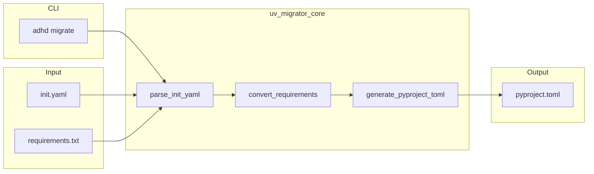

# 04 - Feature: UV Migrator Tool (P1)

> Part of [UV Migration Blueprint](./00_index.md)

---

## 📖 The Story

### 😤 The Pain

```
Current Reality:
┌───────────────────────────────────────────────────────────────────┐
│  Every module has init.yaml:                                      │
│    version: 0.0.1                                                 │
│    type: manager                                                  │
│    requirements:                                                  │
│      - https://github.com/org/Logger-Util.git                     │
│      - https://github.com/org/Config-Manager.git                  │
│                                                                   │
│  PLUS requirements.txt for PyPI packages:                         │
│    sqlalchemy>=2.0.0                                              │
│                                                                   │
│  💥 PROBLEM: These need to become pyproject.toml                  │
│  💥 PROBLEM: 20+ modules to convert manually                      │
│  💥 PROBLEM: GitHub URLs need [tool.uv.sources] mapping           │
└───────────────────────────────────────────────────────────────────┘
```

| Who Hurts | Pain Level | Frequency |
|-----------|------------|-----------|
| Migration executor | 🔥🔥🔥 High | 20+ manual conversions |
| Reviewers | 🔥🔥 Medium | Verifying correct conversion |
| Future module creators | 🔥 Low | One-time migration |

### ✨ The Vision

```
After This Feature:
┌───────────────────────────────────────────────────────────────────┐
│  $ adhd migrate session_manager                                   │
│                                                                   │
│  ✅ Generated pyproject.toml for session_manager                  │
│  ──────────────────────────────────────────────────────────────   │
│  Converted:                                                       │
│    • version: 0.0.1 → [project].version                           │
│    • type: manager → [tool.adhd].type = "manager"                 │
│    • 2 ADHD deps → [tool.uv.sources] + [project].dependencies     │
│    • 1 PyPI dep → [project].dependencies                          │
│                                                                   │
│  Output: managers/session_manager/pyproject.toml                  │
└───────────────────────────────────────────────────────────────────┘

Batch migration:
┌───────────────────────────────────────────────────────────────────┐
│  $ adhd migrate --all                                             │
│                                                                   │
│  ✅ Migrated 20 modules                                           │
│  ❌ 2 modules had issues (see details below)                      │
│                                                                   │
│  $ adhd migrate --dry-run session_manager                         │
│  [Preview: would generate pyproject.toml with...]                 │
└───────────────────────────────────────────────────────────────────┘
```

### 🎯 One-Liner

> `adhd migrate <module>` automatically converts init.yaml + requirements.txt → pyproject.toml with proper [tool.uv.sources] for GitHub dependencies.

### 📊 Impact

| Metric | Before | After |
|--------|--------|-------|
| Time to migrate one module | ~10 min manual | ~5 sec automated |
| Conversion errors | Human error risk | Deterministic |
| Consistency | Variable formatting | Uniform output |

---

## 🔧 The Spec

---

## 🎯 Overview

A migration tool that reads init.yaml and requirements.txt from any ADHD module and generates a pyproject.toml compatible with uv workspaces.

**Module Location:** `cores/uv_migrator_core/`  
**Module Type:** core  
**Priority:** P1 (After P0 proves the concept works)  
**Difficulty:** `[KNOWN]`

---

## 🗺️ System Context



---

## 👥 User Stories

| As a... | I want to... | So that... |
|---------|--------------|------------|
| Developer | Migrate one module at a time | I can verify each conversion |
| Developer | Migrate all modules at once | Bulk migration is fast |
| Developer | Preview changes before writing | I can review before committing |
| Reviewer | See what changed | I can validate conversion logic |

---

## ✅ Acceptance Criteria

| # | Criterion | Verification |
|---|-----------|--------------|
| 1 | `adhd migrate <module>` generates pyproject.toml | File exists after command |
| 2 | version field preserved | `[project].version` matches init.yaml |
| 3 | type field preserved | `[tool.adhd].type` matches init.yaml |
| 4 | GitHub URLs → [tool.uv.sources] | Package name mapped correctly |
| 5 | PyPI deps → [project].dependencies only | No uv.sources entry for PyPI |
| 6 | requirements.txt merged | PyPI deps included in dependencies |
| 7 | `--dry-run` prints but doesn't write | No file created |
| 8 | `--all` migrates all modules | All modules have pyproject.toml |
| 9 | `--no-overwrite` skips existing | Existing files preserved |

---

## 🛠️ Technical Notes

### CLI Interface

```bash
# Migrate single module
adhd migrate <module_name>

# Migrate all discovered modules
adhd migrate --all

# Preview without writing
adhd migrate <module_name> --dry-run
adhd migrate --all --dry-run

# Don't overwrite existing pyproject.toml
adhd migrate --all --no-overwrite
```

### Conversion Logic

#### 1. GitHub URL → Package Name

```python
def github_url_to_package_name(url: str) -> str:
    """
    https://github.com/AI-Driven-Highspeed-Development/Logger-Util.git
    → logger-util
    
    https://github.com/org/Config-Manager.git
    → config-manager
    """
    # Extract repo name, lowercase, replace _ with -
    repo_name = url.rstrip('.git').split('/')[-1]
    return repo_name.lower().replace('_', '-')
```

#### 2. Requirements Classification

```python
def convert_requirements(requirements: list[str]) -> tuple[list[str], dict[str, dict]]:
    """
    Returns (dependencies, uv_sources)
    
    - GitHub URLs → add to both dependencies AND uv_sources
    - PyPI packages → add to dependencies only
    """
    dependencies = []
    uv_sources = {}
    
    for req in requirements:
        if 'github.com' in req:
            pkg_name = github_url_to_package_name(req)
            dependencies.append(pkg_name)
            uv_sources[pkg_name] = {"git": req}
        else:
            dependencies.append(req)
    
    return dependencies, uv_sources
```

### Output Template

```toml
[project]
name = "session-manager"
version = "0.0.1"
requires-python = ">=3.10"
dependencies = [
    "logger-util",
    "config-manager",
    "sqlalchemy>=2.0.0",
]

[tool.adhd]
type = "manager"

[tool.uv.sources]
logger-util = { git = "https://github.com/org/Logger-Util.git" }
config-manager = { git = "https://github.com/org/Config-Manager.git" }

[build-system]
requires = ["hatchling"]
build-backend = "hatchling.build"
```

### Example Conversion

**Input: init.yaml**
```yaml
version: 0.0.1
folder_path: managers/session_manager
type: manager
requirements:
  - https://github.com/org/auth_manager.git
  - https://github.com/org/Logger-Util.git
repo_url: https://github.com/org/session_manager.git
```

**Input: requirements.txt**
```
sqlalchemy>=2.0.0
```

**Output: pyproject.toml**
```toml
[project]
name = "session-manager"
version = "0.0.1"
requires-python = ">=3.10"
dependencies = [
    "auth-manager",
    "logger-util",
    "sqlalchemy>=2.0.0",
]

[project.urls]
Repository = "https://github.com/org/session_manager.git"

[tool.adhd]
type = "manager"

[tool.uv.sources]
auth-manager = { git = "https://github.com/org/auth_manager.git" }
logger-util = { git = "https://github.com/org/Logger-Util.git" }

[build-system]
requires = ["hatchling"]
build-backend = "hatchling.build"
```

---

## 📁 Module Structure

```
cores/uv_migrator_core/
├── __init__.py           # Exports
├── init.yaml             # Module metadata
├── pyproject.toml        # Self-referential (this module!)
├── uv_migrator_core.py   # Main controller/orchestrator
├── migrator.py           # Conversion logic
├── templates.py          # pyproject.toml template strings
├── README.md             # Documentation
└── requirements.txt      # PyPI deps (pyyaml, tomlkit)
```

### Key Functions

```python
# migrator.py
def parse_init_yaml(module_path: Path) -> dict:
    """Parse init.yaml from module directory."""

def parse_requirements_txt(module_path: Path) -> list[str]:
    """Parse requirements.txt if it exists."""

def github_url_to_package_name(url: str) -> str:
    """Convert GitHub URL to package name."""

def convert_requirements(requirements: list[str]) -> tuple[list[str], dict[str, dict]]:
    """Split requirements into dependencies and uv_sources."""

def generate_pyproject_toml(module_path: Path, dry_run: bool = False) -> str:
    """Generate and optionally write pyproject.toml."""
```

---

## ⚠️ Edge Cases

| Scenario | Handling |
|----------|----------|
| No init.yaml | Error: "Not an ADHD module" |
| No requirements field | Empty dependencies |
| No requirements.txt | Skip PyPI deps |
| Malformed GitHub URL | Warning + skip |
| pyproject.toml exists | Skip with --no-overwrite, overwrite otherwise |
| Module name has underscores | Convert to hyphens for package name |
| Empty requirements.txt | Skip gracefully |

---

## ❌ Out of Scope

| Excluded | Rationale |
|----------|-----------|
| Delete init.yaml after migration | Separate cleanup blueprint |
| Validate pyproject.toml syntax | Use uv for validation |
| Handle non-ADHD modules | Only ADHD modules with init.yaml |
| Interactive mode | Batch operation only |
| Rollback support | User can git revert |

---

## 🔗 Dependencies

| Dependency | Type | Status |
|------------|------|--------|
| yaml_reading_core | Internal | ✅ Exists |
| modules_controller_core | Internal | ✅ Exists for discovery |
| tomlkit | PyPI | 📦 Add to requirements |

---

## How to Verify (Manual)

| What to Try | Expected Result |
|-------------|-----------------|
| `adhd migrate session_manager` | pyproject.toml created |
| `adhd migrate session_manager --dry-run` | Output printed, no file created |
| `adhd migrate --all` | All modules have pyproject.toml |
| `adhd migrate --all --no-overwrite` | Existing files untouched |
| Compare init.yaml version with pyproject.toml | Values match |
| `uv sync` after migration | All deps resolve |

---

## ✅ Feature Validation Checklist

### Narrative Completeness
- [x] The Story section clearly states user problem and value
- [x] Intent is unambiguous to a non-technical reader
- [x] Scope is explicitly bounded

### Technical Completeness
- [x] CLI interface specified
- [x] Conversion logic described
- [x] Module structure defined
- [x] Key functions enumerated
- [x] Edge cases covered
- [x] Acceptance criteria are testable

### Traceability
- [x] Links to architecture doc
- [x] Dependencies listed
- [x] Module type specified

---

**← Back to:** [Feature: Core Migration](./03_feature_core_migration.md) | **Next:** [Implementation](./80_implementation.md)
