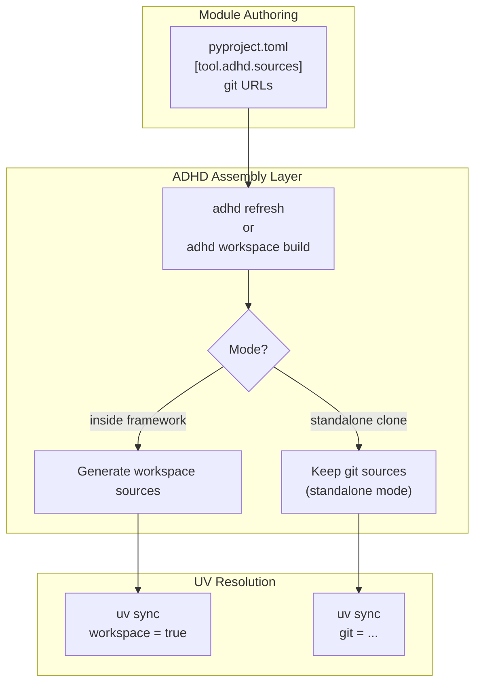
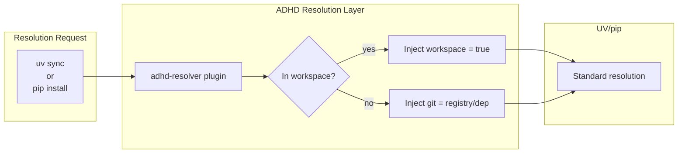

# 🏗️ Federation Architecture Vision

> *Resolving the fundamental paradigm clash between UV's monorepo design and ADHD's polyrepo federation*

**Version:** 1.0 | **Status:** 📐 Draft | **Created:** 2026-02-02

---

## 📍 The Paradigm Clash

### 🔬 Diagnosis Summary

```
UV's Worldview:                        ADHD's Reality:
┌─────────────────────────┐            ┌─────────────────────────┐
│ MONOREPO                │            │ FEDERATED POLYREPO      │
│                         │            │                         │
│ One repo = one truth    │    VS      │ N repos = N truths      │
│ All packages colocated  │            │ Modules are independent │
│ workspace = true        │            │ Each has its own git    │
│ OR git = "..."          │            │ Need BOTH behaviors     │
│ (mutually exclusive)    │            │                         │
└─────────────────────────┘            └─────────────────────────┘
```

### The Semantic Incompatibility

UV's `[tool.uv.sources]` offers two mutually exclusive modes:

| Mode | Syntax | Meaning | When |
|------|--------|---------|------|
| **Workspace** | `{ workspace = true }` | "This package is a sibling in my repo" | Local dev |
| **Git** | `{ git = "..." }` | "Fetch this from remote" | Standalone |

**ADHD modules need BOTH simultaneously:**
- When inside the framework workspace → workspace member
- When cloned standalone → git-resolvable dependencies

This is not a bug in UV—it's a design decision. UV assumes packages have ONE identity.

---

## 🎯 Architectural Solution Proposals

### Proposal A: **Assembly-Time Transformation** `[KNOWN]`

> *"Two pyproject.toml files, one truth, zero runtime cost"*

#### Core Concept

Separate **authoring format** from **consumption format**. Modules are authored with git URLs (their true standalone identity), but during workspace assembly, a transformation step generates UV-compatible local configuration.

```
┌─────────────────────────────────────────────────────────────────┐
│  AUTHORING TIME (What developers write)                         │
│  ┌────────────────────────────────────────────────────────────┐ │
│  │  # cores/logger_util/pyproject.toml                        │ │
│  │  [tool.adhd.sources]  # Note: tool.adhd, NOT tool.uv       │ │
│  │  exceptions-core = "github.com/org/exceptions_core.git"    │ │
│  └────────────────────────────────────────────────────────────┘ │
│                               ↓                                 │
│  ASSEMBLY TIME (adhd refresh / adhd workspace build)            │
│                               ↓                                 │
│  ┌────────────────────────────────────────────────────────────┐ │
│  │  GENERATES: cores/logger_util/.uv_workspace_sources.toml   │ │
│  │  (or patches pyproject.toml dynamically)                   │ │
│  │                                                            │ │
│  │  [tool.uv.sources]                                         │ │
│  │  exceptions-core = { workspace = true }                    │ │
│  └────────────────────────────────────────────────────────────┘ │
│                               ↓                                 │
│  RUNTIME (uv sync)                                              │
│  UV sees workspace = true, happy path                           │
└─────────────────────────────────────────────────────────────────┘
```

#### Implementation Approach



#### Pros & Cons

| ✅ Pros | ❌ Cons |
|---------|---------|
| Zero changes to UV | Extra build step |
| Modules stay portable | Generated files to manage (.gitignore) |
| Works with existing tooling | More moving parts |
| Clear separation of concerns | Developers must understand both modes |

#### Difficulty Assessment

| Component | Label | Rationale |
|-----------|-------|-----------|
| Source transformer | `[KNOWN]` | TOML parsing + generation, well-understood |
| Mode detection | `[KNOWN]` | Check if inside workspace root |
| Integration with `adhd refresh` | `[KNOWN]` | Existing hook system |

---

### Proposal B: **Ambient Workspace Discovery** `[EXPERIMENTAL]`

> *"Let modules discover their context at resolution time"*

#### Core Concept

Instead of hardcoding resolution strategy, modules declare dependencies abstractly, and resolution behavior is determined by **environment context**:

```
┌─────────────────────────────────────────────────────────────────┐
│  MODULE DECLARES (Context-Agnostic)                             │
│  ┌────────────────────────────────────────────────────────────┐ │
│  │  [project]                                                 │ │
│  │  dependencies = ["exceptions-core", "logger-util"]         │ │
│  │                                                            │ │
│  │  [tool.adhd]                                               │ │
│  │  federation_member = true                                  │ │
│  │  registry = "https://github.com/AI-Driven-Highspeed-Dev"   │ │
│  └────────────────────────────────────────────────────────────┘ │
│                                                                 │
│  RESOLUTION CONTEXT DECIDES                                     │
│  ┌────────────────────────────────────────────────────────────┐ │
│  │  if ADHD_WORKSPACE_ROOT exists in parent dirs:             │ │
│  │      → Use workspace = true                                │ │
│  │  else:                                                     │ │
│  │      → Use git = "{registry}/{dep_name}.git"               │ │
│  └────────────────────────────────────────────────────────────┘ │
└─────────────────────────────────────────────────────────────────┘
```

#### Implementation Approach

This requires a **custom UV resolver plugin** (if UV supports it) or a **pre-resolution hook** that dynamically generates `[tool.uv.sources]`.



#### Pros & Cons

| ✅ Pros | ❌ Cons |
|---------|---------|
| Single pyproject.toml per module | Requires UV plugin system (may not exist) |
| No generated files | More magic, harder to debug |
| Elegant conceptually | Tooling compatibility unknown |
| True dual-identity modules | `[EXPERIMENTAL]` - needs validation |

#### Difficulty Assessment

| Component | Label | Rationale |
|-----------|-------|-----------|
| UV plugin architecture | `[RESEARCH]` | May not exist, need to investigate UV internals |
| Workspace detection | `[KNOWN]` | File system traversal |
| Registry URL construction | `[KNOWN]` | String interpolation |

---

## 🏆 Recommended Architecture: **Proposal A (Assembly-Time Transformation)**

### Why Proposal A Wins

| Criterion | Proposal A | Proposal B |
|-----------|------------|------------|
| **Difficulty** | `[KNOWN]` throughout | Has `[RESEARCH]` blocker |
| **UV Compatibility** | Works with UV as-is | Requires UV changes/plugins |
| **Debuggability** | Generated files are inspectable | Magic resolution harder to trace |
| **Future-proofing** | Works with any tool that reads pyproject.toml | Tied to UV's plugin story |
| **P0 Viability** | Yes, 1-2 weeks | No, has research phase |

### Core Principle: Separation of Concerns

```
┌─────────────────────────────────────────────────────────────────┐
│  RESPONSIBILITY MATRIX                                          │
│                                                                 │
│  Git Identity          → init.yaml / [tool.adhd]                │
│  Python Package        → pyproject.toml [project]               │
│  Local Resolution      → Generated [tool.uv.sources] workspace  │
│  Remote Resolution     → [tool.adhd.sources] git URLs           │
│                                                                 │
│  KEY INSIGHT: Git identity and Python package identity          │
│  are ORTHOGONAL concerns. ADHD modules need both.               │
│  UV only handles Python packages. We add the git layer.         │
└─────────────────────────────────────────────────────────────────┘
```

---

## 📐 Detailed Design: Assembly-Time Transformation

### New Section: `[tool.adhd.sources]`

Modules declare their **canonical dependency sources** (git URLs) in a custom TOML section that UV ignores:

```toml
# cores/logger_util/pyproject.toml

[project]
name = "logger-util"
version = "0.1.0"
dependencies = ["exceptions-core"]

[tool.adhd]
type = "util"
layer = "foundation"

[tool.adhd.sources]
# Canonical git URLs for standalone resolution
exceptions-core = "https://github.com/AI-Driven-Highspeed-Dev/exceptions_core.git"

# [tool.uv.sources] is NOT present in source control
# It gets GENERATED during assembly

[build-system]
requires = ["hatchling"]
build-backend = "hatchling.build"
```

### Transformation Rules

```python
# Pseudocode for transformation logic

def transform_for_workspace(module_pyproject: Path, workspace_root: Path):
    """Generate [tool.uv.sources] for workspace mode."""
    
    config = toml.load(module_pyproject)
    adhd_sources = config.get("tool", {}).get("adhd", {}).get("sources", {})
    
    # Check which deps are actually in the workspace
    workspace_members = discover_workspace_members(workspace_root)
    
    uv_sources = {}
    for dep_name, git_url in adhd_sources.items():
        if dep_name in workspace_members:
            # Local workspace member → use workspace = true
            uv_sources[dep_name] = {"workspace": True}
        else:
            # External dep → keep git URL
            uv_sources[dep_name] = {"git": git_url}
    
    # Inject into pyproject.toml (or generate separate file)
    config.setdefault("tool", {}).setdefault("uv", {})["sources"] = uv_sources
    
    return config
```

### File Strategy Options

| Strategy | Description | Recommendation |
|----------|-------------|----------------|
| **In-place patching** | Modify pyproject.toml directly | ❌ Dirty working tree |
| **Generated file** | `.uv.generated.toml` | ❌ UV doesn't support includes |
| **Symlink/override** | Workspace-level uv.toml | 🔍 Investigate |
| **Patch + .gitignore** | Modify pyproject.toml, gitignore the sources section | ✅ Practical |

**Recommended**: Generate the `[tool.uv.sources]` section into pyproject.toml during `adhd refresh`, with a clear marker comment:

```toml
# === AUTO-GENERATED BY ADHD (do not edit) ===
[tool.uv.sources]
exceptions-core = { workspace = true }
# === END AUTO-GENERATED ===
```

And add a `.gitattributes` or pre-commit hook to strip this section before commit.

---

## 🚦 Phased Implementation

### P0: Walking Skeleton `[KNOWN]` (1 week)

**Goal:** Prove the transformation pipeline works end-to-end.

| Task | Deliverable | Status |
|------|-------------|--------|
| Define `[tool.adhd.sources]` schema | Schema doc | ⏳ [TODO] |
| Build source transformer (read adhd.sources, emit uv.sources) | `adhd_transform.py` | ⏳ [TODO] |
| Integrate with `adhd refresh` | Hook in refresh.py | ⏳ [TODO] |
| Test: one module, standalone + workspace | Test script | ⏳ [TODO] |

**How to Verify (Manual):**
1. Clone `logger_util` standalone
2. Run `uv sync` → should pull from git URLs
3. Inside framework, run `adhd refresh`
4. Run `uv sync` → should use workspace = true
5. Imports work in both contexts

### P1: Full Migration `[KNOWN]` (1-2 weeks)

**Goal:** All modules use `[tool.adhd.sources]`, transformation is automatic.

| Task | Deliverable | Status |
|------|-------------|--------|
| Migrate all modules to `[tool.adhd.sources]` | Updated pyproject.toml files | ⏳ [TODO] |
| Remove hardcoded `[tool.uv.sources]` from modules | Clean pyproject.toml | ⏳ [TODO] |
| Add git-clean hook to strip generated sources | Pre-commit hook | ⏳ [TODO] |
| Document dual-mode workflow | README update | ⏳ [TODO] |

### P2: Developer Experience Polish `[KNOWN]` (Optional)

| Task | Deliverable |
|------|-------------|
| `adhd status` shows resolution mode | CLI enhancement |
| Warning if generated sources are stale | Staleness detection |
| IDE integration (mark generated sections) | Editor config |

---

## 🔮 Future-Proofing Analysis

### Compatibility Matrix

| Tool | Works with Proposal A? | Notes |
|------|------------------------|-------|
| **UV** | ✅ Yes | Uses standard pyproject.toml |
| **pip** | ✅ Yes | Ignores tool.uv.sources, uses git URLs |
| **Poetry** | ✅ Yes | Would need poetry-specific generation |
| **PDM** | ✅ Yes | Same pattern, different target |
| **Future tools** | ✅ Likely | Abstract source layer adapts |

### The Abstraction Advantage

By introducing `[tool.adhd.sources]` as the **canonical source of truth**, we gain:

1. **Tool independence**: Can generate for UV, Poetry, pip, whatever comes next
2. **Context awareness**: Same module, different resolution based on environment
3. **Federation support**: Modules remain truly portable across ADHD projects
4. **Clear contracts**: Developers know where to declare deps (`adhd.sources`) vs where UV reads them (`uv.sources`)

---

## 📋 Decision Log

| Decision | Rationale | Date |
|----------|-----------|------|
| Proposal A over Proposal B | No `[RESEARCH]` blockers, works with UV today | 2026-02-02 |
| `[tool.adhd.sources]` as canonical | Separation of authoring vs consumption | 2026-02-02 |
| In-place generation with markers | UV requires sources in pyproject.toml | 2026-02-02 |

---

## 🖼️ Related Assets

*None yet. Consider adding:*
- [ ] Transformation flow diagram
- [ ] Before/after pyproject.toml examples
- [ ] Developer workflow storyboard

---

## 📚 References

- [UV Workspaces Documentation](https://docs.astral.sh/uv/concepts/workspaces/)
- [PEP 621 - pyproject.toml metadata](https://peps.python.org/pep-0621/)
- [Existing UV Migration Blueprint](./00_index.md)
- [Cargo Workspaces](https://doc.rust-lang.org/book/ch14-03-cargo-workspaces.html) (inspiration)

---

## 📝 Changelog

| Version | Date | Changes |
|---------|------|---------|
| 1.0 | 2026-02-02 | Initial vision document |
