# 🎯 Framework Modernization (Post-UV): Project Blueprint

> *Transform ADHD Framework from a bootstrap-heavy, path-hacking system into a clean, UV-native development platform.*

**Document Type:** Technical Design Document / Project Blueprint  
**Version:** 1.0  
**Created:** 2026-02-01  
**Status:** 📐 Planning

---

## 📊 Progress Overview

| Phase | Status | Notes |
|-------|--------|-------|
| P0: Walking Skeleton | ⏳ | UV-aware project creation + module creation basics |
| P1: Core Workflow Migration | ⏳ | Init, refresh, dependency management |
| P2: Template & CLI Modernization | ⏳ | Full template updates, entry point via pyproject.toml |
| P3: Deprecation & Cleanup | ⏳ | init.yaml sunset, backwards compatibility removal |

### Status Legend

| Icon | Meaning |
|------|---------|
| ⏳ | TODO |
| 🔄 | WIP |
| ✅ | DONE |
| 🚫 | CUT |

---

## 📐 Planning Standards

This blueprint follows **HyperDream phasing rules**:

| Principle | Meaning |
|-----------|---------|
| **Walking Skeleton First** | Phase 0 proves plumbing works with hardcoded stubs |
| **Difficulty Honesty** | Each item labeled `[KNOWN]`, `[EXPERIMENTAL]`, or `[RESEARCH]` |
| **Research ≠ Foundation** | `[RESEARCH]` items never in Phase 0 |
| **Incremental Value** | Each phase delivers usable functionality |

---

## 📑 Document Index

| # | Document | Required | Purpose (When to Read) |
|---|----------|----------|------------------------|
| 00 | [Index](./00_index.md) | ✓ | **Navigation hub** — Start here if lost |
| 01 | [Executive Summary](./01_executive_summary.md) | ✓ | **Vision & scope** — Read to understand what/why |
| 02 | [Architecture](./02_architecture.md) | ✓ | **System design** — Read to understand how pieces fit |
| 03 | [Feature: Project Creation](./03_feature_project_creation.md) | | How `adhd new-project` changes with UV |
| 04 | [Feature: Module Creation](./04_feature_module_creation.md) | | Generate pyproject.toml for new modules |
| 05 | [Feature: Module Inclusion](./05_feature_module_inclusion.md) | | Adding existing modules to workspace |
| 06 | [Feature: Refresh Modernization](./06_feature_refresh_modernization.md) | | New refresh logic with UV |
| 07 | [Feature: CLI Entry Points](./07_feature_cli_entry_points.md) | | CLI via pyproject.toml |
| 08 | [Feature: Template Updates](./08_feature_template_updates.md) | | UV-first template modernization |
| 09 | [Feature: init.yaml Sunset](./09_feature_init_yaml_sunset.md) | | Deprecation and migration plan |
| 80 | [Implementation](./80_implementation.md) | ✓ | **Task tracking** — Read to start/track work |

---

## 💭 Vision Statement

> *"The ADHD Framework should feel like a native Python project that happens to have excellent modular architecture—not a framework with its own universe of conventions. UV migration is done; now we make the framework workflows match what UV enables."*

---

## 🧭 How to Navigate This Blueprint

### Reading Order Decision Tree

```mermaid
flowchart TD
    START[📚 You are here] --> Q1{What do you need?}
    
    Q1 -->|"Understand the project"| PATH_UNDERSTAND
    Q1 -->|"Implement something"| PATH_IMPL
    Q1 -->|"Review impact on my workflow"| PATH_WORKFLOW
    
    PATH_UNDERSTAND[🎯 Understanding Path]
    PATH_UNDERSTAND --> ES[01 - Executive Summary]
    ES --> ARCH[02 - Architecture]
    ARCH --> FEAT[Feature Docs 03-09]
    
    PATH_IMPL[🔧 Implementation Path]
    PATH_IMPL --> IMPL[80 - Implementation]
    IMPL --> FEAT2[Relevant Feature Doc]
    
    PATH_WORKFLOW[🔄 Workflow Path]
    PATH_WORKFLOW --> |Project Creation| F03[03 - Project Creation]
    PATH_WORKFLOW --> |Module Creation| F04[04 - Module Creation]
    PATH_WORKFLOW --> |Adding Modules| F05[05 - Module Inclusion]
    PATH_WORKFLOW --> |Refresh/Sync| F06[06 - Refresh]
```

### Document Purpose Quick Reference

| Doc | When to Read | One-Line Purpose |
|-----|--------------|------------------|
| **00 - Index** | First visit, lost | Navigation hub, project overview |
| **01 - Exec Summary** | Deciding whether to work on this | Goals, non-goals, scope, what changes vs stays |
| **02 - Architecture** | Understanding system design | Before/after comparison, module fate |
| **03 - Project Creation** | Working on `adhd new-project` | UV workspace setup, template changes |
| **04 - Module Creation** | Working on `adhd create-module` | pyproject.toml generation |
| **05 - Module Inclusion** | Adding modules to workspace | `uv add` integration |
| **06 - Refresh** | Working on `adhd refresh` | What refresh means with UV |
| **07 - CLI Entry Points** | Setting up CLI properly | pyproject.toml entry points |
| **08 - Templates** | Updating project/module templates | UV-first approach |
| **09 - init.yaml Sunset** | Migration planning | Deprecation timeline |
| **80 - Implementation** | Starting work, tracking progress | Phased tasks, verification steps |

---

## 🔗 Related Documents

| Document | Relationship |
|----------|--------------|
| [UV Migration Blueprint](../uv_migration/00_index.md) | Prerequisite - defines UV workspace setup |
| [UV Impact Analysis](../uv_migration/06_impact_analysis.md) | Context - what can be eliminated |

---

**Next:** [01 - Executive Summary](./01_executive_summary.md)
