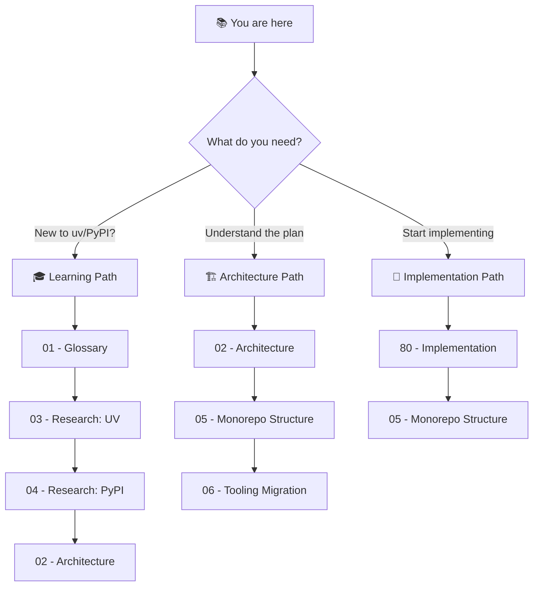

# 🏠 Workspace Monorepo Migration: Blueprint Index

> *Consolidate all ADHD modules into a single UV workspace monorepo for simplified dependency management, atomic updates, and streamlined CI.*

**Document Type:** Blueprint Index  
**Version:** 1.0  
**Created:** 2026-02-03  
**Status:** ⏳ [TODO] Planning Phase

---

## 📊 Progress Overview

| Phase | Status | Goal |
|-------|--------|------|
| P0: Research & Learning | ⏳ [TODO] | Understand uv, PyPI, distribution options |
| P1: Architecture Design | ⏳ [TODO] | Finalize monorepo structure |
| P2: Tooling Migration | ⏳ [TODO] | Update modules_controller_core, adhd refresh |
| P2.5: Type Removal | ⏳ [TODO] | Remove type field (~92 locations), keep layer+mcp |
| P3: CI Consolidation | ⏳ [TODO] | Single CI with path filtering |
| P4: Distribution Strategy | ⏳ [TODO] | Private package distribution (if needed) |

### Status Legend

| Icon | Meaning |
|------|---------|
| ⏳ | TODO |
| 🔄 | WIP |
| ✅ | DONE |
| 🚧 | BLOCKED |
| 🚫 | CUT |

---

## 💭 Vision Statement

> *"The unit of reuse is the package, not the repo. By consolidating all modules into one workspace, we get atomic commits, unified lockfile, simplified CI, and eliminate GitHub org flooding—while preserving each module's independent identity via pyproject.toml."*

---

## 🔗 Related Work

| Blueprint | Status | Relevance |
|-----------|--------|-----------|
| [UV Migration](../uv_migration/) | ✅ DONE | Foundation — per-module pyproject.toml |
| [Production Time Module Cut](../production_time_module_cut/) | 🔄 WIP | Layer taxonomy |
| [Discussion Record](../../discussion/2026-02-03_module_management_architecture.md) | ✅ | Consensus decisions + Type removal audit |
| [Type Removal Audit](./08_type_removal_migration.md) | ⏳ TODO | ~92 code locations, file-by-file plan |

---

## 📑 Document Index

| # | Document | Status | Purpose |
|---|----------|--------|---------|
| 00 | [Index](./00_index.md) | — | **Navigation hub** — You are here |
| 01 | [Glossary](./01_glossary.md) | ⏳ | **Terminology** — uv, PyPI, workspace, distribution explained |
| 02 | [Architecture](./02_architecture.md) | ⏳ | **Target structure** — Folder layout, how pieces connect |
| 03 | [Research: UV Workspaces](./03_research_uv_workspaces.md) | ⏳ | **Deep dive** — How uv workspaces work |
| 04 | [Research: PyPI Distribution](./04_research_pypi_distribution.md) | ⏳ | **Distribution options** — Private packages, rapid updates |
| 05 | [Feature: Monorepo Structure](./05_feature_monorepo_structure.md) | ⏳ | **Folder structure** — pyproject.toml patterns |
| 06 | [Feature: Tooling Migration](./06_feature_tooling_migration.md) | ⏳ | **Code changes** — modules_controller_core updates |
| 07 | [Feature: CI Consolidation](./07_feature_ci_consolidation.md) | ⏳ | **CI setup** — Single workflow, path filtering |
| 08 | [Feature: Type Removal](./08_type_removal_migration.md) | ⏳ | **Type removal** — ~92 code locations, file-by-file plan |
| 09 | [Module Distribution Guide](./09_module_distribution_guide.md) | ⏳ | **FAQ** — Pull, publish, modify, private modules |
| 80 | [Implementation](./80_implementation.md) | ✅ | **Task tracking** — Phased migration plan |
| 81 | [P4 Sanity Findings](./81_p4_sanity_findings.md) | ✅ | **Findings report** — 7-San parallel sanity check results |
| 82 | [P5 Testing Report](./82_p5_testing_report.md) | ✅ | **Testing report** — San/Red/Arch comprehensive testing results |
| 83 | [P6 Cleanup Report](./83_p6_cleanup_report.md) | ✅ | **Cleanup report** — Deprecated code removal results |
| 90 | [Decision Log](./90_decision_log.md) | ⏳ | **Rationale** — Key decisions documented |

---

## 🧭 Reading Order

---

## 🔑 Key Questions This Blueprint Answers

| Question | Answer Location |
|----------|-----------------|
| What is uv? How does it compare to pip/poetry? | [01_glossary.md](./01_glossary.md) |
| Can we upload private packages to PyPI? | [04_research_pypi_distribution.md](./04_research_pypi_distribution.md) |
| Can we update packages rapidly like git? | [04_research_pypi_distribution.md](./04_research_pypi_distribution.md) |
| How do I pull/publish/modify modules? | [09_module_distribution_guide.md](./09_module_distribution_guide.md) |
| Git URL vs PyPI — which to use? | [09_module_distribution_guide.md](./09_module_distribution_guide.md) |
| How do I distribute private modules? | [09_module_distribution_guide.md](./09_module_distribution_guide.md) |
| What will the folder structure look like? | [05_feature_monorepo_structure.md](./05_feature_monorepo_structure.md) |
| How much work is this migration? | [80_implementation.md](./80_implementation.md) |

---

**← Back to:** [Day Dream Index](../README.md)
