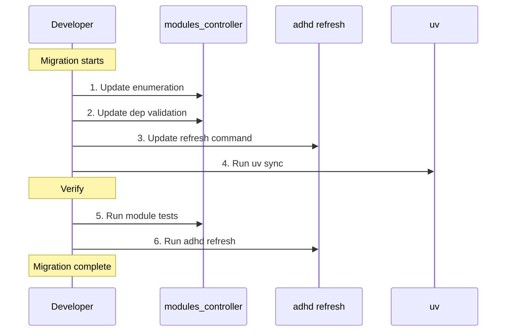

# 06 - Feature: Tooling Migration

> Part of [Workspace Monorepo Migration Blueprint](./00_index.md)
>
> **Status:** ⏳ [TODO] | **Difficulty:** `[KNOWN]`

---

## 📖 The Story

### 😤 The Pain

```
┌─────────────────────────────────────────────────────────────────┐
│  Current tooling assumes polyrepo or specific git URL patterns  │
│                                                                 │
│  modules_controller_core:                                       │
│    - May look for init.yaml (deprecated)                        │
│    - May expect certain folder structures                       │
│                                                                 │
│  adhd refresh:                                                  │
│    - May generate git URLs for dependencies                     │
│    - May not be workspace-aware                                 │
│                                                                 │
│  💥 Tooling not aligned with workspace model                    │
└─────────────────────────────────────────────────────────────────┘
```

| Who Hurts | Pain Level | Frequency |
|-----------|------------|-----------|
| Developer running `adhd refresh` | 🔥🔥 Medium | Per refresh |
| Tooling maintainer | 🔥🔥 Medium | Per feature |

### ✨ The Vision

```
┌─────────────────────────────────────────────────────────────────┐
│  Tooling is workspace-native                                    │
│                                                                 │
│  modules_controller_core:                                       │
│    - Reads [tool.adhd] from pyproject.toml ✅                   │
│    - Understands workspace structure ✅                         │
│    - Validates layer consistency ✅                             │
│                                                                 │
│  adhd refresh:                                                  │
│    - Runs uv sync ✅                                            │
│    - Validates pyproject.toml consistency ✅                    │
│    - Workspace-aware operations ✅                              │
└─────────────────────────────────────────────────────────────────┘
```

### 🎯 One-Liner

> Update ADHD tooling to be fully workspace-native, removing polyrepo assumptions.

### 📊 Impact

| Metric | Before | After |
|--------|--------|-------|
| Tooling complexity | ❌ Dual-mode (poly+mono) | ✅ Monorepo only |
| Developer confusion | ❌ Which mode am I in? | ✅ Always workspace |
| Maintenance burden | ❌ Two code paths | ✅ Single path |

---

## 🔧 The Spec

---

## 🎯 Components to Update

> **📋 Note:** Type removal migration details are in [08_type_removal_migration.md](./08_type_removal_migration.md).
> This document covers workspace-native changes; the type removal doc covers semantic changes.

### 1. modules_controller_core

**Current Responsibilities:**
- Enumerate modules in the workspace
- Parse `[tool.adhd]` from pyproject.toml
- Validate layer constraints
- Build dependency graphs

**Migration Tasks (Workspace):**

| Status | Task | Difficulty |
|--------|------|------------|
| ⏳ | Verify module enumeration uses workspace glob patterns | `[KNOWN]` |
| ⏳ | Confirm no init.yaml references remain | `[KNOWN]` |
| ⏳ | Update dependency walker for workspace deps | `[KNOWN]` |
| ⏳ | Validate all deps are package names (not git URLs) | `[KNOWN]` |

**Migration Tasks (Type Removal — 26 findings):**

| Status | Task | Difficulty |
|--------|------|------------|
| ⏳ | DELETE `ModuleTypeEnum` from module_types.py | `[KNOWN]` |
| ⏳ | DELETE `ModuleTypes` class | `[KNOWN]` |
| ⏳ | Remove TYPE dimension from `ModuleFilter` | `[KNOWN]` |
| ⏳ | Remove `add_type()` and `_type_filters` | `[KNOWN]` |
| ⏳ | Update `ModuleInfo` dataclass (remove module_type) | `[KNOWN]` |
| ⏳ | Remove type from `REQUIRED_INIT_KEYS` | `[KNOWN]` |
| ⏳ | Remove type-layer validation | `[KNOWN]` |

**Code Changes:**

```python
# modules_controller_core/modules_controller.py

def get_workspace_members() -> list[Path]:
    """Get all workspace members from root pyproject.toml."""
    root = find_workspace_root()
    root_pyproject = toml.load(root / "pyproject.toml")
    
    members = root_pyproject.get("tool", {}).get("uv", {}).get("workspace", {}).get("members", [])
    
    result = []
    for pattern in members:
        for path in root.glob(pattern):
            if (path / "pyproject.toml").exists():
                result.append(path)
    
    return result
```

---

### 2. adhd refresh Command

**Current Responsibilities:**
- Sync dependencies
- Potentially regenerate files
- Validate workspace state

**Migration Tasks:**

| Status | Task | Difficulty |
|--------|------|------------|
| ⏳ | Ensure `uv sync` is called | `[KNOWN]` |
| ⏳ | Remove any git URL generation logic | `[KNOWN]` |
| ⏳ | Add workspace validation step | `[KNOWN]` |
| ⏳ | Report inconsistent pyproject.toml files | `[KNOWN]` |

**Proposed Workflow:**

```
adhd refresh
│
├── 1. Find workspace root (pyproject.toml with [tool.uv.workspace])
│
├── 2. Validate workspace structure
│   ├── All members have pyproject.toml
│   ├── All have [tool.adhd] section
│   └── No git URLs in dependencies (workspace deps only)
│
├── 3. Run uv lock (update lockfile if needed)
│
├── 4. Run uv sync (install dependencies)
│
└── 5. Report success/issues
```

---

### 3. uv_migrator_core (If Still Used)

**Current Responsibilities:**
- Generate pyproject.toml for modules
- Migrate from init.yaml

**Migration Tasks:**

| Status | Task | Difficulty |
|--------|------|------------|
| ⏳ | Verify generates workspace-compatible pyproject.toml | `[KNOWN]` |
| ⏳ | Remove git URL generation in favor of package names | `[KNOWN]` |
| ⏳ | Update templates for flat layout | `[KNOWN]` |

**Note:** If UV migration is complete, this module may be maintenance-only.

---

### 4. workspace_core

**Current Responsibilities:**
- Generate VS Code workspace files
- Handle workspace switching

**Migration Tasks:**

| Status | Task | Difficulty |
|--------|------|------------|
| ⏳ | Verify workspace file generation works with monorepo | `[KNOWN]` |
| ⏳ | Confirm path references are correct | `[KNOWN]` |

---

### 5. instruction_core

**Current Responsibilities:**
- Sync instruction files
- Manage agent/instruction discovery

**Migration Tasks:**

| Status | Task | Difficulty |
|--------|------|------------|
| ⏳ | Verify instruction discovery uses workspace paths | `[KNOWN]` |
| ⏳ | Confirm no hardcoded polyrepo paths | `[KNOWN]` |

---

## 🔍 Code Audit Checklist

Search for these patterns across the codebase:

| Pattern | Risk | Action |
|---------|------|--------|
| `git+https://` | High | Replace with workspace package names |
| `git+ssh://` | High | Replace with workspace package names |
| `init.yaml` | Medium | Remove references (deprecated) |
| `sys.path.insert` | Medium | Remove (workspace handles imports) |
| `os.path.join("cores/"` | Low | Verify uses workspace root |

**Commands to find issues:**

```bash
# Find git URL references
grep -r "git+https" --include="*.py" --include="*.toml"

# Find init.yaml references
grep -r "init\.yaml" --include="*.py"

# Find path hacks
grep -r "sys\.path\.insert" --include="*.py"
```

---

## 📋 Validation Tests

### Test 1: Module Enumeration

```python
def test_enumerate_workspace_members():
    """All workspace members are discovered."""
    members = get_workspace_members()
    
    expected = [
        "cores/exceptions_core",
        "cores/yaml_reading_core",
        "cores/modules_controller_core",
        # ... all others
    ]
    
    member_names = [m.name for m in members]
    for exp in expected:
        assert Path(exp).name in member_names
```

### Test 2: Dependency Resolution

```python
def test_workspace_deps_resolve():
    """Workspace dependencies resolve by package name."""
    # This should work after uv sync
    from exceptions_core import ADHDException
    from logger_util import Logger
    from modules_controller_core import get_workspace_members
```

### Test 3: No Git URLs in Dependencies

```python
def test_no_git_urls_in_deps():
    """No module uses git URLs for workspace deps."""
    for module in get_workspace_members():
        pyproject = toml.load(module / "pyproject.toml")
        deps = pyproject.get("project", {}).get("dependencies", [])
        
        for dep in deps:
            assert "git+" not in dep, f"{module.name} has git URL: {dep}"
```

---

## 🔄 Migration Sequence



---

## 📊 Estimated Effort

### Workspace Migration

| Component | Changes | Hours |
|-----------|---------|-------|
| modules_controller_core | Medium | 2-4 |
| adhd refresh | Small | 1-2 |
| uv_migrator_core | Small (verify) | 1 |
| workspace_core | Small (verify) | 1 |
| instruction_core | Small (verify) | 1 |
| **Subtotal** | — | **6-9 hours** |

### Type Removal Migration (~92 locations)

| Component | Findings | Hours |
|-----------|----------|-------|
| modules_controller_core | 26 | 4-6 |
| module_creator_core | 15 | 3-4 |
| project_creator_core | 15 | 3-4 |
| adhd_mcp + adhd_framework | 19 | 2-3 |
| Instruction files | 17 | 1-2 |
| **Subtotal** | **~92** | **14-20 hours** |

**Combined Total:** ~20-29 hours (~4-5 days)

See [08_type_removal_migration.md](./08_type_removal_migration.md) for complete file-by-file breakdown.

---

**← Back to:** [Blueprint Index](./00_index.md) | **Next:** [Feature: CI Consolidation](./07_feature_ci_consolidation.md)
