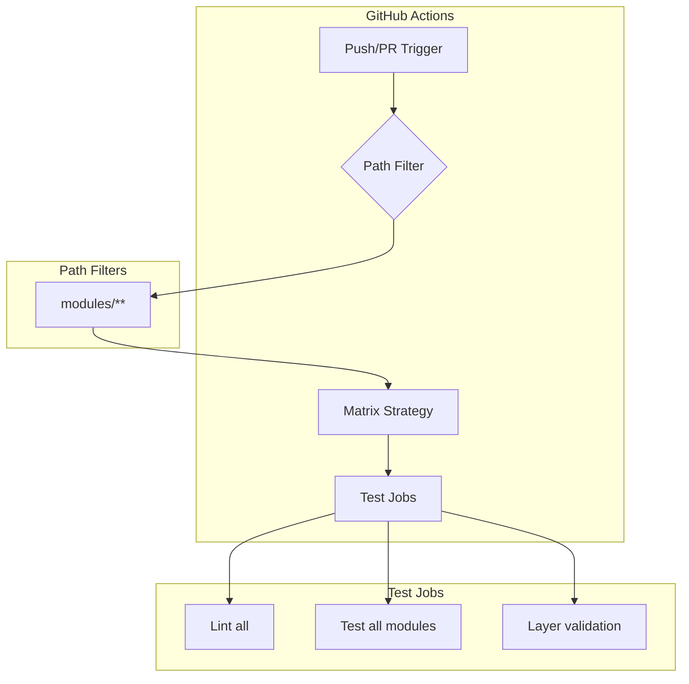

# 07 - Feature: CI Consolidation

> Part of [Workspace Monorepo Migration Blueprint](./00_index.md)
>
> **Status:** ⏳ [TODO] | **Difficulty:** `[KNOWN]`

---

## 📖 The Story

### 😤 The Pain

```
┌─────────────────────────────────────────────────────────────────┐
│  POLYREPO CI: N workflows, N configurations                     │
│                                                                 │
│  repo-a/.github/workflows/ci.yml                                │
│  repo-b/.github/workflows/ci.yml                                │
│  repo-c/.github/workflows/ci.yml                                │
│  ...                                                            │
│                                                                 │
│  💥 N places to update CI configuration                         │
│  💥 N places to manage secrets                                  │
│  💥 Inconsistent CI behavior across repos                       │
│  💥 Cross-repo changes need N PRs                               │
└─────────────────────────────────────────────────────────────────┘
```

| Who Hurts | Pain Level | Frequency |
|-----------|------------|-----------|
| CI maintainer | 🔥🔥🔥 High | Per CI update |
| Developer | 🔥🔥 Medium | Per cross-repo change |

### ✨ The Vision

```
┌─────────────────────────────────────────────────────────────────┐
│  MONOREPO CI: Single workflow with flat modules/ folder         │
│                                                                 │
│  .github/workflows/ci.yml                                       │
│    ├── triggers on: push to modules/**                          │
│    ├── runs: uv sync, pytest, ruff, layer validation            │
│    └── validates: layer constraints via adhd deps               │
│                                                                 │
│  ✅ One place for all CI config                                 │
│  ✅ One set of secrets                                          │
│  ✅ Consistent behavior                                         │
│  ✅ Atomic changes in single PR                                 │
└─────────────────────────────────────────────────────────────────┘
```

### 🎯 One-Liner

> Single CI workflow with path-based filtering to run tests only for changed modules.

### 📊 Impact

| Metric | Before (Polyrepo) | After (Monorepo) |
|--------|-------------------|------------------|
| CI config locations | ❌ N files | ✅ 1 file |
| Secret management | ❌ N repos | ✅ 1 repo |
| Cross-module testing | ❌ Manual | ✅ Automatic |
| CI update effort | ❌ N changes | ✅ 1 change |

---

## 🔧 The Spec

---

## 🏗️ CI Architecture



---

## 📄 GitHub Actions Workflow

### Single Workflow File

```yaml
# .github/workflows/ci.yml
name: CI

on:
  push:
    branches: [main, develop]
    paths:
      - 'modules/**'       # Flat modules folder
      - 'pyproject.toml'
      - 'uv.lock'
      - '.github/workflows/ci.yml'
  pull_request:
    branches: [main, develop]
    paths:
      - 'modules/**'       # Flat modules folder
      - 'pyproject.toml'
      - 'uv.lock'
      - '.github/workflows/ci.yml'

jobs:
  # ============================================
  # Determine if modules changed
  # ============================================
  changes:
    runs-on: ubuntu-latest
    outputs:
      modules: ${{ steps.filter.outputs.modules }}
    steps:
      - uses: actions/checkout@v4
      
      - uses: dorny/paths-filter@v3
        id: filter
        with:
          filters: |
            modules:
              - 'modules/**'
              - 'pyproject.toml'
              - 'uv.lock'

  # ============================================
  # Setup and Lint (always runs if any change)
  # ============================================
  lint:
    needs: changes
    if: ${{ needs.changes.outputs.modules == 'true' }}
    runs-on: ubuntu-latest
    steps:
      - uses: actions/checkout@v4
      
      - name: Install uv
        uses: astral-sh/setup-uv@v4
        with:
          version: "latest"
      
      - name: Set up Python
        run: uv python install 3.11
      
      - name: Install dependencies
        run: uv sync --extra dev
      
      - name: Lint with ruff
        run: uv run ruff check .
      
      - name: Type check with mypy
        run: uv run mypy --ignore-missing-imports .
        continue-on-error: true  # Optional: don't fail CI on type errors

  # ============================================
  # Test cores (if changed)
  # ============================================
  # Test all modules (flat structure)
  # ============================================
  test-modules:
    needs: [changes, lint]
    if: ${{ needs.changes.outputs.modules == 'true' }}
    runs-on: ubuntu-latest
    strategy:
      matrix:
        python-version: ['3.10', '3.11', '3.12']
    steps:
      - uses: actions/checkout@v4
      
      - name: Install uv
        uses: astral-sh/setup-uv@v4
      
      - name: Set up Python ${{ matrix.python-version }}
        run: uv python install ${{ matrix.python-version }}
      
      - name: Install dependencies
        run: uv sync --extra dev
      
      - name: Run all module tests
        run: uv run pytest modules/ -v --tb=short

  # ============================================
  # Layer Validation (always runs)
  # ============================================
  validate-layers:
    needs: [changes, lint]
    if: ${{ needs.changes.outputs.modules == 'true' }}
    runs-on: ubuntu-latest
    steps:
      - uses: actions/checkout@v4
      
      - name: Install uv
        uses: astral-sh/setup-uv@v4
      
      - name: Set up Python
        run: uv python install 3.11
      
      - name: Install dependencies
        run: uv sync
      
      - name: Validate layer constraints
        run: |
          # This command should exit 1 on violations
          uv run python -m adhd_framework deps --closure-all || exit 1
```

---

## 🔀 Alternative: Simpler Approach

If path-based filtering is too complex, a simpler approach:

```yaml
# .github/workflows/ci.yml
name: CI

on:
  push:
    branches: [main, develop]
  pull_request:
    branches: [main, develop]

jobs:
  test:
    runs-on: ubuntu-latest
    steps:
      - uses: actions/checkout@v4
      
      - name: Install uv
        uses: astral-sh/setup-uv@v4
      
      - name: Set up Python
        run: uv python install 3.11
      
      - name: Install dependencies
        run: uv sync --extra dev
      
      - name: Lint
        run: uv run ruff check .
      
      - name: Test all
        run: uv run pytest -v
      
      - name: Validate layers
        run: uv run adhd deps --closure-all
```

**Trade-off:**
- ✅ Simpler to maintain
- ❌ Runs ALL tests even for small changes
- ✅ Catches cross-module regressions
- ❌ Slower for small PRs

---

## 📊 CI Comparison

| Aspect | Path-Filtered | Run-All |
|--------|---------------|---------|
| Complexity | Medium | Low |
| Speed (small changes) | Fast | Slow |
| Cross-module coverage | May miss | Always catches |
| Maintenance | More | Less |
| Recommended for | Large monorepos | Small-medium |

**Recommendation:** Start with "Run-All" approach, optimize to path-filtered if CI times become a bottleneck.

---

## 🔐 Secrets Management

With monorepo, secrets are centralized:

| Secret | Purpose | Scope |
|--------|---------|-------|
| `GITHUB_TOKEN` | Auto-provided | All jobs |
| `PYPI_TOKEN` | Publishing (if needed) | Publish job only |
| `CODECOV_TOKEN` | Coverage reports | Test jobs |

```yaml
# Example secret usage
- name: Publish to PyPI
  if: github.event_name == 'push' && startsWith(github.ref, 'refs/tags/v')
  env:
    UV_PUBLISH_TOKEN: ${{ secrets.PYPI_TOKEN }}
  run: uv publish
```

---

## 📈 Optional: Coverage Reports

```yaml
  coverage:
    needs: [test-cores, test-managers, test-utils, test-mcps]
    if: always()  # Run even if some tests skipped
    runs-on: ubuntu-latest
    steps:
      - uses: actions/checkout@v4
      
      - name: Install uv
        uses: astral-sh/setup-uv@v4
      
      - name: Set up Python
        run: uv python install 3.11
      
      - name: Install dependencies
        run: uv sync --extra dev
      
      - name: Run tests with coverage
        run: uv run pytest --cov=. --cov-report=xml
      
      - name: Upload to Codecov
        uses: codecov/codecov-action@v4
        with:
          token: ${{ secrets.CODECOV_TOKEN }}
          files: ./coverage.xml
```

---

## ✅ Validation Checklist

| Check | What to Verify |
|-------|----------------|
| ☐ Lint job | Runs ruff on all code |
| ☐ Test jobs | Run pytest for each module category |
| ☐ Python versions | Matrix tests multiple versions (optional) |
| ☐ Layer validation | `adhd deps --closure-all` passes |
| ☐ Path filtering | Jobs skip when paths unchanged (if using) |
| ☐ Branch protection | Main requires passing CI |

---

**← Back to:** [Blueprint Index](./00_index.md) | **Next:** [Implementation](./80_implementation.md)
