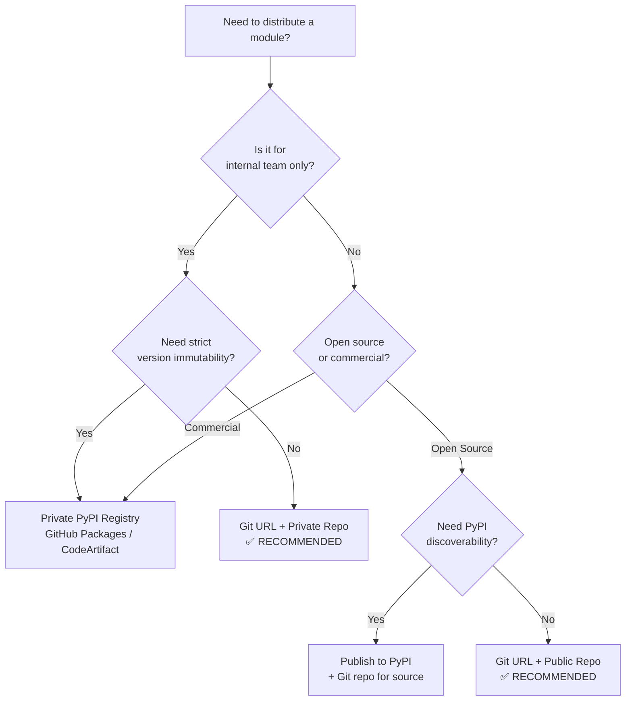

# 📦 Module Distribution Guide

> *A practical FAQ for ADHD Framework module distribution: pulling, publishing, modifying, and handling private modules.*

**Document Type:** Guide / FAQ  
**Version:** 1.0  
**Created:** 2026-02-03  
**Status:** ⏳ [TODO] Reference Document

---

## 📖 The Story

### 😤 The Pain

```
┌──────────────────────────────────────────────────────────────────────┐
│  DEVELOPER CONFUSION                                                 │
│  ┌────────────────────────────────────────────────────────────────┐  │
│  │  "How do I pull modules?"        ──►  💥 PyPI? Git? Both?      │  │
│  │  "How do I publish modules?"     ──►  💥 twine? uv? GitHub?    │  │
│  │  "Can I modify & republish?"     ──►  💥 Does PyPI save git?   │  │
│  │  "What about private modules?"   ──►  💥 GitHub = old way??    │  │
│  └────────────────────────────────────────────────────────────────┘  │
└──────────────────────────────────────────────────────────────────────┘
```

| Pain Point | Root Cause |
|------------|------------|
| "Which distribution model?" | Two valid options, unclear when to use each |
| "Is git-based legacy?" | Misconception — git URLs are modern & preferred |
| "Does PyPI save git history?" | No — only tarballs, history lost |
| "Private = expensive?" | Only with private PyPI registries |

### ✨ The Vision

```
┌──────────────────────────────────────────────────────────────────────┐
│  CLEAR MENTAL MODEL                                                  │
│  ┌────────────────────────────────────────────────────────────────┐  │
│  │  DEVELOPMENT     →    Work in monorepo, direct edits           │  │
│  │  DISTRIBUTION    →    Git URLs (free, fast, history preserved) │  │
│  │  FORMAL RELEASE  →    PyPI (when needed for discoverability)   │  │
│  │  PRIVATE MODULES →    GitHub private repos + SSH/tokens        │  │
│  └────────────────────────────────────────────────────────────────┘  │
└──────────────────────────────────────────────────────────────────────┘
```

### 🎯 One-Liner

> *"Use Git URLs for internal/rapid iteration, PyPI for formal open-source releases. GitHub private repos solve private distribution for free."*

### 📊 Impact

| Before | After |
|--------|-------|
| ❌ Confusion: "PyPI or Git?" | ✅ Clear decision matrix |
| ❌ "Private = $$$ registry" | ✅ "Private = free GitHub" |
| ❌ "Modify = complex process" | ✅ "Git: push. PyPI: bump+build+upload" |
| ❌ "Git-based is old way" | ✅ "Git-based is simpler for internal" |

---

## 🔧 The Spec

---

## 1. The Two Distribution Models

```
┌─────────────────────────────────────────────────────────────────────────────────┐
│                        DISTRIBUTION MODEL COMPARISON                            │
├─────────────────────────────────┬───────────────────────────────────────────────┤
│  MODEL A: Git-based             │  MODEL B: PyPI-based                          │
│  ═══════════════════════════    │  ═══════════════════════════                  │
│                                 │                                               │
│  ┌─────────┐    git push        │  ┌─────────┐    uv build                      │
│  │ Module  │ ────────────►      │  │ Module  │ ──────────────►  ┌─────────┐     │
│  └─────────┘      ┌─────────┐   │  └─────────┘      ┌───────┐   │ .tar.gz │     │
│                   │ GitHub  │   │                   │ dist/ │   └────┬────┘     │
│                   └────┬────┘   │                   └───────┘        │          │
│                        │        │                        │           │          │
│                        ▼        │                        ▼           ▼          │
│               pip install       │               uv publish    ───► PyPI         │
│               git+https://...   │               (or twine)                      │
│                                 │                                               │
│  ✅ Git history preserved       │  ❌ Git history LOST (tarball only)           │
│  ✅ Instant updates (push)      │  ❌ Must bump version each change             │
│  ✅ Free for private            │  ❌ Private = $$$ (registry needed)           │
│  ❌ Requires git access         │  ✅ Standard Python way                       │
│  ❌ No version caching          │  ✅ Immutable version caching                 │
└─────────────────────────────────┴───────────────────────────────────────────────┘
```

### Summary Table

| Aspect | Git-based (RECOMMENDED) | PyPI-based (Traditional) |
|--------|-------------------------|--------------------------|
| **Publish** | `git push` to GitHub | `uv publish` / `twine upload` |
| **Pull** | `pip install git+https://...` | `pip install package-name` |
| **Private** | GitHub private repos + SSH/tokens | Private registry ($$$) |
| **Git history** | ✅ Preserved | ❌ Lost (tarball only) |
| **Update speed** | ✅ Instant (just push) | ❌ Bump version → build → upload |
| **Version caching** | ❌ No | ✅ Immutable versions |
| **Cost** | ✅ Free (GitHub) | ❌ Private = paid registries |

---

## 2. FAQ: Your Questions Answered

---

### Q1: How do I pull modules from the internet?

#### Option A: Git URL (RECOMMENDED for ADHD) `[KNOWN]`

**In `pyproject.toml`:**

```toml
[project]
name = "my-project"
dependencies = [
    "config-manager",
    "logger-util",
]

[tool.uv.sources]
# Public GitHub repo
config-manager = { git = "https://github.com/org/config_manager.git" }

# Specific tag/version
logger-util = { git = "https://github.com/org/logger_util.git", tag = "v1.0.0" }

# Specific branch
# logger-util = { git = "https://github.com/org/logger_util.git", branch = "develop" }

# Specific commit
# logger-util = { git = "https://github.com/org/logger_util.git", rev = "abc1234" }
```

**Then run:**

```bash
uv sync
# or
pip install git+https://github.com/org/config_manager.git
```

#### Option B: PyPI `[KNOWN]`

**In `pyproject.toml`:**

```toml
[project]
name = "my-project"
dependencies = [
    "requests>=2.28.0",
    "pydantic>=2.0,<3.0",
]
```

**Then run:**

```bash
uv sync
# or
pip install -r requirements.txt
```

#### Decision: When to Use Which?

| Scenario | Use Git URL | Use PyPI |
|----------|-------------|----------|
| ADHD Framework modules | ✅ | ❌ |
| Your own modules | ✅ | ❌ (unless formal release) |
| Third-party libraries (requests, pydantic) | ❌ | ✅ |
| Bleeding-edge unreleased features | ✅ | ❌ |
| Stable, versioned dependencies | ❌ | ✅ |

---

### Q2: How do I publish modules?

#### Option A: To GitHub (Git-based) — RECOMMENDED `[KNOWN]`

```bash
# 1. Navigate to your module
cd modules/config_manager

# 2. Ensure clean git state
git add .
git commit -m "feat: add new feature X"

# 3. Push to GitHub
git push origin main

# 4. (Optional) Tag for versioning
git tag v1.0.0
git push --tags

# ✅ DONE! Others can now pull via:
#    pip install git+https://github.com/org/config_manager.git
#    pip install git+https://github.com/org/config_manager.git@v1.0.0
```

**That's it. No build step. No upload step. Push = published.**

#### Option B: To PyPI `[KNOWN]`

```bash
# 1. Navigate to your module
cd modules/config_manager

# 2. Ensure version is correct in pyproject.toml
# [project]
# name = "config-manager"
# version = "1.0.0"  ← This is what gets published

# 3. Build the package
uv build
# Creates:
#   dist/config_manager-1.0.0.tar.gz
#   dist/config_manager-1.0.0-py3-none-any.whl

# 4. Upload to PyPI (requires API token)
uv publish
# or: twine upload dist/*

# 5. Set up PyPI credentials (one-time)
# Create ~/.pypirc or use environment variables:
# export UV_PUBLISH_TOKEN="pypi-xxxxx"
```

#### Comparison

| Step | Git-based | PyPI-based |
|------|-----------|------------|
| Prepare | `git add .` | Edit `pyproject.toml` version |
| Package | (none) | `uv build` |
| Upload | `git push` | `uv publish` |
| Total commands | 2 | 3-4 |
| Can re-push same "version"? | ✅ Yes (same branch) | ❌ No (immutable) |

---

### Q3: How do I modify modules from the internet and republish?

#### Critical Clarification

```
┌──────────────────────────────────────────────────────────────────────────────────┐
│                     GIT vs PyPI: WHAT GETS PRESERVED?                            │
├────────────────────────────┬─────────────────────────────────────────────────────┤
│                            │                                                     │
│  GIT-BASED                 │  PyPI-BASED                                         │
│  ══════════                │  ══════════                                         │
│                            │                                                     │
│  ┌─────────────────────┐   │  ┌─────────────────────┐                            │
│  │  Full Git Repo      │   │  │  .tar.gz Tarball    │                            │
│  │  ├── .git/          │   │  │  ├── src/           │                            │
│  │  │   └── (history)  │   │  │  ├── pyproject.toml │                            │
│  │  ├── src/           │   │  │  └── README.md      │                            │
│  │  ├── pyproject.toml │   │  │                     │                            │
│  │  └── README.md      │   │  │  ❌ NO .git/        │                            │
│  └─────────────────────┘   │  │  ❌ NO history      │                            │
│                            │  └─────────────────────┘                            │
│  ✅ Clone → Edit → Push    │  ❌ Download → Edit → Bump version → Build → Upload │
│  ✅ History preserved      │  ❌ History LOST                                    │
│  ✅ Folder structure: YES  │  ✅ Folder structure: YES (in tarball)              │
│                            │                                                     │
└────────────────────────────┴─────────────────────────────────────────────────────┘
```

| Aspect | Git-based | PyPI-based |
|--------|-----------|------------|
| Git history preserved? | ✅ **YES** | ❌ **NO** — PyPI only stores tarball |
| Inner folder structure preserved? | ✅ YES | ✅ YES (in tarball) |
| Can modify locally? | ✅ Clone, edit, push | ✅ Download source, edit, rebuild |
| Rapid iteration? | ✅ Push = instant update | ❌ Must bump version, rebuild, upload |
| Version pinning | By branch/tag/commit | By version number |
| Can others see your changes? | ✅ Full diff history | ❌ Only see release notes |

#### Workflow A: Modify a Git-based Module `[KNOWN]`

```bash
# 1. Clone (or it's already in your monorepo)
git clone https://github.com/org/config_manager.git
cd config_manager

# 2. Make your modifications
vim config_manager/config_manager.py

# 3. Commit and push
git add .
git commit -m "fix: resolve edge case in load_config"
git push origin main

# 4. Consumers automatically get the update
#    - If tracking main branch: next `uv sync` pulls new code
#    - If pinned to tag: update their pin to new tag
```

**Key insight:** Consumers tracking `main` branch get updates automatically. No action needed.

#### Workflow B: Modify a PyPI Module (You Own) `[KNOWN]`

```bash
# 1. Clone your SOURCE repo (NOT pip install!)
git clone https://github.com/org/config_manager.git  # Your source repo
cd config_manager

# 2. Make modifications
vim config_manager/config_manager.py

# 3. BUMP VERSION (REQUIRED — PyPI rejects same version!)
vim pyproject.toml
# Change: version = "1.0.0"  →  version = "1.0.1"

# 4. Build new package
uv build

# 5. Upload to PyPI
uv publish

# 6. Consumers must update their version pin
#    dependencies = ["config-manager>=1.0.1"]
```

**⚠️ Critical:** PyPI versions are **immutable**. You cannot re-upload `1.0.0`. You must bump to `1.0.1`.

#### Workflow C: Modify Someone Else's PyPI Module `[KNOWN]`

```bash
# 1. Download source (NOT the installed wheel!)
pip download config-manager --no-binary :all:
tar -xzf config_manager-1.0.0.tar.gz
cd config_manager-1.0.0

# 2. Modify
vim config_manager/config_manager.py

# 3. You have two options:

# Option 3a: Fork and publish under new name
vim pyproject.toml
# Change: name = "config-manager"  →  name = "config-manager-fork"
# Change: version = "1.0.0"  →  version = "1.0.0"
uv build
uv publish

# Option 3b: Install locally (don't publish)
pip install -e .  # Editable install from local source
```

---

### Q4: How do I push PRIVATE modules?

#### Option A: GitHub Private Repo (RECOMMENDED) `[KNOWN]`

```bash
# 1. Create a private repo on GitHub
#    github.com/your-org → New repository → Private

# 2. Push your module
cd modules/private_module
git init
git remote add origin git@github.com:your-org/private-module.git
git add .
git commit -m "Initial commit"
git push -u origin main

# ✅ DONE! 
# Your private module is now accessible to authorized users only
```

**"Isn't GitHub the old way?"**

```
┌──────────────────────────────────────────────────────────────────────────────────┐
│                            THE "OLD WAY" MISCONCEPTION                           │
├──────────────────────────────────────────────────────────────────────────────────┤
│                                                                                  │
│  ❌ OLD WAY (What people think is "GitHub-based"):                               │
│  ═══════════════════════════════════════════════                                 │
│     One repo per module, scattered across org                                    │
│                                                                                  │
│     github.com/org/                                                              │
│       ├── config-manager/     ← separate repo                                    │
│       ├── logger-util/        ← separate repo                                    │
│       ├── adhd-mcp/           ← separate repo                                    │
│       └── ... 50 more repos   ← org flooding!                                    │
│                                                                                  │
│  ✅ NEW WAY (What we actually do):                                               │
│  ═════════════════════════════════                                               │
│     Monorepo for development, Git URLs for distribution                          │
│                                                                                  │
│     DEVELOPMENT (one repo):        DISTRIBUTION (Git URLs):                      │
│     adhd-framework/                pip install git+https://...                   │
│       ├── modules/                   • Point to monorepo subdirectory            │
│       │   ├── config_manager/        • Or split out for external users           │
│       │   ├── logger_util/                                                       │
│       │   └── adhd_mcp/                                                          │
│       └── pyproject.toml                                                         │
│                                                                                  │
└──────────────────────────────────────────────────────────────────────────────────┘
```

#### Option B: Private PyPI Registry `[KNOWN]`

| Registry | Cost | Notes |
|----------|------|-------|
| **GitHub Packages** | Free (with GitHub) | Integrated with GitHub repos |
| **AWS CodeArtifact** | ~$0.05/GB/month | Good for AWS-heavy orgs |
| **Google Artifact Registry** | ~$0.10/GB/month | Good for GCP-heavy orgs |
| **Azure Artifacts** | Free tier available | Good for Azure-heavy orgs |
| **Self-hosted: devpi** | Free (self-hosted) | Requires server maintenance |
| **Self-hosted: pypiserver** | Free (self-hosted) | Simpler than devpi |
| **Gemfury** | $9+/month | Managed service |

**When to use private PyPI?**

- External contractors who shouldn't have git repo access
- Compliance requirements mandating artifact registry
- Need immutable version pinning for auditing

---

### Q5: How do I pull PRIVATE modules?

#### Option A: Git URL with SSH Key (RECOMMENDED) `[KNOWN]`

**In `pyproject.toml`:**

```toml
[tool.uv.sources]
private-module = { git = "git@github.com:your-org/private-module.git" }
```

**Prerequisites:**
1. SSH key added to GitHub: `~/.ssh/id_ed25519.pub`
2. Key associated with your GitHub account
3. Access granted to the private repo

```bash
# Test SSH access
ssh -T git@github.com
# Should say: "Hi username! You've successfully authenticated..."
```

#### Option B: Git URL with Personal Access Token `[KNOWN]`

**In `pyproject.toml`:**

```toml
[tool.uv.sources]
# ⚠️ Don't commit tokens to version control!
# Use environment variable substitution
private-module = { git = "https://${GITHUB_TOKEN}@github.com/your-org/private-module.git" }
```

**Or via environment:**

```bash
export GITHUB_TOKEN="ghp_xxxxxxxxxxxx"
pip install git+https://${GITHUB_TOKEN}@github.com/your-org/private-module.git
```

#### Option C: From Private PyPI Registry `[KNOWN]`

```bash
# Configure the private index
uv sync --index-url https://pypi.org/simple/ \
        --extra-index-url https://private.pypi.your-org.com/simple/

# Or in pyproject.toml
[tool.uv]
index-url = "https://pypi.org/simple/"
extra-index-url = ["https://private.pypi.your-org.com/simple/"]

# With authentication
# Use ~/.netrc or environment variables for credentials
```

---

## 3. Decision Matrix: When to Use What



### Quick Reference Table

| Scenario | Recommended | Why |
|----------|-------------|-----|
| Internal team modules | Git URL (private repo) | Free, rapid iteration, history preserved |
| Open source modules | Git URL OR PyPI | PyPI for discoverability, Git for bleeding edge |
| Modules you'll frequently modify | Git URL | No version bump needed per change |
| Modules with strict versioning needs | PyPI | Immutable versions, clear release process |
| Private + external contractors | Private PyPI registry | Token-based access without git repo access |
| Bleeding-edge features | Git URL (branch/commit) | Pin to specific commit for stability |
| Production stability | PyPI (version pinned) | Immutable, auditable releases |

---

## 4. The ADHD Framework Recommendation

```
┌─────────────────────────────────────────────────────────────────────────────────┐
│                    ADHD FRAMEWORK DISTRIBUTION MODEL                            │
│                                                                                 │
│  ╔═════════════════════════════════════════════════════════════════════════╗    │
│  ║  DEVELOPMENT TIME (Monorepo - Single Source of Truth)                   ║    │
│  ╠═════════════════════════════════════════════════════════════════════════╣    │
│  ║                                                                         ║    │
│  ║    adhd-framework/                                                      ║    │
│  ║    ├── pyproject.toml           ← [tool.uv.workspace]                   ║    │
│  ║    │                               members = ["modules/*"]              ║    │
│  ║    ├── modules/                                                         ║    │
│  ║    │   ├── config_manager/      ← Edit directly here                    ║    │
│  ║    │   │   └── pyproject.toml   ← Individual package metadata           ║    │
│  ║    │   ├── logger_util/                                                 ║    │
│  ║    │   └── adhd_mcp/                                                    ║    │
│  ║    └── uv.lock                  ← Single lockfile for all               ║    │
│  ║                                                                         ║    │
│  ║    Benefits:                                                            ║    │
│  ║    • Atomic commits across modules                                      ║    │
│  ║    • Single lockfile (no version conflicts)                             ║    │
│  ║    • Direct edits (no clone/push cycle during development)              ║    │
│  ║                                                                         ║    │
│  ╚═════════════════════════════════════════════════════════════════════════╝    │
│                                                                                 │
│  ╔═════════════════════════════════════════════════════════════════════════╗    │
│  ║  DISTRIBUTION TIME (When others need your modules)                      ║    │
│  ╠═════════════════════════════════════════════════════════════════════════╣    │
│  ║                                                                         ║    │
│  ║  OPTION A: Clone Whole Monorepo (Simplest)                              ║    │
│  ║  ─────────────────────────────────────────                              ║    │
│  ║    git clone https://github.com/org/adhd-framework.git                  ║    │
│  ║    cd adhd-framework && uv sync                                         ║    │
│  ║    ✅ Best for: Contributors, full framework users                      ║    │
│  ║                                                                         ║    │
│  ║  OPTION B: Git Subdirectory Install (Advanced)                          ║    │
│  ║  ───────────────────────────────────────────                            ║    │
│  ║    [tool.uv.sources]                                                    ║    │
│  ║    config-manager = { git = "https://...", subdirectory = "modules/..." }    │
│  ║    ✅ Best for: Cherry-picking specific modules                         ║    │
│  ║                                                                         ║    │
│  ║  OPTION C: Publish to PyPI (Formal Release)                             ║    │
│  ║  ──────────────────────────────────────────                             ║    │
│  ║    cd modules/config_manager && uv build && uv publish                  ║    │
│  ║    ✅ Best for: Public discoverability, external adoption               ║    │
│  ║                                                                         ║    │
│  ╚═════════════════════════════════════════════════════════════════════════╝    │
│                                                                                 │
└─────────────────────────────────────────────────────────────────────────────────┘
```

### ADHD-Specific Recommendations

| Module Type | Distribution | Rationale |
|-------------|--------------|-----------|
| **Core modules** (config_manager, logger_util) | Git URL to monorepo | Rapid iteration, tight coupling |
| **MCP servers** (adhd_mcp) | Git URL or PyPI | Depends on external adoption goals |
| **Experimental modules** | Git URL (branch) | Easy to break, easy to fix |
| **Stable utilities** | PyPI (optional) | For external discoverability |

---

## 5. Common Misconceptions

```
┌──────────────────────────────────────────────────────────────────────────────────┐
│                           MYTH BUSTERS 🔍                                        │
├────────────────────────────────────────┬─────────────────────────────────────────┤
│  MISCONCEPTION                         │  REALITY                                │
├────────────────────────────────────────┼─────────────────────────────────────────┤
│                                        │                                         │
│  "PyPI saves git history"              │  ❌ PyPI only stores tarballs           │
│                                        │     No commits, no branches, no diffs   │
│                                        │                                         │
│  "I need separate repos to distribute" │  ❌ Monorepo can distribute via:        │
│                                        │     • Subdirectory installs             │
│                                        │     • Published packages (build & push) │
│                                        │                                         │
│  "Private modules = must use PyPI"     │  ❌ Private GitHub repos + Git URLs     │
│                                        │     work great and are FREE             │
│                                        │                                         │
│  "Git-based distribution is legacy"    │  ❌ Git-based is SIMPLER and FASTER     │
│                                        │     for internal/rapid iteration        │
│                                        │                                         │
│  "One repo per module is necessary"    │  ❌ Monorepo + workspace = modern       │
│                                        │     approach (see Rust, Go, etc.)       │
│                                        │                                         │
│  "pip install can't use git URLs"      │  ❌ pip install git+https://... works!  │
│                                        │     So does uv add with git sources     │
│                                        │                                         │
│  "You need CI to publish packages"     │  ❌ Manual publish works fine for       │
│                                        │     small teams (CI = nice-to-have)     │
│                                        │                                         │
└────────────────────────────────────────┴─────────────────────────────────────────┘
```

---

## 6. Command Quick Reference

### Pulling Modules

```bash
# Git URL (public)
pip install git+https://github.com/org/module.git
pip install git+https://github.com/org/module.git@v1.0.0      # Tag
pip install git+https://github.com/org/module.git@main        # Branch
pip install git+https://github.com/org/module.git@abc1234     # Commit

# Git URL (private, SSH)
pip install git+ssh://git@github.com/org/private-module.git

# Git URL (private, token)
pip install git+https://${TOKEN}@github.com/org/private-module.git

# PyPI (public)
pip install package-name
pip install package-name==1.0.0
pip install package-name>=1.0.0,<2.0.0

# UV equivalents
uv add git+https://github.com/org/module.git
uv add package-name
uv sync
```

### Publishing Modules

```bash
# To GitHub (Git-based)
git add . && git commit -m "Release v1.0.0"
git push origin main
git tag v1.0.0 && git push --tags

# To PyPI
uv build                              # Creates dist/*.tar.gz, dist/*.whl
uv publish                            # Uploads to PyPI
# Or: twine upload dist/*

# To Test PyPI (for testing)
uv publish --repository testpypi
```

### Private Module Access

```bash
# SSH setup (one-time)
ssh-keygen -t ed25519 -C "your-email@example.com"
# Add ~/.ssh/id_ed25519.pub to GitHub

# Test SSH
ssh -T git@github.com

# Token setup (environment)
export GITHUB_TOKEN="ghp_xxxxx"
```

---

## 7. Troubleshooting

| Problem | Solution |
|---------|----------|
| `Permission denied (publickey)` | Add SSH key to GitHub, or use HTTPS with token |
| `ERROR: Could not find a version` | Check package name spelling, or use git URL |
| `HTTP Error 403: ... file already exists` | Bump version in pyproject.toml (PyPI is immutable) |
| `fatal: repository not found` | Check URL, permissions, or authentication |
| `Cloning into '...'... fatal: could not read Username` | Use SSH URL or add token to HTTPS URL |

---

## 8. Related Documents

| Document | Purpose |
|----------|---------|
| [03_research_uv_workspaces.md](./03_research_uv_workspaces.md) | How UV workspaces work |
| [04_research_pypi_distribution.md](./04_research_pypi_distribution.md) | Deep dive into PyPI options |
| [05_feature_monorepo_structure.md](./05_feature_monorepo_structure.md) | Folder structure for monorepo |
| [UV Documentation](https://docs.astral.sh/uv/) | Official UV docs |
| [PyPI Publishing Guide](https://packaging.python.org/tutorials/packaging-projects/) | Official Python packaging guide |

---

**← Back to:** [Blueprint Index](./00_index.md)
