# 80 - Implementation Plan

> Part of [Workspace Monorepo Migration Blueprint](./00_index.md)

---

## 🔗 Prerequisites

> ✅ **[UV Migration Blueprint](../uv_migration/)** — COMPLETED
> - Per-module pyproject.toml generation ✅
> - Root workspace configuration ✅
> - Path hack elimination ✅

> ✅ **Type Removal Audit** — COMPLETED
> - ~92 code locations identified
> - File-by-file change list documented
> - See [08_type_removal_migration.md](./08_type_removal_migration.md)

---

## 📊 Status Legend

| Icon | Status | Meaning |
|------|--------|---------|
| ⏳ | `[TODO]` | Not started |
| 🔄 | `[WIP]` | In progress |
| ✅ | `[DONE]` | Complete |
| 🚧 | `[BLOCKED:reason]` | Stuck |
| 🚫 | `[CUT]` | Removed from scope |

---

## 🏗️ Phase 0: Research & Learning ✅ DONE

**Goal:** *"Understand uv, PyPI, and distribution options before making decisions"*

**Status:** ✅ **DONE**

**Estimated Time:** 2-4 hours (reading + experimentation)

### Exit Gate

- [x] Read and understand UV workspace documentation
- [x] Understand PyPI vs private distribution options
- [x] Decision made on distribution strategy (recommendation: git-based)
- [x] All team members aligned on approach

### Tasks

| Status | Task | Difficulty | Notes |
|--------|------|------------|-------|
| ✅ | Read UV workspace docs | `[KNOWN]` | https://docs.astral.sh/uv/concepts/workspaces/ |
| ✅ | Experiment with `uv sync` in workspace | `[KNOWN]` | Already configured |
| ✅ | Review PyPI publishing workflow | `[KNOWN]` | For understanding, not necessarily using |
| ✅ | Decide on distribution strategy | `[KNOWN]` | See [04_research_pypi_distribution.md](./04_research_pypi_distribution.md) |

### Verification (Manual)

| What to Try | Expected Result |
|-------------|-----------------|
| Run `uv sync` from workspace root | All deps installed, no errors |
| Import a workspace member | `from exceptions_core import ADHDException` works |
| Run `uv tree` | Shows dependency tree for all members |

---

## 🛠️ Phase 1: Audit & Standardize pyproject.toml ✅ DONE

**Goal:** *"Ensure all module pyproject.toml files follow the standard pattern"*

**Status:** ✅ **DONE**

**Estimated Time:** 2-4 hours

### Exit Gate

- [x] All modules have consistent pyproject.toml structure
- [x] All internal dependencies use package names (not git URLs)
- [x] All modules have `[tool.adhd]` with `layer` (required)
- [x] All modules have NO `type` field (removed)
- [x] MCP modules have `mcp = true` flag
- [x] All modules use hatchling flat layout

### Tasks

| Status | Task | Module | Difficulty | Notes |
|--------|------|--------|------------|-------|
| ✅ | Audit all pyproject.toml files | All | `[KNOWN]` | List discrepancies |
| ✅ | Remove git URL dependencies | All | `[KNOWN]` | Replace with package names |
| ✅ | Verify `[tool.adhd]` sections | All | `[KNOWN]` | Already done for layer |
| ✅ | Verify hatchling flat layout | All | `[KNOWN]` | `packages = ["."]` |
| ✅ | Run `uv lock` after changes | Root | `[KNOWN]` | Update lockfile |
| ✅ | Run `uv sync` to verify | Root | `[KNOWN]` | Ensure resolution works |

### Modules to Audit

> All modules will be in flat `modules/` folder after migration

```
Foundation Layer:
  ☑ exceptions_core
  ☑ yaml_reading_core
  ☑ modules_controller_core
  ☑ config_manager
  ☑ logger_util

Dev Layer:
  ☑ workspace_core
  ☑ questionary_core
  ☑ instruction_core
  ☑ project_creator_core
  ☑ module_creator_core
  ☑ creator_common_core
  ☑ github_api_core
  ☑ uv_migrator_core
  ☑ temp_files_manager
  ☑ adhd_mcp (mcp = true)
```

### Verification (Manual)

| What to Try | Expected Result |
|-------------|-----------------|
| `grep -r "git+" --include="pyproject.toml"` | No matches (no git URLs) |
| `uv sync` | Completes without errors |
| Import any module | Works without path hacks |

---

## 🔧 Phase 2: Tooling Migration ✅ DONE

**Goal:** *"Update ADHD tooling to be workspace-native"*

**Status:** ✅ **DONE**

**Estimated Time:** 4-8 hours (2-3 days as estimated in discussion)

### Exit Gate

- [x] `modules_controller_core` fully workspace-aware
- [x] `adhd refresh` runs `uv sync` by default (changed `--sync` to `--no-sync`)
- [x] No polyrepo-specific code paths remain (deprecated with notices)
- [x] Workspace validation added to doctor command

### Tasks

| Status | Task | Module | Difficulty | Notes |
|--------|------|--------|------------|-------|
| ✅ | Audit modules_controller_core | modules_controller_core | `[KNOWN]` | Check for polyrepo assumptions |
| ✅ | Update module enumeration | modules_controller_core | `[KNOWN]` | Added `_load_workspace_sources()` |
| ✅ | Update dependency resolution | modules_controller_core | `[KNOWN]` | Added `_validate_workspace_consistency()` |
| ✅ | Update `adhd refresh` | adhd_framework | `[KNOWN]` | `--sync` → `--no-sync` (sync default) |
| ✅ | Add pyproject.toml validation | adhd_framework | `[KNOWN]` | `WORKSPACE_MISSING_SOURCE`/`EXTRA_SOURCE` codes |
| ✅ | Remove git URL generation | uv_migrator_core | `[KNOWN]` | Deprecated with notices |
| ✅ | Verify workspace_core | workspace_core | `[KNOWN]` | Path handling |
| ✅ | Verify instruction_core | instruction_core | `[KNOWN]` | Discovery paths |
| ✅ | Run full test suite | All | `[KNOWN]` | No regressions |

### Code Audit Commands

```bash
# Find git URL references
grep -r "git+https" --include="*.py" --include="*.toml"
grep -r "git+ssh" --include="*.py" --include="*.toml"

# Find init.yaml references
grep -r "init\.yaml" --include="*.py"

# Find path hacks
grep -r "sys\.path\.insert" --include="*.py"
```

### Verification (Manual)

| What to Try | Expected Result |
|-------------|-----------------|
| Run `adhd refresh` | Completes, runs uv sync |
| Run `adhd list` | Shows all modules |
| Run `adhd deps --closure <module>` | Shows dependency tree |
| Run tests | All pass |

---

## 🔄 Phase 2.5: Type Removal Migration ✅ DONE

**Goal:** *"Remove `type` field entirely, keep only `layer` + `mcp` for minimal taxonomy"*

**Status:** ✅ **DONE**

**Estimated Time:** 14-20 hours (~3 days)

**Reference:** [08_type_removal_migration.md](./08_type_removal_migration.md) for complete file-by-file breakdown

### Exit Gate

- [x] `ModuleTypeEnum` deleted from codebase
- [x] `ModuleInfo.module_type` field removed/renamed
- [x] `ModuleInfo.is_mcp` field added
- [x] `ModuleInfo.folder` field added
- [x] All type-based filtering removed from CLI
- [x] `mcp = true` flag replaces type-based MCP detection
- [x] Instruction files updated
- [x] No `type = "..."` generated in migration code

### Audit Summary (~92 code locations)

| Component | Findings | Priority | Hours |
|-----------|----------|----------|-------|
| modules_controller_core | 26 | CRITICAL | 4-6 |
| module_creator_core | 15 | CRITICAL | 3-4 |
| project_creator_core | 15 | CRITICAL | 3-4 |
| adhd_mcp + adhd_framework | 19 | HIGH | 2-3 |
| Instruction files | 17 | MEDIUM | 1-2 |

### Dependency Order

```
modules_controller_core → module_creator_core → adhd_mcp
                       ↘ project_creator_core ↗
```

> **⚠️ modules_controller_core MUST change first** — all other modules depend on it.

### Tasks (Phase 2.5.1: modules_controller_core)

| Status | Task | File | Difficulty |
|--------|------|------|------------|
| ✅ | DELETE `ModuleTypeEnum` enum | module_types.py | `[KNOWN]` |
| ✅ | DELETE `ModuleTypes` class | module_types.py | `[KNOWN]` |
| ✅ | Remove `TYPE` dimension from filter | module_filter.py | `[KNOWN]` |
| ✅ | Remove `add_type()` method | module_filter.py | `[KNOWN]` |
| ✅ | Update `ModuleInfo` dataclass (add is_mcp, folder) | modules_controller.py | `[KNOWN]` |
| ✅ | Remove type from `REQUIRED_INIT_KEYS` | modules_controller.py | `[KNOWN]` |
| ✅ | Remove type-layer validation | modules_controller.py | `[KNOWN]` |

### Tasks (Phase 2.5.2: Creator Cores — parallel)

| Status | Task | Module | Difficulty |
|--------|------|--------|------------|
| ✅ | Remove `ModuleCreationParams.module_type` | module_creator_core | `[KNOWN]` |
| ✅ | Add `layer` + `is_mcp` params | module_creator_core | `[KNOWN]` |
| ✅ | Remove "what type?" wizard question | module_creator_core | `[KNOWN]` |
| ✅ | Update MCP conditional to `if is_mcp:` | module_creator_core | `[KNOWN]` |
| ✅ | DELETE `MODULE_TYPE_TO_DIR` dict | project_creator_core | `[KNOWN]` |
| ✅ | Remove type from `_extract_module_metadata()` | project_creator_core | `[KNOWN]` |
| ✅ | Update pyproject.toml.template | project_creator_core | `[KNOWN]` |

### Tasks (Phase 2.5.3: CLI Layer)

| Status | Task | Module | Difficulty |
|--------|------|--------|------------|
| ✅ | Remove `list_modules(types=[...])` param | adhd_mcp | `[KNOWN]` |
| ✅ | Remove CLI `--types` argument | adhd_mcp | `[KNOWN]` |
| ✅ | Update `create_module()` to use layer+is_mcp | adhd_mcp | `[KNOWN]` |
| ✅ | Use folder-based display instead of type | adhd_mcp | `[KNOWN]` |

### Tasks (Phase 2.5.4: Documentation)

| Status | Task | File | Difficulty |
|--------|------|------|------------|
| ✅ | Replace Module Types with Module Taxonomy | adhd_framework_context.instructions.md | `[KNOWN]` |
| ✅ | Remove type decision tree | adhd_framework_context.instructions.md | `[KNOWN]` |
| ✅ | Update naming conventions | adhd_framework_context.instructions.md | `[KNOWN]` |
| ✅ | Update pyproject.toml example | mcp_development.instructions.md | `[KNOWN]` |

### Verification (Manual)

| What to Try | Expected Result |
|-------------|-----------------|
| `grep -r "ModuleTypeEnum" --include="*.py"` | No matches |
| `grep -r "module_type" --include="*.py"` | No matches (or migration shims only) |
| Run module creation wizard | No "what type?" question |
| `adhd list --help` | No `--types` option |
| `adhd list --layer foundation` | Works correctly |
| Create MCP module | Uses `mcp = true` flag |

---

## � Folder Structure Decision: DEFERRED

> **Question:** Do we need to move modules from `cores/`, `managers/`, `utils/`, `mcps/` to a flat `modules/` folder?

### Current State

```
adhd_framework_v3/
├── cores/           (11 modules)
├── managers/        (2 modules: config_manager, temp_files_manager)
├── utils/           (1 module: logger_util)
├── mcps/            (1 module: adhd_mcp)
└── plugins/         (0 modules)

pyproject.toml:
  [tool.uv.workspace]
  members = ["cores/*", "managers/*", "utils/*", "plugins/*", "mcps/*"]
```

### Blueprint Target (from 05_feature_monorepo_structure.md)

```
adhd_framework_v3/
└── modules/         (15 modules, flat)

pyproject.toml:
  [tool.uv.workspace]
  members = ["modules/*"]
```

### Decision: **DEFER** ❄️

**Rationale:**
1. ✅ Current multi-folder structure **works correctly** with UV workspaces
2. ✅ Module classification already uses `[tool.adhd].layer` metadata, NOT folder path
3. ✅ Type removal migration derived `folder` field from current paths — code handles this
4. ⚠️ Moving 15 folders simultaneously is **high risk** for minimal functional benefit
5. ⚠️ **~10+ instruction files** reference `cores/**`, `managers/**` in `applyTo` patterns — would need HyperAgentSmith coordination
6. ⚠️ Git history complexity with mass `git mv` operations

**If pursued later:**
- Add as optional **P8: Folder Consolidation** phase
- Execute AFTER P3-P6 are complete and stable
- Coordinate with HyperAgentSmith for instruction file updates
- Consider whether the churn is worth the aesthetic benefit

---

## 🚀 Phase 3: CI Consolidation ✅ DONE

**Goal:** *"Single CI workflow with workspace-aware testing"*

**Status:** ✅ **DONE**

**Estimated Time:** 2-4 hours

### Exit Gate

- [x] Single `.github/workflows/ci.yml` file
- [x] Runs lint (ruff) on all code
- [x] Runs tests for all modules
- [x] Validates layer constraints (`--closure-all`)
- [x] Branch protection evaluated (DEFERRED - deemed unnecessary for current scale)

### Implementation Summary

- Added `--closure-all` flag to `adhd_framework.py` for workspace-wide layer validation
- Created `.github/workflows/ci.yml` with lint, test, and layer-validation jobs
- Added `[tool.ruff]` configuration to root pyproject.toml
- Added `[tool.pytest.ini_options]` configuration to root pyproject.toml
- Branch protection is a manual step (GitHub repo settings → Branches → Add rule)

### Tasks

| Status | Task | Difficulty | Notes |
|--------|------|------------|-------|
| ✅ | Create/update ci.yml | `[KNOWN]` | See [07_feature_ci_consolidation.md](./07_feature_ci_consolidation.md) |
| ✅ | Add uv setup step | `[KNOWN]` | Uses `astral-sh/setup-uv` |
| ✅ | Add lint job | `[KNOWN]` | ruff check via pyproject.toml config |
| ✅ | Add test jobs | `[KNOWN]` | pytest for all modules |
| ✅ | Add layer validation | `[KNOWN]` | `adhd deps --closure-all` |
| ✅ | Document branch protection | `[KNOWN]` | Skipped per sanity check |
| ⏳ | Test CI on a PR | `[KNOWN]` | To be verified on next PR |

### Verification (Manual)

| What to Try | Expected Result |
|-------------|-----------------|
| Push a commit | CI runs |
| Open a PR | All checks pass |
| Break a test | CI fails (expected) |
| Layer violation | CI fails (expected) |

---

## 🔍 Phase 4: Parallel Sanity Check ✅ DONE

**Goal:** *"Verify all modules are logically consistent after the migration using parallel validation"*

**Status:** ✅ **DONE**

**Estimated Time:** 4-6 hours (parallelized across modules)

**Reference:** [81_p4_sanity_findings.md](./81_p4_sanity_findings.md) for complete findings report

### Exit Gate

- [x] All module imports verified working
- [x] All dependencies correctly declared in pyproject.toml
- [x] No circular dependencies detected
- [x] Layer constraints validated across entire workspace
- [x] Consolidated sanity report generated with zero blocking issues

### Strategy: Parallel HyperSan Subagents (7 Sans by Complexity)

> **Rationale:** Allocating 1 San per module (15 total) is overkill — small modules like `exceptions_core` require minimal context. A balanced approach groups modules by complexity: **Large modules** (26+ locations) get dedicated Sans, **medium modules** share Sans in pairs, and **small modules** (simple wrappers) are batched 3-4 per San. This optimizes agent utilization while ensuring complex modules receive thorough analysis.


### Checks Per Module

| Check Type | What It Validates | Difficulty |
|------------|-------------------|------------|
| Import Check | `from module import X` works for all exports | `[KNOWN]` |
| Dependency Check | All imports are declared in pyproject.toml | `[KNOWN]` |
| Circular Dep Check | No A→B→C→A dependency cycles | `[KNOWN]` |
| Layer Constraint | Module only imports from allowed layers | `[KNOWN]` |
| pyproject.toml Valid | All required fields present, syntax correct | `[KNOWN]` |
| Init Export Check | `__init__.py` exports match actual module contents | `[KNOWN]` |

### Tasks

| Status | Task | Difficulty | Notes |
|--------|------|------------|-------|
| ✅ | Create sanity check script/command | `[KNOWN]` | Manual verification used |
| ✅ | Spawn 7 parallel Sans (by complexity) | `[KNOWN]` | 3 dedicated + 2 grouped + 2 batched |
| ✅ | San-1 to San-3: Large modules (dedicated) | `[KNOWN]` | modules_ctrl, project_creator, module_creator |
| ✅ | San-4 to San-5: Medium modules (grouped) | `[KNOWN]` | config+instruction, uv_migrator+adhd_mcp+root |
| ✅ | San-6 to San-7: Small modules (batched) | `[KNOWN]` | 4 small modules per San |
| ✅ | Consolidate all 7 San reports | `[KNOWN]` | See [81_p4_sanity_findings.md](./81_p4_sanity_findings.md) |
| ✅ | Triage issues by severity | `[KNOWN]` | 2H, 8M, 4L found |

### Module Allocation (7 Sans by Complexity)

> **Why this grouping?** The type removal audit identified module complexity: `modules_controller_core` (~26 locations), `project_creator_core` (~15), and `module_creator_core` (~15) are **Large** and need dedicated attention. Medium modules with moderate complexity share Sans in pairs. Small modules (simple wrappers, minimal logic) batch efficiently 3-4 per San without context pressure.

| San | Modules | Size | Layer | Notes |
|-----|---------|------|-------|-------|
| **San-1** | modules_controller_core | **Large** | foundation | ~26 locations, complex dependency logic |
| **San-2** | project_creator_core | **Large** | dev | ~15 locations, wizard + preloads |
| **San-3** | module_creator_core | **Large** | dev | ~15 locations, wizard + templates |
| **San-4** | config_manager, instruction_core | Medium | foundation/dev | Config loading + instruction discovery |
| **San-5** | uv_migrator_core, adhd_mcp, root app | Medium | dev/mcp | Migration + CLI + app.py entrypoints |
| **San-6** | exceptions_core, yaml_reading_core, logger_util, workspace_core | Small | foundation/dev | Simple utilities, minimal deps |
| **San-7** | questionary_core, creator_common_core, github_api_core, temp_files_manager | Small | dev | Wrappers and helpers |

### Verification (Manual)

| What to Try | Expected Result |
|-------------|-----------------|
| `uv run python -c "from exceptions_core import ADHDException"` | No import error |
| `uv run python -c "from adhd_mcp import adhd_mcp"` | No import error |
| `adhd deps --closure-all` | No layer violations |
| Run sanity script | All modules pass |

---

## 🧪 Phase 5: Comprehensive Testing ✅ DONE

**Goal:** *"Test the hell out of it — stress test the entire framework with adversarial and validation testing"*

**Status:** ✅ **DONE**

**Estimated Time:** 8-16 hours (multiple loop iterations)

**Reference:** [82_p5_testing_report.md](./82_p5_testing_report.md) for complete testing report

### Exit Gate

- [x] San validation passes on all modules
- [x] Red team attack surface report complete
- [x] All RED-identified issues triaged
- [x] Critical/High issues fixed by Arch
- [x] Re-validation confirms fixes don't break anything
- [x] Edge cases and boundary conditions documented
- [x] Performance benchmarks established (if applicable)

### Strategy: San/Red/Arch Checking Loop

> **Key Insight:** San performs static analysis only — it validates code structure, imports, and declarations. Red can **run code** and actually break things (edge cases, runtime errors). Therefore, after Arch fixes and San validates the fix *looks* correct, Red must verify the fix *actually works*.

```mermaid
flowchart TD
    subgraph "Testing Loop (Max 5 iterations)"
        A[🔍 San: Validate] --> B[🔴 Red: Attack]
        B --> C{Issues Found?}
        C -->|No| H[✅ Loop Exit - Clean]
        C -->|Yes| D[📋 Categorize Issues]
        D --> E[🏗️ Arch: Fix Critical/High]
        E --> F[🔍 San: Re-validate Fixes]
        F --> G[🔴 Red: Re-attack Fixed Areas]
        G --> I{Issues Found?}
        I -->|No| H
        I -->|Yes| A
    end
    
    H --> J[Final Report]
```



**Loop Flow Explained:**
```
1. San validates all modules (static analysis)
2. Red attacks (runs code, tests edge cases, tries to break things)
3. Issues found?
   → No: EXIT (clean)
   → Yes: Continue
4. Categorize issues (CRITICAL/HIGH/MEDIUM/LOW)
5. Arch fixes CRITICAL and HIGH issues
6. San re-validates fixes look correct (static)
7. Red re-attacks the fixed areas (runtime verification)
8. Issues still found?
   → No: EXIT (clean)
   → Yes: Loop back to step 1 (max 5 iterations)
```

### Loop Structure

| Step | Agent | Action | Output |
|------|-------|--------|--------|
| 1 | HyperSan | Validate all modules pass sanity checks (static) | Validation Report |
| 2 | HyperRed | Attack: try to break imports, deps, edge cases (runtime) | Attack Surface Report |
| 3 | — | Consolidate issues from San + Red | Unified Issue List |
| 4 | — | Check if issues found; if not, EXIT clean | Loop decision |
| 5 | HyperArch | Fix CRITICAL and HIGH severity issues | Fix commits |
| 6 | HyperSan | Re-validate that fixes look correct (static analysis) | Re-validation Report |
| 7 | HyperRed | Re-attack fixed areas to verify fixes work (runtime) | Re-attack Report |
| 8 | — | Check if issues remain; if not, EXIT; else goto step 1 | Loop decision |

> **Why Red re-attacks after San re-validates?**
> - San can only verify the fix *looks* correct (syntax, imports, types)
> - Red can verify the fix *actually works* (run the code, test edge cases)
> - Example: San sees "the missing import is now added" ✓
> - Red verifies "the import actually resolves at runtime" ✓

### Exit Criteria

```yaml
exit_criteria:
  max_iterations: 5
  required_conditions:
    - zero_critical_issues: true
    - zero_high_issues: true
    - san_validation_pass: true
    - no_regression: true
  allowed_remaining:
    - medium_issues: 3  # Can defer to future
    - low_issues: unlimited
```

### Red Team Attack Vectors

| Attack Category | What Red Tries | Expected Defense |
|-----------------|----------------|------------------|
| Import Breaking | Import non-existent symbols | Clear error messages |
| Circular Deps | Create A→B→A chains | Detection and rejection |
| Layer Violation | Foundation importing Dev | Layer constraint enforcement |
| Missing Deps | Remove dep, see what breaks | Graceful handling |
| Edge Cases | Empty modules, missing files | Defensive code |
| Concurrency | Parallel module loads | Thread-safe operations |
| Config Corruption | Malformed pyproject.toml | Validation errors |

### Tasks

| Status | Task | Agent | Difficulty | Notes |
|--------|------|-------|------------|-------|
| ✅ | Initial full San validation | San | `[KNOWN]` | Static baseline |
| ✅ | Red attack pass 1 | Red | `[KNOWN]` | Import/dep attacks (runtime) |
| ✅ | Categorize and triage issues | Orch | `[KNOWN]` | CRIT/HIGH/MED/LOW |
| ✅ | Arch fixes for CRIT/HIGH | Arch | `[EXPERIMENTAL]` | 1 BLOCKER (race condition) fixed |
| ✅ | San re-validation | San | `[KNOWN]` | Confirm fixes look correct |
| ✅ | **Red re-attack fixed areas** | Red | `[KNOWN]` | 8/8 concurrency tests pass |
| ✅ | Iterate until clean (max 5x) | All | `[KNOWN]` | 2 cycles completed |
| ✅ | Edge case documentation | San | `[KNOWN]` | 3 WARNINGs deferred to P6 |
| ✅ | Final comprehensive report | Orch | `[KNOWN]` | See [82_p5_testing_report.md](./82_p5_testing_report.md) |

### Verification (Manual)

| What to Try | Expected Result |
|-------------|-----------------|
| Run test suite | All tests pass |
| `adhd refresh` | No errors, sync works |
| `adhd list` | All modules visible |
| Create new module | Wizard works end-to-end |
| Break something intentionally | Clear error, graceful handling |

---

## 🧹 Phase 6: Deprecated Code Removal ✅ DONE

**Goal:** *"Aggressively remove legacy code, backward compatibility shims, and just-in-case conditionals"*

**Status:** ✅ **DONE**

**Estimated Time:** 6-10 hours

**Reference:** [83_p6_cleanup_report.md](./83_p6_cleanup_report.md) for complete cleanup report

### Exit Gate

- [x] All deprecated functions in uv_migrator_core removed (or consciously deferred)
- [x] Old init.yaml handling code removed (if any remains)
- [x] Legacy type-related code removed
- [x] "Just in case" conditionals identified and removed
- [x] Removal validated not to break any functionality
- [x] Code coverage maintained or improved

### Strategy: Parallel Identify → Remove → Validate Loop


### Removal Targets

| Category | What to Look For | Location Hints | Severity |
|----------|------------------|----------------|----------|
| Deprecated Functions | `@deprecated`, `# DEPRECATED`, TODO comments | uv_migrator_core | HIGH |
| Old init.yaml Code | `init.yaml` parsing that's no longer used | modules_controller_core | HIGH |
| Legacy Type Code | `module_type`, `ModuleType` references | All modules | HIGH |
| Dead Code | Functions never called | Static analysis | MEDIUM |
| Backward Compat Shims | `try: new_way except: old_way` patterns | All modules | LOW |
| Commented Code | Large blocks of `# old code` | All modules | LOW |

### Parallel Identification Groups

| San Instance | Modules to Scan | Focus |
|--------------|-----------------|-------|
| San-1 | uv_migrator_core | Deprecated migration functions |
| San-2 | modules_controller_core | Old init.yaml, type code |
| San-3 | module_creator_core, project_creator_core | Type-related scaffolding |
| San-4 | adhd_mcp, adhd_framework | CLI backward compat |
| San-5 | All other modules | General dead code |

### Removal Process

```yaml
removal_process:
  for_each_candidate:
    1_identify:
      - grep for deprecated markers
      - static analysis for dead code
      - manual review for just-in-case
    2_assess:
      - is it actually unused?
      - what depended on it?
      - safe to remove?
    3_remove:
      - delete the code
      - update any imports
      - remove from __init__.py exports
    4_validate:
      - run tests
      - run sanity checks
      - manual smoke test
    5_document:
      - note what was removed
      - why it was safe
```

### Tasks

| Status | Task | Difficulty | Notes |
|--------|------|------------|-------|
| ✅ | Parallel scan for deprecated markers | `[KNOWN]` | 5 Sans deployed |
| ✅ | Scan uv_migrator_core for old functions | `[KNOWN]` | 3 LOW deferred |
| ✅ | Scan for remaining type-related code | `[KNOWN]` | All removed |
| ✅ | Scan for just-in-case conditionals | `[KNOWN]` | 7 MEDIUM found |
| ✅ | Dead code analysis (static) | `[KNOWN]` | grep-based scan |
| ✅ | Consolidate removal candidates | `[KNOWN]` | 14 total candidates |
| ✅ | Remove HIGH severity items | `[KNOWN]` | Already removed in prior phases |
| ✅ | Remove MEDIUM severity items | `[KNOWN]` | 5 items removed |
| ✅ | Final validation pass | `[KNOWN]` | 16/16 tests pass |
| ✅ | Document removed code | `[KNOWN]` | See [83_p6_cleanup_report.md](./83_p6_cleanup_report.md) |

### Verification (Manual)

| What to Try | Expected Result |
|-------------|-----------------|
| `grep -r "DEPRECATED\|deprecated" --include="*.py"` | No matches (or only false positives) |
| `grep -r "init\.yaml" --include="*.py"` | Minimal, only valid uses |
| `grep -r "module_type" --include="*.py"` | No matches |
| `grep -r "just in case" --include="*.py"` | No matches |
| Run full test suite | All pass |
| `adhd refresh && adhd list` | Works correctly |

---

## 🔮 Phase 7: Distribution Strategy (Deferred) 🔮 DEFERRED

**Goal:** *"Document and potentially implement external distribution"*

**Status:** 🔮 **DEFERRED** — Not needed until external consumers emerge

**Note:** This phase is deferred. The ADHD Framework is used internally within the monorepo. External distribution will be considered when/if external consumers need to depend on ADHD modules.

### Exit Gate (If Applicable)

- [ ] Decision documented on whether to publish
- [ ] If publishing: process documented
- [ ] If git-based: example usage documented

### Tasks (If Applicable)

| Status | Task | Difficulty | Notes |
|--------|------|------------|-------|
| 🔮 | Document git-based install for external users | `[KNOWN]` | See research doc |
| 🔮 | Create example pyproject.toml for consumers | `[KNOWN]` | Show how to depend on ADHD |
| 🔮 | (Optional) Set up PyPI publishing | `[EXPERIMENTAL]` | Only if decided |

---

## 📊 Overall Progress Tracker

| Phase | Status | Exit Gate | Notes |
|-------|--------|-----------|-------|
| P0: Research | ✅ DONE | 4/4 | Complete |
| P1: pyproject.toml | ✅ DONE | 6/6 | All 15 modules standardized |
| P2: Tooling | ✅ DONE | 4/4 | Workspace-aware, sync default |
| P2.5: Type Removal | ✅ DONE | 8/8 | ModuleTypeEnum deleted, is_mcp/folder added |
| P3: CI | ✅ DONE | 6/7 | CI workflow created, branch protection manual |
| P4: Parallel Sanity | ✅ DONE | 7/7 | 2H+8M fixed, 4L deferred. See [findings](./81_p4_sanity_findings.md) |
| P5: Comprehensive Testing | ✅ DONE | 9/9 | 129 tests, 1 BLOCKER fixed. See [report](./82_p5_testing_report.md) |
| P6: Deprecated Removal | ✅ DONE | 10/10 | 5 MEDIUM removed, 3 LOW deferred. See [report](./83_p6_cleanup_report.md) |
| P7: Distribution | 🔮 DEFERRED | 0/3 | Deferred until needed |

---

## ⏱️ Time Estimates Summary

| Phase | Estimated Hours |
|-------|-----------------|
| P0: Research | 2-4 |
| P1: pyproject.toml | 2-4 |
| P2: Tooling | 4-8 |
| P2.5: Type Removal | 14-20 |
| P3: CI | 2-4 |
| P4: Parallel Sanity | 4-6 |
| P5: Comprehensive Testing | 8-16 |
| P6: Deprecated Removal | 6-10 |
| P7: Distribution | 1-2 (if needed) |
| **Total** | **43-74 hours** (~6-10 days) |

Updated to include:
- Type removal migration (P2.5) based on HyperSan audit findings (~92 code locations)
- Parallel sanity checks (P4) for post-migration validation
- Comprehensive testing loop (P5) with San/Red/Arch team
- Deprecated code removal (P6) for aggressive cleanup

---

**← Back to:** [Blueprint Index](./00_index.md) | **Next:** [Decision Log](./90_decision_log.md)
