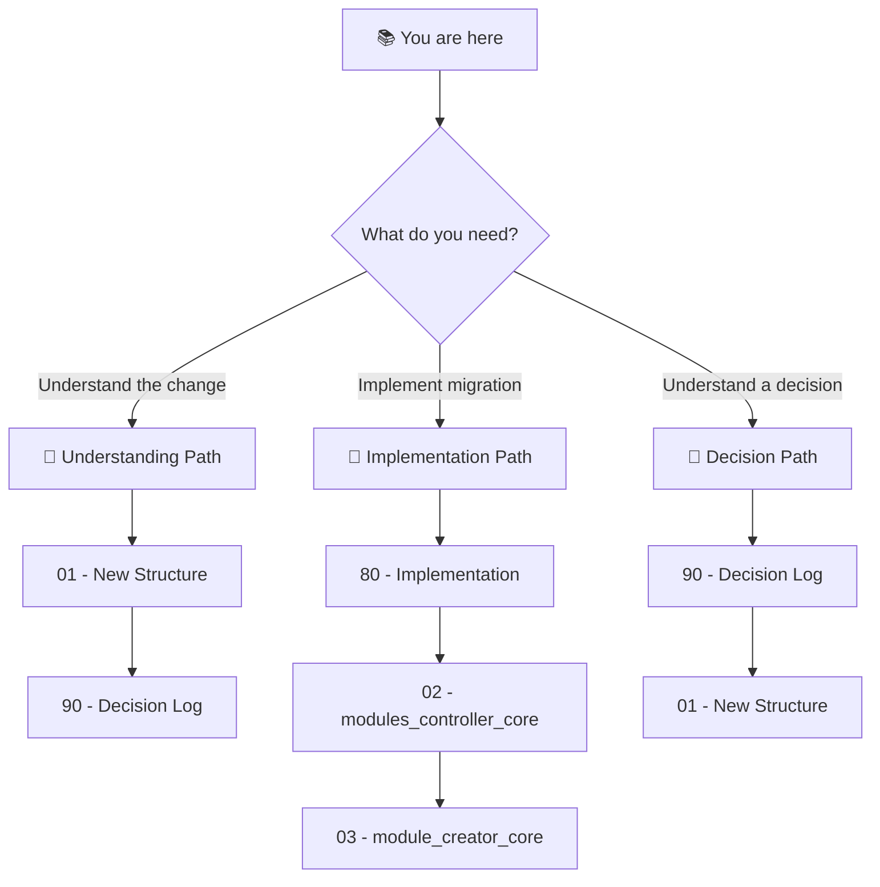

# 🎯 Folder Structure Revamp: Project Blueprint

> *Simplifying the ADHD Framework's module organization by replacing 6 legacy folders with a unified, layer-based `modules/` structure.*

**Document Type:** Technical Design Document / Migration Blueprint  
**Version:** 1.0  
**Created:** 2026-02-04  
**Status:** 📐 Planning

---

## 📊 Progress Overview

| Phase | Status | Notes |
|-------|--------|-------|
| P0: modules_controller_core | ⏳ [TODO] | Foundation — all others depend on this |
| P1: module_creator_core | ⏳ [TODO] | Update wizard and templates |
| P2: project_creator_core | ⏳ [TODO] | Update new project scaffolding |
| P3: adhd_mcp + CLI | ⏳ [TODO] | Update MCP tools and CLI |
| P4: Instruction Files | ⏳ [TODO] | Update 14 instruction files |
| P5: Migrate Existing Modules | ⏳ [TODO] | Physical file moves + git |

### Status Legend

| Icon | Meaning |
|------|---------|
| ⏳ | TODO |
| 🔄 | WIP |
| ✅ | DONE |
| 🚫 | CUT |

---

## 📐 Planning Standards

This blueprint follows **HyperDream phasing rules**:

| Principle | Meaning |
|-----------|---------|
| **Walking Skeleton First** | P0 proves discovery logic works with new paths |
| **Difficulty Honesty** | Each item labeled `[KNOWN]`, `[EXPERIMENTAL]`, or `[RESEARCH]` |
| **Research ≠ Foundation** | `[RESEARCH]` items never in Phase 0 |
| **Incremental Value** | Each phase delivers usable functionality |

---

## 📑 Document Index

| # | Document | Required | Purpose (When to Read) |
|---|----------|----------|------------------------|
| 00 | [Index](./00_index.md) | ✓ | **Navigation hub** — Start here |
| 01 | [Feature: New Structure](./01_feature_new_structure.md) | ✓ | **The target** — What we're building |
| 02 | [Migration: modules_controller_core](./02_migration_modules_controller.md) | ✓ | **P0** — Critical path, do first |
| 03 | [Migration: module_creator_core](./03_migration_module_creator.md) | ✓ | **P1** — Wizard + templates |
| 04 | [Migration: project_creator_core](./04_migration_project_creator.md) | ✓ | **P2** — New project scaffolding |
| 05 | [Migration: adhd_mcp + CLI](./05_migration_adhd_mcp_cli.md) | ✓ | **P3** — MCP tools and CLI |
| 06 | [Migration: Instructions](./06_migration_instructions.md) | ✓ | **P4** — Instruction file updates |
| 07 | [Migration: Existing Modules](./07_migration_existing_modules.md) | ✓ | **P5** — Physical file moves |
| 80 | [Implementation](./80_implementation.md) | ✓ | **Task tracking** — Start/track work |
| 90 | [Decision Log](./90_decision_log.md) | ✓ | **Rationale** — Why we chose this |

---

## 💭 Vision Statement

> *"We're replacing the cognitive overhead of 6 legacy folders (`cores/`, `managers/`, `plugins/`, `utils/`, `mcps/`, `project/`) with a single unified `modules/` structure where layer (dependency order) determines placement, not subjective 'type' debates."*

> **Key Insight**: The ADHD Framework is a "factory" for generating projects—it will never "ship" as a product itself. In this repo, **all modules are foundation** (they ARE the framework) or **dev** (testing tools). The **runtime layer is empty** here and only populated in generated projects where users add their app-specific logic.

---

## 🧭 How to Navigate This Blueprint

### Reading Order Decision Tree



### Document Purpose Quick Reference

| Doc | When to Read | One-Line Purpose |
|-----|--------------|------------------|
| **00 - Index** | First visit, lost | Navigation hub, project overview |
| **01 - New Structure** | Understanding the target | What the new `modules/` looks like |
| **02-07 - Migrations** | Implementing specific phase | Technical details for each core |
| **80 - Implementation** | Starting work, tracking progress | Phased tasks, verification steps |
| **90 - Decision Log** | Understanding "why" | Rationale for all locked decisions |

---

## [Custom] 📜 Key Decisions Summary

All decisions are **LOCKED** and documented in [90_decision_log.md](./90_decision_log.md).

| Decision | Choice | Rationale |
|----------|--------|-----------|
| Remove `type` entirely | ✅ Yes | Subjective debates → objective layer |
| Symmetric layer folders | ✅ Option C | Scalability for 30+ modules |
| `[tool.adhd].layer` required | ✅ Yes | External module portability |
| `[tool.adhd].mcp = true` flag | ✅ Yes | Clear MCP identification |
| Backward compatibility | ❌ None | Internal tooling, not public API |

---

## [Custom] ⚠️ Migration Order (Critical)

```
┌─────────────────────────────────────────────────────────────────┐
│  modules_controller_core  ──►  module_creator_core              │
│          │                            │                         │
│          ▼                            ▼                         │
│  adhd_mcp + CLI  ◄───────  project_creator_core                 │
│          │                                                      │
│          ▼                                                      │
│  Instruction Files  ──►  Physical Migration                     │
└─────────────────────────────────────────────────────────────────┘

⚠️  modules_controller_core MUST be done first!
    All other cores import from it for module discovery.
```

---

## [Custom] 📊 Estimated Impact

| Component | Lines Changed | Files Modified |
|-----------|---------------|----------------|
| modules_controller_core | ~455 | 4-5 |
| module_creator_core | ~150 | 3-4 |
| project_creator_core | ~76 | 2-3 |
| adhd_mcp + CLI | ~100 | 4 |
| Instruction files | N/A | 14 |
| **Total** | ~780 lines | ~28 files |

---

**← Back to:** [day_dream/](../)
