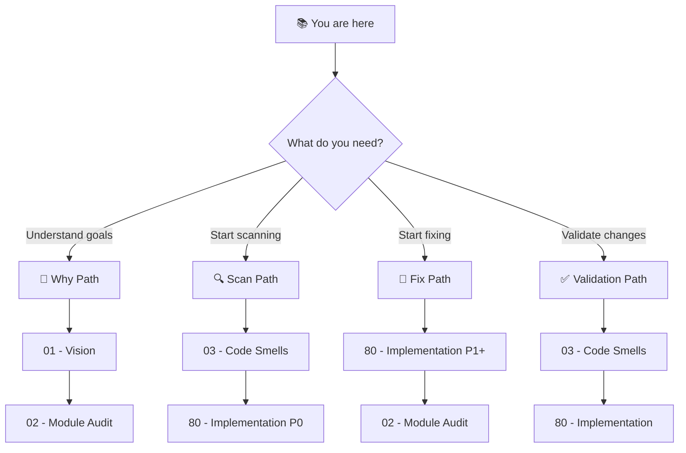

# 🎯 Code Quality Audit & Fix: Project Blueprint

> *"The Folder Structure Revamp is done. Now it's time to make the code as clean as the structure."*

**Document Type:** Technical Audit Blueprint  
**Version:** 1.0  
**Created:** 2026-02-05  
**Status:** 📐 Planning

---

## 📊 Progress Overview

| Phase | Status | Notes |
|-------|--------|-------|
| P0: Discovery | ⏳ [TODO] | Catalog all code smells |
| P1: Foundation Cleanup | ⏳ [TODO] | Fix foundation modules |
| P2: Dev Module Cleanup | ⏳ [TODO] | Fix adhd_mcp |
| P3: Cross-Module Polish | ⏳ [TODO] | Dedupe, consolidate |

### Status Legend

| Icon | Meaning |
|------|---------|
| ⏳ | TODO |
| 🔄 | WIP |
| ✅ | DONE |
| 🚧 | BLOCKED:reason |
| 🚫 | CUT |

---

## 📐 Planning Standards

This audit follows **HyperDream phasing rules**:

| Principle | Meaning |
|-----------|---------|
| **Discovery First** | Phase 0 inventories problems before fixing anything |
| **Module-by-Module** | Each agent handles 3-4 modules max (context window) |
| **Validation Loop** | Every fix verified by HyperSan before proceeding |
| **No Architecture Changes** | Fix code quality within existing structure |

---

## 📑 Document Index

| # | Document | Required | Purpose (When to Read) |
|---|----------|----------|------------------------|
| 00 | [Index](./00_index.md) | ✓ | **Navigation hub** — Start here |
| 01 | [Vision & Scope](./01_vision.md) | ✓ | **What and Why** — Understand the audit goals |
| 02 | [Module Audit](./02_module_audit.md) | ✓ | **Module Inventory** — What each module does |
| 03 | [Code Smells](./03_code_smells.md) | ✓ | **Detection Targets** — What we're hunting |
| 80 | [Implementation](./80_implementation.md) | ✓ | **Task Tracking** — Multi-agent workflow |

---

## 💭 Vision Statement

> *"Clean code is not about perfection—it's about reducing the cognitive load for the next developer (or agent) who touches it. This audit systematically identifies and fixes technical debt accumulated during rapid development, leaving the codebase more maintainable without changing what it does."*

---

## 🧭 How to Navigate This Blueprint

### Reading Order Decision Tree

---

## 🎯 Scope Boundaries

### ✅ In Scope

| Category | Examples |
|----------|----------|
| **Path Hacks** | `.parent.parent.parent`, hardcoded paths |
| **Code Duplication** | Copy-paste logic across modules |
| **Dead Code** | Unused imports, functions, classes |
| **Long Files/Functions** | >600 lines files, >50 lines functions |
| **Magic Values** | Hardcoded strings/numbers without constants |
| **sys.path Hacks** | Runtime import path manipulation |

### ❌ Out of Scope

| Category | Why Excluded |
|----------|--------------|
| **Architecture Changes** | P0-P5 Folder Structure Revamp handled this |
| **Module Boundary Changes** | Already defined in v3 structure |
| **Feature Changes** | This is cleanup, not enhancement |
| **New Functionality** | Audit only, no new features |

---

## 📈 Quick Stats

**Discovered during context gathering:**

| Metric | Count | Notes |
|--------|-------|-------|
| Foundation Modules | 15 | See [02_module_audit.md](./02_module_audit.md) |
| Dev Modules | 1 | adhd_mcp |
| Runtime Modules | 0 | Empty (as designed) |
| Files >400 LOC | 6 | config_keys.py (1011!), adhd_controller.py (745) |
| Path Hack Instances | 1 | project_creator.py L32 |
| sys.path Hacks | 4 | All in `.agent_plan/red_team/` (test files) |
