# 80 - Implementation Plan

> Part of [Code Quality Audit Blueprint](./00_index.md)

<!-- 
⚠️  CODE EXAMPLES & FOLDER STRUCTURES WARNING ⚠️
════════════════════════════════════════════════════════════════════════════════
Examples in this document are ILLUSTRATIVE, not PRESCRIPTIVE.

The implementation agent (HyperArch) will determine actual file locations,
command syntax, and implementation details based on current codebase state.
════════════════════════════════════════════════════════════════════════════════
-->

---

## 📊 Status Legend

| Icon | Status | Meaning |
|------|--------|---------|
| ⏳ | `[TODO]` | Not started |
| 🔄 | `[WIP]` | In progress |
| ✅ | `[DONE]` | Complete |
| 🚧 | `[BLOCKED:reason]` | Stuck (kebab-case reason) |
| 🚫 | `[CUT]` | Removed from scope |

---

## 🤖 Multi-Agent Workflow

### Agent Roles

| Agent | Role | Responsibility |
|-------|------|----------------|
| **HyperIQGuard** | Code Smell Detective | Scans modules, catalogs issues, prioritizes |
| **HyperArch** | Implementation Lead | Executes fixes, refactors code |
| **HyperSan** | Validation Guard | Verifies each change, runs tests |
| **HyperOrch** | Orchestrator | Tracks progress, routes work, resolves blocks |

### Workflow Loop

```mermaid
flowchart LR
    subgraph "Per-Module Cycle"
        IQ[🔍 IQGuard: Scan] --> ARCH[🔧 Arch: Fix]
        ARCH --> SAN[✅ San: Validate]
        SAN --> NEXT{Next Module?}
        NEXT -->|Yes| IQ
        NEXT -->|No| DONE[📦 Phase Complete]
    end
    
    SAN -->|Fail| ARCH
```



### Context Window Management

Each agent handles **3-4 modules max** per session to stay within context limits:

| Batch | Modules | Assigned To |
|-------|---------|-------------|
| Batch A | logger_util, exceptions_core, yaml_reading_core | HyperArch-A |
| Batch B | config_manager, temp_files_manager, workspace_core | HyperArch-B |
| Batch C | modules_controller_core, instruction_core, cli_manager | HyperArch-C |
| Batch D | project_creator_core, module_creator_core, creator_common_core | HyperArch-D |
| Batch E | github_api_core, questionary_core, uv_migrator_core | HyperArch-E |
| Batch F | adhd_mcp (all files) | HyperArch-F |

---

## 🦴 Phase 0: Discovery (Read-Only)

**Goal:** *"Catalog all code smells without making any changes"*

**Duration:** 1-2 days  
**Mode:** READ-ONLY — No edits

### Exit Gate

- [x] All 16 modules scanned
- [x] Smell inventory complete for each module
- [x] Priority ranking established
- [x] P1 task list finalized

### Tasks

| Status | Task | Agent | Module(s) | Difficulty |
|--------|------|-------|-----------|------------|
| ✅ | Run automated detection (ruff, grep) | HyperIQGuard | All | `[KNOWN]` |
| ✅ | Manual review: file lengths | HyperIQGuard | All | `[KNOWN]` |
| ✅ | Manual review: function lengths | HyperIQGuard | All | `[KNOWN]` |
| ✅ | Manual review: god classes | HyperIQGuard | modules_controller, config_manager, project_creator | `[KNOWN]` |
| ✅ | Catalog path hacks | HyperIQGuard | All | `[KNOWN]` |
| ✅ | Catalog sys.path usage | HyperIQGuard | All | `[KNOWN]` |
| ✅ | Prioritize findings | HyperOrch | - | `[KNOWN]` |

### Detection Commands

```bash
# Run from framework root

# 1. Ruff check (comprehensive)
ruff check modules/ --output-format=json > .temp_agent_work/ruff_report.json

# 2. File lengths
find modules/ -name "*.py" -exec wc -l {} \; | sort -rn > .temp_agent_work/file_lengths.txt

# 3. Path hacks
grep -rn "\.parent\.parent" modules/ > .temp_agent_work/path_hacks.txt

# 4. sys.path manipulation
grep -rn "sys\.path\.\(insert\|append\)" modules/ > .temp_agent_work/syspath_hacks.txt

# 5. Magic URLs
grep -rn "https://" modules/ --include="*.py" > .temp_agent_work/magic_urls.txt

# 6. TODO/FIXME
grep -rn "TODO\|FIXME\|HACK" modules/ > .temp_agent_work/todos.txt
```

### Deliverables

Create inventory files in `.temp_agent_work/audit/`:

```
.temp_agent_work/audit/
├── module_inventories/
│   ├── logger_util.md
│   ├── exceptions_core.md
│   ├── ... (one per module)
│   └── adhd_mcp.md
├── priority_matrix.md
└── p1_task_list.md
```

### Verification (Manual)

| What to Try | Expected Result |
|-------------|-----------------|
| `cat .temp_agent_work/audit/priority_matrix.md` | Shows ranked list of issues |
| Count inventory files | 16 files in module_inventories/ |
| Review p1_task_list.md | Clear, actionable tasks |

### P0 Completion Checklist

- [x] All 16 modules have inventory files
- [x] Priority matrix created
- [x] P1 task list ready for execution
- [x] No code changes made (read-only phase)

**Results:** Cataloged 2 critical, 6 high, 8 medium issues. See `.temp_agent_work/audit/p0_discovery_results.md`.

---

## 🏗️ Phase 1: Foundation Cleanup

**Goal:** *"Fix all high-severity issues in foundation modules"*

**Duration:** 3-5 days

### Exit Gate

- [x] Zero path hacks in foundation modules
- [x] Zero sys.path manipulation in production code
- [x] All files under 600 LOC (or documented exception)
- [x] HyperSan validation passes

### Sub-Phases

#### P1.1: Critical Path Hacks 🔴

| Status | Task | Agent | Module | Difficulty |
|--------|------|-------|--------|------------|
| ✅ | Add `get_framework_root()` to workspace_core | HyperArch | workspace_core | `[KNOWN]` |
| ✅ | Fix FRAMEWORK_ROOT in project_creator.py | HyperArch | project_creator_core | `[KNOWN]` |
| ✅ | Scan and fix any other path hacks | HyperArch | All foundation | `[KNOWN]` |
| ✅ | Validate imports work | HyperSan | All foundation | `[KNOWN]` |

**Fix Applied:** `project_creator.py` PATH_HACK replaced with `_get_framework_file()` helper.

**Fix Pattern:**

```python
# workspace_core/workspace_builder.py (or new file)

def get_framework_root() -> Path:
    """Get the ADHD Framework root directory.
    
    Works from any module location within the framework.
    Returns the directory containing init.yaml.
    """
    current = Path(__file__).resolve()
    
    # Walk up until we find init.yaml (framework marker)
    for parent in [current] + list(current.parents):
        if (parent / "init.yaml").exists():
            return parent
    
    raise ADHDError("Could not locate ADHD Framework root (no init.yaml found)")
```

#### P1.2: Long File Splits 🟠

| Status | Task | Agent | Module | Difficulty |
|--------|------|-------|--------|------------|
| ✅ | Document config_keys.py as auto-generated exception | HyperDream | config_manager | `[KNOWN]` |
| ✅ | Review modules_controller.py (465 LOC) | HyperIQGuard | modules_controller_core | `[KNOWN]` |
| ✅ | Extract filterable logic if needed | HyperArch | modules_controller_core | `[EXPERIMENTAL]` |
| ✅ | Review github_api/api.py (453 LOC) | HyperIQGuard | github_api_core | `[KNOWN]` |

**Note**: config_keys.py (1011 LOC) is **ACCEPTABLE** — auto-generated file, doesn't add cognitive complexity.

**Fixes Applied:**
- `adhd_controller.py` (745 lines) → Split into 3 files (max 451 lines)
- `helpers.py` → Extracted 7 helper functions, no function >50 lines
- `modules_controller.py` → Extracted 6 helper methods, longest function 32 lines
- `instruction_controller.py` → Extracted 4 helpers + deduplicated glob pattern

#### P1.3: Dead Code Removal 🟡

| Status | Task | Agent | Module | Difficulty |
|--------|------|-------|--------|------------|
| ✅ | Fix all F401 (unused imports) from ruff | HyperArch | All foundation | `[KNOWN]` |
| ✅ | Fix all F841 (unused variables) from ruff | HyperArch | All foundation | `[KNOWN]` |
| ✅ | Review and remove commented-out code | HyperArch | All foundation | `[KNOWN]` |

### Verification (Manual)

| What to Try | Expected Result |
|-------------|-----------------|
| `grep -rn "\.parent\.parent" modules/foundation/` | No results |
| `ruff check modules/foundation/` | Clean or only style warnings |
| `python -c "from project_creator_core import ProjectCreator"` | Imports successfully |

### P1 Completion Checklist

- [x] All path hacks eliminated from foundation
- [x] workspace_core has `get_framework_root()` utility
- [x] config_keys.py documented as auto-generated
- [x] Ruff check passes (no F-series errors)
- [x] All changes validated by HyperSan

---

## 📡 Phase 2: Medium Priority Cleanup

**Goal:** *"Fix medium-priority issues across all modules"*

**Duration:** 1-2 days

### Exit Gate

- [x] Magic constants extracted
- [x] Stale docstrings updated
- [x] Helper functions consolidated
- [x] HyperSan validation passes

### Tasks

| Status | Task | Agent | File | Difficulty |
|--------|------|-------|------|------------|
| ✅ | Add `DEFAULT_LOG_DIR` constant | HyperArch | logger_util/logger.py | `[KNOWN]` |
| ✅ | Update stale docstrings | HyperArch | uv_migrator_core/migrator.py | `[KNOWN]` |
| ✅ | Add `_build_short_names` helper | HyperArch | config_manager/config_template.py | `[KNOWN]` |
| ✅ | Validate all changes | HyperSan | All | `[KNOWN]` |

### Verification (Manual)

| What to Try | Expected Result |
|-------------|-----------------|
| `grep -rn "DEFAULT_LOG_DIR" modules/` | Shows constant definition |
| `ruff check modules/` | Clean output |
| Import affected modules | No errors |

### P2 Completion Checklist

- [x] Magic constants extracted to named variables
- [x] Stale docstrings updated to match current behavior
- [x] Long helper functions split into smaller units
- [x] HyperSan validation complete

---

## 🌟 Phase 3: Module Consolidation

**Goal:** *"Eliminate thin wrappers and consolidate related modules"*

**Duration:** 1-2 days

### Exit Gate

- [x] Thin wrapper modules consolidated or removed
- [x] Module count reduced (16 → 14)
- [x] All TODO/FIXME items resolved or tracked
- [x] Final ruff check clean

### Tasks

| Status | Task | Agent | Scope | Difficulty |
|--------|------|-------|-------|------------|
| ✅ | **CONSOLIDATE**: Merge `questionary_core` into `creator_common_core` | HyperArch | creator_common_core | `[KNOWN]` |
| ✅ | **REMOVE**: Delete `yaml_reading_core`, inline in `project_creator_core` | HyperArch | yaml_reading_core → project_creator_core/yaml_utils.py | `[KNOWN]` |
| ✅ | **KEEP**: `temp_files_manager` (user decision: reusability value) | HyperOrch | temp_files_manager | `[KNOWN]` |
| ✅ | Final ruff + manual scan | HyperIQGuard | All | `[KNOWN]` |
| ✅ | Document remaining debt with `# DEBT:` | HyperArch | All | `[KNOWN]` |

### Thin Wrapper Decision Matrix

| Module | Value Added | Decision |
|--------|-------------|----------|
| questionary_core | Unified styling | ✅ **MERGE** into `creator_common_core`, then delete |
| yaml_reading_core | Error handling | ✅ **REMOVE** — inline `yaml.safe_load()` in `project_creator_core` |
| temp_files_manager | Lifecycle mgmt | ✅ **KEEP** — Reusability value for external projects |

### Verification (Manual)

| What to Try | Expected Result |
|-------------|-----------------|
| `ruff check modules/` | Clean output |
| `grep -rn "# DEBT:" modules/` | Shows documented debt only |
| Run full test suite | All tests pass |

### P3 Completion Checklist

- [x] No undocumented technical debt
- [x] Ruff check clean
- [x] Test suite passes
- [x] All thin wrappers justified or consolidated

**Results:**
- `questionary_core` → Merged into `creator_common_core`, module deleted
- `yaml_reading_core` → Inlined into `project_creator_core/yaml_utils.py`, module deleted
- `temp_files_manager` → KEPT (user decision: valuable for external projects)
- **Module count: 16 → 14**

---

## 📋 Agent Handoff Protocol

### IQGuard → Arch Handoff

IQGuard provides:
```markdown
## Module: {name}

**Issues Found**:
1. [🔴 Critical] {description} @ {file}:{line}
2. [🟠 High] {description} @ {file}:{line}

**Recommended Fixes**:
1. {action for issue 1}
2. {action for issue 2}

**Test Coverage Note**: {what tests exist, what to verify}
```

### Arch → San Handoff

Arch provides:
```markdown
## Changes Made

**Module**: {name}
**Commit**: {hash or "not committed"}

**Files Modified**:
- {file1}: {change description}
- {file2}: {change description}

**Verification Steps**:
1. `{command}` → expected: {result}
2. `{command}` → expected: {result}

**Potential Side Effects**: {list or "none"}
```

### San → Orch Report

San provides:
```markdown
## Validation Report

**Module**: {name}
**Status**: ✅ PASS | ❌ FAIL

**Checks Performed**:
- [✅/❌] Imports work
- [✅/❌] Tests pass
- [✅/❌] No new ruff errors
- [✅/❌] Manual verification steps pass

**Issues Found**: {list or "none"}
**Recommendation**: [Proceed | Fix Required]
```

---

## ⚠️ Error Recovery

### If Validation Fails

1. San reports failure to Orch
2. Orch routes back to Arch with specific failure
3. Arch fixes and resubmits
4. Max 2 retry cycles before escalation

### If Module Has Circular Dependency

1. Document in inventory
2. Defer to P3 (cross-module phase)
3. May require architecture review (out of scope for this audit)

---

## 📝 Progress Tracking

### Phase 0 Progress ✅

| Date | Modules Scanned | Issues Found | Notes |
|------|-----------------|--------------|-------|
| 2026-02-05 | 16/16 | 2 critical, 6 high, 8 medium | Complete |

### Phase 1 Progress ✅

| Date | Task | Status | Notes |
|------|------|--------|-------|
| 2026-02-05 | P1A Critical: PATH_HACK fix | ✅ DONE | `_get_framework_file()` helper |
| 2026-02-05 | P1A Critical: adhd_controller.py split | ✅ DONE | 745 → 451 lines (3 files) |
| 2026-02-05 | P1B High: helpers.py | ✅ DONE | 7 helpers extracted |
| 2026-02-05 | P1B High: modules_controller.py | ✅ DONE | 6 helpers, max 32 lines |
| 2026-02-05 | P1B High: instruction_controller.py | ✅ DONE | 4 helpers + dedup |

### Phase 2 Progress ✅

| Date | Task | Status | Notes |
|------|------|--------|-------|
| 2026-02-05 | logger_util constant | ✅ DONE | `DEFAULT_LOG_DIR` |
| 2026-02-05 | uv_migrator docstrings | ✅ DONE | Updated stale docs |
| 2026-02-05 | config_template helper | ✅ DONE | `_build_short_names` |

### Phase 3 Progress ✅

| Date | Task | Status | Notes |
|------|------|--------|-------|
| 2026-02-05 | questionary_core | ✅ DONE | Merged into creator_common_core |
| 2026-02-05 | yaml_reading_core | ✅ DONE | Inlined into project_creator_core |
| 2026-02-05 | temp_files_manager | ✅ KEPT | User decision: reusability value |

---

## 🎉 Audit Complete

**Completion Date:** 2026-02-05

### Results Summary

| Metric | Before | After | Change |
|--------|--------|-------|--------|
| Critical issues | 2 | 0 | ✅ -2 |
| High priority issues | 6 | 0 | ✅ -6 |
| Medium priority issues | 8 | 0 | ✅ -8 |
| Module count | 16 | 14 | ✅ -2 |
| Max file size (LOC) | 745 | 451 | ✅ -294 |

### Key Accomplishments

1. **PATH_HACK eliminated** — `project_creator.py` now uses proper framework file resolution
2. **God file split** — `adhd_controller.py` reduced from 745 to 451 lines across 3 focused files
3. **Function extraction** — 17+ helper functions extracted across modules, none >50 lines
4. **Module consolidation** — Removed 2 thin-wrapper modules (`questionary_core`, `yaml_reading_core`)
5. **Instruction sync** — `.github/instructions/` properly synced back to `instruction_core` source

---

## 📋 Phase 4: Housekeeping & Sync (Out-of-Band)

**Goal:** *"Ensure documentation and instruction sources are in sync"*

**Owner:** HyperAgentSmith (separate from main audit workflow)

### ⚠️ Known Issue: Instruction File Sync

The P4 instruction updates during the UV migration were applied directly to `.github/instructions/` files instead of through the proper channel.

**Problem:**
- Source of truth: `modules/foundation/instruction_core/data/instructions/`
- Edits were made directly to: `.github/instructions/`
- This violates the refresh mechanism workflow

### Task

| Status | Task | Agent | Notes |
|--------|------|-------|-------|
| ✅ | Sync `.github/instructions/` changes back to `instruction_core` source | HyperAgentSmith | Manual diff + merge |
| ✅ | Run `adhd refresh instructions` to validate sync | HyperAgentSmith | Should be no-op after sync |
| ✅ | Document proper instruction edit workflow | HyperAgentSmith | Update relevant .instructions.md |

**Note:** Completed earlier in the audit cycle.

### Phase 4 Progress

| Date | Task | Status | Notes |
|------|------|--------|-------|
| 2026-02-05 | Sync instructions | ✅ DONE | Synced back to instruction_core source |
