# 🎨 02_refresh_flow_diagram

> *End-to-end refresh pipeline showing dependency ordering and tiered script execution.*

**Status:** 📐 Draft  
**Last Updated:** 2026-02-06

---

## 📍 Context

**Related Feature:** [Architecture](../blueprint/02_architecture.md)  
**Requested By:** HyperDream (blueprint authoring)  
**Decision Context:** Visualizes the complete refresh pipeline from CLI invocation through dependency-sorted execution with tiered script support.

---

## 🖼️ The Artifact

```mermaid
flowchart TD
    CLI["adhd refresh [--full]"]
    
    CLI --> SYNC{"--no-sync?"}
    SYNC -->|no| UV["uv sync"]
    SYNC -->|yes| DISC
    UV --> DISC
    
    DISC["Discover all modules<br/>list_all_modules()"]
    DISC --> SORT["Sort by dependencies<br/>sort_modules_for_refresh()<br/>(pure topo sort)"]
    
    SORT --> LOOP["For each module in dependency order"]
    
    LOOP --> HAS_R{"Has refresh.py?"}
    
    HAS_R -->|yes| RUN["Run refresh.py"]
    HAS_R -->|no| NEXT["Next module"]
    
    RUN --> FULL{"--full flag?"}
    
    FULL -->|yes| HAS_RF{"Has refresh_full.py?"}
    FULL -->|no| NEXT
    
    HAS_RF -->|yes| RUN_FULL["Run refresh_full.py"]
    HAS_RF -->|no| NEXT
    
    RUN_FULL --> NEXT
    
    NEXT --> DONE["✅ Refresh complete"]
    
    style RUN fill:#4CAF50,color:#fff
    style RUN_FULL fill:#FF9800,color:#fff
    style DONE fill:#4CAF50,color:#fff
```

**Source File:** Embedded above (Mermaid)

### Annotations

| # | Element | Notes |
|---|---------|-------|
| 1 | Dependency ordering | Pure `graphlib.TopologicalSorter` on declared deps — no layer grouping |
| 2 | Standard scripts | `refresh.py` runs for every module that has one. Modules without it are silently skipped — no warning, no log. |
| 3 | Full scripts | `refresh_full.py` runs only when `--full` flag is set AND file exists |
| 4 | Per-module execution | Both scripts run per module before moving to next (not separate passes) |

---

## ⚠️ Constraints

### Must Have
- Diagram must show both `refresh.py` and `refresh_full.py` paths
- Must show the `--full` flag decision point
- Must show dependency-based ordering (not layer-based)

### Must NOT Have
- Staleness detection / `.refresh_stamp` (removed from design)
- Strategy gates (always/lazy/manual — removed)
- Layer-first grouping (replaced by pure dependency sort)
- Parallel execution paths (cut from scope)

---

## 🔗 Related Features

| Feature | Relationship | Status |
|---------|--------------|--------|
| [Architecture](../blueprint/02_architecture.md) | Primary (this asset was created for it) | ⏳ [TODO] |
| [Dependency Ordering](../blueprint/03_feature_dependency_ordering.md) | Uses (dependency sorting flow) | ⏳ [TODO] |
| [Tiered Scripts](../blueprint/04_feature_tiered_scripts.md) | Uses (tiered execution flow) | ⏳ [TODO] |
