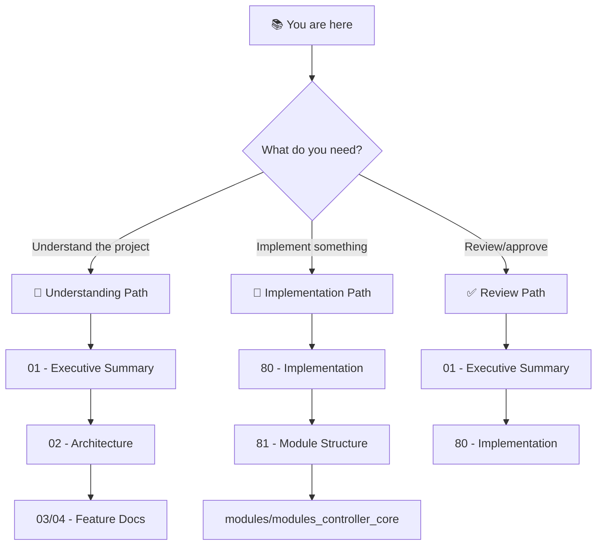

# 🎯 Layered Refresh System: Project Blueprint

> *Refresh the right modules, in the right order.*

**Document Type:** Technical Design Document / Project Blueprint  
**Version:** 2.0  
**Created:** 2026-02-06  
**Updated:** 2026-02-06  
**Status:** 📐 Planning

---

## 📊 Progress Overview

| Item | Status | Notes |
|------|--------|-------|
| Dependency-ordered refresh | ⏳ [TODO] | Pure topo sort via declared deps |
| Tiered refresh scripts | ⏳ [TODO] | `refresh.py` + `refresh_full.py` per module |
| CLI `--full` flag | ⏳ [TODO] | Trigger full-tier scripts |

### Status Legend

| Icon | Meaning |
|------|---------|
| ⏳ | TODO |
| 🔄 | WIP |
| ✅ | DONE |
| 🚫 | CUT |

---

## 📐 Planning Standards

This blueprint follows **HyperDream rules**:

| Principle | Meaning |
|-----------|---------|
| **Difficulty Honesty** | Each item labeled `[KNOWN]`, `[EXPERIMENTAL]`, or `[RESEARCH]` |
| **Research ≠ Foundation** | `[RESEARCH]` items never in implementation scope |
| **Single Phase** | One cohesive delivery, no multi-release phasing |

---

## 📑 Document Index

| # | Document | Required | Purpose (When to Read) |
|---|----------|----------|------------------------|
| 00 | [Index](./00_index.md) | ✓ | **Navigation hub** — Start here if lost |
| 01 | [Executive Summary](./01_executive_summary.md) | ✓ | **Vision & scope** — Read to understand what/why |
| 02 | [Architecture](./02_architecture.md) | ✓ | **System design** — Read to understand how pieces fit |
| 03 | [Feature: Dependency Ordering](./03_feature_dependency_ordering.md) | | **Feature detail** — Pure dependency topo sort for refresh order |
| 04 | [Feature: Tiered Scripts](./04_feature_tiered_scripts.md) | | **Feature detail** — `refresh.py` + `refresh_full.py` per module |
| 80 | [Implementation](./80_implementation.md) | ✓ | **Task tracking** — Read to start/track work |
| 81 | [Module Structure](./81_module_structure.md) | ✓ | **Code organization** — Read to find where code lives |
| 82 | [CLI Commands](./82_cli_commands.md) | | **CLI reference** — `adhd refresh` command details |
| 99 | [References](./99_references.md) | | **Links** — External docs, prior art |

### Module Specs

| Module | Purpose |
|--------|---------|
| [modules_controller_core](./modules/modules_controller_core.md) | Primary module: refresh orchestration, dependency ordering |

---

## 💭 Vision Statement

> *"The ADHD Framework's `adhd refresh` should run modules in correct dependency order, with support for light and heavy refresh tiers per module. Modules declare their dependencies — the framework figures out the rest. No manual orchestration, no surprises."*

---

## 🧭 How to Navigate This Blueprint

### Reading Order Decision Tree

---

## [Custom] 📜 Decision Log (Discussion Consensus)

| Date | Decision | Rationale | Decided By |
|------|----------|-----------|------------|
| 2026-02-06 | Pure dependency topo sort (NOT layer-first) | Dependencies are the correct and only ordering primitive. Layer alone is insufficient — modules within a layer can have required ordering. | User correction |
| 2026-02-06 | `refresh.py` is a custom script — no change detection | No generic way to detect staleness before running a custom script. mtime/hash stamping removed. | User correction |
| 2026-02-06 | Tiered scripts: `refresh.py` + `refresh_full.py` | Different refresh operations have different costs/frequencies. Naming is self-documenting and backward-compatible. | HyperDream + User |
| 2026-02-06 | Single implementation phase | Not complex enough to justify multi-release phasing. | User correction |
| 2026-02-06 | `init.yaml` deprecated; `pyproject.toml` is the source | Modernization alignment per HyperSan | HyperSan |
| 2026-02-06 | Use `graphlib.TopologicalSorter` (stdlib) | Zero dependencies, exactly what we need | HyperArch |
| 2026-02-06 | `refresh.py` and `refresh_full.py` are OPTIONAL per module | Most modules won't have refresh scripts. Missing scripts = silent skip, no warning, no log. | User correction |
| 2026-02-06 | Circular dependency check at module-add/sync time, NOT refresh time | By the time `adhd refresh` runs, the dep graph is already validated as acyclic. Cycle detection is out of scope for this blueprint. | User correction |

---

**← Back to:** [Day Dream Index](../../)
