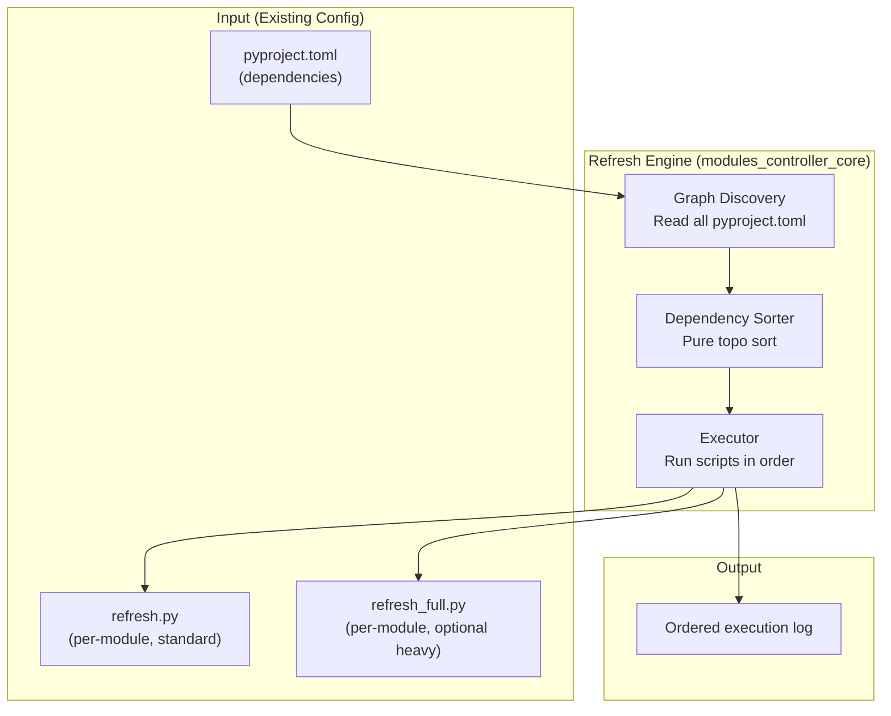
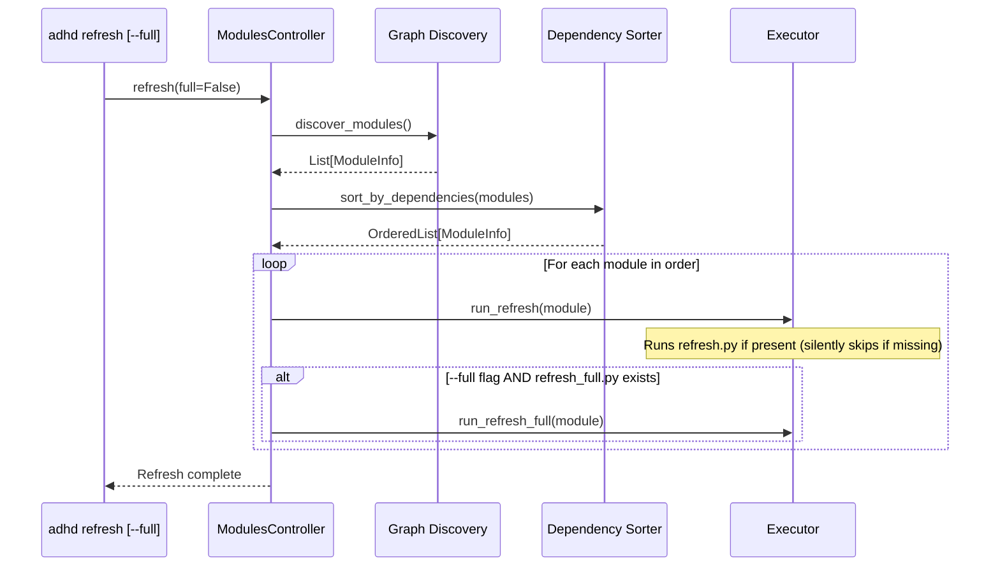

# 02 - Architecture

> Part of [Layered Refresh System Blueprint](./00_index.md)

---

## 📖 The Story

### 😤 The Pain

```
Current Reality:
┌──────────────────────────────────────────────────────────────────┐
│  adhd refresh                                                    │
│       ↓                                                          │
│  for module in discovery_order:  ←── 💥 No ordering guarantee    │
│      run refresh.py              ←── 💥 No light vs heavy split  │
└──────────────────────────────────────────────────────────────────┘
```

| Who Hurts | Pain Level | Frequency |
|-----------|------------|-----------|
| Framework Developer | 🔥🔥🔥 High | Every `adhd refresh` call |

### ✨ The Vision

```
After This Feature:
┌──────────────────────────────────────────────────────────────────┐
│  adhd refresh [--full]                                           │
│       ↓                                                          │
│  Build dependency graph from pyproject.toml                      │
│       ↓                                                          │
│  topo_sort(all_modules)                                          │
│       ↓                                                          │
│  For module in sorted_order:                                     │
│      run refresh.py                                              │
│      if --full AND refresh_full.py exists:                       │
│          run refresh_full.py                                     │
└──────────────────────────────────────────────────────────────────┘
```

### 🎯 One-Liner

> A dependency-sorted refresh pipeline with optional heavy-tier scripts per module.

---

## 🔧 The Spec

---

## 🏗️ System Overview

### High-Level Architecture



---

## 📊 Data Flow



### Stage Details

| Stage | Input | Transformation | Output | Owner |
|-------|-------|----------------|--------|-------|
| Graph Discovery | `pyproject.toml` files | Parse `dependencies` → build module graph | Module dependency graph | `modules_controller_core` |
| Dependency Sort | Module graph | `graphlib.TopologicalSorter` on all modules | Flat execution order | `modules_controller_core` |
| Execution | Ordered modules + `--full` flag | Run `refresh.py` (if present) + `refresh_full.py` (if present and `--full`) per module. Silently skip modules without scripts. | Side effects + log | `modules_controller_core` |

---

## 🧩 Logical Components

### Graph Discovery

| Attribute | Value |
|-----------|-------|
| **Purpose** | Build a module dependency graph from `pyproject.toml` metadata |
| **Boundary** | Reads config only. Does NOT execute anything or modify state. |
| **Implemented By** | `modules_controller_core/` (extends existing `ModulesController.list_all_modules()`) |
| **Depends On** | Existing `ModuleInfo`, `pyproject.toml` parsing |
| **Exposes** | `Dict[str, ModuleInfo]` with deps populated |

### Dependency Sorter

| Attribute | Value |
|-----------|-------|
| **Purpose** | Produce a flat execution order from the dependency graph using pure topological sort |
| **Boundary** | Pure function. Takes graph, returns ordered list. No side effects. |
| **Implemented By** | `modules_controller_core/` (new function/method) |
| **Depends On** | `graphlib.TopologicalSorter` (stdlib) |
| **Exposes** | `sort_modules_for_refresh(modules) -> List[ModuleInfo]` |

### Executor

| Attribute | Value |
|-----------|-------|
| **Purpose** | Run refresh scripts in the computed order, with optional heavy tier |
| **Boundary** | Orchestrates sort → run. Owns the main refresh loop. |
| **Implemented By** | `modules_controller_core/modules_controller.py` (modified `refresh()` method) |
| **Depends On** | Dependency Sorter, existing `run_module_refresh_script()` |
| **Exposes** | Enhanced `ModulesController.refresh()` |

---

## 🔑 Key Design Principles

| # | Principle | Implication |
|---|-----------|-------------|
| 1 | **Dependencies Are the Only Ordering Primitive** | Pure topo sort on declared deps. Layer grouping is emergent, not enforced. Within a single layer, modules may have required ordering based on deps. |
| 2 | **Single Source of Truth** | All ordering derived from `pyproject.toml` `[project] dependencies`. No parallel config. |
| 3 | **Stdlib Only** | `graphlib` — zero new dependencies. |
| 4 | **No Change Detection** | `refresh.py` is a custom script. It always runs. No mtime, no hashing, no stamps. |
| 5 | **Tiered by Convention** | `refresh.py` = light/always. `refresh_full.py` = heavy/on-demand. Detected by filename, no config needed. |

---

## 📁 Project Structure

```
modules/foundation/modules_controller_core/
├── modules_controller.py          (MODIFIED — ordered refresh + tiered scripts)
├── refresh_order.py               (NEW — pure dependency topo sort)
├── module_types.py                (EXISTING — LAYER_SUBFOLDERS for reference)
├── dependency_walker.py           (EXISTING — dep graph logic for reference)
└── tests/
    └── test_refresh_order.py      (NEW)
```

---

## 🔌 Integration Points

### External APIs

N/A — No external APIs. All operations are local filesystem.

### File Formats

| Format | Used For | Schema Location |
|--------|----------|-----------------|
| `pyproject.toml` | Module dependencies | Existing: `[project] dependencies = [...]` |
| `refresh.py` | Standard refresh script (per module) | Existing convention |
| `refresh_full.py` | Heavy refresh script (per module, optional) | New convention |

---

## ✅ Architecture Validation Checklist

### Narrative
- [x] The Story section clearly states the architectural problem
- [x] One-Liner captures the system in one sentence

### Technical
- [x] High-level architecture diagram present and fits one screen
- [x] Data flow diagram present
- [x] All logical components documented with boundaries
- [x] Key Design Principles listed (3-5)

### Linkage
- [x] Document linked from 00_index.md

---

**← Back to:** [Index](./00_index.md)
