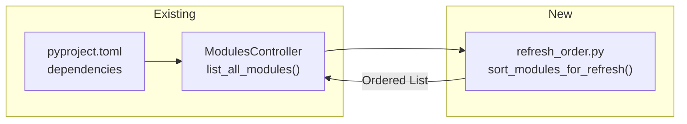
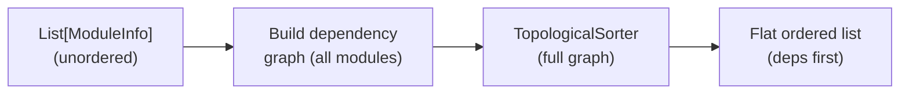

# 03 - Feature: Dependency Ordering

> Part of [Layered Refresh System Blueprint](./00_index.md)

---

## 📖 The Story

### 😤 The Pain

```
Current Reality:
┌──────────────────────────────────────────────────────────────────┐
│  adhd refresh                                                    │
│       ↓                                                          │
│  Modules discovered in filesystem order:                         │
│    cli_manager → config_manager → adhd_mcp → logger_util → ...   │
│                                                                  │
│  💥 cli_manager refreshes BEFORE config_manager (its dependency!)│
│  💥 dev modules run before foundation modules finish             │
│  💥 Even within foundation, config_manager runs before           │
│     cli_manager which it depends on                              │
└──────────────────────────────────────────────────────────────────┘
```

| Who Hurts | Pain Level | Frequency |
|-----------|------------|-----------|
| Framework Developer | 🔥🔥🔥 High | Every refresh |
| Module Author | 🔥🔥 Medium | When adding modules with deps |

### ✨ The Vision

```
After This Feature:
┌──────────────────────────────────────────────────────────────────┐
│  adhd refresh                                                    │
│       ↓                                                          │
│  Pure topological sort by declared dependencies:                 │
│    exceptions_core → logger_util → config_manager →              │
│    workspace_core → modules_controller_core → cli_manager →      │
│    creator_common_core → module_creator_core →                   │
│    instruction_core → adhd_mcp → ...                             │
│                                                                  │
│  ✅ Dependencies ALWAYS refresh before dependents                │
│  ✅ Layer ordering emerges naturally from dep graph              │
└──────────────────────────────────────────────────────────────────┘
```

### 🎯 One-Liner

> Refresh modules in pure dependency order using `graphlib.TopologicalSorter` on declared `pyproject.toml` dependencies — no layer grouping, just the dependency graph.

### 📊 Impact

| Metric | Before | After |
|--------|--------|-------|
| Execution order correctness | ❌ Filesystem order (accidental) | ✅ Guaranteed correct (dependency topo sort) |
| New module onboarding | ❌ Hope discovery order works | ✅ Declare deps in pyproject.toml, done |
| Ordering config needed | ❌ None (no guarantees) | ✅ None (auto-discovered from existing deps) |
| Within-layer ordering | ❌ Not handled | ✅ Deps between same-layer modules respected |

---

## 🔧 The Spec

---

## 🎯 Overview

This feature introduces deterministic, dependency-aware ordering for `adhd refresh`. It uses **one** existing piece of metadata:

- **`dependencies`** in `pyproject.toml` `[project]` — declares explicit module dependencies.

The algorithm is: build a dependency graph of all ADHD modules, then run `graphlib.TopologicalSorter.static_order()` to produce a flat execution list. This guarantees every dependency refreshes before its dependents.

**Why NOT layer-first, then topo-sort within layers?** Because layer alone is an insufficient ordering primitive. Modules within a single layer can (and do) depend on each other with required ordering. For example, within `foundation/`: `cli_manager` depends on `config_manager` depends on `logger_util` depends on `exceptions_core`. A pure dependency sort naturally produces the correct cross-layer AND intra-layer ordering without needing a two-pass approach.

**Difficulty:** `[KNOWN]`

---

## 📚 Prior Art

### Existing Solutions

| Solution | Type | Relevance | Status |
|----------|------|-----------|--------|
| `graphlib.TopologicalSorter` (Python 3.9+ stdlib) | Library | High | ✅ Adopt |
| `dependency_walker.py` | Internal Pattern | Medium | 🔧 Reference (existing dep graph logic) |

### Usage Decision

**Using:** `graphlib.TopologicalSorter` (stdlib)  
**How:** Build a graph of ADHD module deps (all modules, not grouped by layer), call `static_order()` for execution sequence.  
**Why this over alternatives:** Stdlib, zero-dependency, well-tested. (Note: `graphlib` also provides `CycleError` for cycle detection, but that validation happens at module-add/sync time, not at refresh time.)

---

## 🗺️ System Context



---

## 📊 Data Flow



| Stage | Format | Example |
|-------|--------|---------|
| Input | `List[ModuleInfo]` (from `list_all_modules()`) | `[cli_manager, adhd_mcp, logger_util, ...]` |
| Graph | `Dict[str, Set[str]]` adjacency | `{"cli_manager": {"config_manager", "logger_util"}, ...}` |
| Output | `List[ModuleInfo]` (dependency-ordered) | `[exceptions_core, logger_util, config_manager, ..., adhd_mcp]` |

---

## 👥 User Stories

| As a... | I want... | So that... |
|---------|-----------|------------|
| Framework developer | `adhd refresh` to run modules in dependency order | I don't get stale state from out-of-order execution |
| Module author | My new module to sort correctly by declaring deps | I don't need to understand or configure any ordering system |

---

## ✅ Acceptance Criteria

- [ ] `adhd refresh` runs all modules in topological dependency order — every module's dependencies refresh before it does
- [ ] Within a single layer (e.g., all foundation modules), dependency ordering is respected (not just alphabetical or discovery order)
- [ ] Modules without `refresh.py` are still sorted (for ordering purposes) but silently skipped during execution — no warning, no log
- [ ] The ordered list is logged at DEBUG level so developers can inspect the computed order
- [ ] Modules with no dependencies on each other can appear in any order relative to each other

---

## ⚠️ Edge Cases

| Edge Case | Handling |
|-----------|----------|
| Module with no dependencies | Appears early in order (leaf node) |
| Module depending on a module in a different layer | Handled naturally by topo sort — dep runs first regardless of layer |
| Cyclic dependency | **Out of scope for refresh.** Cycles are validated and rejected at module-add/sync time (`adhd s` / `uv sync`). The refresh system assumes an acyclic graph. |
| Module with unknown/missing layer | Still sorted by deps — layer is not used for ordering |
| External (non-ADHD) dependencies in `pyproject.toml` | Ignored — only ADHD module names are graph nodes |
| Module not found in graph (e.g., optional dep) | Log warning, skip the edge, continue sorting |

---

## ❌ Out of Scope

| Excluded | Rationale |
|----------|-----------|
| Parallel execution within independent branches | No proven need. Sequential is simple and fast enough. |
| Layer-first grouping before topo sort | Explicitly rejected. Dependencies are the only ordering primitive. |
| Re-sorting mid-execution if a refresh changes deps | Deps don't change at runtime. Sort once, execute once. |

---

## 🔗 Dependencies

| Dependency | Type | Status | Notes |
|------------|------|--------|-------|
| `graphlib.TopologicalSorter` | stdlib (Python 3.9+) | Done | Already available in framework Python version |
| `ModulesController.list_all_modules()` | internal | Done | Provides `List[ModuleInfo]` with deps |

---

## 🖼️ Related Assets

- [Refresh Flow Diagram](../assets/02_refresh_flow_diagram.asset.md)

---

## ✅ Feature Validation Checklist

### Narrative Completeness
- [x] The Story section clearly states user problem and value
- [x] Intent is unambiguous to a non-technical reader
- [x] Scope is explicitly bounded

### Technical Completeness
- [x] Prior Art section documents existing solutions
- [x] Edge Cases cover failure scenarios
- [x] Acceptance Criteria are testable

### Linkage
- [x] Feature linked from `01_executive_summary.md`
- [x] Module spec backlink exists in `modules/modules_controller_core.md`

---

**← Back to:** [Index](./00_index.md)
