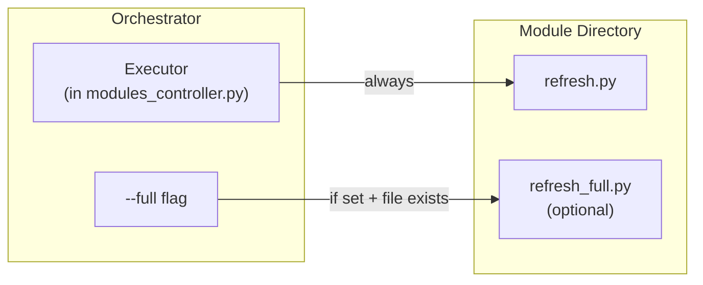

# 04 - Feature: Tiered Refresh Scripts

> Part of [Layered Refresh System Blueprint](./00_index.md)

---

## 📖 The Story

### 😤 The Pain

```
Current Reality:
┌──────────────────────────────────────────────────────────────────┐
│  Module: cli_manager                                             │
│  refresh.py does EVERYTHING:                                     │
│    - Quick: sync CLI command groups (~1s)                        │
│    - Heavy: regenerate all template files (~15s)                 │
│    - Heavy: rebuild help text index (~10s)                       │
│                                                                  │
│  💥 Every `adhd refresh` pays the full 26s cost                  │
│  💥 No way to say "just do the quick stuff"                      │
│  💥 No way to say "do the heavy stuff too" on demand             │
└──────────────────────────────────────────────────────────────────┘
```

| Who Hurts | Pain Level | Frequency |
|-----------|------------|-----------|
| Framework Developer | 🔥🔥 Medium | Daily — heavy ops slow down iteration |
| Module Author | 🔥 Low | When designing what goes in refresh.py |

### ✨ The Vision

```
After This Feature:
┌──────────────────────────────────────────────────────────────────┐
│  Module: cli_manager                                             │
│                                                                  │
│  refresh.py         ← Quick ops only (~1s)                       │
│  refresh_full.py    ← Heavy ops (~25s, runs on --full only)      │
│                                                                  │
│  adhd refresh       → runs refresh.py only       (~1s per mod)   │
│  adhd refresh --full → runs BOTH scripts         (full rebuild)  │
│                                                                  │
│  ✅ Fast iteration for common case                               │
│  ✅ Full rebuild available on demand                             │
└──────────────────────────────────────────────────────────────────┘
```

### 🎯 One-Liner

> Modules can split refresh work into `refresh.py` (light, always) and `refresh_full.py` (heavy, on-demand) — the orchestrator discovers both by filename convention.

### 📊 Impact

| Metric | Before | After |
|--------|--------|-------|
| Daily refresh speed | ❌ Pays full cost every time | ✅ Light-only by default |
| Module author control | ❌ One script, all-or-nothing | ✅ Two tiers, clear separation |
| Backward compatibility | N/A | ✅ Modules with only `refresh.py` work unchanged |

---

## 🔧 The Spec

---

## 🎯 Overview

This feature introduces a **filename-based tiered refresh convention**. No config changes needed — the orchestrator discovers scripts by name:

| Script | Runs When | Purpose |
|--------|-----------|---------|
| `refresh.py` | Every `adhd refresh` | **Standard**: Quick, essential operations. Sync commands, light codegen, config updates. Should complete in seconds. |
| `refresh_full.py` | Only on `adhd refresh --full` | **Full**: Expensive operations. Template regeneration, index rebuilding, heavy codegen. May take tens of seconds. |

When `--full` is specified, the executor runs **both** scripts per module in order: `refresh.py` first, then `refresh_full.py`. This ensures the full refresh is additive — it always includes the light operations.

**Difficulty:** `[KNOWN]`

---

## 🔬 Deep Dive

### Naming Convention Rationale

We considered several naming approaches:

| Option | Example | Pros | Cons | Decision |
|--------|---------|------|------|----------|
| **Semantic suffix** | `refresh.py` + `refresh_full.py` | Self-documenting, backward-compatible, obvious CLI mapping | Only 2 tiers (sufficient) | ✅ **Adopted** |
| Lifecycle hooks | `on_refresh.py` + `on_build.py` | Familiar to npm/Docker users | Breaks existing `refresh.py` convention, implies lifecycle events that don't exist | ❌ Rejected |
| Numeric tiers | `refresh_t1.py` + `refresh_t2.py` | Extensible to N tiers | Meaningless names — what's "tier 2"? | ❌ Rejected |
| Frequency-based | `refresh.py` + `refresh_heavy.py` | Clear weight semantics | "Heavy" is subjective | ❌ Rejected |

**Why `refresh_full.py`?**
- **Backward-compatible**: Existing `refresh.py` keeps working with zero changes.
- **Self-documenting**: "full" means "the full version of refresh" — intuitive.
- **CLI mapping**: `adhd refresh` → `refresh.py`, `adhd refresh --full` → both. Clean symmetry.
- **No config**: Presence of the file IS the configuration. No `pyproject.toml` changes needed.

### Execution Order Within a Module

For each module, when `--full` is specified:

```
1. Run refresh.py       (light ops — always first)
2. Run refresh_full.py  (heavy ops — only if file exists AND --full)
```

`refresh.py` always runs first because heavy operations may depend on the state that light operations establish (e.g., full template rebuild needs freshly synced command groups).

### Future Extensibility

If a third tier emerges (e.g., `refresh_init.py` for one-time bootstrapping), the convention extends naturally:

| Script | Trigger | Use Case |
|--------|---------|----------|
| `refresh.py` | Always | Light/essential |
| `refresh_full.py` | `--full` | Heavy/expensive |
| `refresh_init.py` | `--init` (future) | One-time bootstrap |

This is documented for awareness but explicitly **not in scope** — only `refresh.py` and `refresh_full.py` are implemented now.

---

## 🗺️ System Context



---

## 👥 User Stories

| As a... | I want... | So that... |
|---------|-----------|------------|
| Framework developer | `adhd refresh` to run fast by default | My iteration loop stays under 10 seconds |
| Framework developer | `adhd refresh --full` to do everything | I can trigger heavy rebuilds when I need them |
| Module author | To put expensive operations in `refresh_full.py` | They don't slow down every refresh |
| Module author | To not need any config changes for tiered refresh | I just create the file and it works |

---

## ✅ Acceptance Criteria

- [ ] `adhd refresh` runs only `refresh.py` for each module (same as today)
- [ ] `adhd refresh --full` runs `refresh.py` THEN `refresh_full.py` (if present) for each module
- [ ] Modules without `refresh_full.py` work identically in both modes
- [ ] `refresh_full.py` is discovered by filename convention — no config registration needed
- [ ] Execution order: `refresh.py` before `refresh_full.py` within each module
- [ ] Log output clearly shows which tier of script is running

---

## ⚠️ Edge Cases

| Edge Case | Handling |
|-----------|----------|
| Module has `refresh_full.py` but no `refresh.py` | `refresh_full.py` still runs on `--full`. No warning — both scripts are optional. Skip `refresh.py` silently. |
| `refresh_full.py` fails | Log error, continue to next module (same behavior as `refresh.py` failures) |
| `refresh_full.py` is not executable / has syntax error | Caught by subprocess, logged as error, continue |
| Module has other `refresh_*.py` files (e.g., `refresh_test.py`) | Ignored — only `refresh.py` and `refresh_full.py` are recognized |

---

## ❌ Out of Scope

| Excluded | Rationale |
|----------|-----------|
| `refresh_init.py` (bootstrap tier) | No proven need. Documented as future extension only. |
| Config-based tier registration | Filename convention is simpler and sufficient. |
| Per-tier dependency ordering (different order for full vs standard) | Same dependency order for both. Complexity not justified. |

---

## 🔗 Dependencies

| Dependency | Type | Status | Notes |
|------------|------|--------|-------|
| Dependency Ordering (Feature 03) | internal | This feature | Provides the ordered module list |
| `ModulesController.refresh()` | internal | Done | Existing method to modify |
| `--full` CLI flag | internal | New | Needs argparse addition |

---

## 🖼️ Related Assets

- [Refresh Flow Diagram](../assets/02_refresh_flow_diagram.asset.md)

---

## ✅ Feature Validation Checklist

### Narrative Completeness
- [x] The Story section clearly states user problem and value
- [x] Intent is unambiguous to a non-technical reader
- [x] Scope is explicitly bounded

### Technical Completeness
- [x] Deep Dive documents naming convention with rationale
- [x] Edge Cases cover failure scenarios
- [x] Acceptance Criteria are testable

### Linkage
- [x] Feature linked from `01_executive_summary.md`
- [x] Module spec backlink exists in `modules/modules_controller_core.md`

---

**← Back to:** [Index](./00_index.md)
