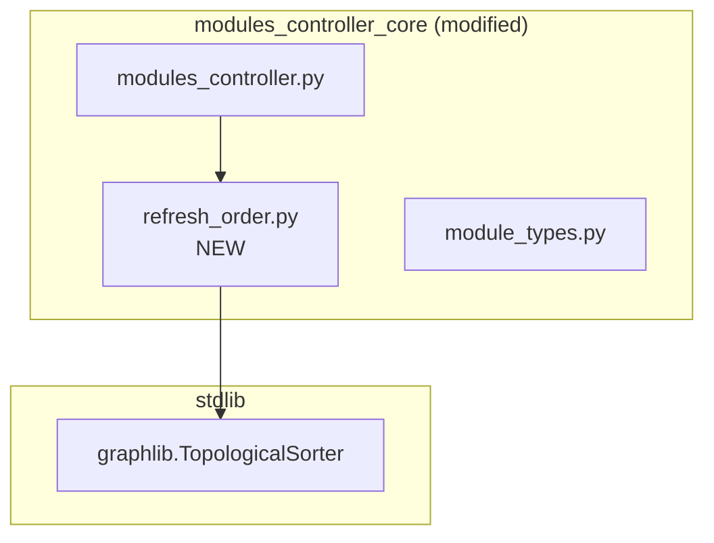
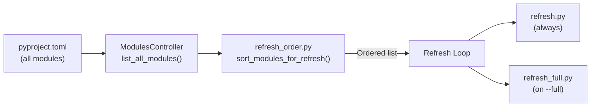

# 81 - Module Structure

> Part of [Layered Refresh System Blueprint](./00_index.md)

---

## 📖 The Story

### 😤 The Pain

```
Current Reality:
┌──────────────────────────────────────────────────────────────────┐
│  Developer asks: "Where does refresh ordering live?"             │
│       ↓                                                          │
│  💥 Scattered across modules_controller.py (600+ line file)      │
│     No clear boundary between discovery and ordering             │
└──────────────────────────────────────────────────────────────────┘
```

| Who Hurts | Pain Level | Frequency |
|-----------|------------|-----------|
| Implementation Agent | 🔥🔥 Medium | When implementing this feature |

### ✨ The Vision

```
After This Feature:
┌──────────────────────────────────────────────────────────────────┐
│  modules_controller_core/                                        │
│  ├── refresh_order.py      ← Pure dependency topo sort           │
│  └── modules_controller.py ← Orchestrates sort + tiered exec    │
│                                                                  │
│  ✅ Clear separation of concerns, new file <100 LOC              │
└──────────────────────────────────────────────────────────────────┘
```

### 🎯 One-Liner

> One new focused file in `modules_controller_core/` for dependency ordering, keeping the existing controller as the orchestrator with tiered script support.

---

## 🔧 The Spec

---

## 🏗️ ADHD Module Organization

### 📦 Reusable Modules

| Module | Path | Purpose | Reuse Potential |
|--------|------|---------|------------------|
| [modules_controller_core](./modules/modules_controller_core.md) | `modules/foundation/modules_controller_core/` | Refresh ordering, module orchestration | Core to any ADHD project — already reusable |

### 🎯 Project-Specific Modules

N/A — All changes are to the existing reusable `modules_controller_core`. No new project-specific modules needed.

---

## 📂 File Tree (Proposed)

```text
modules/foundation/modules_controller_core/
├── __init__.py                     (MODIFIED — export new functions)
├── modules_controller.py           (MODIFIED — refresh() uses ordered list + tiered scripts)
├── refresh_order.py                (NEW — sort_modules_for_refresh, pure dependency topo sort)
├── module_types.py                 (EXISTING — LAYER_SUBFOLDERS, ModuleLayer)
├── dependency_walker.py            (EXISTING — reference for dep graph patterns)
├── module_filter.py                (EXISTING — unchanged)
├── module_doctor.py                (EXISTING — unchanged)
└── tests/
    └── test_refresh_order.py       (NEW)
```

---

## 🔗 Module Dependencies



## 📊 Data Flow Diagram



---

## ✅ Module Structure Validation Checklist

### Completeness
- [x] **Reusable Modules** table filled
- [x] **Project-Specific Modules** marked N/A with rationale
- [x] **Proposed File Tree** reflects implementation target

### Traceability  
- [x] Listed module has a corresponding spec in `modules/`
- [x] Module dependencies diagram is present and accurate

---

**Next**: [Implementation](./80_implementation.md)
