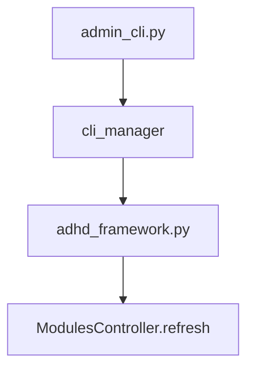

# 82 - CLI Commands

> Part of [Layered Refresh System Blueprint](./00_index.md)

---

## ⌨️ Command Line Interface

### 🏗️ CLI Pattern



### 🛠️ Admin Commands

| Command | Arguments | Description |
|---------|-----------|-------------|
| `adhd refresh` | (none) | Run all `refresh.py` scripts in dependency order. |
| `adhd refresh --full` | `--full` | Run `refresh.py` AND `refresh_full.py` (where present) in dependency order. |
| `adhd refresh --no-sync` | `--no-sync` | Skip `uv sync` before refreshing (existing flag). |

### Flag Interactions

| Flags | Behavior |
|-------|----------|
| (none) | Default: run `refresh.py` per module in dependency order |
| `--full` | Run `refresh.py` then `refresh_full.py` per module, dependency-ordered |
| `--no-sync` | Combinable with any of the above |
| `--no-sync --full` | Skip sync, then full refresh |

### 🚀 User Commands

N/A — `adhd refresh` is an admin/developer command. No separate user-facing commands.

---

### Output Examples

**Default refresh:**
```
$ adhd refresh
Running uv sync before refresh...
✅ uv sync completed
Refreshing all modules...
  Refresh order: exceptions_core → logger_util → config_manager → ... → adhd_mcp
  Refreshing exceptions_core...
  Refreshing logger_util...
  Refreshing cli_manager...
  Refreshing instruction_core...
  Refreshing adhd_mcp...
✅ Project refresh completed! (5 refreshed)
```

**Full refresh:**
```
$ adhd refresh --full
Running uv sync before refresh...
✅ uv sync completed
Refreshing all modules (full)...
  Refresh order: exceptions_core → logger_util → config_manager → ... → adhd_mcp
  Refreshing exceptions_core...
  Refreshing logger_util...
  Refreshing cli_manager...
    Running full refresh for cli_manager...
  Refreshing instruction_core...
    Running full refresh for instruction_core...
  Refreshing adhd_mcp...
✅ Project refresh completed! (5 refreshed, 2 full)
```

---

**Next**: [Implementation](./80_implementation.md)
