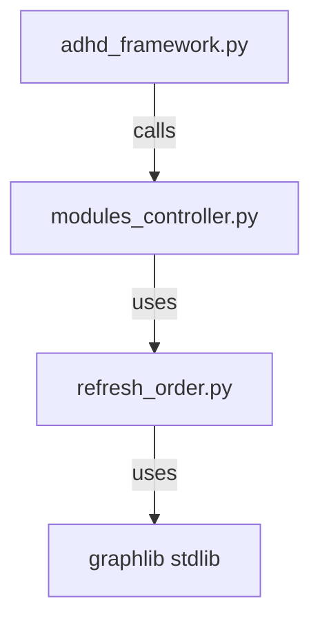
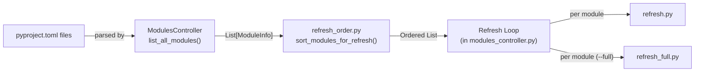

# Module Specification: modules_controller_core

> Part of [Layered Refresh System Blueprint](../00_index.md)

---

## 📖 The Story

### 😤 The Pain

```
Current Reality:
┌──────────────────────────────────────────────────────────────────┐
│  ModulesController.refresh()                                     │
│       ↓                                                          │
│  Iterates list_all_modules() in discovery order  💥              │
│  Runs every refresh.py unconditionally            💥              │
│  No ordering, no tiered scripts                                  │
└──────────────────────────────────────────────────────────────────┘
```

| Who Hurts | Pain Level | Frequency |
|-----------|------------|-----------|
| Framework Developer | 🔥🔥🔥 High | Every `adhd refresh` |

### ✨ The Vision

```
After This Feature:
┌──────────────────────────────────────────────────────────────────┐
│  ModulesController.refresh()                                     │
│       ↓                                                          │
│  sort_modules_for_refresh() → dependency-ordered list  ✅        │
│       ↓                                                          │
│  For each: run refresh.py (+ refresh_full.py on --full)  ✅     │
│       ↓                                                          │
│  Correct order, tiered scripts  ✅                               │
└──────────────────────────────────────────────────────────────────┘
```

### 🎯 One-Liner

> Extend `modules_controller_core` with a `refresh_order.py` submodule for pure dependency sorting, and enhance `refresh()` to support tiered script execution.

---

## 📝 Overview

The `modules_controller_core` module is the central orchestrator for module discovery, validation, and lifecycle management in the ADHD Framework. This spec covers the **additions** needed for the Layered Refresh System — one new file and modifications to the existing controller.

### 🎯 Responsibilities
- **✅ DO**: Sort modules by topological dependency order for refresh
- **✅ DO**: Discover and run tiered refresh scripts (`refresh.py` + `refresh_full.py`)
- **✅ DO**: Support `--full` flag to trigger heavy-tier scripts
- **❌ DON'T**: Modify how modules are discovered (that's existing `list_all_modules()`)
- **❌ DON'T**: Handle CLI argument parsing (that's `adhd_framework.py`)
- **❌ DON'T**: Detect staleness or cache refresh state (`refresh.py` always runs)

### 📚 External Dependence

| Dependency | Type | Purpose |
|------------|------|---------|
| `graphlib.TopologicalSorter` | stdlib | Dependency-based topological sorting |

---

## 🔗 Implements Features

| Feature | Blueprint | What This Module Provides |
|---------|-----------|---------------------------|
| Dependency Ordering | [03_feature_dependency_ordering.md](../03_feature_dependency_ordering.md) | `sort_modules_for_refresh()` — pure dependency topo sort |
| Tiered Scripts | [04_feature_tiered_scripts.md](../04_feature_tiered_scripts.md) | Tiered script discovery + execution in `refresh()` method |

---

## 📂 Folder Structure

```text
modules_controller_core/
├── __init__.py                  # Existing — add new exports
├── modules_controller.py        # Existing — modify refresh() method
├── refresh_order.py             # NEW — pure dependency topo sort
├── module_types.py              # Existing — LAYER_SUBFOLDERS, ModuleLayer
├── dependency_walker.py         # Existing — reference patterns, unchanged
├── module_filter.py             # Existing — unchanged
├── module_doctor.py             # Existing — unchanged
└── tests/
    └── test_refresh_order.py    # NEW
```

---

## ⚙️ Implementation Details

### Key Components

| Component | Type | Description |
|-----------|------|-------------|
| `sort_modules_for_refresh()` | Function | Builds full dependency graph from all modules, runs `TopologicalSorter.static_order()`, returns flat ordered list |
| `_build_dependency_graph()` | Function | Filters ADHD module deps from external deps, builds adjacency dict |
| `refresh()` (modified) | Method | Uses ordered list, runs `refresh.py` + optional `refresh_full.py` per module |
| `_discover_refresh_scripts()` | Function | Checks for `refresh.py` and `refresh_full.py` in module directory |

### Public API / Interfaces

**`refresh_order.py`:**
```
sort_modules_for_refresh(modules: List[ModuleInfo]) -> List[ModuleInfo]
```
- Input: Unordered list of modules from `list_all_modules()`
- Output: Ordered list (dependencies first, dependents last)
- Note: Assumes dependency graph is acyclic (validated at module-add/sync time)

**Modified `ModulesController.refresh()`:**
```
def refresh(
    self,
    module_name: Optional[str] = None,
    *,
    skip_sync: bool = False,
    full: bool = False,
) -> None
```
- `full=True`: Also runs `refresh_full.py` scripts (for `--full`)
- `module_name`: Targeted single-module refresh (existing functionality)

---

## 🔌 Architecture & Dependencies

### 📊 Dependency Diagram



### 🔗 Dependency Details

| Dependency | Type | Purpose |
|------------|------|---------|
| `graphlib.TopologicalSorter` | External (stdlib) | Dependency ordering |

### 📊 Dataflow Diagram



### 📝 Data Information

| Data Source | Description | Format/Schema | Storage Mechanism |
|-------------|-------------|---------------|-------------------|
| `pyproject.toml` | Module dependencies | TOML (`[project] dependencies = [...]`) | File (per-module) |
| `refresh.py` | Standard refresh script | Python script | File (per-module) |
| `refresh_full.py` | Heavy refresh script (optional) | Python script | File (per-module, optional) |
| `ModuleInfo` | Module metadata object | Python dataclass | In-Memory |

### ⌨️ CLI Registration

N/A — This module does not register CLI commands directly. It is called by `adhd_framework.py` which owns the `adhd refresh` command.

---

## 🧪 Quality Assurance

- **Unit Tests**: `test_refresh_order.py` — happy path ordering, cross-layer dependency handling, modules with no deps, external deps filtering, modules without refresh scripts
- **Integration Tests**: Verify full `adhd refresh` runs in correct order end-to-end (manual verification)

---

## ✅ Module Validation Checklist

### Traceability
- [x] **Implements Features** section links to 2 features
- [x] All linked features have backlinks to this module spec

### Completeness
- [x] Responsibilities clearly state DO and DON'T
- [x] Public API section defines interface contract
- [x] Dependency diagram present and accurate
- [x] Dataflow diagram shows full data path
- [x] Data Information table describes all data sources

---

**← Back to:** [Index](../00_index.md)
