# 🎯 Instruction Compiler Pipeline: Project Blueprint

> *Transform ADHD's silently broken instruction sync into a compiled, auditable pipeline — fix the poisoned v2 references, repair the broken sync path, and evolve from scattered markdown copier to flow-compiled, skills-aware sync orchestrator.*

**Document Type:** Technical Design Document / Project Blueprint  
**Version:** 2.0  
**Created:** 2026-02-08  
**Revised:** 2026-02-08  
**Status:** 📐 Planning

---

## 📊 Progress Overview

| Phase | Status | Notes |
|-------|--------|-------|
| P0: v3 Contamination Fix | ⏳ [TODO] | Fix broken sync path, purge v2 poison from 37 files, update agent format spec |
| P1: Flow-First Compilation Pipeline | ⏳ [TODO] | .flow sources, compilation, manifest, `flow-core` dependency |
| P1b: Remaining Agent Migrations | ⏳ [TODO] | Migrate 7 remaining agents to .flow |
| P2: Cleanup | ⏳ [TODO] | Remove replaced hand-written files |

### Status Legend

| Icon | Meaning |
|------|---------|
| ⏳ | TODO |
| 🔄 | WIP |
| ✅ | DONE |
| 🚫 | CUT |

---

## 📐 Planning Standards

This blueprint follows **HyperDream phasing rules**:

| Principle | Meaning |
|-----------|---------|
| **Walking Skeleton First** | Phase 0 proves plumbing works with hardcoded stubs |
| **Difficulty Honesty** | Each item labeled `[KNOWN]`, `[EXPERIMENTAL]`, or `[RESEARCH]` |
| **Research ≠ Foundation** | `[RESEARCH]` items never in Phase 0 |
| **Incremental Value** | Each phase delivers usable functionality |

---

## 📑 Document Index

| # | Document | Required | Purpose (When to Read) |
|---|----------|----------|------------------------|
| 00 | [Index](./00_index.md) | ✓ | **Navigation hub** — Start here if lost |
| 01 | [Executive Summary](./01_executive_summary.md) | ✓ | **Vision & scope** — Read to understand what/why |
| 02 | [Architecture](./02_architecture.md) | ✓ | **System design** — Read to understand how pieces fit |
| 03 | [Feature: v3 Contamination Fix](./03_feature_v3_format_fix.md) | | **Feature detail** — Fix broken sync path + purge all v2 poison from data files |
| 04 | [Feature: Skills Adoption](./04_feature_skills_adoption.md) | | **Feature detail** — Agent Skills taxonomy and adoption (one skill per folder) |
| 05 | [Feature: Flow Compilation Pipeline](./05_feature_flow_compilation_pipeline.md) | | **Feature detail** — The core .flow → markdown pipeline |
| 06 | [Feature: instruction_core Refactor](./06_feature_instruction_core_refactor.md) | | **Feature detail** — From copier to compile+sync orchestrator |
| 80 | [Implementation](./80_implementation.md) | ✓ | **Task tracking** — Read to start/track work |

---

## 💭 Vision Statement

> *"ADHD's agent instructions are the nervous system of the framework — they tell AI agents how to think, act, and collaborate. Today they're silently broken: the sync path points to a directory that doesn't exist (`cores/instruction_core/data`), 20+ files reference dead `cores/` paths, and the instruction files teach agents about a v2 project that was replaced months ago. Tomorrow they'll be accurate, compiled from composable .flow sources, organized into Agent Skills, and synced through a manifest-driven pipeline that's auditable via git blame. Every reference correct, every agent reproducible, every skill loadable on demand."*

---

## 🧭 How to Navigate This Blueprint

### Reading Order Decision Tree

```mermaid
flowchart TD
    START[📚 You are here] --> Q1{What do you need?}
    
    Q1 -->|"Understand the project"| PATH_UNDERSTAND
    Q1 -->|"Implement something"| PATH_IMPL
    Q1 -->|"Review/approve"| PATH_REVIEW
    
    PATH_UNDERSTAND[🎯 Understanding Path]
    PATH_UNDERSTAND --> ES[01 - Executive Summary]
    ES --> ARCH[02 - Architecture]
    ARCH --> FEAT[03-06 Feature Docs]
    
    PATH_IMPL[🔧 Implementation Path]
    PATH_IMPL --> IMPL[80 - Implementation]
    IMPL --> F03[03 - v3 Contamination Fix<br/>Start here for P0]
    F03 --> F04[04 - Skills Adoption<br/>Also P0]
    
    PATH_REVIEW[✅ Review Path]
    PATH_REVIEW --> ES2[01 - Executive Summary]
    ES2 --> IMPL2[80 - Implementation]
```

### Document Purpose Quick Reference

| Doc | When to Read | One-Line Purpose |
|-----|--------------|------------------|
| **00 - Index** | First visit, lost | Navigation hub, project overview |
| **01 - Exec Summary** | Deciding whether to work on this | Goals, non-goals, scope, success metrics |
| **02 - Architecture** | Understanding system design | Pipeline stages, data flow, module boundaries |
| **03 - v3 Contamination Fix** | Starting P0 work | 3-layer contamination audit, broken path fix, batch file correction |
| **04 - Skills Adoption** | Starting P0 work | Skills taxonomy, SKILL.md format, one skill per folder |
| **05 - Flow Compilation** | Starting P1 work | .flow → markdown pipeline, manifest schema |
| **06 - instruction_core Refactor** | Starting P1 work | Controller transformation to compile+sync |
| **80 - Implementation** | Starting work, tracking progress | Phased tasks, verification steps, decisions log |

---

## [Custom] 📜 Discussion Provenance

This blueprint was developed through multi-agent discussion on 2026-02-08:

| Agent | Role | Key Contribution |
|-------|------|-----------------|
| **HyperDream** | Visionary Architect | Original pipeline vision, skills taxonomy, phasing, 3-layer contamination framing |
| **HyperSan** | Sanity Checker | Identified broken `official_source_path`, found all `cores/` references, caught v2 tooling poison |
| **HyperArch** | Implementation Architect | Verified codebase facts, confirmed `pyproject.toml`-based discovery, corrected all v2 assumptions |

### v2 Corrections Applied (v2.0 rewrite)

The v1.0 blueprint contained critical v2 assumptions that were identified and corrected:

| v1.0 (Wrong) | v2.0 (Corrected) | Why |
|---------------|-------------------|-----|
| "instruction_core has no init.yaml → invisible to framework" | instruction_core HAS `pyproject.toml` with `[tool.adhd]` → IS discovered by ModulesController | v3 discovery uses `pyproject.toml`, not `init.yaml` |
| "Create init.yaml to fix visibility" | Fix `official_source_path` in `instruction_controller.py` line 47 | The real bug is a hardcoded broken path (`cores/instruction_core/data`), not a missing metadata file |
| P0 was "Create init.yaml + audit format" | P0 is "Fix broken path + purge v2 poison from 37 files + update agent format spec" | Correct diagnosis drives correct treatment |
| Dependencies declared via init.yaml + GitHub URLs | Dependencies declared via `[project].dependencies` in `pyproject.toml` + `[tool.uv.sources]` workspace resolution | v3 uses uv workspace, not pip + GitHub URLs |

---

## ✅ Index Validation Checklist

### Navigation
- [x] All documents listed in index with correct links
- [x] Reading order decision tree present
- [x] Document purpose quick reference table present

### Accuracy
- [x] Progress overview matches actual phase structure
- [x] Vision statement reflects corrected (v3) understanding
- [x] Discussion provenance documents agent contributions and v2 corrections

---

**← Back to:** [Day Dream Index](../README.md)

