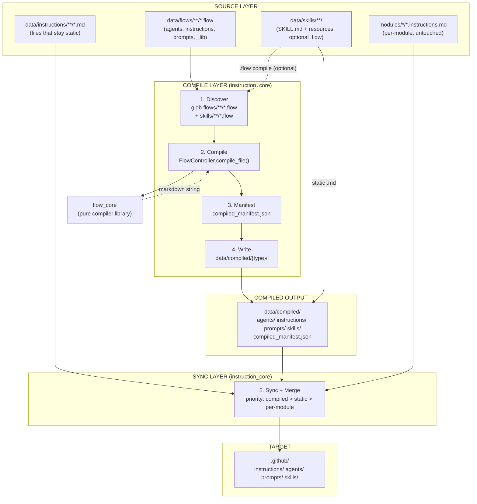
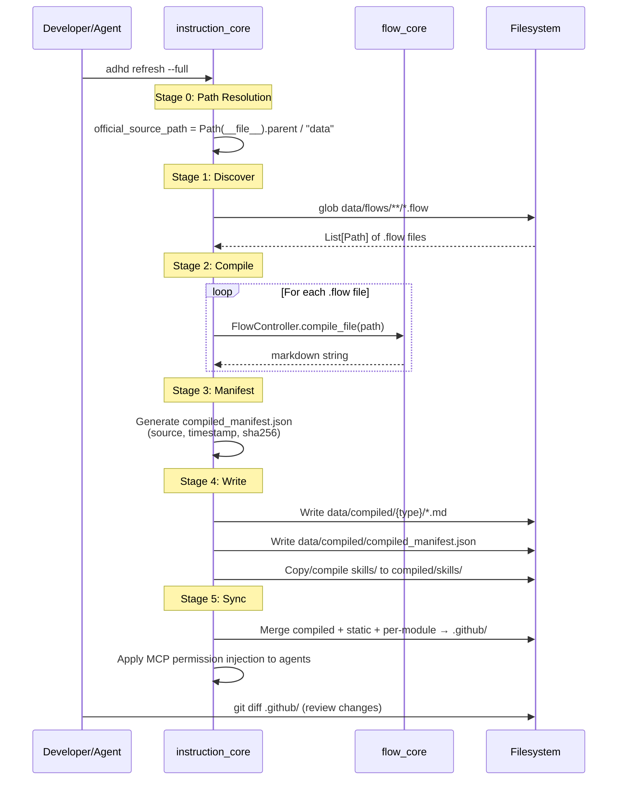

# 02 - Architecture

> Part of [Instruction Compiler Pipeline Blueprint](./00_index.md)

---

## 📖 The Story

### 😤 The Pain

```
Current Reality:
┌──────────────────────────────────────────────────────────────────┐
│  instruction_controller.py:                                      │
│    official_source_path = root / "cores" / "instruction_core"    │
│                                   ^^^^^^                         │
│    💥 Path doesn't exist → _sync_data_to_target() SKIPS          │
│    💥 .github/ files are STALE (months old)                      │
│                                                                  │
│  Even if path were correct:                                      │
│  data/instructions/{7 subdirs}/ ──► shutil.copy2 ──► .github/    │
│  data/agents/                   ──► flatten        ──► .github/  │
│  data/prompts/                  ──► flatten        ──► .github/  │
│  modules/*/*.instructions.md    ──► copy           ──► .github/  │
│                                                                  │
│  💥 No composition, no provenance, no manifest                   │
│  💥 Workflow files mixed with coding standards                   │
│  💥 37 files contain dead v2 references                          │
└──────────────────────────────────────────────────────────────────┘
```

| Who Hurts | Pain Level | Frequency |
|-----------|------------|-----------|
| Every AI agent (learns wrong facts) | 🔥🔥🔥 Critical | Every prompt |
| Agent authors | 🔥🔥🔥 High | Every agent update — shared content duplicated |
| Developers | 🔥🔥 Medium | Daily — can't trace .github/ file origins |

### ✨ The Vision

```
After This Blueprint:
┌──────────────────────────────────────────────────────────────────┐
│  instruction_controller.py:                                      │
│    official_source_path = Path(__file__).parent / "data"         │
│    ✅ Derives from module location, survives renames             │
│                                                                  │
│  data/flows/*.flow  ──► FlowController.compile_file()            │
│                         ──► data/compiled/{type}/*.md            │
│                         ──► data/compiled/compiled_manifest.json │
│  data/skills/         ──► copy to compiled/skills/               │
│  static .md files     ──► copy as-is (no compilation needed)     │
│                                                                  │
│  compiled/ + static + per-module ──► sync ──► .github/           │
│  (priority: compiled > static > per-module)                      │
│                                                                  │
│  ✅ Broken path fixed             ✅ v2 poison purged            │
│  ✅ Composition via .flow          ✅ Manifest provenance        │
│  ✅ Skills for on-demand content   ✅ Git-blame everything       │
└──────────────────────────────────────────────────────────────────┘
```

### 🎯 One-Liner

> Fix the broken sync path, purge v2 contamination, then build a four-stage pipeline — discover, compile, manifest, sync — that replaces dumb file copying with flow-compiled, manifest-tracked instruction delivery.

---

## 🔧 The Spec

---

## 🏗️ System Overview

### High-Level Architecture



---

## 📊 Data Flow



### Stage Details

| Stage | Input | Transformation | Output | Owner |
|-------|-------|----------------|--------|-------|
| 0. Path Fix | `Path(__file__)` | Derive source path from module location | `Path` to `data/` directory | `instruction_core` |
| 1. Discover | `data/flows/` + `data/skills/` directories | Glob `**/*.flow`, classify by subdirectory (including skills) | `List[FlowSource]` with type + path | `instruction_core` |
| 2. Compile | Each `.flow` file path | `FlowController.compile_file()` → tokenize → parse → resolve → compile | Markdown string per source | `flow_core` (called by `instruction_core`) |
| 3. Manifest | Compiled strings + metadata | SHA-256 hash, timestamp, source path | `compiled_manifest.json` | `instruction_core` |
| 4. Write | Markdown strings + manifest | Write to `data/compiled/{agents,instructions,prompts,skills}/` | Committed output files | `instruction_core` |
| 5. Sync | compiled/ + static/ + per-module/ | Copy to `.github/` with priority merge | `.github/{instructions,agents,prompts,skills}/` | `instruction_core` |

---

## 🧩 Logical Components

### Flow Compiler (flow_core)

| Attribute | Value |
|-----------|-------|
| **Purpose** | Pure `.flow` → Markdown compiler. Tokenize, parse, resolve, compile. |
| **Boundary** | Knows nothing about instruction_core, .github/, skills, or sync. Receives a file path, returns a string. |
| **Implemented By** | `modules/dev/flow_core/` |
| **Depends On** | `exceptions-core`, `logger-util` (declared in flow_core's `pyproject.toml`) |
| **Exposes** | `FlowController.compile_file(path) → str`, `FlowController.compile_source(source) → str` |

---

### Compile Orchestrator (instruction_core)

| Attribute | Value |
|-----------|-------|
| **Purpose** | Discover .flow sources, invoke compiler, write compiled output, generate manifest, sync to .github/ |
| **Boundary** | Owns the pipeline lifecycle. Does NOT own compiler internals. Does NOT own per-module .instructions.md authoring. |
| **Implemented By** | `modules/dev/instruction_core/` |
| **Depends On** | `flow-core` (P1), `exceptions-core`, `modules-controller-core`, `config-manager`, `logger-util` — all declared in `instruction_core/pyproject.toml` `[project].dependencies` |
| **Exposes** | `InstructionController.run()` (compile + sync), `InstructionController.compile_only()` (P1+) |

**v3 Dependency Declaration (P1):**
```toml
# instruction_core/pyproject.toml
[project]
dependencies = [
    "exceptions-core",
    "modules-controller-core",
    "logger-util",
    "config-manager",
    "pyyaml>=6.0",
    "flow-core",  # Added in P1
]

[tool.uv.sources]
flow-core = { workspace = true }  # Added in P1
```

---

### Skills Layer (data/skills/)

| Attribute | Value |
|-----------|-------|
| **Purpose** | On-demand, workflow-specific content bundles in [Agent Skills](https://agentskills.io/) format (open standard) |
| **Boundary** | Supports both static `.md` content (copied as-is) and `.flow` sources (compiled by flow_core). Mixed mode per-skill. Synced to `compiled/skills/` then to `.github/skills/` |
| **Implemented By** | `instruction_core/data/skills/` (source), `.github/skills/` (target) |
| **Depends On** | `flow_core` (optional, only for skills with `.flow` sources) |
| **Exposes** | SKILL.md files with YAML frontmatter (name, description) consumed by VS Code |

---

### Per-Module Instructions (modules/*)

| Attribute | Value |
|-----------|-------|
| **Purpose** | Module-specific coding standards authored by module developers |
| **Boundary** | Lives in module directories (`modules/{layer}/{name}/`). instruction_core gathers but never modifies them. |
| **Implemented By** | Each module's own `*.instructions.md` |
| **Depends On** | `modules-controller-core` (for discovery via `pyproject.toml` `[tool.adhd]`) |
| **Exposes** | `.instructions.md` files synced to `.github/instructions/` |

---

## 🔑 Key Design Principles

| # | Principle | Implication |
|---|-----------|-------------|
| 1 | **Path derived from `__file__`, not hardcoded** | `Path(__file__).parent / "data"` survives directory renames. Never hardcode project-relative paths. |
| 2 | **One-way dependency**: instruction_core → flow_core | flow_core remains a pure library. It never imports from instruction_core. |
| 3 | **Compiled output is committed** | `data/compiled/` is in git (NOT gitignored). Enables git blame, PR diffs, rollback. |
| 4 | **Manifest as single source of truth** | `compiled_manifest.json` maps every output file to its source .flow, compile timestamp, and content SHA-256. |
| 5 | **Merge priority: compiled > static > per-module** | Compiled output always wins. Prevents stale hand-written files from overriding compiled versions. |

---

## 📁 Project Structure

```
modules/dev/instruction_core/
├── __init__.py
├── instruction_controller.py           (P0: fix official_source_path)
├── pyproject.toml                      (P1: add flow-core dependency)
├── refresh_full.py                     (P0: runs on adhd refresh --full only)
└── data/
    ├── flows/                          (P1 — .flow source files)
    │   ├── agents/                     (P1)
    │   ├── instructions/               (P1)
    │   ├── prompts/                    (P1)
    │   └── _lib/                       (P1 — shared fragments)
    ├── skills/                         (P0 — one skill per folder, Agent Skills format)
    │   ├── expedition/
    │   ├── day-dream/
    │   ├── testing/
    │   ├── orch-discussion/
    │   ├── orch-implementation/
    │   ├── orch-testing/
    │   ├── orch-routing/
    │   └── orch-expedition/
    ├── compiled/                        (P1 — build output, committed)
    │   ├── agents/
    │   ├── instructions/
    │   ├── prompts/
    │   ├── skills/
    │   └── compiled_manifest.json
    ├── instructions/                    (EXISTING — static .md files, v2-purged in P0)
    │   ├── agents/
    │   ├── exped/                       (P0: reclassified → skills/)
    │   ├── formats/
    │   ├── framework/
    │   ├── modules/
    │   ├── planning/                    (P0: reclassified → skills/)
    │   └── workflows/                   (P0: reclassified → skills/)
    ├── agents/                          (EXISTING — hand-written, replaced by P1b)
    └── prompts/                         (EXISTING — may stay static or become .flow)

.github/                                 (SYNC TARGET)
├── instructions/                        (always-on coding standards)
├── agents/                              (compiled agent files, P1)
├── prompts/                             (compiled/static prompt files)
└── skills/                              (P0 — on-demand bundles, Agent Skills format)
    ├── expedition/
    ├── day-dream/
    ├── testing/
    ├── orch-discussion/
    ├── orch-implementation/
    ├── orch-testing/
    ├── orch-routing/
    └── orch-expedition/
```

---

## 🔌 Integration Points

### External APIs

| Service | Purpose | Auth Method | Rate Limits |
|---------|---------|-------------|-------------|
| N/A | No external APIs | — | — |

This pipeline is entirely local filesystem operations. No external APIs involved.

### File Formats

| Format | Used For | Schema Location |
|--------|----------|-----------------|
| `.flow` | Composable instruction sources | flow_core language spec |
| `.md` (compiled) | Compiled output for VS Code/Copilot | N/A — standard markdown |
| `SKILL.md` | Agent Skills definitions | [Agent Skills spec](https://agentskills.io/specification) (YAML frontmatter: `name`, `description`, optional `license`, `metadata`) |
| `compiled_manifest.json` | Compilation provenance | Defined in [05 - Flow Compilation Pipeline](./05_feature_flow_compilation_pipeline.md) |
| `pyproject.toml` | Module registration + dependency declaration | v3 standard: `[tool.adhd]` for discovery, `[project].dependencies` for deps |

---

## 🚧 Module Boundaries

> Standard ADHD boundaries apply. List exceptions only.

| Exception | Justification |
|-----------|---------------|
| instruction_core → flow_core | New dependency (P1): instruction_core calls `FlowController.compile_file()`. One-way only. Declared in `pyproject.toml` as `dependencies = ["flow-core"]` with `[tool.uv.sources] flow-core = { workspace = true }`. |

> **Out of scope — Creator templates:** `project_creator_core`, `module_creator_core`, and `creator_common_core` do NOT need updating. The `.github/` structure (instructions, agents, prompts, skills) is managed entirely by `instruction_core`'s sync pipeline, not by project/module scaffolding. Creators scaffold source code; instruction_core populates `.github/`.

---

## 💾 State Management

| State | Storage | Lifetime | Owner |
|-------|---------|----------|-------|
| Compiled output | `data/compiled/` filesystem | Persistent (committed) | `instruction_core` |
| Manifest | `data/compiled/compiled_manifest.json` | Persistent (committed) | `instruction_core` |
| Config paths | `config_manager` | Session | `config_manager` |

---

## ⚠️ Error Philosophy

This project follows a **fail-fast** philosophy.

Compilation errors in any `.flow` file abort the entire pipeline — we never produce partial output. A broken `.flow` source means a broken agent, and broken agents are worse than no agents. The compile step logs the exact file, line, and error via flow_core's established error hierarchy (`TokenizerError`, `ParserError`, `ResolverError`, `CompilerError`). The sync step only runs after all compilations succeed.

---

## ✅ Architecture Validation Checklist

### Diagram Completeness
- [x] **High-level diagram** shows all major components
- [x] **Data flow diagram** traces primary use case
- [x] Diagrams fit on one screen (no horizontal scroll)

### Component Definition
- [x] Each **Logical Component** has Purpose, Boundary, Implemented By
- [x] **Module Boundaries** exceptions are justified
- [x] **Key Design Principles** ≤5 and each has implementation implication

### Integration
- [x] **External APIs** documented (N/A stated with reason)
- [x] **File Formats** have schema location — uses `pyproject.toml` NOT `init.yaml`
- [x] **Error Philosophy** stated (fail-fast)

### v3 Accuracy
- [x] Zero references to `init.yaml` as a module registration mechanism
- [x] Dependencies declared via `pyproject.toml` `[project].dependencies`
- [x] Workspace resolution via `[tool.uv.sources]`
- [x] Path fix uses `Path(__file__).parent / "data"`, not hardcoded project path

---

**Prev:** [Executive Summary](./01_executive_summary.md) | **Next:** [Feature: v3 Contamination Fix](./03_feature_v3_format_fix.md)

---

**← Back to:** [Index](./00_index.md)

