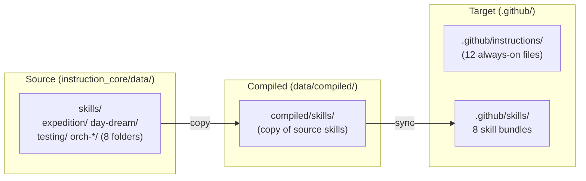
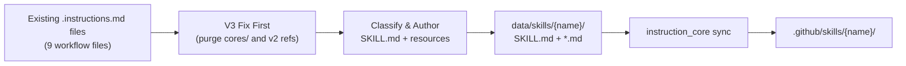

# 04 - Feature: Skills Adoption

> Part of [Instruction Compiler Pipeline Blueprint](./00_index.md)

---

## 📖 The Story

### 😤 The Pain

```
Current Reality:
┌────────────────────────────────────────────────────────────────────────┐
│  .github/instructions/ contains 21+ files                              │
│                                                                        │
│  Agent loads instructions  ──────►  ALL files injected into context    │
│                                                                        │
│  💥 expedition_schemas.instructions.md  ← only needed for expedition   │
│  💥 dream_blueprint.instructions.md     ← only needed for HyperDream   │
│  💥 orch_*.instructions.md (×5)         ← only needed for orchestrator │
│  💥 testing_folders.instructions.md     ← only needed during tests     │
│                                                                        │
│  9 workflow files consuming context window ALWAYS,                     │
│  even when agent is doing something completely unrelated               │
└────────────────────────────────────────────────────────────────────────┘
```

| Who Hurts | Pain Level | Frequency |
|-----------|------------|-----------|
| All agents (context overhead) | 🔥🔥🔥 High | Every prompt — wasted tokens on irrelevant instructions |
| Developers configuring agents | 🔥🔥 Medium | Weekly — unclear which files are always-on vs on-demand |

### ✨ The Vision

```
After This Feature:
┌────────────────────────────────────────────────────────────────────────┐
│  .github/instructions/ contains 12 ALWAYS-ON coding standards          │
│  .github/skills/       contains 8 ON-DEMAND capability bundles          │
│                                                                        │
│  Agent doing code review  ──►  Loads 12 instructions only    ✅        │
│  Agent doing expedition   ──►  + loads expedition skill     ✅         │
│  Agent doing day-dream    ──►  + loads day-dream skill      ✅         │
│  Agent orchestrating      ──►  + loads relevant orch-* skill ✅        │
│                                                                        │
│  Progressive disclosure: metadata → body → resources                   │
│  Portable: VS Code, Copilot CLI, Copilot coding agent                  │
└────────────────────────────────────────────────────────────────────────┘
```

### 🎯 One-Liner

> Reclassify 9 workflow-specific instruction files as 8 Agent Skills bundles (one skill per folder), reducing always-on context overhead and enabling on-demand capability loading.

### 📊 Impact

| Metric | Before | After |
|--------|--------|-------|
| Always-on instruction files | ❌ 21+ (all treated equally) | ✅ 12 (coding standards only) |
| Context tokens per agent | ❌ ~15K wasted on irrelevant workflow files | ✅ Only relevant skills loaded |
| Discoverability | ❌ Flat list of 21+ files | ✅ 12 instructions + 8 named skills |

---

## 🔧 The Spec

---

## 🎯 Overview

VS Code's [Agent Skills](https://agentskills.io/) format (an open standard adopted by VS Code, GitHub, Claude, Cursor, and others) provides native progressive disclosure for on-demand capabilities. A skill is a folder in `.github/skills/{skill-name}/` containing a `SKILL.md` with YAML frontmatter and optional resource files. Skills are loaded only when relevant to the user's prompt, not injected into every interaction.

We identify 8 skill bundles from the current instruction set and restructure them accordingly — one skill per folder, per the Agent Skills specification. Skills support **dual-mode content**: static `.md` files (copied as-is) and optional `.flow` sources (compiled by flow_core). Mixed mode per-skill.

**Important prerequisite:** Content must be v3-fixed (via [03 - v3 Contamination Fix](./03_feature_v3_format_fix.md)) BEFORE splitting into skills. Moving contaminated v2 content into skills just spreads the poison into a new format.

**Priority:** P0  
**Difficulty:** `[KNOWN]`

---

## 📚 Prior Art

### Existing Solutions

| Solution | Type | Relevance | Status |
|----------|------|-----------|--------|
| [Agent Skills](https://agentskills.io/) (open standard) | Platform native | High | ✅ Adopt |
| Custom `applyTo` patterns | Current approach | Medium | 🔧 Keep for instructions, complement with Skills |
| Copilot instructions (flat .github/instructions/) | Current approach | High | 🔧 Keep for always-on, move workflow files to Skills |

### Usage Decision

**Using:** Agent Skills format ([agentskills.io specification](https://agentskills.io/specification))  
**How:** Create `SKILL.md` files with YAML frontmatter (`name`, `description`) in `.github/skills/{name}/`. Resource files alongside. `name` must match parent directory name.  
**Why this over alternatives:** Open standard with wide adoption (VS Code, GitHub, Claude, Cursor, etc.). Progressive disclosure is automatic. Portable across all skills-compatible agents. No custom tooling needed.

---

## 🗺️ System Context



---

## 📊 Data Flow



| Stage | Format | Example |
|-------|--------|---------|
| Input | `.instructions.md` files (9 workflow-specific, v3-fixed) | `expedition_schemas.instructions.md` |
| Output | `SKILL.md` + resource files per skill folder | `skills/expedition/SKILL.md` + `skills/expedition/schemas.md` |

---

## [Custom] 🎨 Skills Taxonomy

### Skills Definition Table

| Skill Name | `name` (frontmatter) | Description | Files Absorbed | Resource Files |
|------------|---------------------|-------------|----------------|----------------|
| **expedition** | `expedition` | Framework export workflows — exporting ADHD agents and instructions to external projects | `expedition_schemas.instructions.md`, `hyper_exped_reference.instructions.md` | `schemas.md` (schema definitions extracted) |
| **day-dream** | `day-dream` | Vision and planning workflows — creating blueprint plans and architecture assets | `dream_blueprint.instructions.md`, `dream_assets.instructions.md` | `assets_guide.md` (asset authoring guide) |
| **testing** | `testing` | Testing and validation workflows — test folder conventions, Python execution rules | `testing_folders.instructions.md`, `python_terminal_commands.instructions.md` | — |
| **orch-discussion** | `orch-discussion` | Orchestrator discussion preset — multi-agent discussion mode for collaborative problem solving | `orch_discussion_preset.instructions.md` | — |
| **orch-implementation** | `orch-implementation` | Orchestrator implementation preset — coordinating implementation tasks across specialist agents | `orch_implementation_preset.instructions.md` | — |
| **orch-testing** | `orch-testing` | Orchestrator testing preset — coordinating test creation, execution, and validation workflows | `orch_testing_preset.instructions.md` | — |
| **orch-routing** | `orch-routing` | Orchestrator routing preset — routing user requests to the correct specialist agent | `orch_routing_preset.instructions.md` | — |
| **orch-expedition** | `orch-expedition` | Orchestrator expedition preset — coordinating expedition workflows across agents | `orch_expedition_preset.instructions.md` | — |

> **Rationale for splitting orchestrator:** The Agent Skills spec requires one skill per folder with `name` matching the directory. Each orchestrator preset is an independent workflow loaded in different contexts. Combining 5 presets into one skill would bloat context when only one preset is needed. Separate skills enable precise progressive disclosure — Copilot loads only the relevant preset.

### Content Validation Gate

> **CRITICAL:** All content absorbed into skills MUST be v3-fixed FIRST (via task #3 in [03 - v3 Contamination Fix](./03_feature_v3_format_fix.md)). Never move contaminated content into skills — it just spreads the poison.

Validation before skill creation:
- [ ] Zero `cores/` references in source files
- [ ] Zero `init.yaml` references in source files
- [ ] Zero dead v2 tooling patterns in source files
- [ ] All `applyTo` paths resolve correctly (or are removed for skill format)

### SKILL.md Format Reference

Every `SKILL.md` must follow this structure (per [Agent Skills spec](https://agentskills.io/specification)):

```markdown
---
name: "{skill-name}"
description: "{max 1024 chars description}"
---

# {Skill Title}

{Main content — the primary instruction body that was previously in .instructions.md files}

## Resources
{Optional: links to resource files alongside SKILL.md}
```

**Format rules (from [Agent Skills specification](https://agentskills.io/specification)):**

| Field | Required | Constraints |
|-------|----------|-------------|
| `name` | Yes | Lowercase + hyphens only, max 64 chars, **must match parent directory name**, no leading/trailing/consecutive hyphens |
| `description` | Yes | Max 1024 chars, should describe both what the skill does and when to use it |
| `license` | No | License name or reference to bundled license file |
| `compatibility` | No | Max 500 chars, environment requirements (if any) |
| `metadata` | No | Arbitrary key-value map for additional properties |
| `allowed-tools` | No | Space-delimited list of pre-approved tools (experimental) |

**Progressive disclosure (3 levels):**
1. **Discovery** (~100 tokens): `name` + `description` loaded at startup for all skills
2. **Activation** (<5000 tokens recommended): Full `SKILL.md` body loaded when task matches
3. **Resources** (as needed): Files in `scripts/`, `references/`, `assets/` loaded on demand

**Portability:** Agent Skills is an [open standard](https://agentskills.io/) adopted by VS Code, GitHub Copilot CLI, Copilot coding agent, Claude, Cursor, and others.

**Optional directories per skill:**
- `scripts/` — Executable code agents can run
- `references/` — Additional documentation loaded on demand
- `assets/` — Templates, images, data files

### Target Folder Structure

```
data/skills/
├── expedition/
│   ├── SKILL.md                 # Main: expedition workflow + schemas overview
│   └── schemas.md               # Resource: detailed schema definitions
├── day-dream/
│   ├── SKILL.md                 # Main: blueprint authoring workflow
│   └── assets_guide.md          # Resource: asset creation guidelines
├── testing/
│   └── SKILL.md                 # Main: testing conventions + Python execution
├── orch-discussion/
│   └── SKILL.md                 # Main: orchestrator discussion preset
├── orch-implementation/
│   └── SKILL.md                 # Main: orchestrator implementation preset
├── orch-testing/
│   └── SKILL.md                 # Main: orchestrator testing preset
├── orch-routing/
│   └── SKILL.md                 # Main: orchestrator routing preset
└── orch-expedition/
    └── SKILL.md                 # Main: orchestrator expedition preset
```

---

## [Custom] 📋 Always-On Instructions (Remaining in .github/instructions/)

After skill extraction, these 12 files remain as always-on coding standards:

| File | Source Location | Purpose |
|------|----------------|---------|
| `adhd_framework_context.instructions.md` | `framework/` | Core framework philosophy and structure |
| `module_development.instructions.md` | `modules/` | Module development standards |
| `config_manager.instructions.md` | per-module | Config manager usage patterns |
| `logger_util.instructions.md` | per-module | Logger usage patterns |
| `exceptions.instructions.md` | per-module | Exception handling standards |
| `agents_format.instructions.md` | `agents/` | Agent file format specification |
| `agent_common_rules.instructions.md` | `agents/` | Common rules for all agents |
| `hyper_san_output.instructions.md` | `agents/` | San checker output format |
| `instructions_format.instructions.md` | `formats/` | Instructions file format specification |
| `prompts_format.instructions.md` | `formats/` | Prompt file format specification |
| `mcp_development.instructions.md` | `modules/` | MCP development standards |
| `module_instructions.instructions.md` | `modules/` | Module instruction authoring |

**Note:** `modules_readme.instructions.md` from `modules/` also remains as always-on. Plus per-module `.instructions.md` files gathered from module directories (e.g., `cli_manager.instructions.md`).

**Removed from always-on:** `modules.init.yaml.instructions.md` — dead v2 artifact. File no longer exists and should not be referenced or synced.

---

## 🔗 Integration Points

| Connects To | Direction | Data | Protocol |
|-------------|-----------|------|----------|
| `instruction_core` sync | → OUT | Skill folders (SKILL.md + resources) | Filesystem copy |
| VS Code Copilot / any skills-compatible agent | ← IN | Reads `.github/skills/` on demand | Agent Skills standard (progressive disclosure) |
| `.github/instructions/` | ↔ BOTH | Reduced set (12 instead of 21+) | Filesystem |

---

## 👥 User Stories

| As a... | I want to... | So that... |
|---------|--------------|------------|
| AI agent | Load only relevant skills | My context window isn't wasted on unrelated workflows |
| Agent author | Organize workflow-specific content as skills | Skills are discoverable and loadable on demand |
| Developer | See a clear separation of always-on vs on-demand content | I know which files affect every interaction vs specific workflows |

---

## ✅ Acceptance Criteria

- [ ] 8 skill folders created in `data/skills/` with valid SKILL.md files
- [ ] Each SKILL.md has correct YAML frontmatter (`name`, `description`), with `name` matching parent directory
- [ ] All 9 workflow files absorbed into skill bundles
- [ ] All absorbed content passes v3 compliance reference (zero v2 poison)
- [ ] 12 always-on instruction files remain in `data/instructions/`
- [ ] Zero references to `modules.init.yaml.instructions.md` remain anywhere
- [ ] `instruction_core` sync updated to copy `skills/` to `.github/skills/`
- [ ] VS Code can discover and load skills from `.github/skills/`
- [ ] Each orch-* skill is a separate folder (not merged into one)

---

## 🛠️ Technical Notes

### Constraints

- SKILL.md `name` must be lowercase with hyphens, max 64 chars, **must match parent directory name**
- SKILL.md `description` must be max 1024 chars
- Skills are folders, not individual files — one SKILL.md per folder
- Each orchestrator preset is a separate skill folder (not merged) for precise progressive disclosure

### Considerations

- Some `.instructions.md` files have `applyTo` frontmatter that controls which files they're attached to. Skills don't use `applyTo` — they're loaded based on prompt relevance. This is a philosophical shift: from "always attached to matching files" to "loaded when contextually relevant".
- Skills support dual-mode content: static `.md` files are copied as-is; `.flow` source files (if present) are compiled by flow_core first. This enables gradual migration to .flow without blocking P0.

---

## ⚠️ Edge Cases

| Scenario | Expected Behavior |
|----------|-------------------|
| VS Code without Skills support (older version) | Skills in `.github/skills/` are ignored. Always-on instructions still work. Graceful degradation. |
| Skill content too large for single SKILL.md | Split into SKILL.md (overview) + resource files (details). Progressive loading handles this. Keep SKILL.md under 500 lines per Agent Skills spec recommendation. |
| Name collision between skill folder and instruction file | Won't happen — skills use folder names (`expedition/`), instructions use filenames (`*.instructions.md`). Different namespace. |

---

## ❌ Out of Scope

- Custom VS Code extension for skill management (VS Code handles this natively)
- Removing the `applyTo` system from instructions (still needed for always-on files)

> **Note:** Compiling skills from `.flow` sources is NOT out of scope — skills support dual-mode (static `.md` + `.flow` compilation). However, P0 skills will all be static `.md`. Flow compilation of skills is a P1+ activity.

---

## 🔗 Dependencies

| Dependency | Status | Notes |
|------------|--------|-------|
| [03 - v3 Contamination Fix](./03_feature_v3_format_fix.md) | Pending | Content MUST be v3-fixed before splitting into skills. Never move contaminated content. |
| [Agent Skills specification](https://agentskills.io/) | Done | Open standard, specification is stable and documented |

---

## 🖼️ Related Assets

N/A — No mockups or diagrams needed beyond inline content.

---

## ❓ Open Questions

- Should `hyper_san_output.instructions.md` (currently in `agents/`) remain as an always-on instruction or become part of a skill?
- Which skills will benefit most from `.flow` compilation in P1+? (expedition and day-dream are likely candidates due to template-heavy content)

---

## ✅ Feature Validation Checklist

### Narrative Completeness
- [x] **The Story** section clearly states user problem and value
- [x] **Intent** is unambiguous to a non-technical reader
- [x] **Scope** is explicitly bounded (Out of Scope section filled)

### Technical Completeness
- [x] **Integration Points** table has all connections documented
- [x] **Edge Cases** table covers failure scenarios
- [x] **Dependencies** are listed with status — includes v3-fix content validation gate
- [x] **Acceptance Criteria** are testable (not vague)

### v3 Accuracy
- [x] Zero references to init.yaml
- [x] `modules.init.yaml.instructions.md` explicitly removed from always-on list
- [x] Content validation gate requires v3-fix before skill creation

### Linkage
- [x] Feature linked from [00_index.md](./00_index.md) and [01_executive_summary.md](./01_executive_summary.md)

---

**Prev:** [Feature: v3 Contamination Fix](./03_feature_v3_format_fix.md) | **Next:** [Feature: Flow Compilation Pipeline](./05_feature_flow_compilation_pipeline.md)

---

**← Back to:** [Index](./00_index.md)

