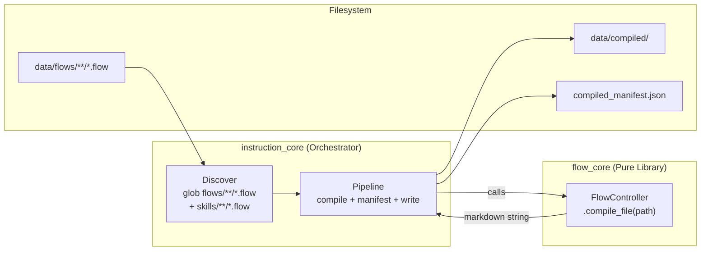
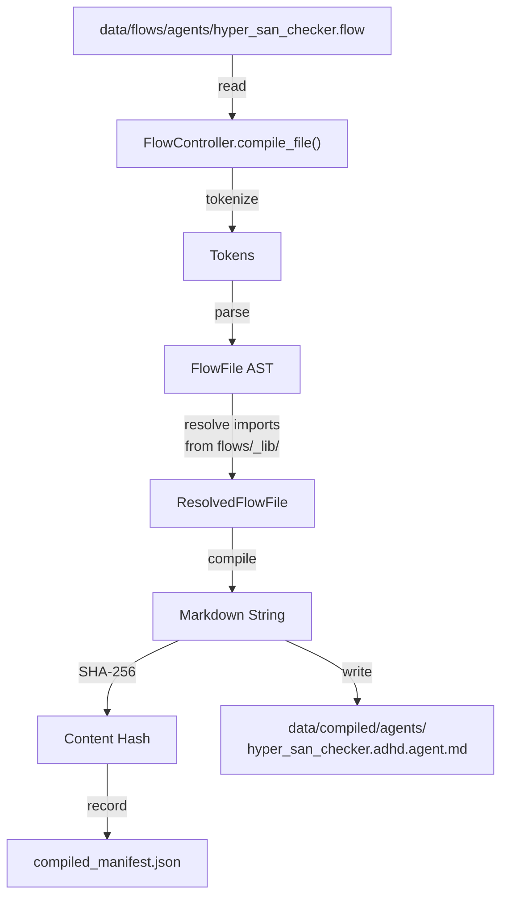
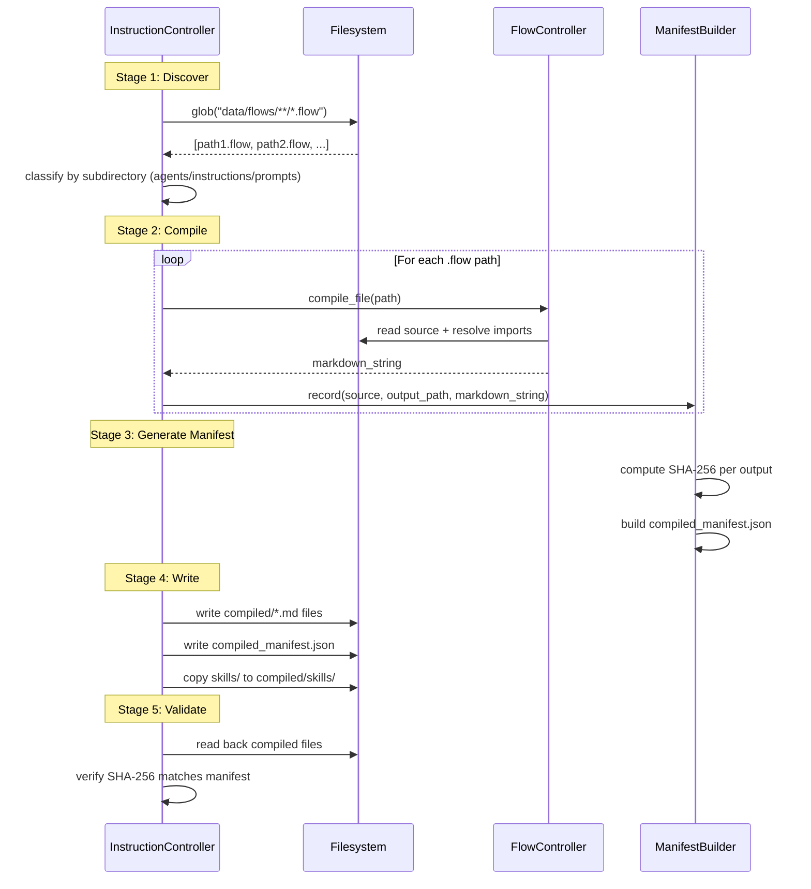

# 05 - Feature: Flow Compilation Pipeline

> Part of [Instruction Compiler Pipeline Blueprint](./00_index.md)

---

## 📖 The Story

### 😤 The Pain

```
Current Reality:
┌────────────────────────────────────────────────────────────────────────┐
│  Agent file: hyper_orchestrator.adhd.agent.md                          │
│                                                                        │
│  Contains: common rules + stopping rules + specialist table +          │
│            mode-specific content + tools list + ...                    │
│                                                                        │
│  💥 Shared content (common_rules, stopping_rules) is COPY-PASTED       │
│     across 8 agent files                                               │
│  💥 Updating shared content = edit 8 files manually                    │
│  💥 Drift between agents — one gets updated, others don't              │
│  💥 No way to verify all agents share the same base rules              │
└────────────────────────────────────────────────────────────────────────┘
```

| Who Hurts | Pain Level | Frequency |
|-----------|------------|-----------|
| HyperAgentSmith (agent author) | 🔥🔥🔥 High | Every shared content update — manual 8-file edit |
| All agents (consistency) | 🔥🔥🔥 High | Risk of drift on every update |
| Framework maintainers | 🔥🔥 Medium | PR reviews can't verify cross-file consistency |

### ✨ The Vision

```
After This Feature:
┌────────────────────────────────────────────────────────────────────────┐
│  flows/_lib/common_rules.flow     ← SINGLE SOURCE for shared rules     │
│  flows/_lib/stopping_rules.flow   ← SINGLE SOURCE for stopping rules   │
│  flows/_lib/specialist_table.flow ← SINGLE SOURCE for specialist table │
│                                                                        │
│  flows/agents/hyper_orchestrator.flow                                  │
│    @import "_lib/common_rules.flow"                                    │
│    @import "_lib/stopping_rules.flow"                                  │
│    @import "_lib/specialist_table.flow"                                │
│    @mode_content |<<<orchestrator-specific content>>>|.                │
│    @out |$common_rules $stopping_rules $specialist_table               │
│         $mode_content|.                                                │
│                                                                        │
│  compile_file("hyper_orchestrator.flow")                               │
│    → hyper_orchestrator.adhd.agent.md  (compiled, committed, diffable) │
│                                                                        │
│  ✅ Update common_rules.flow → recompile → ALL 8 agents updated        │
│  ✅ Git diff shows exactly what changed in compiled output             │
│  ✅ compiled_manifest.json tracks source → output provenance           │
└────────────────────────────────────────────────────────────────────────┘
```

### 🎯 One-Liner

> Build a discover → compile → manifest → write pipeline that turns composable `.flow` sources into compiled markdown with full provenance tracking.

### 📊 Impact

| Metric | Before | After |
|--------|--------|-------|
| Shared content update effort | ❌ Edit 8 files manually | ✅ Edit 1 .flow file, recompile |
| Cross-agent consistency | ❌ Manual verification | ✅ Guaranteed by compilation |
| Change provenance | ❌ None (dumb copy) | ✅ compiled_manifest.json with SHA-256 |
| PR review quality | ❌ Check 8 agent files for consistency | ✅ Check 1 source + compiled diff |

---

## 🔧 The Spec

---

## 🎯 Overview

The compilation pipeline is the core of this blueprint. It transforms `.flow` source files — composable documents using flow_core's language (imports, references, styles) — into final markdown files stored in `data/compiled/`. A manifest tracks provenance. The pipeline lives entirely in `instruction_core` and calls `flow_core` as a pure library.

**Priority:** P1  
**Difficulty:** `[EXPERIMENTAL]` — flow_core is proven, but orchestrating compilation of 8+ agents with shared libraries is untested at this scale.

**v3 Dependency Setup:** instruction_core declares `flow-core` as a dependency:
```toml
# modules/dev/instruction_core/pyproject.toml
[project]
dependencies = [
    "exceptions-core",
    "modules-controller-core",
    "logger-util",
    "config-manager",
    "pyyaml>=6.0",
    "flow-core",  # NEW in P1
]

[tool.uv.sources]
flow-core = { workspace = true }  # NEW in P1
```

No `init.yaml`, no GitHub URLs, no `requirements.txt`.

---

## 📚 Prior Art

### Existing Solutions

| Solution | Type | Relevance | Status |
|----------|------|-----------|--------|
| flow_core `FlowController.compile_file()` | Internal library | High — the compiler itself | ✅ Adopt |
| flow_core `@import` directive | Internal feature | High — enables shared fragments | ✅ Adopt |
| flow_core resolver (import resolution) | Internal feature | High — resolves `@import` from `base_path` | ✅ Adopt |
| Make/Bazel/build systems | External tools | Medium — manifest + incremental builds | ❌ Reject (overkill for <20 files) |

### Build-vs-Adopt Justification

| Rejected Solution | Reason for Building Custom |
|-------------------|---------------------------|
| Make/Bazel | Overkill — we have <20 source files. Python script with glob + hashlib is sufficient. Solution sizing: stdlib handles this trivially. |
| Watchdog file watcher | Only ~10 files to compile. Manual trigger via `adhd refresh --full` is fine. |

---

## 🗺️ System Context



---

## 📊 Data Flow



| Stage | Format | Example |
|-------|--------|---------|
| Input | `.flow` source file | `flows/agents/hyper_san_checker.flow` |
| Intermediate | `ResolvedFlowFile` (AST with resolved imports from `_lib/`) | Internal flow_core data structure |
| Output | Compiled markdown + manifest entry | `compiled/agents/hyper_san_checker.adhd.agent.md` |

---

## [Custom] 🎨 Source File Organization

### flows/ Directory Structure

```
data/flows/
├── agents/                          # One .flow per agent (8 files)
│   ├── hyper_san_checker.flow       # FIRST migration target (smallest)
│   ├── hyper_architect.flow
│   ├── hyper_orchestrator.flow
│   ├── hyper_red.flow
│   ├── hyper_iq_guard.flow
│   ├── hyper_day_dreamer.flow
│   ├── hyper_agent_smith.flow
│   └── hyper_expedition.flow
├── instructions/                    # Composed instruction files (only complex ones)
│   └── agent_common_rules.flow      # Or stays static .md if no composition needed
├── prompts/                         # Composed prompt files (only if needed)
│   └── (most prompts stay static .md)
└── _lib/                            # Shared fragments (reused across agents)
    ├── common_rules.flow            # Common rules for all agents
    ├── stopping_rules.flow          # Standard stopping rules
    ├── specialist_table.flow        # Agent specialist table
    └── framework_context.flow       # Framework overview snippet
```

### Classification Rule

> If a file uses shared fragments or conditional composition → `.flow`. Otherwise → static `.md`. Skills support both modes: static SKILL.md + resources (copied as-is) or `.flow` sources (compiled by flow_core).

| File Type | .flow? | Rationale |
|-----------|--------|----------|
| Agent files | ✅ Yes | All 8 agents share common_rules, stopping_rules, specialist_table |
| `agent_common_rules.instructions.md` | Maybe | If it composes from fragments → .flow. If simple → stays .md |
| `adhd_framework_context.instructions.md` | ❌ No | Single static file, no composition |
| Prompt files | Unlikely | Simple static content, unless composition needed |
| Format specs | ❌ No | Static reference documents |
| Skill files (SKILL.md) | Optional | Skills with template-heavy or composed content can use `.flow`. Simple skills stay static `.md`. Mixed mode per-skill. |

---

## [Custom] 📋 Manifest Schema

### `compiled_manifest.json` Structure

```json
{
  "version": "1.0",
  "compiled_at": "2026-02-10T14:30:00Z",
  "compiler": "flow_core",
  "entries": [
    {
      "source": "flows/agents/hyper_san_checker.flow",
      "output": "compiled/agents/hyper_san_checker.adhd.agent.md",
      "type": "agent",
      "sha256": "a1b2c3d4e5f6...",
      "compiled_at": "2026-02-10T14:30:00Z",
      "imports": [
        "flows/_lib/common_rules.flow",
        "flows/_lib/stopping_rules.flow"
      ]
    }
  ],
  "static_copies": [
    {
      "source": "skills/expedition/SKILL.md",
      "output": "compiled/skills/expedition/SKILL.md",
      "sha256": "f6e5d4c3b2a1..."
    }
  ]
}
```

### Manifest Fields

| Field | Type | Purpose |
|-------|------|---------|
| `version` | string | Manifest schema version |
| `compiled_at` | ISO 8601 | When the full compilation ran |
| `compiler` | string | Compiler identifier |
| `entries[].source` | path (relative to data/) | Source .flow file |
| `entries[].output` | path (relative to data/) | Compiled output file |
| `entries[].type` | enum | `agent`, `instruction`, `prompt`, `skill` |
| `entries[].sha256` | hex string | SHA-256 of compiled output content |
| `entries[].compiled_at` | ISO 8601 | When this specific file was compiled |
| `entries[].imports` | list of paths | .flow files imported by this source |
| `static_copies[]` | list | Non-compiled files copied to compiled/ (skills, static .md) |

### Manifest Use Cases

| Use Case | How Manifest Helps |
|----------|-------------------|
| **Stale detection** | Compare `entries[].sha256` with actual file hash |
| **Provenance** | Trace any `.github/` file → `compiled/` → `flows/` source |
| **Dependency graph** | `entries[].imports` shows which shared fragments each agent uses |
| **Incremental compilation** | Only recompile when source or imports have changed (future optimization) |

---

## [Custom] 🔄 Incremental Migration Strategy

### Migration Order

Agents are migrated one at a time, validated, then the next is started:

| Order | Agent | Rationale |
|-------|-------|-----------|
| 1 | `hyper_san_checker` | Smallest agent, well-defined scope, fewest shared fragments |
| 2 | `hyper_red` | Small, focused agent |
| 3 | `hyper_iq_guard` | Small, focused agent |
| 4 | `hyper_day_dreamer` | Medium complexity |
| 5 | `hyper_agent_smith` | Medium complexity |
| 6 | `hyper_expedition` | Medium complexity |
| 7 | `hyper_architect` | Large, complex agent |
| 8 | `hyper_orchestrator` | Largest, most complex — has 5 mode presets |

### Per-Agent Migration Steps

1. **Author** `.flow` source in `flows/agents/{name}.flow`
2. **Extract** shared fragments to `flows/_lib/` (if not already extracted)
3. **Compile** via `FlowController.compile_file()` → get markdown output
4. **Diff** compiled output against existing hand-written agent file
5. **Validate** compiled output matches expected agent behavior
6. **Replace** hand-written file in `compiled/agents/` with compiled version
7. **Update** manifest entry

### Shared Fragment Extraction

The first agent migration (hyper_san_checker) will create the initial `_lib/` fragments. Subsequent agents reuse and may extend them:

| Fragment | Created During | Used By |
|----------|---------------|---------|
| `common_rules.flow` | Agent #1 (san_checker) | All 8 agents |
| `stopping_rules.flow` | Agent #1 (san_checker) | All 8 agents |
| `specialist_table.flow` | Agent #1 or #2 | All 8 agents |
| `framework_context.flow` | Agent #1 | All 8 agents |

---

## 🔗 Integration Points

| Connects To | Direction | Data | Protocol |
|-------------|-----------|------|----------|
| `flow_core` (FlowController) | → OUT | `.flow` file paths | Python API: `compile_file(Path) → str` |
| `flow_core` (Resolver) | → OUT | Import paths via `@import` | Filesystem relative to `base_path` |
| `data/compiled/` | → OUT | Compiled markdown files + manifest | Filesystem write |
| instruction_core sync | → OUT | `compiled/` feeds into sync stage | Filesystem read |

---

## 👥 User Stories

| As a... | I want to... | So that... |
|---------|--------------|------------|
| Agent author | Compose agents from shared .flow fragments | Shared content changes propagate to all agents automatically |
| Framework maintainer | Trace any .github/ file to its source | I can debug issues and understand provenance |
| PR reviewer | See diffs of both source .flow and compiled output | I can verify compilation is correct |

---

## ✅ Acceptance Criteria

- [ ] `data/flows/_lib/` contains at least `common_rules.flow` and `stopping_rules.flow`
- [ ] At least 1 agent (hyper_san_checker) is compilable from `.flow` source
- [ ] `FlowController.compile_file()` on `flows/agents/hyper_san_checker.flow` produces valid agent markdown
- [ ] `compiled_manifest.json` is generated with correct schema and SHA-256 hashes
- [ ] Compiled output in `data/compiled/agents/` matches expected agent content
- [ ] Compiled output is committed to git (NOT gitignored)
- [ ] Modifying `_lib/common_rules.flow` and recompiling updates the affected agent's compiled output
- [ ] `flow-core` dependency declared in `pyproject.toml` (NOT in init.yaml, NOT via GitHub URLs)

---

## 🛠️ Technical Notes

### Constraints

- flow_core resolves imports relative to `base_path` (the source file's parent directory). `_lib/` imports from `flows/agents/*.flow` use relative paths like `../_lib/common_rules.flow`.
- Compilation is fail-fast: any `.flow` error aborts the entire pipeline.
- Compiled output filenames must match the convention expected by sync: `*.adhd.agent.md`, `*.instructions.md`, `*.prompt.md`.

### Considerations

- flow_core's `@import` resolves files relative to the importing file's directory. The `_lib/` path from an agent `.flow` would be `../_lib/filename.flow`. This is standard flow_core behavior.
- The manifest generation uses stdlib `hashlib.sha256` and `json` — no new dependencies. Solution sizing: stdlib handles this trivially.
- Compilation order doesn't matter since each .flow file is independently compilable. Parallelization is a future optimization.

### v3 Dependency Declaration

```toml
# modules/dev/instruction_core/pyproject.toml
[project]
dependencies = [
    "exceptions-core",
    "modules-controller-core",
    "logger-util",
    "config-manager",
    "pyyaml>=6.0",
    "flow-core",  # Added in P1
]

[tool.uv.sources]
flow-core = { workspace = true }  # Added in P1
```

This is the ONLY dependency declaration needed. No GitHub URLs, no `requirements.txt`, no `init.yaml`.

---

## ⚠️ Edge Cases

| Scenario | Expected Behavior |
|----------|-------------------|
| `.flow` file has import cycle | flow_core raises `CircularDependencyError`. Pipeline logs error and aborts. |
| `.flow` file imports non-existent `_lib/` fragment | flow_core raises `ImportFileNotFoundError`. Pipeline logs and aborts. |
| Compiled output unchanged (same hash) | Manifest still updated with new timestamp. File not rewritten (hash comparison). |
| Empty `.flow` file | flow_core raises `MissingOutNodeError` (no `@out` node). Pipeline logs and aborts. |
| `.flow` references undefined node | flow_core raises `UndefinedNodeError`. Pipeline logs error with source file and line. |

---

## ❌ Out of Scope

- Incremental compilation (only recompile changed files) — full recompile is fine for <20 files
- Watch mode / auto-recompile on file change
- Parallel compilation (sequential is fine for <20 files)

---

## 🔗 Dependencies

| Dependency | Status | Notes |
|------------|--------|-------|
| [03 - v3 Contamination Fix](./03_feature_v3_format_fix.md) | Pending | Files must be v3 compliant before migration |
| [04 - Skills Adoption](./04_feature_skills_adoption.md) | Pending | Skills must be separated before compilation pipeline |
| flow_core | Done | `FlowController.compile_file()` is stable and tested |
| `pyproject.toml` dependency setup | Pending (P1) | Add `flow-core` to `[project].dependencies` + `[tool.uv.sources]` |

---

## ❓ Open Questions

- Should `.flow` files have frontmatter that controls output filename/type, or should that be inferred from directory (`flows/agents/` → agent, etc.)?
- Should the pipeline detect if compiled output was hand-edited (hash mismatch with manifest) and warn?
- What's the best way to handle YAML frontmatter in agent .flow files? Does flow_core support emitting frontmatter, or should the pipeline prepend it post-compilation?

---

## 🔬 Deep Dive

### Pipeline Algorithm

The compilation pipeline runs 5 stages sequentially:

```
discover() → compile_all() → generate_manifest() → write_outputs() → validate()
```

**Complexity:** $O(n \cdot c)$ where $n$ = number of .flow files and $c$ = average compilation cost per file. With $n < 20$ and $c$ dominated by I/O, total time is sub-second.

### Pipeline Sequence Diagram



### Output Type Classification

The pipeline infers output type and filename convention from the source subdirectory:

| Source Directory | Output Type | Filename Convention | Output Directory |
|-----------------|-------------|---------------------|------------------|
| `flows/agents/` | agent | `{stem}.adhd.agent.md` | `compiled/agents/` |
| `flows/instructions/` | instruction | `{stem}.instructions.md` | `compiled/instructions/` |
| `flows/prompts/` | prompt | `{stem}.prompt.md` | `compiled/prompts/` |
| `skills/{name}/*.flow` | skill | Compiled `.md` replaces `.flow` in skill folder | `compiled/skills/{name}/` |

Where `{stem}` is the `.flow` filename without extension (e.g., `hyper_san_checker.flow` → `hyper_san_checker`).

---

## ✅ Feature Validation Checklist

### Narrative Completeness
- [x] **The Story** section clearly states user problem and value
- [x] **Intent** is unambiguous to a non-technical reader
- [x] **Scope** is explicitly bounded (Out of Scope section filled)

### Technical Completeness
- [x] **Integration Points** table has all connections documented
- [x] **Edge Cases** table covers failure scenarios
- [x] **Dependencies** are listed with status
- [x] **Acceptance Criteria** are testable (not vague)

### v3 Accuracy
- [x] Dependency declared via `pyproject.toml` `[project].dependencies` (not init.yaml, not GitHub URLs)
- [x] Workspace resolution via `[tool.uv.sources]` (not pip install -e)
- [x] Import pattern is `from flow_core import FlowController` (package import)
- [x] Zero references to init.yaml, pip, sys.path.insert, requirements.txt

### Linkage
- [x] Feature linked from [00_index.md](./00_index.md) and [01_executive_summary.md](./01_executive_summary.md)

---

**Prev:** [Feature: Skills Adoption](./04_feature_skills_adoption.md) | **Next:** [Feature: instruction_core Refactor](./06_feature_instruction_core_refactor.md)

---

**← Back to:** [Index](./00_index.md)

