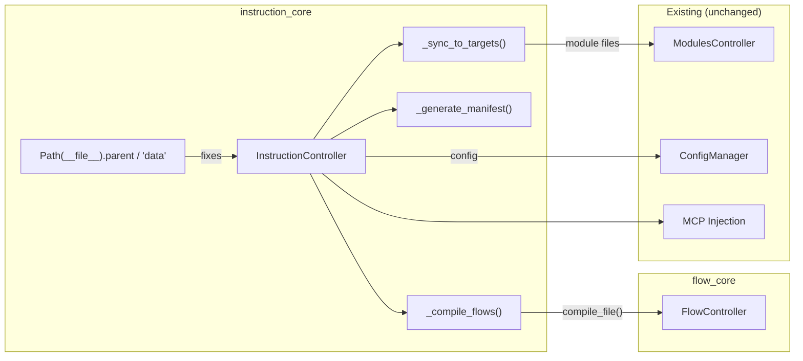
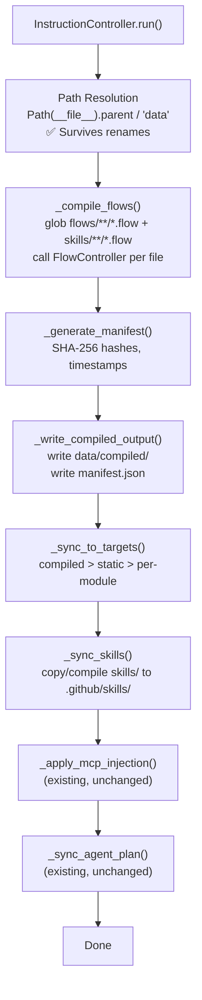

# 06 - Feature: instruction_core Refactor

> Part of [Instruction Compiler Pipeline Blueprint](./00_index.md)

---

## 📖 The Story

### 😤 The Pain

```
Current Reality:
┌────────────────────────────────────────────────────────────────────────┐
│  InstructionController.run() (instruction_controller.py)               │
│                                                                        │
│  💥 CRITICAL BUG — official_source_path points to dead "cores/" dir   │
│     → official sync SILENTLY NO-OPS                                    │
│                                                                        │
│  Even when path is fixed (P0):                                         │
│  1. _sync_agent_plan()            ← copy .agent_plan/                  │
│  2. _sync_data_to_target()        ← shutil.copy2 from data/ to .github│
│  3. _sync_module_files_to_target()← gather per-module files            │
│  4. _apply_mcp_injection()        ← inject MCP tools into agents       │
│                                                                        │
│  💥 Step 2 is dumb copy — no compilation, no manifest                  │
│  💥 No awareness of skills/ folder (doesn't sync skills)               │
│  💥 No awareness of compiled/ folder (doesn't exist yet)               │
│  💥 No merge priority when filenames collide                           │
│  💥 Flattens nested subdirs (data/instructions/agents/*.md → .github/) │
└────────────────────────────────────────────────────────────────────────┘
```

| Who Hurts | Pain Level | Frequency |
|-----------|------------|-----------|
| Framework maintainers | 🔥🔥🔥 High | Every `adhd refresh` — sync broken, no provenance |
| Agent authors | 🔥🔥 Medium | Can't tell if compiled output is current |

### ✨ The Vision

```
After This Feature:
┌────────────────────────────────────────────────────────────────────────┐
│  InstructionController.run()                                           │
│                                                                        │
│  Path fixed (P0): Path(__file__).parent / "data"                       │
│                                                                        │
│  1. _compile_flows()              ← NEW: call flow_core compiler       │
│  2. _generate_manifest()          ← NEW: build compiled_manifest.json  │
│  3. _write_compiled_output()      ← NEW: write to data/compiled/       │
│  4. _sync_to_targets()            ← ENHANCED: merge with priority      │
│     - compiled/ first (highest priority)                               │
│     - static instructions/ next                                        │
│     - skills/ to .github/skills/                                       │
│     - per-module files last (lowest priority)                          │
│  5. _apply_mcp_injection()        ← existing, unchanged               │
│  6. _sync_agent_plan()            ← existing, unchanged               │
│                                                                        │
│  ✅ Path correctly derived from module location                        │
│  ✅ Compilation integrated into refresh                                │
│  ✅ Manifest-driven provenance                                        │
│  ✅ Skills synced to .github/skills/                                  │
│  ✅ Merge priority prevents stale overrides                           │
└────────────────────────────────────────────────────────────────────────┘
```

### 🎯 One-Liner

> Transform `InstructionController` from a broken-path dumb copier into a compile+sync orchestrator that derives paths correctly, invokes flow_core, generates manifests, and syncs with merge priority.

### 📊 Impact

| Metric | Before | After |
|--------|--------|-------|
| `official_source_path` | ❌ Dead path (`cores/instruction_core/data`) | ✅ `Path(__file__).parent / "data"` |
| `run()` capabilities | ❌ Copy only (silently broken) | ✅ Compile + manifest + copy with priority |
| Skills sync | ❌ Not supported | ✅ `.github/skills/` populated |
| Provenance | ❌ None | ✅ `compiled_manifest.json` |
| Conflict resolution | ❌ Last-write-wins (undefined) | ✅ compiled > static > per-module |

---

## 🔧 The Spec

---

## 🎯 Overview

This feature refactors `InstructionController` in `modules/dev/instruction_core/instruction_controller.py` to:

1. **P0:** Fix the broken `official_source_path` (derive from `__file__` instead of hardcoding `cores/`)
2. **P1:** Integrate the compilation pipeline from [05 - Flow Compilation Pipeline](./05_feature_flow_compilation_pipeline.md)

The controller gains three new responsibilities in P1:
1. **Compile**: Invoke `FlowController.compile_file()` for each `.flow` source
2. **Manifest**: Generate `compiled_manifest.json` with provenance data
3. **Prioritized Sync**: Merge compiled + static + per-module with conflict resolution

The existing functionality (agent plan sync, MCP injection, per-module gathering) is preserved.

**Priority:** P1 (except path fix which is P0)  
**Difficulty:** `[KNOWN]` — All components are well-understood. flow_core API is stable. The refactoring is additive.

---

## 📚 Prior Art

### Existing Solutions

| Solution | Type | Relevance | Status |
|----------|------|-----------|--------|
| Current `InstructionController` | Internal | High — the code being refactored | 🔧 Adapt |
| `FlowController.compile_file()` | Internal | High — the compiler we call | ✅ Adopt |
| `shutil.copy2` (stdlib) | Standard lib | Medium — still used for static files | ✅ Keep |
| `hashlib.sha256` (stdlib) | Standard lib | High — for manifest hashes | ✅ Adopt |

### Build-vs-Adopt Justification

| Rejected Solution | Reason for Building Custom |
|-------------------|---------------------------|
| Generic build tool (Make, etc.) | instruction_core already has the orchestration logic. Adding an external build system for <20 files is over-engineering. |

---

## 🗺️ System Context



---

## 📊 Data Flow

### New `run()` Pipeline



| Stage | Format | Example |
|-------|--------|---------|
| Input | `.flow` files + static `.md` + skills + per-module | `flows/agents/*.flow`, `instructions/**/*.md`, `skills/*/SKILL.md` |
| Intermediate | Compiled markdown strings + manifest data | In-memory before writing |
| Output | `.github/` populated with correct priority | `.github/agents/hyper_san_checker.adhd.agent.md` |

---

## [Custom] 🎨 Method Architecture

### P0 Change (Critical Path Fix)

| Location | Change | Why |
|----------|--------|-----|
| `__init__()` line 47 | `self.official_source_path = self.root_path / "cores" / "instruction_core" / "data"` → `self.official_source_path = Path(__file__).resolve().parent / "data"` | Fix broken path that causes official sync to silently no-op |

### P1 New Methods

| Method | Responsibility | Inputs | Outputs |
|--------|---------------|--------|---------|
| `_compile_flows()` | Discover and compile all `.flow` files | `data/flows/` directory | `List[CompiledEntry]` (source, output_path, content, imports) |
| `_generate_manifest()` | Build manifest with hashes and metadata | `List[CompiledEntry]` | `ManifestData` (JSON-serializable dict) |
| `_write_compiled_output()` | Write compiled files and manifest to disk | `List[CompiledEntry]` + `ManifestData` | Files on disk in `data/compiled/` |
| `_sync_skills()` | Copy static skills + compiled skill output to targets' `skills/` folder | Skills source path | Skills in `.github/skills/` |
| `compile_only()` | Public API: compile without sync (for CI/testing) | None | `ManifestData` |

### P1 Modified Methods

| Method | Change | Why |
|--------|--------|-----|
| `run()` | Add compilation stages before sync, add skills sync | Integrate pipeline into existing refresh flow |
| `_sync_data_to_target()` | Add `compiled/` as priority source | Compiled output takes precedence over static files |
| `_ensure_target_structure()` | Add `skills/` directory creation | New sync target |
| `__init__()` | Add `FlowController` initialization (lazy/conditional) | New dependency |

### Existing Methods (Unchanged)

| Method | Why Unchanged |
|--------|---------------|
| `_sync_agent_plan()` | .agent_plan sync is independent of compilation |
| `_sync_module_files_to_target()` | Per-module files bypass pipeline entirely |
| `_apply_mcp_injection_to_agents()` | MCP injection operates on final synced agents |
| `_inject_mcp_permissions_to_agent()` | Internal helper, unchanged |
| `_load_mcp_permissions()` | Config loading, unchanged |

---

## [Custom] 📋 Merge Priority Logic

When syncing to `.github/`, files may come from multiple sources. The merge priority ensures deterministic behavior:

```
Priority 1 (HIGHEST): data/compiled/{type}/*.md
Priority 2:           data/{instructions,agents,prompts}/**/*.md (static)
Priority 3 (LOWEST):  modules/*/*.instructions.md (per-module)
```

### Implementation Approach

```
1. Start with empty target
2. Copy per-module files first      (lowest priority — can be overridden)
3. Copy static data/ files next     (overrides per-module on collision)
4. Copy compiled/ files last        (overrides everything on collision)
5. Copy skills/ (no collision — separate namespace)
```

### Collision Example

| Source | File | Priority | Result |
|--------|------|----------|--------|
| `modules/dev/flow_core/flow_core.instructions.md` | `flow_core.instructions.md` | 3 | ✅ Copied (no collision) |
| `data/instructions/modules/module_development.instructions.md` | `module_development.instructions.md` | 2 | ✅ Copied (no collision) |
| `data/compiled/agents/hyper_san_checker.adhd.agent.md` | `hyper_san_checker.adhd.agent.md` | 1 | ✅ Wins over hand-written `data/agents/` version |
| `data/agents/hyper_san_checker.adhd.agent.md` | `hyper_san_checker.adhd.agent.md` | 2 | ❌ Overridden by compiled version |

---

## 🔗 Integration Points

| Connects To | Direction | Data | Protocol |
|-------------|-----------|------|----------|
| `flow_core` | → OUT | `.flow` file paths | Python API: `FlowController.compile_file()` — imported as `from flow_core import FlowController` |
| `ConfigManager` | ← IN | Paths, targets | Python API: `config_manager.config.instruction_core` |
| `ModulesController` | ← IN | Module list for per-module sync | Python API: `list_all_modules()` |

---

## 👥 User Stories

| As a... | I want to... | So that... |
|---------|--------------|------------|
| Developer running `adhd refresh --full` | Have the sync actually work | .github/ reflects current data files (not stale pre-migration copies) |
| Developer running `adhd refresh --full` | Have compilation happen automatically | I don't need a separate build step |
| CI pipeline | Call `compile_only()` to verify compilation | PRs can gate on compilation success |
| Agent author | See `compiled_manifest.json` after refresh | I can verify which sources produced which outputs |

---

## ✅ Acceptance Criteria

### P0 (Path Fix)
- [ ] `instruction_controller.py` `official_source_path` equals `Path(__file__).resolve().parent / "data"`
- [ ] `adhd refresh --full` actually syncs data files to `.github/` (no longer silently no-ops)
- [ ] Zero references to `cores/` in `instruction_controller.py`

### P1 (Compilation Integration)
- [ ] `InstructionController.__init__()` initializes `FlowController` when `data/flows/` exists
- [ ] `InstructionController.run()` compiles, manifests, writes, then syncs (in order)
- [ ] `_compile_flows()` calls `FlowController.compile_file()` for each `.flow` file
- [ ] `_generate_manifest()` produces valid `compiled_manifest.json` with SHA-256 hashes
- [ ] `_sync_to_targets()` applies merge priority (compiled > static > per-module)
- [ ] `_sync_skills()` copies `data/skills/` to `.github/skills/`
- [ ] `compile_only()` runs compilation without sync (for testing/CI)
- [ ] `pyproject.toml` updated to declare `flow-core` in `[project].dependencies`
- [ ] `[tool.uv.sources]` updated with `flow-core = { workspace = true }`
- [ ] Existing `adhd refresh --full` works unchanged when `data/flows/` doesn't exist yet (backward compatible)
- [ ] MCP injection still works on compiled agent files

---

## 🛠️ Technical Notes

### Constraints

- `flow_core` is imported conditionally or lazily — if `data/flows/` doesn't exist, compilation is skipped entirely. This ensures backward compatibility during incremental migration.
- Compilation errors abort the entire pipeline (fail-fast). Sync only runs after all compilations succeed.
- `FlowController` requires the `.flow` file's parent directory as `base_path` for import resolution.

### Considerations

- `pyproject.toml` must add `flow-core` to `[project].dependencies` and `[tool.uv.sources]` in P1. No `init.yaml`, no GitHub URL, no `requirements.txt`.
- The `__init__` method already loads config via `ConfigManager`. The compilation paths (`flows/`, `compiled/`, `skills/`) can be derived from `self.official_source_path` without additional config keys.
- The `FlowController` import should be: `from flow_core import FlowController` (v3 package import via uv editable install).

---

## ⚠️ Edge Cases

| Scenario | Expected Behavior |
|----------|-------------------|
| `data/flows/` doesn't exist yet | Skip compilation entirely. Behave like current dumb copier (but with fixed path). Backward compatible. |
| `data/flows/` exists but is empty | No `.flow` files found. Write empty manifest. Proceed with static sync. |
| Compilation fails on one file | Abort entire pipeline. Don't update `compiled/` or `.github/`. Log error with file path and line number. |
| `compiled_manifest.json` exists but is corrupt | Regenerate from scratch. Manifest is derived data, not source of truth for content. |
| `data/skills/` doesn't exist | Skip skills sync. No error. |
| Target `.github/skills/` already has stale skill folders | Overwrite with source skills. Don't delete unrecognized folders (may be user-created). |

---

## ❌ Out of Scope

- Adding compilation to CLI as a separate `adhd compile` command (may happen later)
- Config keys for flow/skills/compiled paths (derive from `official_source_path`)
- Changing how per-module `.instructions.md` files are gathered (that logic is unchanged)
- Adding `flow_core` imports to the top-level module `__init__.py` (keep it lazy/conditional)

---

## 🔗 Dependencies

| Dependency | Status | Notes |
|------------|--------|-------|
| [03 - v3 Contamination Fix](./03_feature_v3_format_fix.md) | Pending | Broken path must be fixed before compilation makes sense |
| [04 - Skills Adoption](./04_feature_skills_adoption.md) | Pending | Skills must be structured before sync can handle them |
| [05 - Flow Compilation Pipeline](./05_feature_flow_compilation_pipeline.md) | Pending | Pipeline design must be finalized before implementing in controller |
| flow_core | Done | Stable `FlowController.compile_file()` API; imported as `from flow_core import FlowController` |

---

## ❓ Open Questions

- Should `compile_only()` return the manifest dict or write it to disk?
- ~~Should we add a `--no-compile` flag to `adhd refresh` for cases where compilation should be skipped?~~ **Resolved:** Compilation only runs via `refresh_full.py` on `adhd refresh --full`. Plain `adhd refresh` doesn't trigger instruction sync at all.
- Should the compilation step be conditional on a config flag, or always run when `flows/` exists? **Note:** Now moot — `refresh_full.py` is the only entry point.

---

## ✅ Feature Validation Checklist

### Narrative Completeness
- [x] **The Story** section clearly states user problem and value
- [x] **Intent** is unambiguous to a non-technical reader
- [x] **Scope** is explicitly bounded (Out of Scope section filled)

### Technical Completeness
- [x] **Integration Points** table has all connections documented
- [x] **Edge Cases** table covers failure scenarios
- [x] **Dependencies** are listed with status
- [x] **Acceptance Criteria** are testable (not vague), split by P0 and P1

### v3 Accuracy
- [x] Path fix uses `Path(__file__)`, not another hardcoded path
- [x] Dependency declared via `pyproject.toml` (not init.yaml, not GitHub URLs)
- [x] Import pattern is `from flow_core import FlowController` (package import)
- [x] Zero references to init.yaml, pip, sys.path.insert, requirements.txt, `cores/`

### Linkage
- [x] Feature linked from [00_index.md](./00_index.md) and [01_executive_summary.md](./01_executive_summary.md)

---

**Prev:** [Feature: Flow Compilation Pipeline](./05_feature_flow_compilation_pipeline.md) | **Next:** [Implementation](./80_implementation.md)

---

**← Back to:** [Index](./00_index.md)

