# 🎯 Agent .flow Migration: Project Blueprint

> *Extract the duplicated soul of 8 ADHD agents into composable .flow fragments — single source of truth, zero drift, every agent reproducible from compilation.*

**Document Type:** Technical Design Document / Project Blueprint  
**Version:** 1.0  
**Created:** 2026-02-09  
**Status:** 📐 Planning

---

## 📊 Progress Overview

| Phase | Status | Notes |
|-------|--------|-------|
| P0: Infrastructure Fixes | ⏳ [TODO] | Transitive hash blocker + YAML frontmatter post-processing + `_lib/` creation |
| P1: Proof-of-Concept | ⏳ [TODO] | First agent migration (hyper_san_checker) end-to-end |
| P2: Full Fleet | ⏳ [TODO] | Remaining 7 agents + agent_common_rules + orch-skills evaluation |

### Status Legend

| Icon | Meaning |
|------|---------|
| ⏳ | TODO |
| 🔄 | WIP |
| ✅ | DONE |
| 🚫 | CUT |

---

## 📐 Planning Standards

This blueprint follows **HyperDream phasing rules**:

| Principle | Meaning |
|-----------|---------|
| **Walking Skeleton First** | Phase 0 proves plumbing works with hardcoded stubs |
| **Difficulty Honesty** | Each item labeled `[KNOWN]`, `[EXPERIMENTAL]`, or `[RESEARCH]` |
| **Research ≠ Foundation** | `[RESEARCH]` items never in Phase 0 |
| **Incremental Value** | Each phase delivers usable functionality |

---

## 📑 Document Index

| # | Document | Required | Purpose (When to Read) |
|---|----------|----------|------------------------|
| 00 | [Index](./00_index.md) | ✓ | **Navigation hub** — Start here if lost |
| 01 | [Executive Summary](./01_executive_summary.md) | ✓ | **Vision & scope** — Read to understand what/why |
| 02 | [Architecture](./02_architecture.md) | ✓ | **System design** — Fragment topology, compilation flow, frontmatter |
| 03 | [Feature: P0 Infrastructure](./03_feature_p0_infrastructure.md) | | **P0 blockers** — Transitive hash fix, YAML frontmatter, `_lib/` creation |
| 04 | [Feature: Agent Migration](./04_feature_agent_migration.md) | | **P1-P2 migration** — Per-agent steps, ordering, diff validation |
| 05 | [Feature: Scope Decisions](./05_feature_scope_decisions.md) | | **Decision matrix** — YES/NO/CONDITIONAL for all 30 data files |
| 80 | [Implementation](./80_implementation.md) | ✓ | **Task tracking** — Full phased roadmap P0→P1→P2 |

---

## 💭 Vision Statement

> *"Today, 8 ADHD agents share ~170 lines of identical content copy-pasted across files — common rules, stopping rules, specialist awareness, framework info. Editing one shared block means touching 8 files and hoping nothing drifts. Tomorrow, a `_lib/` of composable .flow fragments becomes the single source of truth. Edit `core_philosophy.flow` once, recompile, and all 8 agents update atomically. The compilation pipeline from Blueprint 08 is built and waiting — this blueprint puts it to work."*

---

## 🧭 How to Navigate This Blueprint

### Reading Order Decision Tree

```mermaid
flowchart TD
    START[📚 You are here] --> Q1{What do you need?}
    
    Q1 -->|"Understand the project"| PATH_UNDERSTAND
    Q1 -->|"Implement something"| PATH_IMPL
    Q1 -->|"Review/approve"| PATH_REVIEW
    
    PATH_UNDERSTAND[🎯 Understanding Path]
    PATH_UNDERSTAND --> ES[01 - Executive Summary]
    ES --> ARCH[02 - Architecture]
    ARCH --> SCOPE[05 - Scope Decisions]
    
    PATH_IMPL[🔧 Implementation Path]
    PATH_IMPL --> IMPL[80 - Implementation]
    IMPL --> F03[03 - P0 Infrastructure<br/>Start here]
    F03 --> F04[04 - Agent Migration<br/>Then here]
    
    PATH_REVIEW[✅ Review Path]
    PATH_REVIEW --> ES2[01 - Executive Summary]
    ES2 --> SCOPE2[05 - Scope Decisions]
    SCOPE2 --> IMPL2[80 - Implementation]
```

### Document Purpose Quick Reference

| Doc | When to Read | One-Line Purpose |
|-----|--------------|------------------|
| **00 - Index** | First visit, lost | Navigation hub, project overview |
| **01 - Exec Summary** | Deciding whether to work on this | Goals, non-goals, scope, prior art |
| **02 - Architecture** | Understanding compilation design | `_lib/` topology, frontmatter, data flow |
| **03 - P0 Infrastructure** | Implementing P0 blockers | Transitive hash fix, YAML sidecars, `_lib/` bootstrap |
| **04 - Agent Migration** | Migrating specific agents | Per-agent steps, ordering, diff validation |
| **05 - Scope Decisions** | Understanding what's in/out | YES/NO/CONDITIONAL matrix for all 30 files |
| **80 - Implementation** | Starting work, tracking progress | Phased tasks, verification, exit gates |

---

## [Custom] 📜 Relationship to Blueprint 08

This blueprint is the **direct sequel** to [Blueprint 08: Instruction Compiler Pipeline](../08_instruction_compiler_pipeline/00_index.md). Blueprint 08 built the compilation infrastructure (P0-P2 all DONE). This blueprint uses that infrastructure for its intended purpose: migrating agent files to `.flow` sources.

| Blueprint 08 Delivered | This Blueprint Uses |
|------------------------|---------------------|
| `_compile_flows()` method | Compiles agent `.flow` sources |
| `_generate_manifest()` method | Tracks agent compilation provenance |
| `compiled_manifest.json` schema | Incremental compilation via `source_sha256` |
| `_sync_data_to_target()` merge priority | Compiled agents override hand-written ones |
| `flow-core` dependency in `pyproject.toml` | `FlowController.compile_file()` for agents |
| Skills sync pipeline | Unchanged — skills stay static `.md` |

---

## 🔗 Quick Links

- **Start Here:** [Executive Summary](./01_executive_summary.md)
- **Technical Deep Dive:** [Architecture](./02_architecture.md)
- **Scope Matrix:** [Scope Decisions](./05_feature_scope_decisions.md)
- **Implementation:** [Roadmap](./80_implementation.md)
- **Prior Art:** [Blueprint 08](../08_instruction_compiler_pipeline/00_index.md)

---

## ✅ Index Validation Checklist

### Navigation
- [ ] **Progress Overview** matches actual phase status
- [ ] **Document Index** links are all valid
- [ ] **Decision tree** paths lead to existing documents

### Required Documents
- [ ] 00_index.md exists (this file)
- [ ] 01_executive_summary.md exists and linked
- [ ] 02_architecture.md exists and linked
- [ ] 80_implementation.md exists and linked

---

**Last Updated:** 2026-02-09
