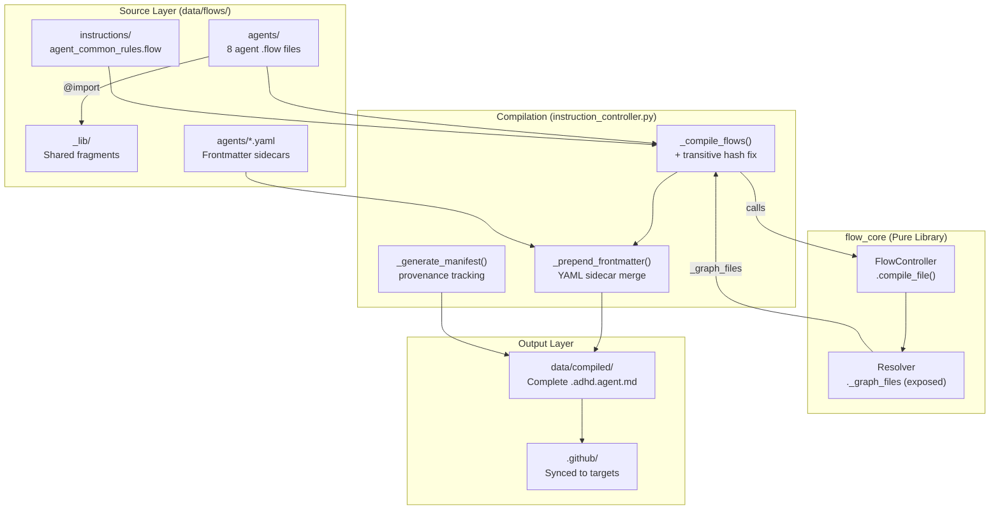
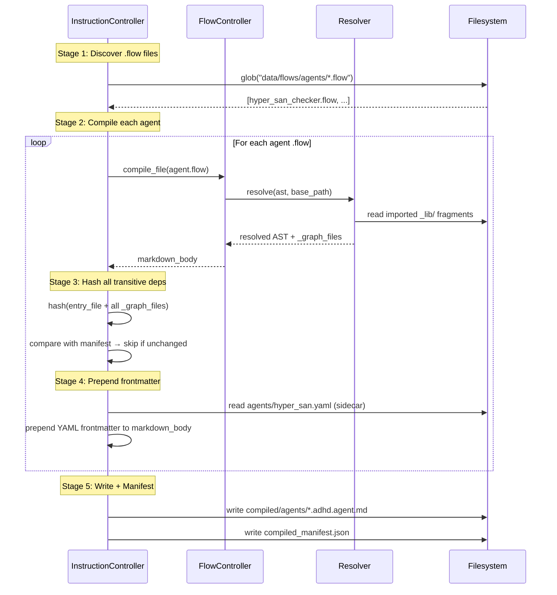

# 02 - Architecture

> Part of [Agent .flow Migration Blueprint](./00_index.md)

---

## 📖 The Story

### 😤 The Pain

```
Current Compilation Pipeline (Blueprint 08):
┌──────────────────────────────────────────────────────────────────────┐
│  data/flows/*.flow ──► _compile_flows() ──► data/compiled/*.md       │
│                                                                      │
│  💥 Hashes only the ENTRY file — misses imported _lib/ fragments     │
│  💥 No YAML frontmatter — agents need ---\nname: ...\ntools: []\n--- │
│  💥 No _lib/ fragments exist yet — nothing to compose from           │
│  💥 Only 1 proof-of-concept .flow file exists                        │
└──────────────────────────────────────────────────────────────────────┘
```

| Who Hurts | Pain Level | Frequency |
|-----------|------------|-----------|
| Compilation pipeline | 🔥🔥🔥 High | Every `_lib/` fragment change — stale output |
| Agent files | 🔥🔥🔥 High | Cannot compile without frontmatter |
| Migration effort | 🔥🔥 Medium | Blocked until infra is fixed |

### ✨ The Vision

```
After Architecture Changes:
┌──────────────────────────────────────────────────────────────────────┐
│  agents/hyper_san.flow ──@import──► _lib/patterns/*.flow             │
│         │                                                            │
│         ▼                                                            │
│  FlowController.compile_file()                                       │
│         │                                                            │
│         ▼                                                            │
│  resolver._graph_files ──► transitive hash ──► incremental check     │
│         │                                                            │
│         ▼                                                            │
│  compiled markdown (body only)                                       │
│         │                                                            │
│         ▼                                                            │
│  agents/hyper_san.yaml (sidecar) ──► prepend frontmatter             │
│         │                                                            │
│         ▼                                                            │
│  compiled/agents/hyper_san_checker.adhd.agent.md  (complete file)    │
└──────────────────────────────────────────────────────────────────────┘
```

### 🎯 One-Liner

> A fragment library, transitive-aware hashing, and sidecar YAML frontmatter turn the existing compilation pipeline into a full agent composition system.

---

## 🔧 The Spec

---

## 🏗️ System Overview

### High-Level Architecture



---

## 📊 Data Flow



### Stage Details

| Stage | Input | Transformation | Output | Owner |
|-------|-------|----------------|--------|-------|
| Discover | `data/flows/agents/*.flow` | glob + classify | List of agent `.flow` paths | `instruction_controller` |
| Compile | `.flow` file + `_lib/` imports | Tokenize→Parse→Resolve→Compile | Markdown body string | `flow_core` |
| Hash | Entry `.flow` + all `_graph_files` | SHA-256 of concatenated file contents | Transitive hash string | `instruction_controller` |
| Frontmatter | `.yaml` sidecar + markdown body | YAML dump + `---\n` wrapper + body | Complete agent `.md` | `instruction_controller` |
| Write | Complete markdown | Write to `compiled/agents/` | `.adhd.agent.md` file | `instruction_controller` |

---

## 🧩 Logical Components

### Fragment Library (`_lib/`)

| Attribute | Value |
|-----------|-------|
| **Purpose** | Single source of truth for all shared agent content |
| **Boundary** | Contains only reusable fragments; no standalone compilable files |
| **Implemented By** | `.flow` files in `data/flows/_lib/` |
| **Depends On** | Nothing (leaf dependency) |
| **Exposes** | Importable `.flow` fragments via `@import` |

### Transitive Hash System

| Attribute | Value |
|-----------|-------|
| **Purpose** | Detect changes in any file in the import closure for incremental compilation |
| **Boundary** | Hashing only; does not modify compilation or resolution logic |
| **Implemented By** | Enhanced `_compile_flows()` in `instruction_controller.py` |
| **Depends On** | `flow_core` Resolver's `_graph_files` (exposed via new public API) |
| **Exposes** | Transitive hash per compiled file, stored in manifest |

### YAML Frontmatter System

| Attribute | Value |
|-----------|-------|
| **Purpose** | Inject agent metadata (name, tools, handoffs) into compiled output |
| **Boundary** | Post-processing only; flow_core remains a pure Markdown emitter |
| **Implemented By** | New `_prepend_frontmatter()` in `instruction_controller.py` + sidecar `.yaml` files |
| **Depends On** | `pyyaml` (already a dependency) |
| **Exposes** | Complete `.adhd.agent.md` files with valid YAML frontmatter |

---

## 🔑 Key Design Principles

| # | Principle | Implication |
|---|-----------|-------------|
| 1 | **flow_core stays pure** | No YAML, no frontmatter, no agent-specific logic in flow_core. All post-processing in `instruction_controller`. |
| 2 | **Sidecar over embedded** | Agent metadata lives in `.yaml` sidecar files, not inside `.flow` sources. Keeps `.flow` files focused on content composition. |
| 3 | **Behavioral fidelity** | Compiled output must be byte-comparable to hand-written originals. Zero behavioral regression. |
| 4 | **Incremental by default** | Transitive hashing enables skip-unchanged semantics. Full recompile available via `force=True`. |
| 5 | **MCP injection compatibility** | Compiled output must produce YAML frontmatter matching the exact regex pattern `_apply_mcp_injection_to_agents()` expects. |

---

## 📁 Project Structure

```
data/flows/
├── _lib/                                (P0 — NEW)
│   ├── adhd/
│   │   └── framework_info.flow          # Project structure, philosophy
│   ├── patterns/
│   │   ├── core_philosophy.flow         # Truthfulness, Read Before Write
│   │   ├── stopping_rules_base.flow     # Common stopping rules
│   │   ├── critical_rules_base.flow     # Common critical rules
│   │   └── specialist_awareness.flow    # Agent team roster table
│   ├── provider/
│   │   └── chatagent_wrapper.flow       # modeInstructions XML wrapper + self-id
│   └── templates/
│       └── adhd_agent.flow              # Master agent skeleton (optional)
├── agents/                              (P1-P2 — NEW)
│   ├── hyper_san_checker.flow           (P1)
│   ├── hyper_san_checker.yaml           (P1 — frontmatter sidecar)
│   ├── hyper_red.flow                   (P2)
│   ├── hyper_red.yaml                   (P2)
│   └── ...                              (P2 — remaining 6 agents)
└── instructions/                        (P2 — NEW)
    └── agent_common_rules.flow          (P2)
```

---

## 🔌 Integration Points

### Internal APIs

| Connects To | Direction | Data | Protocol |
|-------------|-----------|------|----------|
| `flow_core` FlowController | → OUT | `.flow` file paths | `compile_file(Path) → str` |
| `flow_core` Resolver `_graph_files` | ← IN | Set of imported file paths | New public method (P0 fix) |
| `instruction_controller` `_compile_flows()` | ENHANCED | Transitive hash + frontmatter | Enhanced Python method |
| `instruction_controller` `_apply_mcp_injection_to_agents()` | → OUT | YAML frontmatter regex parse | Unchanged — output must match |
| `compiled_manifest.json` | → OUT | Manifest with transitive hash | JSON file |

### File Formats

| Format | Used For | Schema Location |
|--------|----------|-----------------|
| `.flow` | Agent source composition | flow_core language spec |
| `.yaml` (sidecar) | Agent YAML frontmatter | See [03 - P0 Infrastructure](./03_feature_p0_infrastructure.md) |
| `.adhd.agent.md` | Compiled agent output | Existing agent format spec |
| `compiled_manifest.json` | Compilation provenance | Blueprint 08, manifest v1.1 |

---

## 🚧 Module Boundaries

> Standard ADHD boundaries apply. List exceptions only.

| Exception | Justification |
|-----------|---------------|
| `instruction_controller` → `flow_core` Resolver internals | P0 requires exposing `_graph_files` through a public API on FlowController. Currently private to Resolver. |

---

## 💾 State Management

| State | Storage | Lifetime | Owner |
|-------|---------|----------|-------|
| Compiled agent files | `data/compiled/agents/` | Persistent (committed) | `instruction_controller` |
| Compilation manifest | `data/compiled/compiled_manifest.json` | Persistent (committed) | `instruction_controller` |
| Agent frontmatter | `data/flows/agents/*.yaml` | Persistent (committed) | Manual author / HyperAgentSmith |
| `_lib/` fragments | `data/flows/_lib/**/*.flow` | Persistent (committed) | Manual author / HyperAgentSmith |

---

## ⚠️ Error Philosophy

This system follows a **fail-fast** philosophy. If any `.flow` file fails compilation (syntax error, missing import, circular dependency), the entire compilation pipeline aborts with a clear error identifying the file and line. No partial compilation output is produced. This matches the existing behavior from Blueprint 08's `_compile_flows()` — flow errors are logged as warnings and the file is skipped, but the pipeline continues for other files.

**Frontmatter errors** (missing sidecar, malformed YAML) are warnings — the agent compiles without frontmatter, and `_apply_mcp_injection_to_agents()` will log a warning about the missing YAML header.

---

## ✅ Architecture Validation Checklist

### Diagram Completeness
- [x] **High-level diagram** shows all major components
- [x] **Data flow diagram** traces primary use case
- [x] Diagrams fit on one screen (no horizontal scroll)

### Component Definition
- [x] Each **Logical Component** has Purpose, Boundary, Implemented By
- [x] **Module Boundaries** exceptions are justified
- [x] **Key Design Principles** ≤5 and each has implementation implication

### Integration
- [x] **Internal APIs** documented with data direction
- [x] **File Formats** have schema location
- [x] **Error Philosophy** stated (fail-fast)

---

**Prev:** [Executive Summary](./01_executive_summary.md) | **Next:** [Feature: P0 Infrastructure](./03_feature_p0_infrastructure.md)

---

**← Back to:** [Index](./00_index.md)
