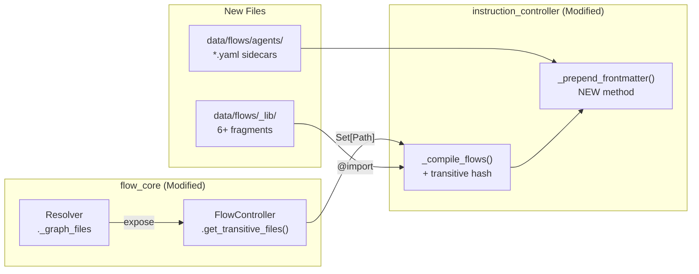
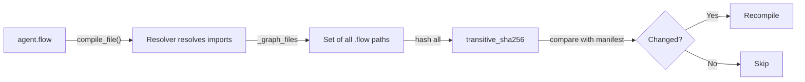
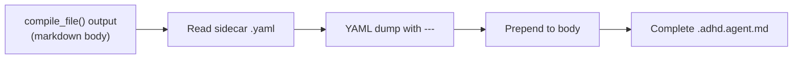

# 03 - Feature: P0 Infrastructure

> Part of [Agent .flow Migration Blueprint](./00_index.md)

---

## 📖 The Story

### 😤 The Pain

```
Three blockers prevent agent .flow migration:
┌──────────────────────────────────────────────────────────────────────┐
│                                                                      │
│  BLOCKER 1: Transitive Hash                                          │
│  ┌────────────────────────────────────────────────────────────┐      │
│  │ _compile_flows() hashes ONLY the entry .flow file          │      │
│  │ When _lib/fragment.flow changes → agents NOT recompiled    │      │
│  │ Result: STALE compiled output, silent bugs                 │      │
│  └────────────────────────────────────────────────────────────┘      │
│                                                                      │
│  BLOCKER 2: YAML Frontmatter                                         │
│  ┌────────────────────────────────────────────────────────────┐      │
│  │ Agents need: ---\nname: ...\ntools: [...]\n---             │      │
│  │ flow_core emits: plain Markdown only                       │      │
│  │ MCP injection regex REQUIRES valid YAML header             │      │
│  │ Result: compiled agents BREAK injection pipeline           │      │
│  └────────────────────────────────────────────────────────────┘      │
│                                                                      │
│  BLOCKER 3: No Shared Fragments Exist                                │
│  ┌────────────────────────────────────────────────────────────┐      │
│  │ _lib/ directory doesn't exist yet                          │      │
│  │ Shared content is only in hand-written agent files         │      │
│  │ Must be extracted before any agent can be migrated         │      │
│  └────────────────────────────────────────────────────────────┘      │
│                                                                      │
└──────────────────────────────────────────────────────────────────────┘
```

| Who Hurts | Pain Level | Frequency |
|-----------|------------|-----------|
| Migration pipeline | 🔥🔥🔥 High | Blocking — migration cannot start |
| Incremental compilation | 🔥🔥🔥 High | Every `_lib/` change silently skipped |
| Agent compilation | 🔥🔥🔥 High | Every compile — no frontmatter = broken agents |

### ✨ The Vision

```
After P0 Infrastructure:
┌──────────────────────────────────────────────────────────────────────┐
│  ✅ Transitive hash: hash(entry + all _graph_files) per agent        │
│  ✅ YAML frontmatter: sidecar .yaml → prepended post-compilation     │
│  ✅ _lib/ ready: 6+ shared fragments extracted and importable        │
│                                                                      │
│  Ready for P1: first agent migration                                 │
└──────────────────────────────────────────────────────────────────────┘
```

### 🎯 One-Liner

> Fix the two compilation blockers (transitive hashing, YAML frontmatter) and bootstrap the shared fragment library so agent migration can begin.

### 📊 Impact

| Metric | Before | After |
|--------|--------|-------|
| `_lib/` fragment change detection | ❌ Silently skipped | ✅ Triggers recompilation |
| Agent YAML frontmatter | ❌ Missing from compiled output | ✅ Prepended from sidecar `.yaml` |
| Shared fragments available | ❌ 0 fragments | ✅ 6+ fragments in `_lib/` |
| MCP injection compatibility | ❌ Broken (no YAML header) | ✅ Works (valid YAML header) |

---

## 🔧 The Spec

---

## 🎯 Overview

P0 consolidates three infrastructure fixes required before any agent `.flow` migration can begin. All three are `[KNOWN]` difficulty — standard Python patterns with proven libraries.

**Priority:** P0  
**Difficulty:** `[KNOWN]`

---

## 📚 Prior Art

### Existing Solutions

| Solution | Type | Relevance | Status |
|----------|------|-----------|--------|
| flow_core `Resolver._graph_files` | Internal state | High — tracks all imported files already | 🔧 Adapt (expose publicly) |
| Blueprint 08 `_compile_flows()` | Internal method | High — existing compilation loop | 🔧 Adapt (add transitive hash) |
| Blueprint 08 `source_sha256` | Manifest field | High — per-file source hash | 🔧 Adapt (extend to transitive) |
| `pyyaml` (already a dependency) | Library | High — YAML parsing/dumping | ✅ Adopt |
| Ansible frontmatter injection | External pattern | Medium — similar sidecar concept | ❌ Not applicable (different domain) |

### Build-vs-Adopt Justification

| Rejected Solution | Reason for Building Custom |
|-------------------|---------------------------|
| Embedding frontmatter in `.flow` | flow_core is a pure Markdown emitter. Adding YAML awareness violates its design boundary. Sidecar is simpler. |
| Hash-all-files approach | Too coarse — hashing every file in `flows/` would trigger unnecessary recompilation. Transitive graph is precise. |

---

## 🗺️ System Context



---

## 📊 Data Flow

### Transitive Hash Flow



### Frontmatter Flow



| Stage | Format | Example |
|-------|--------|---------|
| Input (body) | Markdown string | `You are **HyperSan**...` |
| Input (sidecar) | YAML file | `name: hyper_san_checker\ntools: [grep_search]` |
| Output | Frontmatter + Markdown | `---\nname: hyper_san_checker\n---\nYou are **HyperSan**...` |

---

## [Custom] 🔧 Blocker 1: Transitive Hash Fix

### Problem

`_compile_flows()` in `instruction_controller.py` computes `source_sha256` hashing only the entry `.flow` file:

```python
source_hash = hashlib.sha256(flow_file.read_bytes()).hexdigest()
entry = existing_manifest.get("entries", {}).get(compiled_name, {})
if entry.get("source_sha256") == source_hash:
    # Skips recompilation — but _lib/ fragments could have changed!
```

### Solution

1. **Expose `_graph_files`** from `Resolver` through `FlowController`:
   - Add `FlowController.compile_file_with_deps(path) → (str, Set[Path])` OR
   - Add `FlowController.get_last_resolved_files() → Set[Path]` accessor
   - Design choice: accessor is simpler, compile_file_with_deps is more explicit. Recommend the accessor pattern — it keeps `compile_file()` signature unchanged.

2. **Hash the full closure** in `_compile_flows()`:
   ```
   transitive_hash = sha256(entry_file_bytes + sorted(dep_file_bytes))
   ```

3. **Store `transitive_sha256`** in manifest entries (alongside existing `source_sha256`).

### Scope

| What Changes | Where | Difficulty |
|--------------|-------|------------|
| New public accessor on FlowController | `flow_core/flow_controller.py` | `[KNOWN]` |
| Wire `_graph_files` through resolve→controller | `flow_core/flow_controller.py` | `[KNOWN]` |
| Update hash computation in `_compile_flows()` | `instruction_controller.py` | `[KNOWN]` |
| Add `transitive_sha256` to manifest | `instruction_controller.py` | `[KNOWN]` |

---

## [Custom] 🔧 Blocker 2: YAML Frontmatter Post-Processing

### Problem

Every agent file needs YAML frontmatter:

```yaml
---
name: hyper_san_checker
description: "Sanity checker agent"
argument-hint: "task description"
tools: [grep_search, read_file, semantic_search, ...]
handoffs:
  - label: "Escalate to Architect"
    agent: hyper_architect
    prompt: "Review this finding"
    send: auto
---
```

flow_core emits plain Markdown. `_apply_mcp_injection_to_agents()` uses regex `r"^---\n(.*?)\n---"` to find and modify the YAML header. Without it, injection silently skips the file.

### Solution: Sidecar `.yaml` Files

> **✅ Ratified by Decision 1** (2026-02-09): Multi-agent discussion unanimously confirmed the sidecar approach. The alternative `+./file.yaml | @node = $_ |.` raw-text import syntax was REJECTED — flow_core stays pure, no grammar changes for non-`.flow` imports. Re-evaluate only if a second non-flow format demands inclusion. See [05 - Scope Decisions](./05_feature_scope_decisions.md#custom--architectural-scope-decisions) and [discussion record](../../discussion/2026-02-09_flow_migration_scope_decisions_discussion_record.md).

Each agent gets a companion `.yaml` file in `data/flows/agents/`:

```
data/flows/agents/
├── hyper_san_checker.flow    # Content composition
├── hyper_san_checker.yaml    # Frontmatter metadata
├── hyper_architect.flow
├── hyper_architect.yaml
└── ...
```

**New method** `_prepend_frontmatter()` in `instruction_controller.py`:
1. After `compile_file()` returns markdown body
2. Look for `{stem}.yaml` sidecar in same directory as `.flow` file
3. If found: read YAML, dump with `---\n...\n---\n` wrapper, prepend to body
4. If not found: log warning, output body without frontmatter

**MCP injection compatibility**: The sidecar YAML must produce output matching the inline `tools: [...]` format that `_apply_mcp_injection_to_agents()` regex expects. The sidecar stores tools as a YAML list; `yaml.dump(default_flow_style=None)` produces the correct `tools: [tool1, tool2]` format for short lists.

### Sidecar Schema

```yaml
# Required fields
name: hyper_san_checker
description: "Brief description"

# Optional fields
argument-hint: "task description"
tools: [grep_search, read_file, semantic_search]
handoffs:
  - label: "Escalate to Architect"
    agent: hyper_architect
    prompt: "Review this finding"
    send: auto
```

### Scope

| What Changes | Where | Difficulty |
|--------------|-------|------------|
| New `_prepend_frontmatter()` method | `instruction_controller.py` | `[KNOWN]` |
| Call `_prepend_frontmatter()` after compilation | `_compile_flows()` | `[KNOWN]` |
| Create 8 sidecar `.yaml` files | `data/flows/agents/` | `[KNOWN]` |
| Verify MCP injection still works | Testing | `[KNOWN]` |

---

## [Custom] 🔧 Blocker 3: `_lib/` Fragment Library Bootstrap

### Shared Content Inventory

Extracted from multi-agent discussion analysis:

| Fragment | Where Found | Lines | Target `.flow` |
|----------|-------------|-------|-----------------|
| Agent file edit restriction | 7 of 8 agents | ~7 | `_lib/patterns/stopping_rules_base.flow` |
| No-edit user override | 4 agents | ~4 | `_lib/patterns/stopping_rules_base.flow` |
| Stopping rules persistence meta-rule | all 8 agents | ~8 | `_lib/patterns/stopping_rules_base.flow` |
| Truthfulness principle | all 8 agents | ~8 | `_lib/patterns/core_philosophy.flow` |
| Self-identification step 0 | all 8 agents | ~16 | `_lib/provider/chatagent_wrapper.flow` |
| ADHD framework_information | all 8 agents | ~16 | `_lib/adhd/framework_info.flow` |
| modeInstructions wrapper | all 8 agents | ~16 | `_lib/provider/chatagent_wrapper.flow` |
| Anti-hallucination rules | 3 files | ~30 | `_lib/patterns/critical_rules_base.flow` |
| Agent specialist table | all 8 agents | ~24 | `_lib/patterns/specialist_awareness.flow` |

### Proposed `_lib/` Structure

```
data/flows/_lib/
├── adhd/
│   └── framework_info.flow          # ADHD project structure + philosophy
├── patterns/
│   ├── core_philosophy.flow         # Truthfulness, Read Before Write
│   ├── stopping_rules_base.flow     # Edit restrictions, no-edit, persistence
│   ├── critical_rules_base.flow     # Anti-hallucination, verification rules
│   └── specialist_awareness.flow    # 8-agent roster table
├── provider/
│   └── chatagent_wrapper.flow       # modeInstructions XML + self-id step
└── templates/
    └── adhd_agent.flow              # (Optional) Master skeleton composing all
```

### Extraction Process

1. Take `hyper_san_checker.adhd.agent.md` as reference (smallest agent)
2. Identify each shared block by diffing against other agents
3. Extract to `_lib/` `.flow` files with `@node` definitions
4. Verify each fragment compiles independently with `FlowController.compile_source()`

### Scope

| What Changes | Where | Difficulty |
|--------------|-------|------------|
| Create `_lib/adhd/framework_info.flow` | `data/flows/_lib/` | `[KNOWN]` |
| Create `_lib/patterns/core_philosophy.flow` | `data/flows/_lib/` | `[KNOWN]` |
| Create `_lib/patterns/stopping_rules_base.flow` | `data/flows/_lib/` | `[KNOWN]` |
| Create `_lib/patterns/critical_rules_base.flow` | `data/flows/_lib/` | `[KNOWN]` |
| Create `_lib/patterns/specialist_awareness.flow` | `data/flows/_lib/` | `[KNOWN]` |
| Create `_lib/provider/chatagent_wrapper.flow` | `data/flows/_lib/` | `[KNOWN]` |

---

## 🔗 Integration Points

| Connects To | Direction | Data | Protocol |
|-------------|-----------|------|----------|
| `flow_core` Resolver | ← IN | `_graph_files: Set[Path]` | New public accessor |
| `flow_core` FlowController | ↔ BOTH | `.flow` paths + compiled markdown | `compile_file()` + new accessor |
| `instruction_controller._compile_flows()` | ENHANCED | Transitive hash, frontmatter merge | Modified Python method |
| `_apply_mcp_injection_to_agents()` | → OUT | YAML frontmatter format must match | Regex: `r"^---\n(.*?)\n---"` |
| `compiled_manifest.json` | → OUT | `transitive_sha256` field added | JSON v1.1+ |

---

## ✅ Acceptance Criteria

- [ ] Modifying a `_lib/` fragment and recompiling triggers recompilation of agents importing it
- [ ] `compiled_manifest.json` entries contain `transitive_sha256` alongside `source_sha256`
- [ ] Compiled agent files start with valid `---\n...\n---` YAML frontmatter
- [ ] `_apply_mcp_injection_to_agents()` successfully injects tools into compiled agent files
- [ ] All 6+ `_lib/` fragments compile independently via `FlowController.compile_source()`
- [ ] `_lib/` fragments are importable from agent `.flow` files via `@import "../_lib/..."`

---

## 🛠️ Technical Notes

### Constraints

- `flow_core` Resolver uses `_graph_files` as a `Set[Path]` (mutable, shared with child resolvers for transitive imports). Exposing this requires either a post-resolve accessor or a return value extension.
- YAML frontmatter must use inline flow style for `tools:` list to match MCP injection regex: `tools: [tool1, tool2]` not block style.
- `_lib/` fragments must not contain `@out` nodes — they're included via `@import`, not compiled standalone.

### Considerations

- The `_lib/templates/adhd_agent.flow` master skeleton is optional for P0. If all agents compose fragments directly, the skeleton can be deferred to P2.
- `yaml.dump()` with `default_flow_style=None` auto-selects inline for simple lists and block for complex structures. This matches the existing hand-written format.

---

## ⚠️ Edge Cases

| Scenario | Expected Behavior |
|----------|-------------------|
| Sidecar `.yaml` missing for an agent | Log warning, compile body without frontmatter. MCP injection will skip this agent. |
| Sidecar `.yaml` has invalid YAML | Log error, skip frontmatter. Body still compiled. |
| `_lib/` fragment has syntax error | `FlowError` raised. Agent compilation aborts for that agent. Other agents unaffected. |
| `_graph_files` is empty (no imports) | Transitive hash = entry file hash only. Equivalent to current behavior. Backward compatible. |
| Agent `.flow` imports from outside `_lib/` | Works — flow_core resolves any relative path. But convention is `_lib/` only. |

---

## ❌ Out of Scope

- Changing flow_core's language syntax or tokenizer
- Adding frontmatter support to flow_core itself
- Creating agent `.flow` source files (that's P1, feature 04)
- Modifying `_apply_mcp_injection_to_agents()` regex (output must match existing format)
- Creating the `_lib/templates/adhd_agent.flow` master skeleton (optional, deferred)

---

## 🔗 Dependencies

| Dependency | Status | Notes |
|------------|--------|-------|
| Blueprint 08 P0-P2 | ✅ Done | Compilation pipeline exists and works |
| flow_core `Resolver._graph_files` | ✅ Exists (private) | Needs public exposure |
| `pyyaml` | ✅ Already a dependency | Used for sidecar YAML parsing |
| `instruction_controller._compile_flows()` | ✅ Exists | Needs transitive hash enhancement |

---

## ❓ Open Questions

- Should `FlowController` expose `_graph_files` via a method return or a property? Method is more Pythonic for computed state.
- Should the transitive hash include the sidecar `.yaml` hash too? Probably yes — frontmatter changes should trigger "recompilation" in the manifest sense.

---

## ✅ Feature Validation Checklist

### Narrative Completeness
- [x] **The Story** section clearly states user problem and value
- [x] **Intent** is unambiguous to a non-technical reader
- [x] **Scope** is explicitly bounded (Out of Scope section filled)

### Technical Completeness
- [x] **Integration Points** table has all connections documented
- [x] **Edge Cases** table covers failure scenarios
- [x] **Dependencies** are listed with status
- [x] **Acceptance Criteria** are testable (not vague)

### Linkage
- [x] Feature linked from [00_index.md](./00_index.md) and [01_executive_summary.md](./01_executive_summary.md)

---

**Prev:** [Architecture](./02_architecture.md) | **Next:** [Feature: Agent Migration](./04_feature_agent_migration.md)

---

**← Back to:** [Index](./00_index.md)
