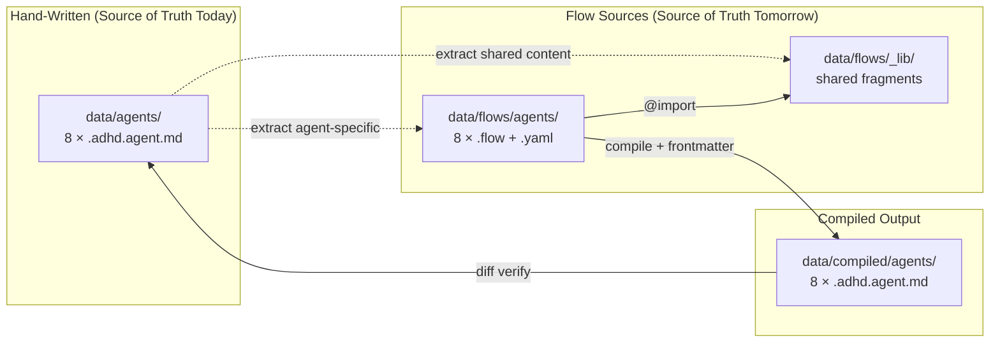
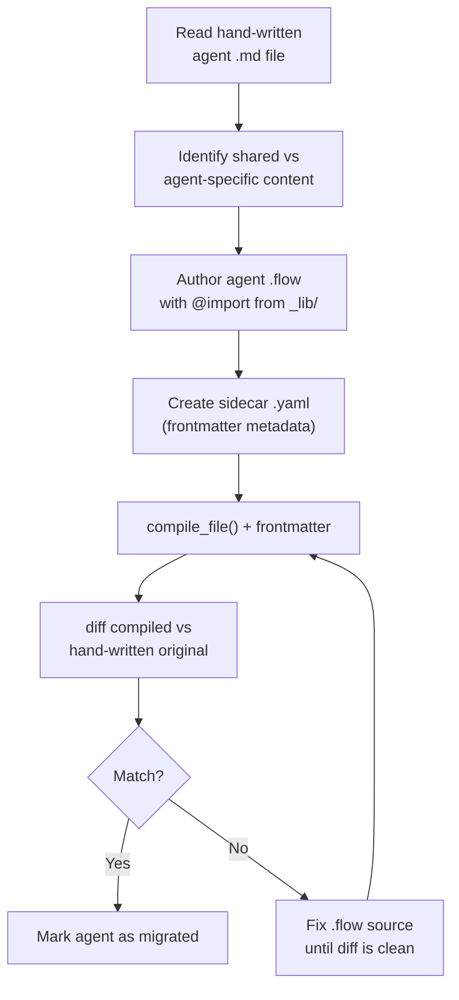

# 04 - Feature: Agent Migration

> Part of [Agent .flow Migration Blueprint](./00_index.md)

---

## 📖 The Story

### 😤 The Pain

```
Current State: 8 hand-written agents, zero .flow sources
┌──────────────────────────────────────────────────────────────────────┐
│                                                                      │
│  data/agents/                      data/flows/                       │
│  ├── hyper_san_checker.adhd.agent.md    └── (empty — no agents)     │
│  ├── hyper_architect.adhd.agent.md                                   │
│  ├── hyper_orchestrator.adhd.agent.md   💥 Shared content is         │
│  ├── hyper_red.adhd.agent.md               copy-pasted in each      │
│  ├── hyper_iq_guard.adhd.agent.md                                    │
│  ├── hyper_day_dreamer.adhd.agent.md    💥 Updates require editing   │
│  ├── hyper_agent_smith.adhd.agent.md       8 files manually          │
│  └── hyper_expedition.adhd.agent.md                                  │
│                                                                      │
└──────────────────────────────────────────────────────────────────────┘
```

| Who Hurts | Pain Level | Frequency |
|-----------|------------|-----------|
| HyperAgentSmith (agent editor) | 🔥🔥🔥 High | Every shared content change |
| All agents (drift risk) | 🔥🔥 Medium | Ongoing risk, compounds over time |

### ✨ The Vision

```
After Migration:
┌──────────────────────────────────────────────────────────────────────┐
│                                                                      │
│  data/flows/agents/                data/compiled/agents/              │
│  ├── hyper_san_checker.flow   ──►  ├── hyper_san_checker.adhd.agent.md
│  ├── hyper_san_checker.yaml        │   (compiled, with frontmatter)  │
│  ├── hyper_architect.flow     ──►  ├── hyper_architect.adhd.agent.md │
│  ├── hyper_architect.yaml          │                                 │
│  ├── ...                      ──►  └── ...                           │
│  │                                                                   │
│  │   All @import from _lib/        data/agents/ (hand-written)       │
│  │   ├── core_philosophy           ├── (removed or empty)            │
│  │   ├── stopping_rules            └── superseded by compiled/       │
│  │   ├── specialist_awareness                                        │
│  │   └── framework_info                                              │
│                                                                      │
│  ✅ Edit _lib/ fragment → recompile → all agents updated              │
│  ✅ diff compiled vs hand-written → verify behavioral fidelity        │
└──────────────────────────────────────────────────────────────────────┘
```

### 🎯 One-Liner

> Migrate all 8 agents one-by-one from hand-written markdown to composable `.flow` sources, validating each via diff against the original.

### 📊 Impact

| Metric | Before | After |
|--------|--------|-------|
| Shared content sources | ❌ 8 copies | ✅ 1 source in `_lib/` |
| Update propagation | ❌ Manual 8-file edit | ✅ Edit 1 fragment, recompile |
| Consistency guarantee | ❌ Hope-based | ✅ Compilation-guaranteed |
| Agent count from `.flow` | ❌ 0 / 8 | ✅ 8 / 8 |

---

## 🔧 The Spec

---

## 🎯 Overview

This feature covers the actual migration of agent files from hand-written markdown to `.flow` source files. P1 migrates the first agent (hyper_san_checker) as a proof-of-concept. P2 migrates the remaining 7 agents plus `agent_common_rules.instructions.md`.

**Priority:** P1 (first agent), P2 (remaining fleet)  
**Difficulty:** `[KNOWN]` — all patterns proven in flow_core tests and playground

---

## 📚 Prior Art

### Existing Solutions

| Solution | Type | Relevance | Status |
|----------|------|-----------|--------|
| Blueprint 08 Feature 05 migration order | Internal plan | High — defined ordering | ✅ Adopt |
| flow_core playground v4 prototype | Internal prototype | Medium — aspirational `_lib/` | 🔧 Adapt |
| Blueprint 08 per-agent migration steps | Internal plan | High — defined process | ✅ Adopt |

### Build-vs-Adopt Justification

| Rejected Solution | Reason |
|-------------------|--------|
| Automated migration tool | 8 files, done once. Manual extraction is more accurate and less risky than parsing agent markdown structure. |

---

## 🗺️ System Context



---

## 📊 Data Flow

### Per-Agent Migration Flow



| Stage | Format | Example |
|-------|--------|---------|
| Input | Hand-written `.adhd.agent.md` | 120 lines of mixed shared + specific content |
| Intermediate | `.flow` source + `.yaml` sidecar | `.flow` with `@import` from `_lib/` + YAML metadata |
| Output | Compiled `.adhd.agent.md` | Byte-comparable to hand-written original |

---

## [Custom] 📋 Migration Order

Agents ordered smallest → largest to build experience incrementally:

| # | Agent | Lines | Phase | Rationale |
|---|-------|-------|-------|-----------|
| 1 | `hyper_san_checker` | 120 | P1 | Smallest, focused scope, proof-of-concept |
| 2 | `hyper_expedition` | 88 | P2 | Small, focused |
| 3 | `hyper_agent_smith` | 96 | P2 | Small, focused |
| 4 | `hyper_iq_guard` | 103 | P2 | Small, focused |
| 5 | `hyper_day_dreamer` | 117 | P2 | Medium complexity |
| 6 | `hyper_architect` | 129 | P2 | Large, complex |
| 7 | `hyper_red` | 149 | P2 | Large, focused |
| 8 | `hyper_orchestrator` | 150 | P2 | Largest — 5 mode presets make it the most complex |

### `agent_common_rules.instructions.md` (P2)

This instruction file is tightly coupled to agents — it defines the canonical rules that agents import. Migrating it to `.flow` means `_lib/patterns/` fragments become the source of truth for both the instruction file AND the agent imports. One source, two outputs.

### Orch-Skills Evaluation (P2)

During P2, evaluate whether the 5 orchestrator skill instruction files (`orch-discussion`, `orch-implementation`, `orch-testing`, `orch-routing`, `orch-expedition`) should be migrated to `.flow`. Decision criteria:
- Do they share content between each other? → YES = migrate
- Do they share content with agents? → YES = migrate  
- Are they purely standalone prose? → YES = stay static

---

## [Custom] 🔧 Per-Agent Migration Steps

For each agent, the migration follows these exact steps:

### Step 1: Content Analysis

1. Open `data/agents/{name}.adhd.agent.md`
2. Extract YAML frontmatter → `data/flows/agents/{name}.yaml` (sidecar)
3. Identify shared blocks (match against `_lib/` fragments)
4. Isolate agent-specific content

### Step 2: Author `.flow` Source

1. Create `data/flows/agents/{name}.flow`
2. Add `@import` directives for each shared fragment:
   ```
   @import "../_lib/patterns/core_philosophy.flow".
   @import "../_lib/patterns/stopping_rules_base.flow".
   @import "../_lib/adhd/framework_info.flow".
   @import "../_lib/provider/chatagent_wrapper.flow".
   ```
3. Define agent-specific nodes with `@node_name |<<<content>>>|.`
4. Compose `@out` node referencing all components in correct order

### Step 3: Compile and Diff

1. Run `FlowController.compile_file(agent.flow)` → markdown body
2. Prepend frontmatter from sidecar `.yaml`
3. `diff` compiled output vs hand-written original
4. Fix discrepancies until diff is clean (whitespace normalization allowed)

### Step 4: Validate

1. Copy compiled file to `.github/agents/` via `adhd refresh --full`
2. Verify VS Code loads the agent correctly
3. Verify `_apply_mcp_injection_to_agents()` works on the compiled file
4. Spot-check agent behavior in chat

### Step 5: Finalize

1. Remove hand-written file from `data/agents/` (compiled version supersedes)
2. Update `compiled_manifest.json` entry
3. Commit both source (`.flow` + `.yaml`) and compiled output

---

## 🔗 Integration Points

| Connects To | Direction | Data | Protocol |
|-------------|-----------|------|----------|
| `data/agents/*.adhd.agent.md` | ← IN | Hand-written originals (read for diff) | Filesystem |
| `data/flows/_lib/**/*.flow` | ← IN | Shared fragments (imported by agents) | `@import` |
| `flow_core` FlowController | → OUT | `.flow` paths → compiled markdown | `compile_file()` |
| `data/flows/agents/*.yaml` | ← IN | Frontmatter sidecars | YAML read |
| `data/compiled/agents/` | → OUT | Complete agent `.adhd.agent.md` | Filesystem write |
| `.github/agents/` | → OUT | Synced via `_sync_data_to_target()` | Existing sync |
| `_apply_mcp_injection_to_agents()` | → OUT | YAML frontmatter must match regex | Existing regex |

---

## 👥 User Stories

| As a... | I want to... | So that... |
|---------|--------------|------------|
| Agent author | Compose agents from shared fragments | I update shared content in one place |
| Framework maintainer | See `diff` of compiled output | I can verify migration fidelity |
| PR reviewer | Check `.flow` source + compiled diff | I can review agent changes efficiently |

---

## ✅ Acceptance Criteria

### P1 (First Agent)

- [ ] `hyper_san_checker.flow` exists in `data/flows/agents/`
- [ ] `hyper_san_checker.yaml` sidecar exists with valid frontmatter
- [ ] `adhd refresh --full` compiles `hyper_san_checker.flow` to `compiled/agents/hyper_san_checker.adhd.agent.md`
- [ ] Compiled output diff vs hand-written original shows zero functional differences (whitespace normalization allowed)
- [ ] `_apply_mcp_injection_to_agents()` works on the compiled file
- [ ] Hand-written `data/agents/hyper_san_checker.adhd.agent.md` can be removed (compiled supersedes)

### P2 (Full Fleet)

- [ ] All 8 agents have `.flow` + `.yaml` sources in `data/flows/agents/`
- [ ] All 8 agents compile successfully via `adhd refresh --full`
- [ ] All compiled outputs match hand-written originals (functional equivalence)
- [ ] `agent_common_rules.flow` exists in `data/flows/instructions/`
- [ ] `data/agents/` directory is empty or removed (all superseded by `compiled/agents/`)
- [ ] Orch-skills migration decision documented (YES/NO/CONDITIONAL per skill)

---

## 🛠️ Technical Notes

### Constraints

- Agent `.flow` files import from `_lib/` using relative paths: `@import "../_lib/patterns/core_philosophy.flow".`
- The `.yaml` sidecar filename must exactly match the `.flow` filename stem (e.g., `hyper_san_checker.flow` → `hyper_san_checker.yaml`)
- Compiled output must use the `.adhd.agent.md` extension to be recognized by sync and MCP injection
- Agent migration order is a recommendation, not a hard requirement. The only constraint is hyper_san_checker first (proof-of-concept)

### Considerations

- `hyper_orchestrator` has 5 mode presets, making it the most complex agent. It should be migrated last to benefit from experience with simpler agents.
- Some agents may have slight whitespace differences after compilation. A normalization pass (strip trailing whitespace, normalize blank lines) should be applied before diffing.
- The `agent_common_rules.instructions.md` migration is a dependency-inversion: today agents copy-paste from this file; tomorrow both the instruction file AND agents import from the same `_lib/` fragments.

---

## ⚠️ Edge Cases

| Scenario | Expected Behavior |
|----------|-------------------|
| Agent has unique content not in any `_lib/` fragment | Content stays inline in the agent's `.flow` file as agent-specific nodes |
| Compiled output has minor whitespace diff vs original | Acceptable after normalization. Document specific differences. |
| Agent uses a fragment that other agents don't | Fragment still lives in `_lib/` for potential reuse. Not a problem. |
| `hyper_orchestrator` mode presets | Each preset becomes a separate `@node` in the `.flow` file. The `@out` composes based on mode. |
| Hand-written `data/agents/` file conflicts with compiled | Compiled takes priority via merge priority from Blueprint 08. Hand-written file deleted after migration. |

---

## ❌ Out of Scope

- Changing agent behavior or content during migration (behavioral fidelity required)
- Creating new agents or removing existing agents
- Modifying flow_core language for agent-specific features
- Migrating non-agent files (instructions, prompts, skills) — see [05 - Scope Decisions](./05_feature_scope_decisions.md)

---

## 🔗 Dependencies

| Dependency | Status | Notes |
|------------|--------|-------|
| [03 - P0 Infrastructure](./03_feature_p0_infrastructure.md) | Pending | Transitive hash, frontmatter, `_lib/` must be done first |
| `_lib/` fragments | Pending (P0) | Shared content must exist before agents can import it |
| flow_core `@import` | ✅ Done | Stable language feature |
| Blueprint 08 merge priority | ✅ Done | Compiled > static in sync |

---

## ❓ Open Questions

- Should migrated agent `.flow` files have comments documenting which sections map to `_lib/` imports? (Improves readability, adds maintenance)
- For `hyper_orchestrator`'s 5 mode presets: one `.flow` file with 5 preset nodes, or 5 separate files? (One file is simpler; 5 files allow independent compilation)

---

## ✅ Feature Validation Checklist

### Narrative Completeness
- [x] **The Story** section clearly states user problem and value
- [x] **Intent** is unambiguous to a non-technical reader
- [x] **Scope** is explicitly bounded (Out of Scope section filled)

### Technical Completeness
- [x] **Integration Points** table has all connections documented
- [x] **Edge Cases** table covers failure scenarios
- [x] **Dependencies** are listed with status
- [x] **Acceptance Criteria** are testable (not vague)

### Linkage
- [x] Feature linked from [00_index.md](./00_index.md) and [01_executive_summary.md](./01_executive_summary.md)

---

**Prev:** [Feature: P0 Infrastructure](./03_feature_p0_infrastructure.md) | **Next:** [Feature: Scope Decisions](./05_feature_scope_decisions.md)

---

**← Back to:** [Index](./00_index.md)
