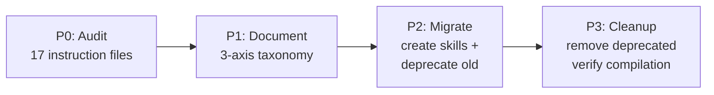

# 01 — Summary

> Part of [PP02 — Context Injection Files Restructuring](./_overview.md)

---

## 📖 The Story

### 😤 The Pain

```
Current Reality:
┌──────────────────────────────────────────────────────────────┐
│  "Is this an instruction, a skill, or agent personality?"    │
│                                                              │
│  module_development.instructions.md  ──►  Only Arch uses it │
│  hyper_san_output.instructions.md    ──►  Only San uses it  │
│  But both are broadcast to ALL agents via applyTo globs     │
│                                                              │
│  Result: Agents get context they don't need.                 │
│          Authors don't know where to put new specs.          │
│          No clear taxonomy for context injection files.      │
└──────────────────────────────────────────────────────────────┘
```

| Who Hurts | Pain Level | Frequency |
|-----------|------------|-----------|
| Agent authors (HyperSmith) | 🔥🔥🔥 High | Every new file |
| All agents (context noise) | 🔥🔥 Medium | Every invocation |
| Framework contributors | 🔥🔥 Medium | When adding specs |

### ✨ The Vision

```
After This Procedure:
┌──────────────────────────────────────────────────────────────┐
│  3-Axis Taxonomy — every file has exactly one home:          │
│                                                              │
│  AGENT  = perspective (personality, tone, stopping rules)    │
│  INSTRUCTION = universal truth (framework specs, formats)    │
│  SKILL  = procedure (SOP consumed by specific workflows)    │
│                                                              │
│  Decision Rule:                                              │
│  Instruction → Skill IFF exclusively one agent's workflow.   │
│  Multi-agent applyTo → stays instruction.                    │
└──────────────────────────────────────────────────────────────┘
```

### 🎯 One-Liner

> Classify all context injection files under a 3-axis taxonomy (agent/instruction/skill), migrate single-agent instructions to skills, and eliminate context noise — with zero agent coverage loss.

### 📊 Impact

| Metric | Before | After |
|--------|--------|-------|
| Taxonomy clarity | ❌ No formal rule for file placement | ✅ 3-axis decision rule documented |
| Context noise | ❌ Single-agent specs broadcast to all | ✅ Skills scoped to consuming agent |
| Author guidance | ❌ "Where does this go?" | ✅ Decision tree: instruction vs skill |
| Deprecated files | ❌ N/A | ✅ 0 (all cleaned up in P3) |

---

## 🔧 The Spec

---

## 🌟 TL;DR

Audit all 17 instruction files, classify each as "stays instruction" or "migrates to skill" using a single-consumer decision rule, execute the migration with `deprecated` YAML markers for safe transition, then verify `adhd r -f` compiles cleanly with no coverage gaps.

---

## 🎯 Procedure Scope

**Trigger:** Consensus from 4-agent discussion that context injection files lack a clear taxonomy, causing misplacement and context noise.
**End State:** Every `.instructions.md` file either (a) remains as a multi-agent instruction or (b) has been migrated to a skill folder with the old file removed. The 3-axis taxonomy is documented as a framework instruction.

---

## 🔍 Prior Art & Existing Solutions

| Approach | What It Does | Decision | Rationale |
|----------|--------------|----------|-----------|
| Current flat instructions | All specs as `.instructions.md` with `applyTo` globs | ADAPT | Keep multi-agent instructions; migrate single-agent ones |
| Skills system (existing) | `SKILL.md` + subfolder structure | ADOPT | Already supports procedures with subfolders |
| Agent-embedded instructions | Inline specs in `.agent.md` flows | REJECT | Violates separation of concerns; bloats agent files |

---

## ❌ Non-Goals

| Non-Goal | Rationale |
|----------|-----------|
| Rewriting agent personality/identity | Agents are out of scope; only instruction→skill migration |
| Changing the Flow DSL or compiler | Infrastructure is stable; we only update skill references |
| Migrating module-local instructions | Module-local files stay in their module dirs per consensus |
| Automating the decision rule in CI | Future work; this plan is the manual restructuring |
| Changing `adhd r -f` behavior | Only adding `deprecated: true` exclusion logic if needed |

---

## 🏗️ Approach & Architecture

### High-Level Flow



### Components Affected

| Component | Change Type | Description |
|-----------|-------------|-------------|
| `.github/instructions/*.instructions.md` | Modify / Remove | Files classified as single-agent migrate out |
| `.github/skills/{new}/SKILL.md` | Create | New skill folders for migrated content |
| `instruction_core/data/instructions/` | Modify / Remove | Source-of-truth files for migrated instructions |
| `instruction_core/data/flows/` | Modify | Agent flow files updated to reference new skills |
| `.github/instructions/adhd_framework_context.instructions.md` | Modify | Add 3-axis taxonomy documentation |

### Key Design Decisions

| # | Decision | Rationale |
|---|----------|-----------|
| 1 | Audit-first (P0 before any migration) | Cannot classify without knowing actual consumers |
| 2 | `deprecated: true` YAML marker for transition | Safe rollback; `adhd r -f` skips deprecated files |
| 3 | No dual-visibility period | Deprecated files are excluded at compile time — no ambiguity |
| 4 | Skills can have subfolders (`scripts/`, `references/`) | Complex procedures need supporting files |

---

## ✅ Features / Steps Overview

| Priority | Step | Difficulty | Description |
|----------|------|------------|-------------|
| P0 | Usage Audit | `[KNOWN]` | Map every instruction's applyTo to actual agent consumers |
| P1 | Taxonomy Documentation | `[KNOWN]` | Document 3-axis taxonomy + decision rule as instruction |
| P2 | Migration Execution | `[KNOWN]` | Create skill folders, move content, add deprecated markers |
| P3 | Deprecation Cleanup | `[KNOWN]` | Remove deprecated files, verify `adhd r -f`, check coverage |

---

## 📊 Success Metrics

| Metric | Target | How to Measure |
|--------|--------|----------------|
| Classification coverage | 17/17 instructions audited | Audit matrix completeness |
| Zero broken agents | 0 agents missing context post-migration | `adhd r -f` compiles cleanly |
| Taxonomy documented | Decision rule in framework instruction | File exists with applyTo targeting all agents |
| Deprecated files removed | 0 deprecated files remain after P3 | `grep -r "deprecated: true" .github/` returns empty |

---

## 📅 Scope Budget

| Phase | Duration | Hard Limit |
|-------|----------|------------|
| P0 (Usage Audit) | ■■□□□□□□ Light (max 2 slots) | Max 5 tasks, `[KNOWN]` only |
| P1 (Taxonomy Docs) | ■■□□□□□□ Light (max 2 slots) | Max 3 tasks, `[KNOWN]` only |
| P2 (Migration) | ■■■□□□□□ Standard (max 3 slots) | May include `[EXPERIMENTAL]` |
| P3 (Cleanup) | ■■□□□□□□ Light (max 2 slots) | Max 3 tasks, `[KNOWN]` only |

---

## ✅ Summary Validation Checklist

### Narrative (The Story)
- [x] **Problem** names who hurts and how
- [x] **Value** is quantifiable or emotionally resonant

### Scope
- [x] **Non-Goals** has ≥3 explicit exclusions
- [x] **Steps/Features** has ≤5 P0 items
- [x] No `[RESEARCH]` items in P0

### Architecture
- [x] **High-Level Flow** diagram present
- [x] **Components Affected** table lists all impacted modules
- [x] **Key Design Decisions** are recorded with rationale

### Grounding
- [x] **Prior Art** documents ≥1 alternative considered
- [x] **Scope Budget** has estimates per phase

---

**Next:** [Implementation](./80_implementation.md)

---

**← Back to:** [_overview.md](./_overview.md)
