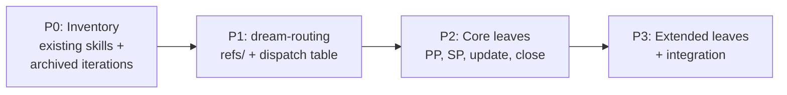

# 01 — Summary

> Part of [PP03 — Dream SOP Skills](./_overview.md)

---

## 📖 The Story

### 😤 The Pain

```
Current Reality:
┌─────────────────────────────────────────────────────────────────┐
│  User: "Create a PP blueprint for feature X"                    │
│                                                                 │
│  Agent reads day-dream skill (format spec) ──► 423 lines        │
│  Agent reads dream-planning skill (decomp) ──► 329 lines        │
│  Agent reads writing-templates skill ──────► 245 lines          │
│                                                                 │
│  Agent: "I have ~1000 lines of specs... now what do I DO?"      │
│         Improvises a procedure. Gets 60% of the format right.   │
│         Forgets exit gates. Misses frontmatter fields.          │
└─────────────────────────────────────────────────────────────────┘
```

| Who Hurts | Pain Level | Frequency |
|-----------|------------|-----------|
| HyperDream (plan author) | 🔥🔥🔥 High | Every blueprint |
| HyperOrch (routing decisions) | 🔥🔥 Medium | Every planning request |
| Human (quality variance) | 🔥🔥 Medium | Reviews inconsistent plans |

### ✨ The Vision

```
After This Procedure:
┌─────────────────────────────────────────────────────────────────┐
│  User: "Create a PP blueprint for feature X"                    │
│                                                                 │
│  dream-routing classifies intent ──► "create-PP"                │
│  Dispatches to dream-create-PP skill (self-contained SOP)       │
│  Agent follows step-by-step: templates, frontmatter, gates      │
│                                                                 │
│  Result: Consistent, complete blueprint. Every time.            │
└─────────────────────────────────────────────────────────────────┘
```

### 🎯 One-Liner

> Turn DREAM from a passive format spec into an active dispatch system with fixed entry points and self-contained SOPs for every planning operation.

### 📊 Impact

| Metric | Before | After |
|--------|--------|-------|
| Routing clarity | ❌ Agent improvises which skill to read | ✅ dream-routing dispatches to exact leaf skill |
| Blueprint consistency | ❌ Varies by agent context window | ✅ SOPs enforce identical structure |
| Template discovery | ❌ Agents must find `_templates/` independently | ✅ Templates bundled as `references/` in routing skill |
| Onboarding | ❌ Read 3 skills (~1000 lines) to author a plan | ✅ Read 1 leaf skill (<150 lines) for the specific operation |

---

## 🌟 TL;DR

Create a `dream-routing` skill that classifies user intent and dispatches to self-contained leaf skills (`dream-create-PP`, `dream-create-SP`, `dream-update`, `dream-close`, etc.). Move templates from `_templates/` to `dream-routing/references/`. Each leaf skill is a complete SOP — no reading siblings required.

---

## 🎯 Procedure Scope

**Trigger:** Discussion consensus that DREAM lacks active dispatch — agents improvise blueprint operations from passive format specs, producing inconsistent results.
**End State:** `dream-routing` skill exists with intent classification table. Each core DREAM operation has a self-contained leaf skill. Existing skills (`day-dream`, `dream-planning`) updated to reference the new routing system. Templates relocated to `dream-routing/references/`.

---

## 🔍 Prior Art & Existing Solutions

| Approach | What It Does | Decision | Rationale |
|----------|--------------|----------|-----------|
| Current 3-skill system (day-dream + dream-planning + writing-templates) | Passive format specs agents read holistically | ADAPT | Keep as reference specs; routing layer dispatches to SOPs |
| orch-routing → orch-implementation pattern | Layered skill dispatch for orchestration | ADOPT | Proven pattern; dream-routing follows same architecture |
| Monolithic "DREAM spec" (archived v3/v4 iterations) | Single giant spec with all rules | REJECT | 12 archived iterations prove this approach fails at scale |

---

## ❌ Non-Goals

| Non-Goal | Rationale |
|----------|-----------|
| Rewriting day-dream or dream-planning content | Existing specs are stable; we ADD a routing layer, not replace |
| Automating intent classification in code | This is a skill (agent-read SOP), not software |
| Handling archived iteration migration | P0 reviews archives for learning only; no migration of old plans |
| Creating skills for non-DREAM operations | Scope is DREAM planning operations exclusively |
| Changing the Flow DSL or template compilation | Infrastructure is out of scope |

---

## 🏗️ Approach & Architecture

### High-Level Flow



### Skill Architecture (Target State)

| Skill | Status | Role |
|-------|--------|------|
| `dream-routing/` (+ `references/`) | NEW | Entry point; owns templates (from `_templates/`) |
| `dream-create-PP/` | NEW | Leaf SOP: create PP blueprint |
| `dream-create-SP/` | NEW | Leaf SOP: create SP blueprint |
| `dream-update/` | NEW | Leaf SOP: update/resurrect plans |
| `dream-close/` | NEW | Leaf SOP: plan closure gates |
| `dream-fix/` | NEW (P3) | Leaf SOP: fix validation errors |
| `dream-validate/` | NEW (P3) | Leaf SOP: validate plan structure |
| `day-dream/` | MODIFY | Add routing ref; stays format-only spec |
| `dream-planning/` | MODIFY | Add routing ref; stays decomposition protocol |

### Components Affected

| Component | Change Type | Description |
|-----------|-------------|-------------|
| `instruction_core/data/skills/dream-*` | Create | 7 new skill folders (source-of-truth) |
| `.github/skills/dream-*` | Create (synced) | Synced via `adhd r -f` |
| `.github/skills/day-dream/`, `dream-planning/` | Modify | Add routing references |
| `.agent_plan/day_dream/_templates/` | Remove | Replaced with redirect to `dream-routing/references/` |

### Key Design Decisions

| # | Decision | Rationale |
|---|----------|-----------|
| 1 | Routing skill owns templates as `references/` | Templates are reference material for SOPs, not standalone artifacts |
| 2 | Leaf skills are fully self-contained | No reading siblings — reduces context window, prevents cross-contamination |
| 3 | Archive review in P0, not ongoing | Learn from 12 archived iterations but don't carry forward their structure |
| 4 | Follow orch-routing pattern exactly | Proven layered dispatch; consistent framework UX |

---

## ✅ Features / Steps Overview

| Priority | Step | Difficulty | Description |
|----------|------|------------|-------------|
| P0 | Skill Inventory & Design | `[KNOWN]` | Review 3 existing skills + 12 archived iterations, produce dispatch table |
| P1 | dream-routing Skill | `[KNOWN]` | Create routing skill, relocate templates to references/, write dispatch |
| P2 | Core Leaf Skills | `[KNOWN]` | Create dream-create-PP, dream-create-SP, dream-update, dream-close |
| P3 | Extended Skills & Integration | `[EXPERIMENTAL]` | Remaining leaves, update existing skills, verify full dispatch chain |

---

## 📊 Success Metrics

| Metric | Target | How to Measure |
|--------|--------|----------------|
| Routing exists | 1 skill with dispatch table | `dream-routing/SKILL.md` with intent→skill mapping |
| Core leaf SOPs | 4 self-contained skills | Each works without reading siblings |
| Templates relocated | 0 files in `_templates/` | Redirect notice only |
| Consistency | Identical blueprint structure | Compare 2 SOP-produced blueprints |

---

## 📅 Scope Budget

| Phase | Duration | Hard Limit |
|-------|----------|------------|
| P0 (Inventory & Design) | ■■■□□□□□ Standard (max 3 slots) | Max 5 tasks, `[KNOWN]` only |
| P1 (dream-routing) | ■■■□□□□□ Standard (max 3 slots) | Max 5 tasks, `[KNOWN]` only |
| P2 (Core Leaf Skills) | ■■■■■□□□ Heavy (max 5 slots) | 4 leaf skills, `[KNOWN]` only |
| P3 (Extended & Integration) | ■■■□□□□□ Standard (max 3 slots) | May include `[EXPERIMENTAL]` |

---

## ✅ Summary Validation Checklist

### Narrative (The Story)
- [x] **Problem** names who hurts and how
- [x] **Value** is quantifiable or emotionally resonant

### Scope
- [x] **Non-Goals** has ≥3 explicit exclusions
- [x] **Steps/Features** has ≤5 P0 items
- [x] No `[RESEARCH]` items in P0

### Architecture
- [x] **High-Level Flow** diagram present
- [x] **Components Affected** table lists all impacted modules
- [x] **Key Design Decisions** are recorded with rationale

### Grounding
- [x] **Prior Art** documents ≥1 alternative considered
- [x] **Scope Budget** has estimates per phase

---

**Next:** [Implementation](./80_implementation.md)

**← Back to:** [_overview.md](./_overview.md)
