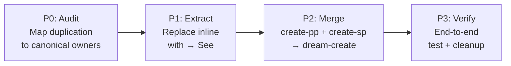

# 01 — Summary

> Part of [PP04 — Dream Skills Consolidation](./_overview.md)

---

## 📖 The Story

### 😤 The Pain

```
Current Reality:
┌─────────────────────────────────────────────────────────────────┐
│  9 dream-* skills with 5+ inline copies of status syntax,      │
│  5 copies of frontmatter schema, 4 copies of line limits       │
│                                                                 │
│  One copy updated → others drift → agents see conflicting defs  │
│  Result: hallucination cascade (SP = "Simple Plan" 💥)          │
└─────────────────────────────────────────────────────────────────┘
```

| Who Hurts | Pain Level | Frequency |
|-----------|------------|-----------|
| HyperDream (loads stale inline defs) | 🔥🔥🔥 High | Every plan operation |
| HyperArch (implements from wrong schema) | 🔥🔥🔥 High | Every implementation |
| Human (reviews inconsistent output) | 🔥🔥 Medium | Periodic reviews |

### ✨ The Vision

```
After This Procedure:
┌─────────────────────────────────────────────────────────────────┐
│  Shared data lives in canonical assets (dream-planning/assets/, │
│  dream-vision/assets/). Skills use → See pointers.              │
│  dream-create replaces two 80%-identical skills.                │
│                                                                 │
│  Update ONE file → all skills see the truth. Always.            │
└─────────────────────────────────────────────────────────────────┘
```

### 🎯 One-Liner

> Deduplicate 9 dream-* skills by extracting shared reference data into canonical assets and merging near-identical create skills, eliminating hallucination-causing drift.

### 📊 Impact

| Metric | Before | After |
|--------|--------|-------|
| Inline duplication | ❌ ~350-450 lines across 9 skills | ✅ 0 inline copies, `→ See` pointers only |
| Status syntax copies | ❌ 5+ copies | ✅ 1 canonical (`dream-planning/assets/status-syntax.md`) |
| Create skills | ❌ 2 skills, 80% overlap | ✅ 1 skill with SP/PP branching |
| Update propagation | ❌ Edit 5-6 files per change | ✅ Edit 1 file |

---

## 🔧 The Spec

## 🌟 TL;DR

Extract duplicated reference data (status syntax, frontmatter schema, line limits, difficulty labels) from 9 dream-* skills into canonical asset files owned by `dream-planning` and `dream-vision`. Replace inline copies with `→ See` pointers. Merge `dream-create-pp` + `dream-create-sp` into `dream-create` with conditional branching. Result: 8 skills, zero duplication.

## 🎯 Procedure Scope

**Trigger:** Multi-agent discussion consensus (2026-03-02) — duplication across dream-* skills caused hallucination cascade.
**End State:** All shared reference data lives in canonical asset files. Every SOP skill uses `→ See` pointers instead of inline copies. `dream-create` replaces two near-identical create skills. `adhd r -f` compiles clean.

## 🔍 Prior Art & Existing Solutions

| Approach | What It Does | Decision | Rationale |
|----------|--------------|----------|-----------|
| Current inline duplication | Each skill self-contains all defs | REJECT | Causes drift and hallucinations |
| Canonical `→ See` pointers | Skills reference shared asset files | ADOPT | Single source of truth, already used in dream-planning/assets/ |
| Aggressive merge (6 skills) | Merge fix+validate, update+close too | REJECT | High risk, unclear benefit — extraction alone resolves their duplication |

## ❌ Non-Goals

| Non-Goal | Rationale |
|----------|-----------|
| Rewriting dream-planning or dream-vision content | Existing specs are stable; we ADD pointers, not rewrite |
| Merging fix + validate or update + close skills | Extraction removes their duplication without merge risk |
| Creating new canonical data that doesn't already exist | Assets like `status-syntax.md` already exist in `dream-planning/assets/` |
| Changing the DREAM protocol itself | This is a refactor of skill organization, not spec changes |
| Modifying non-dream skills or Flow DSL | Out of scope entirely |

## 🔍 Considered & Rejected: module-dev / mcp-module-dev Merge

**Analysis (2026-03-02):** Evaluated whether `module-dev` and `mcp-module-dev` skills should be consolidated alongside dream-* skills.

| Finding | Detail |
|---------|--------|
| Structure | Well-structured parent→specialization (no merge needed) |
| Overlap | ~15-20% intentional safety reinforcement |
| Cross-refs | Already bidirectional |
| `cli-dev` | Fully orthogonal — no overlap |

**Decision:** No merge. The parent→specialization pattern is correct by design. One minor fix applied: broadened MCP-specific `print()` warning in `module-dev/SKILL.md` to apply to all modules (see P1 task in [80_implementation.md](./80_implementation.md)).

## 🏗️ Approach & Architecture

### Scale Options

| Scale | Changes | Result | Effort | Risk |
|-------|---------|--------|--------|------|
| **Conservative** | Extract shared refs only | 9 skills, ~0 duplication | ~2 slots | Low |
| **Moderate** ⭐ | Extract refs + merge create-pp/sp | 8 skills, 0 duplication | ~3 slots | Low-Med |
| **Aggressive** | Above + merge fix/validate + update/close | 6 skills | ~5+ slots | High |

**Recommendation:** Moderate — delivers 95% of dedup benefit with predictable risk. Conservative leaves the create-skill overlap. Aggressive merges skills with distinct workflows.

### High-Level Flow (Moderate)



### Canonical Ownership Map

| Data | Canonical Owner | Asset File |
|------|----------------|------------|
| Status syntax | `dream-planning/assets/` | `status-syntax.md` ✅ exists |
| Frontmatter schema | `dream-planning/assets/` | `overview-frontmatter-schema.md` ✅ exists |
| Magnitude routing | `dream-planning/assets/` | (in SKILL.md body) |
| Line limits | `dream-vision/assets/` | `document-line-limits.md` ✅ exists |
| Story-Spec pattern | `dream-vision/assets/` | `story-spec-pattern.md` ✅ exists |
| Difficulty labels | `dream-planning/assets/` | TBD — may need creation |

### Key Design Decisions

| # | Decision | Rationale |
|---|----------|-----------|
| 1 | `→ See` pointers, not symlinks or imports | Agent-readable, zero tooling dependency |
| 2 | Merge only create-pp + create-sp | 80% overlap is clear; other skills differ meaningfully |
| 3 | Canonical owners are existing asset directories | No new infrastructure — `dream-planning/assets/` and `dream-vision/assets/` already exist |

## ✅ Features / Steps Overview

| Priority | Step | Difficulty | Description |
|----------|------|------------|-------------|
| P0 | Canonical Asset Audit | `[KNOWN]` | Audit all 9 skills, map duplication to owners |
| P1 | Extract & Replace | `[KNOWN]` | Replace inline data with `→ See` pointers in 6 SOP skills |
| P2 | Merge Create Skills | `[KNOWN]` | Combine create-pp + create-sp → dream-create |
| P3 | Verification & Cleanup | `[KNOWN]` | End-to-end test, link verification, index updates |

## 📊 Success Metrics

| Metric | Target | How to Measure |
|--------|--------|----------------|
| Inline duplication | 0 copies of shared defs | `grep` for status syntax blocks across skills |
| Skill count | 8 (down from 9) | `ls dream-*/` in skills directory |
| Build health | `adhd r -f` clean | Run after each phase |
| Pointer validity | 0 broken `→ See` links | Verify each pointer resolves to existing asset |

## 📅 Scope Budget

| Phase | Duration | Hard Limit |
|-------|----------|------------|
| P0 (Audit) | ■□□□□□□□ Trivial (1 slot) | Max 5 tasks, `[KNOWN]` only |
| P1 (Extract) | ■■□□□□□□ Light (2 slots) | `[KNOWN]` only |
| P2 (Merge) | ■■□□□□□□ Light (2 slots) | `[KNOWN]` only |
| P3 (Verify) | ■□□□□□□□ Trivial (1 slot) | `[KNOWN]` only |

## ✅ Summary Validation Checklist

### Narrative (The Story)
- [x] **Problem** names who hurts and how
- [x] **Value** is quantifiable or emotionally resonant

### Scope
- [x] **Non-Goals** has ≥3 explicit exclusions
- [x] **Steps/Features** has ≤5 P0 items
- [x] No `[RESEARCH]` items in P0

### Architecture
- [x] **High-Level Flow** diagram present
- [x] **Components Affected** covered via Canonical Ownership Map
- [x] **Key Design Decisions** recorded with rationale

### Grounding
- [x] **Prior Art** documents ≥1 alternative considered
- [x] **Scope Budget** has estimates per phase

---

**Next:** [Implementation](./80_implementation.md)

**← Back to:** [_overview.md](./_overview.md)
