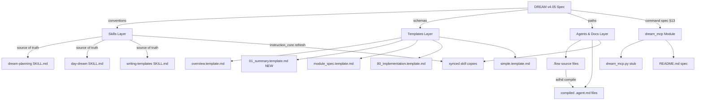

# SP01 — Architecture

## 📖 The Story

### Component Landscape

SP01 touches documentation artifacts across the ADHD ecosystem. No runtime code changes — only `.md` files, `.flow` files, and the `dream_mcp` module scaffold.

```
┌─────────────────────────────────────────────────────────────────┐
│                    DREAM v4.05 Spec (source of truth)           │
│                    .agent_plan/day_dream/DREAM_v4.05.md         │
└─────────────┬──────────────┬──────────────┬─────────────────────┘
              │              │              │
              ▼              ▼              ▼
┌─────────────────┐ ┌───────────────┐ ┌──────────────────────────┐
│   Skills (3)    │ │  Templates    │ │   Agents & Docs          │
│ .github/skills/ │ │  _templates/  │ │   instruction_core/data/ │
│                 │ │               │ │                          │
│ dream-planning  │ │ overview      │ │ flows/agents/*.flow      │
│ day-dream       │ │ 01_summary    │ │ compiled/agents/*.md     │
│ writing-templates │ module_spec   │ │ skills/**/SKILL.md       │
└────────┬────────┘ │ 80_impl       │ └────────────┬─────────────┘
         │          │ simple        │              │
         │          └───────┬───────┘              │
         │                  │                      │
         ▼                  ▼                      ▼
┌─────────────────────────────────────────────────────────────────┐
│              Aligned Ecosystem (v4.05 conventions)              │
└─────────────────────────────────────────────────────────────────┘
                              │
                              ▼
                 ┌──────────────────────┐
                 │   dream_mcp          │
                 │   modules/dev/       │
                 │   (skeleton only)    │
                 │   P0 stubs for:      │
                 │   status, tree,      │
                 │   stale, validate    │
                 └──────────────────────┘
```

---

## 🔧 The Spec

### System Diagram



### Component Relationships

| Component | Type | Modified By Phase | Data Flow |
|-----------|------|-------------------|-----------|
| `_templates/` directory | Infrastructure | p00 | Renamed from `templates/`; templates updated in-place |
| dream-planning SKILL.md | Skill (source) | p01 | Read by agents at planning time |
| day-dream SKILL.md | Skill (source) | p01 | Read by HyperDream at authoring time |
| writing-templates SKILL.md | Skill (source) | p01 | Read by HyperDream at template creation |
| `*.flow` source files | Agent source | p02 | Compiled by `flow_core` → `.agent.md` |
| Compiled `.agent.md` files | Agent (derived) | p02 | Auto-generated from `.flow` files |
| Synced skill copies | Docs (derived) | p02 | Synced from `.github/skills/` by `instruction_core` |
| `dream_mcp` module | MCP server | p03 | New skeleton at `modules/dev/dream_mcp/` |

### Cross-Module Dependencies

```
instruction_core (EXISTING — modified)
├── data/flows/agents/*.flow      ← p02 updates paths
├── data/compiled/agents/*.md     ← p02 recompiles
└── data/skills/**/SKILL.md       ← p02 re-syncs after p01

dream_mcp (NEW — scaffolded)
└── modules/dev/dream_mcp/        ← p03 creates skeleton

flow_core (EXISTING — used, NOT modified)
└── Used by `adhd compile` to regenerate agents
```

### Boundary Definitions

| Boundary | Inside SP01 | Outside SP01 |
|----------|-------------|--------------|
| Skills | Rewrite content to v4.05 | No new skills created |
| Templates | Update schemas + create PP template | No template engine changes |
| Agents | Fix path references + recompile | No agent behavior changes |
| dream_mcp | Scaffold module + stub signatures | Actual command implementation |
| DREAM spec | Read-only reference | No spec modifications |
