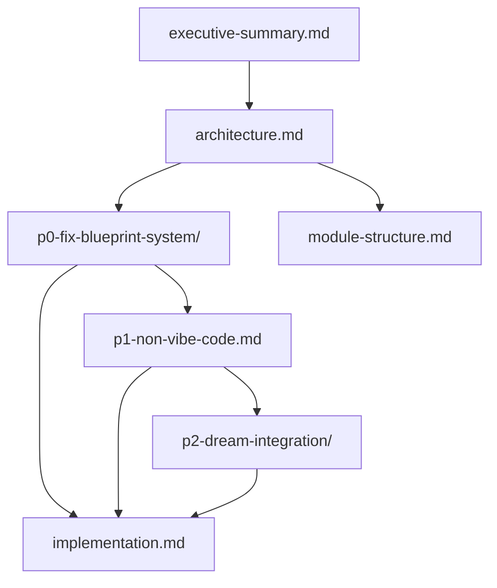

# DREAM Upgrade

> ✅ **[DONE]** — Evolved the ADHD Framework's planning system from linear blueprints to decomposition-aware, agent-native planning.

---

## Purpose

Upgrade the blueprint/planning system to use AI-agent time scales, conditional walking skeletons, clean-code-first directives, Non-Vibe Code engineering discipline, and the DREAM decomposition protocol (magnitude-gated structure, plan/task hierarchy, context isolation).

## Children

| Name | Type | Status | Description |
|------|------|--------|-------------|
| [executive-summary.md](./executive-summary.md) | Task | ✅ [DONE] | Vision, goals, non-goals, feature overview |
| [architecture.md](./architecture.md) | Task | ✅ [DONE] | System design — skill boundary contract, data flow |
| [p0-fix-blueprint-system/](./p0-fix-blueprint-system/_overview.md) | Plan | ✅ [DONE] | P0: Fix estimation, walking skeleton, backward compat |
| [p1-non-vibe-code.md](./p1-non-vibe-code.md) | Task | ✅ [DONE] | P1: Non-Vibe Code engineering discipline (3 pillars) |
| [p2-dream-integration/](./p2-dream-integration/_overview.md) | Plan | ✅ [DONE] | P2: New dream-planning skill, day-dream update, template refresh |
| [implementation.md](./implementation.md) | Task | ✅ [DONE] | Phased task tracking and decisions log |
| [module-structure.md](./module-structure.md) | Task | ✅ [DONE] | File locations — skills/templates only, no new modules |

## Integration Map

Phases are sequential: P0 → P1 → P2. Cross-cutting docs (executive-summary, architecture, implementation, module-structure) apply to all phases.

## Reading Order

1. [executive-summary.md](./executive-summary.md) — Understand the what/why
2. [architecture.md](./architecture.md) — Understand the how
3. [p0-fix-blueprint-system/](./p0-fix-blueprint-system/_overview.md) — Phase 0 features
4. [p1-non-vibe-code.md](./p1-non-vibe-code.md) — Phase 1 feature
5. [p2-dream-integration/](./p2-dream-integration/_overview.md) — Phase 2 features
6. [implementation.md](./implementation.md) — Task tracking and decisions
7. [module-structure.md](./module-structure.md) — Where files live
