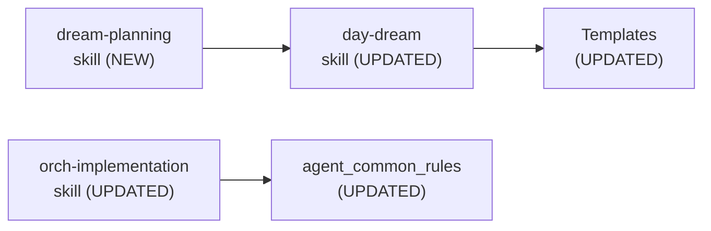

# Module Structure

> Part of [DREAM Upgrade](./_overview.md) · ✅ [DONE]

---

## 📖 The Story

### 🎯 One-Liner

> No new modules — this project modified skills and templates only, all within existing file locations.

---

## 🔧 The Spec

---

## 🏗️ ADHD Module Organization

### 📦 Reusable Modules

N/A — No new reusable modules. This project created/updated skills and templates, which live outside the module system.

### 🎯 Project-Specific Modules

N/A — No new project-specific modules.

---

## 📄 Files Modified

| File Type | Path | Purpose | Phase |
|-----------|------|---------|-------|
| Skill (NEW) | `.github/skills/dream-planning/SKILL.md` | Decomposition protocol | P2 |
| Skill (UPDATE) | `.github/skills/day-dream/SKILL.md` | Authoring rules fixes | P0 + P1 + P2 |
| Skill (UPDATE) | `.github/skills/orch-implementation/SKILL.md` | Non-Vibe Code standards | P1 |
| Instruction (UPDATE) | `.github/instructions/agent_common_rules.instructions.md` | Universal directive | P1 |
| Instruction (NEW) | `.github/instructions/non_vibe_code.instructions.md` | Full practice spec | P1 |
| Template (UPDATE) | `templates/blueprint/00_index.template.md` | Planning standards | P2 |
| Template (UPDATE) | `templates/blueprint/80_implementation.template.md` | Duration + skeleton | P2 |
| Template (NEW) | `templates/blueprint/overview.template.md` | `_overview.md` scaffold | P2 |
| Template (NEW) | `templates/blueprint/task.template.md` | Leaf task scaffold | P2 |

---

## 📂 File Tree (Changes Only)

```text
.github/skills/
├── dream-planning/               (P2 — NEW skill)
│   └── SKILL.md
├── day-dream/                    (P0/P1/P2 — UPDATED skill)
│   └── SKILL.md
└── orch-implementation/          (P1 — UPDATED skill)
    └── SKILL.md

.github/instructions/
├── agent_common_rules.instructions.md    (P1 — UPDATED)
└── non_vibe_code.instructions.md         (P1 — NEW)

templates/blueprint/
├── overview.template.md                  (P2 — NEW)
├── task.template.md                      (P2 — NEW)
├── 00_index.template.md                  (P2 — UPDATED)
└── 80_implementation.template.md         (P2 — UPDATED)
```

---

## 🔗 Dependencies

No module dependencies — this project operated entirely in the skills/templates/instructions layer.



---

**← Back to:** [DREAM Upgrade Overview](./_overview.md)
