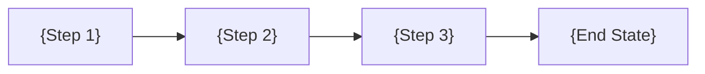

<!--
╔═══════════════════════════════════════════════════════════════════════════════╗
║  ⚠️  SCAFFOLD — This template provides STRUCTURE, not protocol.              ║
║  Protocol rules live in skills: day-dream (authoring) and dream-planning     ║
║  (decomposition). Templates are passive — copy, fill, customize.             ║
╚═══════════════════════════════════════════════════════════════════════════════╝
-->

<!--
PURPOSE: Procedure Plan merged summary — combines executive summary and
architecture into a single document. Used when plan type is PP (Procedure Plan).

System Plans use separate 01_executive_summary.md + 02_architecture.md.
Procedure Plans use this single 01_summary.md instead.

Line Limit: ≤200 lines (DREAM v4.05 §2.7)
-->

# 01 - Summary

> Part of [{Plan Name} Blueprint](./_overview.md)

---

## 📖 The Story

<!--
REQUIRED: Visual, scannable narrative — NOT a text wall.
Use ASCII boxes, tables, and emoji anchors. A PM should grasp the problem/solution in 10 seconds.
If you can't draw the pain and vision, you don't understand the feature.
-->

### 😤 The Pain

```
Current Reality:
┌─────────────────────────────────────────┐
│  {Actor} wants {X}  ────►  💥 BLOCKED   │
│                                         │
│  Because: {root cause}                  │
└─────────────────────────────────────────┘
```

| Who Hurts | Pain Level | Frequency |
|-----------|------------|-----------|
| {persona} | 🔥🔥🔥 High | Daily |
| {persona} | 🔥🔥 Medium | Weekly |

### ✨ The Vision

```
After This Procedure:
┌─────────────────────────────────────────┐
│  {Actor} wants {X}  ────►  ✅ SUCCESS   │
│                                         │
│  Flow: {step} → {step} → {result}       │
└─────────────────────────────────────────┘
```

### 🎯 One-Liner

> {Elevator pitch — what this procedure achieves and why it matters}

### 📊 Impact

| Metric | Before | After |
|--------|--------|-------|
| {metric} | ❌ {current state} | ✅ {target state} |

---

## 🔧 The Spec

---

## 🌟 TL;DR

<!-- CONSTRAINT: Maximum 3 sentences. -->

{What this procedure does, what it changes, and what the end state looks like.}

---

## 🎯 Procedure Scope

<!-- What triggers this procedure and what constitutes completion. -->

**Trigger:** {What event or decision initiated this procedure}
**End State:** {What "done" looks like — observable, verifiable}

---

## 🔍 Prior Art & Existing Solutions

| Library/Tool/Process | What It Does | Decision | Rationale |
|----------------------|--------------|----------|-----------|
| {existing approach} | {capability} | ADOPT / ADAPT / REJECT | {Why} |

---

## ❌ Non-Goals

<!-- CONSTRAINT: Minimum 3 items. -->

| Non-Goal | Rationale |
|----------|-----------|
| {Excluded scope} | {Why out of scope} |
| {Excluded scope} | {Why out of scope} |
| {Excluded scope} | {Why out of scope} |

---

## 🏗️ Approach & Architecture

<!-- Merged architecture section — how the procedure changes the system. -->

### High-Level Flow



### Components Affected

| Component | Change Type | Description |
|-----------|-------------|-------------|
| `{module/file}` | Create / Modify / Remove | {What changes} |

### Key Design Decisions

| # | Decision | Rationale |
|---|----------|-----------|
| 1 | {Decision} | {Why this approach} |
| 2 | {Decision} | {Why this approach} |

---

## ✅ Features / Steps Overview

<!-- Maximum 5 P0 items. Each ≤5 lines here; details in separate docs. -->

| Priority | Step/Feature | Difficulty | Description |
|----------|--------------|------------|-------------|
| P0 | {Step Name} | `[KNOWN]` | {One sentence} |
| P0 | {Step Name} | `[KNOWN]` | {One sentence} |
| P1 | {Step Name} | `[EXPERIMENTAL]` | {One sentence} |

---

## 📊 Success Metrics

| Metric | Target | How to Measure |
|--------|--------|----------------|
| {Metric} | {Target} | {Method} |

---

## 📅 Scope Budget

| Phase | Duration | Hard Limit |
|-------|----------|------------|
| P0 | {estimate} | Max 5 tasks, `[KNOWN]` only |
| P1 | {estimate} | May include `[EXPERIMENTAL]` |

---

## ✅ Summary Validation Checklist

### Narrative (The Story)
- [ ] **Problem** names who hurts and how
- [ ] **Value** is quantifiable or emotionally resonant

### Scope
- [ ] **Non-Goals** has ≥3 explicit exclusions
- [ ] **Steps/Features** has ≤5 P0 items
- [ ] No `[RESEARCH]` items in P0

### Architecture
- [ ] **High-Level Flow** diagram present
- [ ] **Components Affected** table lists all impacted modules
- [ ] **Key Design Decisions** are recorded with rationale

### Grounding
- [ ] **Prior Art** documents ≥1 alternative considered
- [ ] **Scope Budget** has estimates per phase

---

**Next:** [Feature/Step Docs](./0N_feat_{name}.md) | [Implementation](./80_implementation.md)

---

**← Back to:** [_overview.md](./_overview.md)
