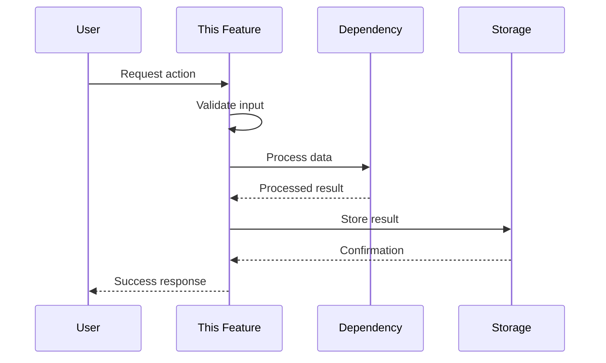
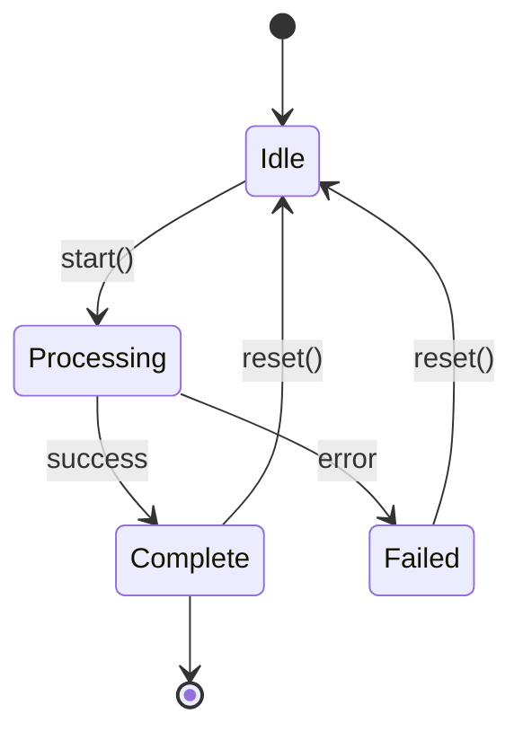

<!-- ═══════════════════════════════════════════════════════════════════
     ADHD-MANAGED — DO NOT EDIT DIRECTLY
     Source: modules/dev/instruction_core/data/.agent_plan/day_dream/_templates/blueprint/deep_dive_reference.md
     Refresh: adhd r -f
═══════════════════════════════════════════════════════════════════ -->

# Deep Dive Section Reference

> Reference documentation for the `## 🔬 Deep Dive` section in feature templates.

---

## When to Use Deep Dive

Include a Deep Dive section when your feature requires **rigorous technical artifacts**:

| Condition | Deep Dive Warranted |
|-----------|---------------------|
| Algorithm choices need Big-O analysis, benchmarks, or correctness proofs | ✅ Yes |
| Architecture requires class diagrams showing ≥5 classes with relationships | ✅ Yes |
| Migration needs phased timeline with rollback triggers | ✅ Yes |
| Performance requires actual measured numbers, not estimates | ✅ Yes |
| Multiple implementations compared with weighted scoring matrix | ✅ Yes |
| State machines have ≥4 states with complex transitions | ✅ Yes |
| API evolution spans ≥2 versions with schema changes | ✅ Yes |
| Feature is straightforward with no algorithmic complexity | ❌ No |
| A simple table or bullet list captures the tradeoffs | ❌ No |
| Implementation path is obvious from Overview + Technical Notes | ❌ No |

**Litmus Test:** *"Would this require a whiteboard with diagrams and numbers?"*
- If yes → Deep Dive is warranted
- If just discussion → use FREE ZONE instead

---

## Deep Dive vs FREE ZONE

| FREE ZONE | DEEP DIVE |
|-----------|-----------|
| Conceptual thinking | Rigorous technical artifacts |
| Philosophical tensions, metaphors | UML diagrams, Mermaid charts |
| Strategic decisions, scope fences | Mathematical proofs, Big-O |
| Things explained in a meeting | Things drawn on a whiteboard |
| Future regrets, assumptions | Benchmark tables with real data |

---

## Expected Depth

- **Minimum:** 60 lines
- **Maximum:** 280 lines
- **If <40 lines:** Content belongs in Technical Notes or FREE ZONE

---

## Available Subsections

Choose relevant subsections based on your feature's complexity:

### Algorithm Choices

Compare approaches with complexity analysis:

```markdown
### Algorithm Choices

| Approach | Time | Space | Pros | Cons | Verdict |
|----------|------|-------|------|------|---------|
| {Option A} | O(n) | O(1) | {pros} | {cons} | ✅ Selected |
| {Option B} | O(n²) | O(n) | {pros} | {cons} | ❌ Rejected |

**Decision Rationale:** {Why the selected approach wins}
```

### API Contract Draft

Function signatures with type hints and docstrings:

```markdown
### API Contract Draft

```python
def process_data(
    input: InputModel,
    options: ProcessOptions | None = None
) -> ProcessResult:
    """
    Process input data according to options.
    
    Args:
        input: The data to process
        options: Optional processing configuration
        
    Returns:
        ProcessResult with status and output
        
    Raises:
        ValidationError: If input fails validation
        ProcessingError: If processing fails
    """
    ...
```

**Version:** v1.0  
**Breaking Changes:** None (initial)
```

### Sequence Diagram

Flow of control for primary use case:

```markdown
### Sequence Diagram


```

### State Machine

For features with complex state transitions:

```markdown
### State Machine



| State | Entry Action | Exit Action | Valid Transitions |
|-------|--------------|-------------|-------------------|
| Idle | Initialize | Cleanup | → Processing |
| Processing | Start job | Cancel if timeout | → Complete, → Failed |
| Complete | Log success | Archive | → Idle, → [*] |
| Failed | Log error | Cleanup | → Idle |
```

### Performance Tradeoffs

Conscious tradeoffs with rationale:

```markdown
### Performance Tradeoffs

| Tradeoff | We chose... | Because... | Risk | Mitigation |
|----------|-------------|------------|------|------------|
| Memory vs Speed | Speed | User latency matters more | OOM on large data | Streaming fallback |
| Accuracy vs Latency | Accuracy | Incorrect results unacceptable | Slow response | Caching layer |
| Simplicity vs Features | Simplicity | P0 scope constraint | Missing edge cases | P1 additions |
```

### Error Handling Strategy

Failure modes and recovery:

```markdown
### Error Handling Strategy

| Failure Mode | Detection | Response | User Impact | Recovery |
|--------------|-----------|----------|-------------|----------|
| Network timeout | 30s deadline | Retry 3x | "Please wait" | Auto-retry |
| Invalid input | Schema validation | Reject early | Validation errors | User fixes input |
| Dependency down | Health check | Circuit breaker | Graceful degradation | Auto-heal |
| Data corruption | Checksum mismatch | Rollback | Error message | Manual restore |
```

---

## Example Files

See `templates/examples/` for completed Deep Dive examples:

| Example | Demonstrates |
|---------|--------------|
| `deep_dive_algorithm_choices.example.md` | Algorithm comparison + benchmarks |
| `deep_dive_api_contract.example.md` | API spec with schemas + versioning |
| `deep_dive_error_handling.example.md` | Error taxonomy + recovery strategies |
| `deep_dive_migration_runbook.example.md` | Step-by-step migration guide |
| `deep_dive_state_machine.example.md` | State diagrams + transition tables |
| `deep_dive_comprehensive_architecture.example.md` | Full architecture (80-120 lines) |
| `deep_dive_migration_strategy.example.md` | Migration with Gantt + rollback (80-120 lines) |
| `deep_dive_algorithm_proof.example.md` | Complexity proofs + benchmarks (60-100 lines) |

---

## Integration with Feature Template

In `NN_feature.template.md`, include Deep Dive as:

```markdown
## 🔬 Deep Dive

<!-- 
Include this section when feature requires non-trivial technical design.
See: deep_dive_reference.md for subsection templates and examples.
Delete this section for straightforward features.
-->

{Include relevant subsections from deep_dive_reference.md}
```

---

**← Back to:** [Templates Index](../00_index.md)
