<!-- ═══════════════════════════════════════════════════════════════════
     ADHD-MANAGED — DO NOT EDIT DIRECTLY
     Source: modules/dev/instruction_core/data/.agent_plan/day_dream/_templates/examples/deep_dive_architecture.example.md
     Refresh: adhd r -f
═══════════════════════════════════════════════════════════════════ -->

## 🔬 Deep Dive

### Architecture: Modular Plugin System

**Context:** Designing an extensible architecture where features are isolated modules that can be developed, tested, and deployed independently. This pattern applies to CLI tools, web apps, IDEs, or any system needing extensibility.

---

### 1. High-Level Architecture


**Principle:** The core is *boring*—it only provides infrastructure. All interesting behavior lives in plugins.

---

### 2. Layer Responsibilities

| Layer | Responsibilities | May Depend On | Must NOT Depend On |
|-------|-----------------|---------------|-------------------|
| **Core** | Registry, config, events, logging | Stdlib only | Plugins, App |
| **Plugins** | Feature implementation | Core | Other plugins (except declared deps) |
| **App** | Entry points, routing | Core, Plugins | — |

**Key Invariant:** Plugins never import each other directly. They communicate via events or shared contracts in Core.

---

### 3. Module Structure

```
project/
├── core/                      # Infrastructure (stable, rarely changes)
│   ├── __init__.py
│   ├── registry.py           # Plugin registration
│   ├── config.py             # Configuration loading
│   ├── events.py             # Event bus (pub/sub)
│   └── contracts.py          # Interfaces plugins implement
│
├── plugins/                   # Features (changes frequently)
│   ├── exporter/
│   │   ├── __init__.py       # Registers with core on import
│   │   ├── plugin.py         # Plugin class
│   │   └── formats/          # Plugin-internal modules
│   │       ├── csv.py
│   │       ├── json.py
│   │       └── markdown.py
│   │
│   └── analytics/
│       ├── __init__.py
│       ├── plugin.py
│       └── ...
│
├── app/                       # Application entry points
│   ├── cli.py                # CLI commands
│   └── server.py             # HTTP server (if applicable)
│
└── main.py                    # Bootstrap: load core, register plugins, run app
```

---

### 4. Dependency Flow

```mermaid
flowchart LR
    subgraph Allowed
        direction TB
        App2[App] --> Core2[Core]
        Plugin2[Plugin] --> Core2
        App2 --> Plugin2
    end
    
    subgraph Forbidden
        direction TB
        Core3[Core] -.->|❌| Plugin3[Plugin]
        Plugin3 -.->|❌| Plugin4[Plugin B]
    end
```



**Why This Matters:**
- Core can be tested without any plugins
- Plugins can be developed in isolation
- Adding a plugin never requires changing core
- Removing a plugin never breaks other plugins

---

### 5. Communication Patterns

#### Pattern A: Direct Call (Plugin → Core)

```python
# Plugin uses core services directly
from core.config import get_setting
from core.events import emit

class MyPlugin(Plugin):
    def do_work(self):
        threshold = get_setting("my_plugin.threshold", default=0.5)
        emit("work_started", {"plugin": self.name})
```

#### Pattern B: Event Bus (Plugin ↔ Plugin, decoupled)

```python
# analytics_plugin.py
from core.events import subscribe

@subscribe("export_completed")
def on_export(event_data: dict):
    """React to export plugin's events without importing it."""
    track_event("export", event_data)
```

#### Pattern C: Contracts (Shared interfaces)

```python
# core/contracts.py
from abc import ABC, abstractmethod

class Exporter(ABC):
    """Contract that export plugins implement."""
    
    @abstractmethod
    def export(self, data: Any, destination: Path) -> ExportResult:
        ...
    
    @property
    @abstractmethod
    def format_name(self) -> str:
        ...

# plugins/exporter/csv.py
class CsvExporter(Exporter):
    format_name = "csv"
    
    def export(self, data: Any, destination: Path) -> ExportResult:
        # CSV-specific implementation
        ...
```

---

### 6. Bootstrap Sequence


---

### 7. When to Use This Architecture

| Scenario | Recommended? | Notes |
|----------|--------------|-------|
| CLI with multiple subcommands | ✅ Yes | Each command = plugin |
| Web app with distinct features | ✅ Yes | Feature modules as plugins |
| Library for others to extend | ✅ Yes | Classic plugin pattern |
| Simple script (<500 lines) | ❌ No | Overkill, just use functions |
| Tightly coupled domain logic | ❌ No | Forced separation hurts more than helps |
| Performance-critical inner loop | ⚠️ Maybe | Event bus adds overhead |

---

### 8. Trade-offs

| Benefit | Cost |
|---------|------|
| Easy to add features | Initial setup complexity |
| Features developed in isolation | Plugin discovery/loading overhead |
| Easy to test components | Indirection can obscure flow |
| Teams can work independently | Need clear contracts upfront |
| Hot-reload plugins (potentially) | Event debugging harder |

---

### 9. Anti-Patterns to Avoid

| ❌ Don't | ✅ Do Instead |
|----------|---------------|
| Plugin imports another plugin | Communicate via events |
| Core depends on plugin interfaces | Define interfaces in core |
| Monolithic plugin (1000+ lines) | Split into focused plugins |
| Implicit plugin discovery | Explicit registration |
| Share mutable state between plugins | Immutable events or copies |
