<!-- ═══════════════════════════════════════════════════════════════════
     ADHD-MANAGED — DO NOT EDIT DIRECTLY
     Source: modules/dev/instruction_core/data/.agent_plan/day_dream/_templates/examples/deep_dive_state_machine.example.md
     Refresh: adhd r -f
═══════════════════════════════════════════════════════════════════ -->

## 🔬 Deep Dive

### State Machine: Background Job Lifecycle

**Context:** Managing long-running async jobs (file processing, API sync, report generation). Jobs must support pause/resume, cancellation, retry logic, and progress tracking.

---

### 1. State Diagram

```mermaid
stateDiagram-v2
    [*] --> Pending: create_job()
    
    Pending --> Running: start()
    Pending --> Cancelled: cancel()
    
    Running --> Paused: pause()
    Running --> Completed: work_finished
    Running --> Failed: unrecoverable_error
    Running --> Cancelled: cancel()
    
    Paused --> Running: resume()
    Paused --> Cancelled: cancel()
    
    Failed --> Pending: retry()
    
    Completed --> [*]
    Cancelled --> [*]
    
    note right of Running
        Active processing.
        Emits progress events.
        Checkpoints for resumability.
    end note
    
    note right of Paused
        State persisted.
        Resources released.
        24h timeout → auto-cancel.
    end note
    
    note right of Failed
        Retryable up to max_attempts.
        Error details captured.
        After max: terminal.
    end note
```



---

### 2. State Transition Table

| From | To | Trigger | Guard | Side Effects |
|------|----|---------|-------|--------------|
| `Pending` | `Running` | `start()` | has_resources | Acquire worker, emit `JobStarted` |
| `Pending` | `Cancelled` | `cancel()` | — | Emit `JobCancelled` |
| `Running` | `Paused` | `pause()` | at_checkpoint | Save progress, release worker |
| `Running` | `Completed` | internal | work_done | Emit `JobCompleted`, cleanup |
| `Running` | `Failed` | internal | is_error | Log error, release worker |
| `Running` | `Cancelled` | `cancel()` | — | Stop gracefully, emit `JobCancelled` |
| `Paused` | `Running` | `resume()` | has_resources | Reacquire worker, resume from checkpoint |
| `Paused` | `Cancelled` | `cancel()` | — | Emit `JobCancelled` |
| `Failed` | `Pending` | `retry()` | attempts < max | Increment attempt counter |

---

### 3. Invariants (Illegal Transitions)

| Attempted | Why Illegal | Response |
|-----------|-------------|----------|
| `Completed` → any | Terminal state | `InvalidStateError` |
| `Cancelled` → any | Terminal state | `InvalidStateError` |
| `Failed` → `Running` | Must go through Pending | `InvalidStateError` |
| `Paused` → `Completed` | Must resume first | `InvalidStateError` |
| any → `Pending` | Initial state only | `InvalidStateError` |

---

### 4. Data Model

```python
from dataclasses import dataclass, field
from datetime import datetime
from enum import Enum
from typing import Any

class JobState(Enum):
    PENDING = "pending"
    RUNNING = "running"
    PAUSED = "paused"
    COMPLETED = "completed"
    FAILED = "failed"
    CANCELLED = "cancelled"

@dataclass
class JobProgress:
    """Checkpoint data for resumable jobs."""
    current_step: int
    total_steps: int
    last_checkpoint: dict[str, Any]  # Job-specific resumption data
    
    @property
    def percent(self) -> float:
        return (self.current_step / self.total_steps) * 100 if self.total_steps else 0

@dataclass
class Job:
    """Core job entity."""
    id: str
    state: JobState = JobState.PENDING
    created_at: datetime = field(default_factory=datetime.now)
    started_at: datetime | None = None
    finished_at: datetime | None = None
    
    # Configuration (immutable after creation)
    job_type: str = ""
    params: dict[str, Any] = field(default_factory=dict)
    max_attempts: int = 3
    
    # Progress & Result
    attempt: int = 0
    progress: JobProgress | None = None
    result: Any = None
    error: str | None = None
    
    @property
    def is_terminal(self) -> bool:
        return self.state in {JobState.COMPLETED, JobState.CANCELLED}
    
    @property
    def can_retry(self) -> bool:
        return self.state == JobState.FAILED and self.attempt < self.max_attempts
```

---

### 5. State Machine Implementation

```python
class JobStateMachine:
    """Encapsulates all state transition logic."""
    
    TRANSITIONS = {
        JobState.PENDING: {JobState.RUNNING, JobState.CANCELLED},
        JobState.RUNNING: {JobState.PAUSED, JobState.COMPLETED, JobState.FAILED, JobState.CANCELLED},
        JobState.PAUSED: {JobState.RUNNING, JobState.CANCELLED},
        JobState.FAILED: {JobState.PENDING},  # retry resets to pending
        JobState.COMPLETED: set(),  # terminal
        JobState.CANCELLED: set(),  # terminal
    }
    
    def can_transition(self, job: Job, to_state: JobState) -> bool:
        """Check if transition is valid."""
        return to_state in self.TRANSITIONS.get(job.state, set())
    
    def transition(self, job: Job, to_state: JobState) -> Job:
        """
        Perform state transition with side effects.
        
        Raises:
            InvalidStateError: Transition not allowed.
        """
        if not self.can_transition(job, to_state):
            raise InvalidStateError(
                f"Cannot transition from {job.state.value} to {to_state.value}"
            )
        
        # Apply transition
        job.state = to_state
        
        # Side effects
        if to_state == JobState.RUNNING and job.started_at is None:
            job.started_at = datetime.now()
        elif to_state in {JobState.COMPLETED, JobState.FAILED, JobState.CANCELLED}:
            job.finished_at = datetime.now()
        elif to_state == JobState.PENDING:  # retry
            job.attempt += 1
            job.error = None
        
        return job
```

---

### 6. Visualization: Job Flow

```
┌─────────────────────────────────────────────────────────────┐
│                        JOB LIFECYCLE                         │
├─────────────────────────────────────────────────────────────┤
│                                                             │
│   ┌─────────┐                                               │
│   │ PENDING │──start()──▶┌─────────┐                       │
│   └────┬────┘            │ RUNNING │◀──────┐               │
│        │                 └────┬────┘       │               │
│      cancel()                 │         resume()           │
│        │            ┌────────┼────────┐    │               │
│        ▼            │        │        │    │               │
│   ┌──────────┐   pause()  done()   error() │               │
│   │CANCELLED │◀─────┤        │        │    │               │
│   └──────────┘      ▼        ▼        ▼    │               │
│                ┌────────┐ ┌────────┐ ┌──────┐              │
│                │ PAUSED │ │COMPLETE│ │FAILED│──retry()──┐  │
│                └────────┘ └────────┘ └──────┘            │  │
│                     │                    │               │  │
│                  cancel()         (max attempts?)       │  │
│                     │                    │               │  │
│                     ▼                    └───────────────┘  │
│               ┌──────────┐                                  │
│               │CANCELLED │◀─────── (exceeded max attempts)  │
│               └──────────┘                                  │
└─────────────────────────────────────────────────────────────┘
```

---

### 7. Key Design Patterns Used

| Pattern | Where Applied | Benefit |
|---------|---------------|---------|
| **State Pattern** | JobState enum + machine | Clean transition logic |
| **Memento** | JobProgress checkpoint | Resume without replay |
| **Observer** | Event emission on transition | Decouple logging/metrics |
| **Guard Clause** | can_transition() | Fail fast, explicit |

---

### 8. Testing Strategy

| Test Type | What to Verify | Example |
|-----------|----------------|---------|
| Happy path | Pending → Running → Completed | Standard flow |
| Pause/Resume | Progress preserved across pause | Resume from checkpoint |
| Retry logic | Failed → Pending → Running | Attempt counter increments |
| Terminal states | No transitions from Completed/Cancelled | Raises InvalidStateError |
| Concurrent access | Two start() calls | Only one succeeds |
