# 🎯 DREAM Upgrade: Project Blueprint

> *Evolve the ADHD Framework's planning system from linear blueprints to decomposition-aware, agent-native planning*

**Document Type:** Technical Design Document / Project Blueprint  
**Version:** 1.0  
**Created:** 2026-02-10  
**Status:** 📐 Planning

---

## 📊 Progress Overview

| Phase | Status | Notes |
|-------|--------|-------|
| P0: Fix Current Blueprint System | ⏳ | Estimation, walking skeleton, backward compat fixes |
| P1: Non-Vibe Code Practice | ⏳ | Correctness-over-completion discipline in implementation workflow |
| P2: DREAM Integration | ⏳ | New skill, updated skill, template refresh |

### Status Legend

| Icon | Meaning |
|------|---------|
| ⏳ | TODO |
| 🔄 | WIP |
| ✅ | DONE |
| 🚫 | CUT |

---

## 📐 Planning Standards

This blueprint follows **HyperDream phasing rules**:

| Principle | Meaning |
|-----------|---------|
| **AI-Agent Time Estimates** | Durations assume AI agent execution speed, not human |
| **Conditional Walking Skeleton** | Walking skeleton only when cross-boundary integration risk is high |
| **Difficulty Honesty** | Each item labeled `[KNOWN]`, `[EXPERIMENTAL]`, or `[RESEARCH]` |
| **Research ≠ Foundation** | `[RESEARCH]` items never in Phase 0 |
| **Incremental Value** | Each phase delivers usable functionality |

---

## 📑 Document Index

| # | Document | Required | Purpose (When to Read) |
|---|----------|----------|------------------------|
| 00 | [Index](./00_index.md) | ✓ | **Navigation hub** — Start here if lost |
| 01 | [Executive Summary](./01_executive_summary.md) | ✓ | **Vision & scope** — Read to understand what/why |
| 02 | [Architecture](./02_architecture.md) | ✓ | **System design** — How skill + template + folder fit together |
| 03 | [Feature: Fix Estimation](./03_feature_fix_estimation.md) | | AI-agent time defaults |
| 04 | [Feature: Fix Walking Skeleton](./04_feature_fix_walking_skeleton.md) | | Conditional walking skeleton |
| 05 | [Feature: Fix Backward Compat](./05_feature_fix_backward_compat.md) | | Clean-code-first directive |
| 06 | [Feature: DREAM Planning Skill](./06_feature_dream_planning_skill.md) | | New decomposition protocol skill |
| 07 | [Feature: Update Day-Dream Skill](./07_feature_update_day_dream_skill.md) | | Fix existing skill with new rules |
| 08 | [Feature: Template Refresh](./08_feature_template_refresh.md) | | Align templates with new protocol |
| 09 | [Feature: Non-Vibe Code](./09_feature_non_vibe_code.md) | | Non-Vibe Code engineering discipline (3 pillars) |
| 80 | [Implementation](./80_implementation.md) | ✓ | **Task tracking** — Phased roadmap |
| 81 | [Module Structure](./81_module_structure.md) | ✓ | **Code organization** — Skills/templates, no new modules |

---

## 💭 Vision Statement

> *"AI agents should plan work the way they execute it — fast, decomposed, and context-isolated. The DREAM Upgrade replaces human-timescale linear blueprints with a magnitude-gated decomposition protocol where plans break into tasks, siblings can't interfere with each other, and the simplest correct structure is always chosen."*

---

## 🧭 How to Navigate This Blueprint

### Reading Order Decision Tree

```mermaid
flowchart TD
    START[📚 You are here] --> Q1{What do you need?}
    
    Q1 -->|"Understand the project"| PATH_U
    Q1 -->|"Implement something"| PATH_I
    Q1 -->|"Review/approve"| PATH_R
    
    PATH_U[🎯 Understanding Path]
    PATH_U --> ES[01 - Executive Summary]
    ES --> ARCH[02 - Architecture]
    ARCH --> FEAT[Feature Docs 03-08]
    
    PATH_I[🔧 Implementation Path]
    PATH_I --> IMPL[80 - Implementation]
    IMPL --> MOD[81 - Module Structure]
    MOD --> F[Relevant Feature Doc]
    
    PATH_R[✅ Review Path]
    PATH_R --> ES2[01 - Executive Summary]
    ES2 --> IMPL2[80 - Implementation]
```

### Document Purpose Quick Reference

| Doc | When to Read | One-Line Purpose |
|-----|--------------|------------------|
| **00** | First visit | Navigation hub |
| **01** | Deciding scope | Goals, non-goals, feature list |
| **02** | Understanding design | How skill + templates + folder structure work together |
| **03-05** | Fixing current system | P0 fixes: estimation, skeleton, compat |
| **06** | Building new skill | The core DREAM decomposition protocol |
| **07-08** | Updating existing | Day-dream skill updates and template refresh |
| **09** | Non-Vibe Code practice | P1: Correctness-over-completion engineering discipline |
| **80** | Starting work | Phased task list |
| **81** | Finding files | Where changes go (skills, templates, instructions) |

---

## [Custom] 📜 Decision Log

| Date | Decision | Rationale |
|------|----------|-----------|
| 2026-02-10 | L0-L4 **numbering** replaced with directory-based hierarchy | `_overview.md` convention at every plan directory provides same hierarchical context without rigid level numbers |
| 2026-02-10 | `_overview.md` convention adopted | Mandatory at every plan directory — provides purpose, children list, integration map, reading order |
| 2026-02-10 | node.yaml + contract.yaml MERGED | Single plan.yaml or inline frontmatter is simpler for our needs |
| 2026-02-10 | "node" terminology REPLACED | "plan" (decomposable) + "task" (leaf) is clearer |
| 2026-02-10 | New `dream-planning` skill owns protocol | Single source of truth for decomposition rules |
| 2026-02-10 | Walking skeleton made conditional | Only needed when cross-boundary integration risk is high |
| 2026-02-10 | Templates remain passive scaffolds | Skill is the authority; templates just render |

---

**Last Updated:** 2026-02-10
