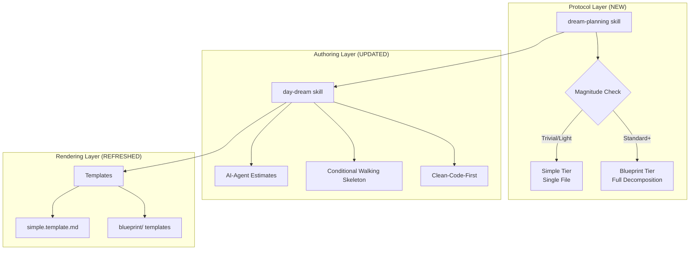
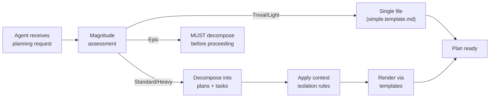

# 02 - Architecture

> Part of [DREAM Upgrade Blueprint](./00_index.md)

---

## 📖 The Story

### 😤 The Pain

```
Current Reality:
┌──────────────────────────────────────────────────────────────────┐
│  day-dream skill  ──►  Templates  ──►  Blueprint files           │
│                                                                  │
│  Problem: Skill has ONE path (always Blueprint tier)             │
│  Problem: No decomposition protocol for complex plans            │
│  Problem: Templates echo same data across multiple files         │
│  Problem: No isolation rules for parallel agent work             │
└──────────────────────────────────────────────────────────────────┘
```

| Who Hurts | Pain Level | Frequency |
|-----------|------------|-----------|
| HyperDream (planning agent) | 🔥🔥🔥 High | Every complex plan |
| Parallel subagents | 🔥🔥🔥 High | Every decomposed task |

### ✨ The Vision

```
After DREAM Upgrade:
┌──────────────────────────────────────────────────────────────────┐
│  dream-planning skill (protocol)                                 │
│       │                                                          │
│       ├── Magnitude check → Simple tier OR Blueprint tier        │
│       ├── Decomposition rules (plan/task hierarchy)              │
│       └── Context isolation (sibling firewall)                   │
│                                                                  │
│  day-dream skill (authoring)                                     │
│       │                                                          │
│       ├── Fixed estimates (AI-agent time)                        │
│       ├── Conditional walking skeleton                           │
│       └── Clean-code-first directive                             │
│                                                                  │
│  Templates (passive scaffolds)                                   │
│       └── Render plans/tasks, don't define protocol              │
└──────────────────────────────────────────────────────────────────┘
```

### 🎯 One-Liner

> Two skills (protocol + authoring) backed by passive templates, with magnitude-gated structure and context isolation.

---

## 🔧 The Spec

---

## 🏗️ System Overview

### High-Level Architecture



---

## 📊 Data Flow

### Planning Decision Flow



| Stage | Input | Transformation | Output | Owner |
|-------|-------|----------------|--------|-------|
| Magnitude assessment | Task description | Classify complexity | Tier decision | `dream-planning` skill |
| Decomposition | Complex task | Break into plan/task tree | Structured hierarchy | `dream-planning` skill |
| Context isolation | Plan tree | Apply sibling firewall rules | Isolated work units | `dream-planning` skill |
| Authoring | Isolated units | Apply estimation + directives | Blueprint docs | `day-dream` skill |
| Rendering | Authored content | Fill template sections | Final .md files | Templates |

---

## 🧩 Logical Components

### `dream-planning` Skill (NEW)

| Attribute | Value |
|-----------|-------|
| **Purpose** | Decomposition protocol — teaches agents how to break work into plans and tasks |
| **Boundary** | Owns: magnitude routing, plan/task terminology, context isolation, sibling firewall. Does NOT own: file formatting, template structure, status syntax |
| **Implemented By** | `.github/skills/dream-planning/SKILL.md` |
| **Depends On** | Nothing (standalone protocol) |
| **Exposes** | Decomposition rules, magnitude scale, isolation constraints |

### `day-dream` Skill (UPDATED)

| Attribute | Value |
|-----------|-------|
| **Purpose** | Blueprint authoring rules — how to write planning documents |
| **Boundary** | Owns: template selection, Story/Spec pattern, status markers, line limits, estimation defaults, walking skeleton policy, backward compat directive. Does NOT own: decomposition protocol |
| **Implemented By** | `.github/skills/day-dream/SKILL.md` |
| **Depends On** | `dream-planning` for tier routing decisions |
| **Exposes** | Authoring rules, validation checklists, template catalog |

### Templates (REFRESHED)

| Attribute | Value |
|-----------|-------|
| **Purpose** | Passive rendering scaffolds — provide structure for plan/task documents |
| **Boundary** | Owns: section layout, placeholder text. Does NOT own: any protocol rules or authoring decisions |
| **Implemented By** | `instruction_core/data/.agent_plan/day_dream/_templates/` |
| **Depends On** | `day-dream` skill for authoring rules |
| **Exposes** | Template files (simple, blueprint, asset) |

---

## 🔑 Key Design Principles

| # | Principle | Implication |
|---|-----------|-------------|
| 1 | **Skill is authority, template is scaffold** | Protocol rules live in skills, never in template comments |
| 2 | **Single source of truth** | Each fact lives in one place; no echo across index/summary/feature |
| 3 | **Magnitude gates structure** | Complexity determines tier automatically; agents don't choose |
| 4 | **Context isolation enables parallelism** | Sibling firewall means subagents can work without coordination |
| 5 | **AI-agent time is the default** | Estimates assume agent speed; human tasks get explicit `human_only` flag |
| 6 | **Directory = plan, file = task, `_overview.md` = navigator** | Hierarchy via filesystem structure; mandatory `_overview.md` at every plan directory provides reading order and context |

---

## 📂 Blueprint Folder Structure Convention

Hierarchy in blueprints is expressed through the filesystem, not level numbers:

- **Directory = plan** — has children, always has `_overview.md`
- **File = task** — leaf, directly executable
- **`_overview.md` at every plan directory** — mandatory navigator providing big picture, children list, integration map, reading order

### Agent Protocol

> Enter directory → read `_overview.md` first → process children in stated order

### Example Structure

```
.agent_plan/day_dream/
└── blueprint/
    └── feature_name/                   ← plan (directory)
        ├── _overview.md                ← MANDATORY: purpose, children, integration map, reading order
        ├── assets/                     ← shared mockups, diagrams
        │
        ├── subsystem_a/               ← child plan (directory)
        │   ├── _overview.md            ← subsystem_a's big picture
        │   ├── task_one.md             ← task (leaf — executable)
        │   └── task_two.md             ← task (leaf — executable)
        │
        ├── subsystem_b/               ← child plan
        │   ├── _overview.md
        │   └── some_task.md            ← task
        │
        └── wiring_task.md             ← task (leaf — integration work)
```

### `_overview.md` Content Structure

```markdown
# {Plan Name}

## Purpose
What this plan is about and why it exists.

## Children
| Child | Type | Description |
|-------|------|-------------|
| subsystem_a/ | plan | Description |
| task_one.md | task | Description |

## Integration Map
How children connect and depend on each other.

## Reading Order
1. subsystem_a/ (independent)
2. subsystem_b/ (depends on a's API)
3. wiring_task.md (depends on both)
```

---

## 📁 Project Structure

```
.github/skills/
├── dream-planning/                   (P1 — NEW)
│   └── SKILL.md
├── day-dream/                        (P0/P1 — UPDATED)
│   └── SKILL.md
│
modules/dev/instruction_core/data/
└── .agent_plan/day_dream/_templates/  (P1 — REFRESHED)
    ├── simple.template.md
    └── blueprint/
        ├── overview.template.md             ← NEW: template for _overview.md
        ├── task.template.md                 ← template for leaf task files
        ├── 00_index.template.md
        ├── 01_executive_summary.template.md
        ├── ...
        └── NN_feature_simple.template.md
```

---

## 🔌 Integration Points

### Skill Cross-References

| Connection | Direction | Data | Protocol |
|------------|-----------|------|----------|
| `dream-planning` → `day-dream` | → OUT | Tier decision, magnitude | Skill references skill |
| `day-dream` → templates | → OUT | Authoring rules | Skill guides template usage |
| HyperDream agent → `dream-planning` | ← IN | Planning requests | Agent reads skill |
| HyperDream agent → `day-dream` | ← IN | Authoring guidance | Agent reads skill |

### File Formats

| Format | Used For | Schema Location |
|--------|----------|-----------------|
| SKILL.md | Skill definitions | `.github/skills/{name}/SKILL.md` |
| .template.md | Document scaffolds | `templates/` folder |
| _overview.md | Mandatory navigator at every plan directory — purpose, children list, integration map, reading order | Defined in `dream-planning` skill |
| plan.yaml | Plan metadata (inline frontmatter or standalone) | Defined in `dream-planning` skill |
| .task.md | Leaf task specifications | Defined in `dream-planning` skill |

---

## [Custom] ⚖️ Skill Boundary Contract

The two skills have a clear division of responsibility:

| Concern | Owner | NOT Owned By |
|---------|-------|-------------|
| "Should I decompose this?" | `dream-planning` | `day-dream` |
| "How do I write this document?" | `day-dream` | `dream-planning` |
| "Which template do I use?" | `day-dream` | `dream-planning` |
| "How do I isolate subagent work?" | `dream-planning` | `day-dream` |
| "What time estimate format?" | `day-dream` | `dream-planning` |
| "What's the plan/task hierarchy?" | `dream-planning` | `day-dream` |

---

**Prev:** [Executive Summary](./01_executive_summary.md) | **Next:** [Feature: Fix Estimation](./03_feature_fix_estimation.md)

---

**← Back to:** [Index](./00_index.md)
