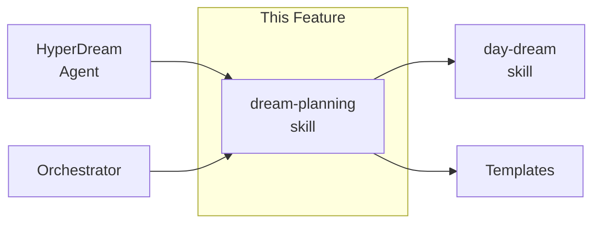
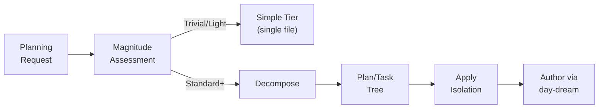

# 06 - Feature: DREAM Planning Skill

> Part of [DREAM Upgrade Blueprint](./00_index.md)

---

## 📖 The Story

### 😤 The Pain

```
Current Reality:
┌──────────────────────────────────────────────────────────────────┐
│  Agent gets complex task  ──►  💥 NO PROTOCOL 💥                 │
│                                                                  │
│  • No rules for breaking work into parallel subtasks             │
│  • No isolation — subagents step on each other's context         │
│  • No magnitude check — trivial tasks get same overhead as Epic  │
│  • "plan" vs "task" vs "node" vs "feature" — terminology chaos   │
└──────────────────────────────────────────────────────────────────┘
```

| Who Hurts | Pain Level | Frequency |
|-----------|------------|-----------|
| HyperDream (planning agent) | 🔥🔥🔥 High | Every complex plan |
| Orchestrator (routing agent) | 🔥🔥🔥 High | Every multi-agent dispatch |
| Subagents (parallel workers) | 🔥🔥 Medium | Context conflicts when parallel |

### ✨ The Vision

```
After This Feature:
┌──────────────────────────────────────────────────────────────────┐
│  Agent gets complex task  ──►  ✅ DREAM PROTOCOL                 │
│                                                                  │
│  1. Check magnitude → route to right tier                        │
│  2. Decompose into plans (containers) + tasks (leaves)           │
│  3. Apply sibling firewall — each subagent isolated              │
│  4. Execute in parallel where dependencies allow                 │
│  5. Parent integrates results                                    │
└──────────────────────────────────────────────────────────────────┘
```

### 🎯 One-Liner

> A new `dream-planning` skill that teaches agents the DREAM decomposition protocol: magnitude-gated structure, plan/task hierarchy, and context isolation for parallel work.

### 📊 Impact

| Metric | Before | After |
|--------|--------|-------|
| Decomposition protocol | ❌ None (ad-hoc) | ✅ Formal skill with rules |
| Parallel agent safety | ❌ Context conflicts | ✅ Sibling firewall |
| Structure selection | ❌ Always full blueprint | ✅ Magnitude-gated (simple or blueprint) |
| Terminology | ❌ "node", "feature", inconsistent | ✅ "plan" + "task", well-defined |

---

## 🔧 The Spec

---

## 🎯 Overview

The `dream-planning` skill is a new skill file that teaches AI agents the DREAM decomposition protocol. It is the single source of truth for:

1. **Magnitude routing** — how to assess complexity and pick the right planning tier
2. **Plan/task hierarchy** — terminology and rules for decomposable vs leaf units
3. **Context isolation** — sibling firewall rules for parallel subagent work
4. **Lifecycle** — how plans are decomposed, delegated, integrated, and reported

This skill wraps the best concepts from DREAM v3 (context isolation, sibling firewall, magnitude routing) while simplifying what doesn't fit (L0-L4 **numbering** replaced with directory-based hierarchy using mandatory `_overview.md`, separate node.yaml/contract.yaml merged, state machine tracking removed).

**Priority:** P1  
**Difficulty:** `[EXPERIMENTAL]`

---

## 📚 Prior Art

### Existing Solutions

| Solution | Type | Relevance | Status |
|----------|------|-----------|--------|
| DREAM v3 spec (internal) | Protocol spec | High | 🔧 Adapt |
| Current day-dream skill | Authoring guide | Medium | ✅ Adopt (keep for authoring) |
| Agent Skills standard (agentskills.io) | Skill format | High | ✅ Adopt (format) |

### Usage Decision

**Using:** DREAM v3 concepts (adapted)  
**How:** Cherry-pick context isolation, sibling firewall, magnitude routing, plan/task types. Discard L0-L4 levels, separate file schemas, state machine.  
**Why this over alternatives:** DREAM v3 was designed for this purpose; we're simplifying, not replacing.

### Build-vs-Adopt Justification

| Rejected Concept | Reason for Simplifying |
|-------------------|------------------------|
| L0-L4 level **numbering** | Directory-based hierarchy with mandatory `_overview.md` provides same context without rigid numbers |
| Separate node.yaml + contract.yaml | Single plan.yaml (or inline frontmatter) is sufficient |
| state/execution.json tracking | Agents report via status markers; no runtime tracking needed |
| DREAM_AGENT_CARD.md | Skill file serves this purpose |

---

## 🗺️ System Context



---

## 📊 Data Flow



| Stage | Format | Example |
|-------|--------|---------|
| Input | Task description | "Upgrade the planning system" |
| Magnitude | Classification | `Standard` → Blueprint tier |
| Output | Plan tree with isolation | Plan with 3 tasks, sibling firewall applied |

---

## [Custom] 📜 SKILL.md Content Outline

The `dream-planning` SKILL.md should contain these sections:

### 1. When to Use
- Agent receives a planning or decomposition request
- Task exceeds Trivial/Light magnitude
- Multiple subagents need to work in parallel

### 2. Terminology

| Term | Definition |
|------|-----------|
| **plan** | A decomposable unit — has children (plans or tasks). Represented as a **directory** with mandatory `_overview.md` |
| **task** | A leaf unit — directly executable, no children. Represented as a **file** (.md) |
| **_overview.md** | Mandatory file at every plan directory — purpose, children list, integration map, reading order |
| **magnitude** | Complexity classification: Trivial / Light / Standard / Heavy / Epic |
| **sibling firewall** | Rule: siblings never read/write each other's content |

### 3. Magnitude Routing

| Magnitude | Action | Structure |
|-----------|--------|-----------|
| Trivial | Execute immediately | No planning doc needed |
| Light | Execute directly | Optional simple plan file |
| Standard | Decompose if ≥3 subtasks | Blueprint tier |
| Heavy | SHOULD decompose | Blueprint tier |
| Epic | MUST decompose | Blueprint tier, mandatory decomposition |

### 4. Decomposition Protocol

```
1. ASSESS — Classify magnitude
2. DECOMPOSE — Break into plan/task tree (if Standard+)
3. ISOLATE — Apply sibling firewall to each branch
4. DELEGATE — Assign tasks to subagents with context boundaries
5. INTEGRATE — Parent collects results, resolves conflicts
6. REPORT — Mark plan as done
```

### 5. Context Isolation Rules

| Scope | What Agent Can See |
|-------|-------------------|
| Read | Own task, all ancestors, skill files |
| Write | Own task ONLY |
| Sibling status | Yes (via parent) |
| Sibling content | NO |

### 6. Directory-Based Hierarchy & `_overview.md` Convention

Hierarchy is expressed through the filesystem, not level numbers:

- **Directory = plan** — has children, always has `_overview.md`
- **File = task** — leaf, directly executable

**Agent protocol:** Enter directory → read `_overview.md` first → process children in stated order.

**`_overview.md` must contain:** Purpose, Children table (child name, type, description), Integration Map, Reading Order.

### 7. File Formats

- **_overview.md**: mandatory navigator at every plan directory
- **plan.yaml** (or inline YAML frontmatter in .md): metadata for plans
- **.task.md**: specification for leaf tasks
- Single file for Simple tier; folder with `_overview.md` for Blueprint tier

### 8. Anti-Patterns

| Don't | Do Instead |
|-------|------------|
| Siblings communicate directly | Route through parent's integrate phase |
| Epic-magnitude leaf tasks | Decompose into plan with children |
| Skip magnitude assessment | Always check magnitude first |

---

## 🔗 Integration Points

| Connects To | Direction | Data | Protocol |
|-------------|-----------|------|----------|
| `day-dream` skill | → OUT | Tier decision, terminology | Skill cross-reference |
| HyperDream agent | ← IN | Planning requests | Agent reads skill |
| Orchestrator | ← IN | Decomposition requests | Agent reads skill |
| Templates | → OUT | Structure decisions | Skill guides usage |

---

## 👥 User Stories

| As a... | I want to... | So that... |
|---------|--------------|------------|
| HyperDream agent | know when to decompose a task | I don't over-plan trivial work or under-plan complex work |
| Orchestrator | dispatch parallel subagents safely | subagents don't corrupt each other's context |
| Subagent | know my read/write boundaries | I can work without worrying about sibling interference |

---

## ✅ Acceptance Criteria

- [ ] `dream-planning` SKILL.md exists at `.github/skills/dream-planning/SKILL.md`
- [ ] SKILL.md follows Agent Skills standard (YAML frontmatter + body sections)
- [ ] Magnitude routing table with 5 levels and corresponding actions
- [ ] Decomposition protocol with 6 steps (ASSESS → REPORT)
- [ ] Context isolation rules with read/write visibility table
- [ ] Plan/task terminology defined with clear boundary
- [ ] Anti-patterns checklist with ≥5 entries
- [ ] Cross-references `day-dream` skill for authoring rules

---

## 🛠️ Technical Notes

### Constraints

- Must follow the Agent Skills standard format (see `writing-skills` skill)
- Must NOT duplicate authoring rules from `day-dream` — reference them
- Must be self-contained enough that an agent reading only this skill can decompose work

### Considerations

- The skill needs to be readable by agents that have never seen DREAM v3
- Keep the magnitude scale simple — 5 levels is enough
- Sibling firewall is the most valuable concept; make it prominent

---

## ⚠️ Edge Cases

| Scenario | Expected Behavior |
|----------|-------------------|
| Task is exactly at Trivial/Light boundary | Agent chooses lower (Trivial) — minimize overhead |
| Plan has only 1 child | Warn: probably should be a task, not a plan |
| Sibling needs data from another sibling | Route through parent; never direct access |
| Epic magnitude detected at task level | Refuse and escalate — must decompose first |
| Agent doesn't have decomposition capability | Execute as single task with note about ideal decomposition |

---

## ❌ Out of Scope

- Automated magnitude detection tooling
- Runtime state tracking (execution.json)
- L0-L4 level **numbering** (hierarchy is preserved via directory structure with `_overview.md`)
- DREAM_AGENT_CARD.md (skill file serves this purpose)
- Subagent spawning mechanics (that's orchestrator's job)

---

## 🔗 Dependencies

| Dependency | Status | Notes |
|------------|--------|-------|
| P0 fixes (features 03-05) | Pending | Skill should reference fixed estimation/compat rules |
| `writing-skills` skill | Done | Defines SKILL.md format |
| Agent Skills standard | Done | External format spec |

---

## 🖼️ Related Assets

N/A — No mockups or diagrams needed beyond what's in this document.

---

## ❓ Open Questions

- Should magnitude assessment be formalized as a checklist, or remain agent judgment?
- How detailed should plan.yaml frontmatter schema be in the skill?
- ~~How to express hierarchy without L0-L4 numbering?~~ **RESOLVED:** Directory = plan, file = task, mandatory `_overview.md` at every plan directory provides hierarchical context.

---

## ✅ Feature Validation Checklist

### Narrative Completeness
- [ ] **The Story** section clearly states user problem and value
- [ ] **Intent** is unambiguous to a non-technical reader
- [ ] **Scope** is explicitly bounded (Out of Scope section filled)

### Technical Completeness
- [ ] **Integration Points** table has all connections documented
- [ ] **Edge Cases** table covers failure scenarios
- [ ] **Dependencies** are listed with status
- [ ] **Acceptance Criteria** are testable (not vague)

### Linkage
- [ ] **Related module specs** link back to this feature
- [ ] **Assets** are linked if mockups/diagrams exist

---

**Prev:** [Fix Backward Compat](./05_feature_fix_backward_compat.md) | **Next:** [Update Day-Dream Skill](./07_feature_update_day_dream_skill.md)

---

**← Back to:** [Index](./00_index.md)
