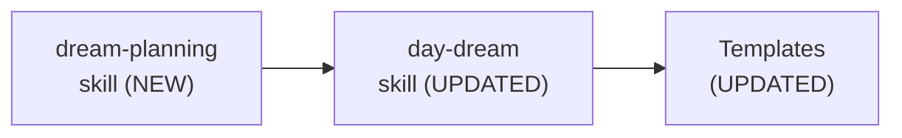

# 81 - Module Structure

> Part of [DREAM Upgrade Blueprint](./00_index.md)

---

## 📖 The Story

### 😤 The Pain

```
Current Reality:
┌──────────────────────────────────────────────────────────────────┐
│  "Where do the changes go?"  ──►  💥 CONFUSION 💥                │
│                                                                  │
│  This project modifies skills, templates, and instructions       │
│  — NOT Python modules. Standard module structure is misleading.  │
└──────────────────────────────────────────────────────────────────┘
```

| Who Hurts | Pain Level | Frequency |
|-----------|------------|-----------|
| Implementation agent (HyperArch) | 🔥🔥 Medium | At implementation start |

### ✨ The Vision

```
After Reading This Doc:
┌──────────────────────────────────────────────────────────────────┐
│  "Where do changes go?"  ──►  ✅ CLEAR MAP                       │
│                                                                  │
│  Skills: .github/skills/{name}/SKILL.md                          │
│  Templates: instruction_core/data/.agent_plan/day_dream/templates│
│  No new Python modules needed                                    │
└──────────────────────────────────────────────────────────────────┘
```

### 🎯 One-Liner

> No new modules — this project modifies skills and templates only, all within existing file locations.

---

## 🔧 The Spec

---

## 🏗️ ADHD Module Organization

### 📦 Reusable Modules

N/A — No new reusable modules. This project creates/updates skills and templates, which live outside the module system.

### 🎯 Project-Specific Modules

N/A — No new project-specific modules either.

### 📄 Files Modified (Not Modules)

| File Type | Path | Purpose | Phase |
|-----------|------|---------|-------|
| Skill (NEW) | `.github/skills/dream-planning/SKILL.md` | Decomposition protocol | P1 |
| Skill (UPDATE) | `.github/skills/day-dream/SKILL.md` | Authoring rules fixes | P0 + P1 |
| Template (UPDATE) | `instruction_core/data/.agent_plan/day_dream/templates/blueprint/00_index.template.md` | Planning standards | P1 |
| Template (UPDATE) | `instruction_core/data/.agent_plan/day_dream/templates/blueprint/80_implementation.template.md` | Duration + skeleton | P1 |
| Template (UPDATE) | `instruction_core/data/.agent_plan/day_dream/templates/blueprint/NN_feature.template.md` | Terminology | P1 |
| Template (UPDATE) | `instruction_core/data/.agent_plan/day_dream/templates/blueprint/NN_feature_simple.template.md` | Terminology | P1 |
| Template (NEW) | `instruction_core/data/.agent_plan/day_dream/templates/blueprint/overview.template.md` | `_overview.md` scaffold for plan directories | P1 |
| Template (NEW) | `instruction_core/data/.agent_plan/day_dream/templates/blueprint/task.template.md` | Leaf task file scaffold | P1 |

---

## 📂 File Tree (Changes Only)

```text
.github/skills/
├── dream-planning/               (P1 — NEW skill)
│   └── SKILL.md
└── day-dream/                    (P0/P1 — UPDATED skill)
    └── SKILL.md

modules/dev/instruction_core/data/
└── .agent_plan/day_dream/
    └── templates/blueprint/      (P1 — UPDATED templates)
        ├── overview.template.md              ← NEW: _overview.md scaffold
        ├── task.template.md                  ← NEW: leaf task scaffold
        ├── 00_index.template.md
        ├── 80_implementation.template.md
        ├── NN_feature.template.md
        └── NN_feature_simple.template.md
```

---

## � New Blueprint Folder Structure

This is how blueprint projects will be structured after the upgrade. The key changes are:
- **Directory = plan** (has children, always has `_overview.md`)
- **File = task** (leaf, executable)
- **`_overview.md` mandatory** at every plan directory

### Simple Tier (≤2 features, no decomposition)

```text
.agent_plan/day_dream/
└── my_small_feature.md          ← single file, done
```

### Blueprint Tier (Standard+ magnitude, full decomposition)

```text
.agent_plan/day_dream/blueprint/
└── feature_name/                   ← plan (directory)
    ├── _overview.md                ← MANDATORY: purpose, children, integration map
    ├── assets/                     ← shared mockups, diagrams
    │   └── flow_diagram.asset.md
    │
    ├── subsystem_a/               ← child plan (directory)
    │   ├── _overview.md            ← subsystem_a's big picture
    │   ├── task_one.md             ← task (leaf — executable)
    │   └── task_two.md             ← task (leaf — executable)
    │
    ├── subsystem_b/               ← child plan
    │   ├── _overview.md
    │   └── some_task.md            ← task
    │
    └── wiring_task.md             ← task (leaf — integration work)
```

### Agent Navigation Protocol

```
1. Enter directory
2. Read _overview.md  → understand purpose, children, integration
3. Process children in order specified by _overview.md
4. Recurse into child directories (repeat from step 1)
```

### `_overview.md` Content Structure

| Section | Purpose |
|---------|---------|
| **Purpose** | What this plan is about |
| **Children** | Table of child plans/tasks with descriptions |
| **Integration Map** | How children connect and depend on each other |
| **Reading Order** | Recommended sequence for processing children |

---

## �🔗 Module Dependencies

No module dependencies — this project operates entirely in the skills/templates layer.



---

## ✅ Module Structure Validation Checklist

### Completeness
- [x] **Reusable Modules** marked "N/A — No reusable modules"
- [x] **Project-Specific Modules** marked "N/A — Skills/templates only"
- [x] **File Tree** reflects target changes by phase

### Traceability
- [x] All modified files linked to their source features
- [x] Dependency diagram present and accurate

---

**← Back to:** [Index](./00_index.md)
