# 🎯 Instruction System Optimization: Project Blueprint

> *Taming context windows through intelligent instruction layering, budget-aware compilation, and platform-agnostic architecture*

**Document Type:** Technical Design Document / Project Blueprint  
**Version:** 1.0  
**Created:** 2026-02-09  
**Status:** 📐 Planning

---

## 📊 Progress Overview

| Phase | Status | Notes |
|-------|--------|-------|
| P0: Core Validation & Discovery | ⏳ | Line limits, token budgets, skill index, audit tool |
| P1: Platform & Versioning | ⏳ | VS Code profiles, flow fragment versioning |
| P2: Advanced Testing | ⏳ | Behavioral compliance testing |

### Status Legend

| Icon | Meaning |
|------|---------|
| ⏳ | TODO |
| 🔄 | WIP |
| ✅ | DONE |
| 🚫 | CUT |

---

## 📐 Planning Standards

This blueprint follows **HyperDream phasing rules**:

| Principle | Meaning |
|-----------|---------|
| **Walking Skeleton First** | Phase 0 proves plumbing works with hardcoded stubs |
| **Difficulty Honesty** | Each item labeled `[KNOWN]`, `[EXPERIMENTAL]`, or `[RESEARCH]` |
| **Research ≠ Foundation** | `[RESEARCH]` items never in Phase 0 |
| **Incremental Value** | Each phase delivers usable functionality |

---

## 📑 Document Index

| # | Document | Required | Purpose (When to Read) |
|---|----------|----------|------------------------|
| 00 | [Index](./00_index.md) | ✓ | **Navigation hub** — Start here if lost |
| 01 | [Executive Summary](./01_executive_summary.md) | ✓ | **Vision & scope** — Read to understand what/why |
| 02 | [Architecture](./02_architecture.md) | ✓ | **System design** — Read to understand how pieces fit |
| 03 | [Feature: Line Limit Enforcement](./03_feature_line_limit_enforcement.md) | ✓ | **P0** — Automated ≤100 line validation |
| 04 | [Feature: Token Budget Annotations](./04_feature_token_budget_annotations.md) | ✓ | **P0** — Declare token costs in fragments |
| 05 | [Feature: VS Code Platform Profiles](./05_feature_vscode_platform_profiles.md) | ✓ | **P0** — Platform-agnostic core schema |
| 06 | [Feature: Skill Discovery Index](./06_feature_skill_discovery_index.md) | ✓ | **P0** — Compiled SKILLS_INDEX.md manifest |
| 07 | [Feature: Instruction Audit Tool](./07_feature_instruction_audit_tool.md) | ✓ | **P0** — MCP/CLI for conflict detection |
| 80 | [Implementation](./80_implementation.md) | ✓ | **Task tracking** — Read to start/track work |

---

## 💭 Vision Statement

> *"Transform the ADHD Framework's instruction system from a context-hungry monolith into a lean, observable, budget-aware pipeline. Every instruction knows its cost, every conflict is detected before runtime, and platform-specific features stay cleanly separated from the portable core."*

---

## 🧭 How to Navigate This Blueprint

### Reading Order Decision Tree

```mermaid
flowchart TD
    START[📚 You are here] --> Q1{What do you need?}
    
    Q1 -->|"Understand the project"| PATH_UNDERSTAND
    Q1 -->|"Implement something"| PATH_IMPL
    Q1 -->|"Debug token issues"| PATH_DEBUG
    Q1 -->|"Review/approve"| PATH_REVIEW
    
    PATH_UNDERSTAND[🎯 Understanding Path]
    PATH_UNDERSTAND --> ES[01 - Executive Summary]
    ES --> ARCH[02 - Architecture]
    ARCH --> FEAT[Feature Docs 03-07]
    
    PATH_IMPL[🔧 Implementation Path]
    PATH_IMPL --> IMPL[80 - Implementation]
    IMPL --> F1[03 - Line Limits]
    F1 --> F2[04 - Token Budgets]
    
    PATH_DEBUG[🔍 Debug Path]
    PATH_DEBUG --> F5[07 - Audit Tool]
    F5 --> ARCH2[02 - Architecture]
    ARCH2 --> F3[06 - Skill Index]
    
    PATH_REVIEW[✅ Review Path]
    PATH_REVIEW --> ES2[01 - Executive Summary]
    ES2 --> IMPL2[80 - Implementation]
```

### Document Purpose Quick Reference

| Doc | When to Read | One-Line Purpose |
|-----|--------------|------------------|
| **00 - Index** | First visit, lost | Navigation hub, project overview |
| **01 - Exec Summary** | Deciding whether to work on this | Goals, non-goals, scope |
| **02 - Architecture** | Understanding system design | Components, data flow, boundaries |
| **03 - Line Limits** | Implementing P0 validation | Enforce ≤100 line compiled agents |
| **04 - Token Budgets** | Adding cost metadata | Token annotations in fragments |
| **05 - VS Code Profiles** | Platform separation | Core vs platform-specific schema |
| **06 - Skill Index** | Building discovery manifest | SKILLS_INDEX.md compilation |
| **07 - Audit Tool** | Building the inspector | MCP/CLI conflict detection |
| **80 - Implementation** | Starting work | Phased tasks, checklists |

---

## [Custom] 🎨 Feature Dependencies

---

**← Navigation:** [Executive Summary](./01_executive_summary.md) | [Implementation](./80_implementation.md)
