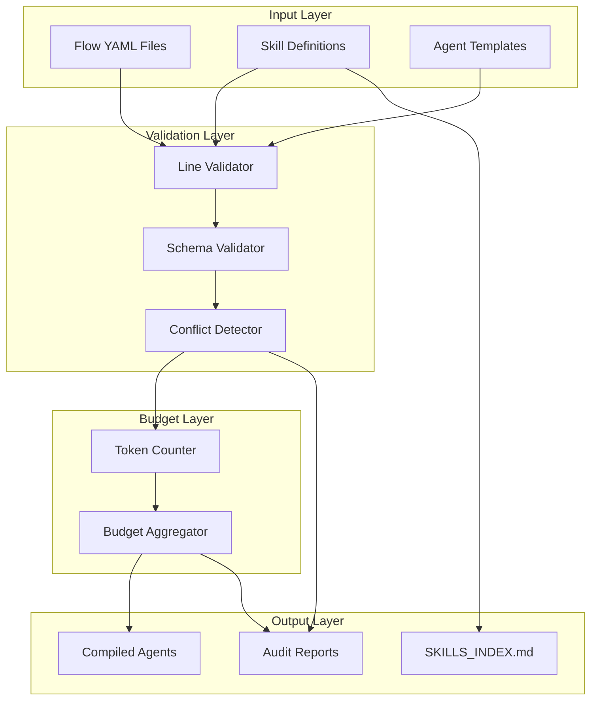
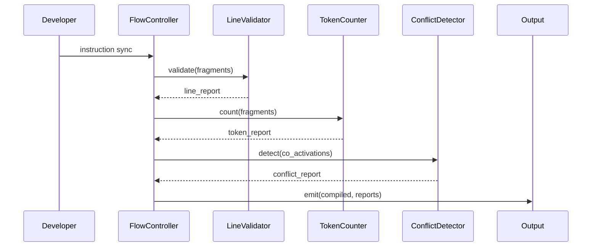

# 02 - Architecture

> Part of [Instruction System Optimization Blueprint](./00_index.md)

---

## 📖 The Story

### 😤 The Pain

```
Current Reality:
┌────────────────────────────────────────────────────────────────┐
│  instruction_controller.py  ──►  Compile  ──►  💥 BLACK BOX   │
│                                                                │
│  No visibility into: lines, tokens, conflicts, platform deps   │
└────────────────────────────────────────────────────────────────┘
```

| Who Hurts | Pain Level | Frequency |
|-----------|------------|-----------|
| FlowController (compilation) | 🔥🔥🔥 High | Every compile |
| InstructionController (sync) | 🔥🔥 Medium | On sync |
| ADHD MCP (debugging) | 🔥🔥🔥 High | On inspection |

### ✨ The Vision

```
After Feature:
┌────────────────────────────────────────────────────────────────┐
│  Sources  ──►  Validators  ──►  Budget Engine  ──►  ✅ EMIT   │
│                    │                 │                         │
│                    └── Line Check    └── Token Sum             │
│                    └── Conflict Det  └── Audit Report          │
└────────────────────────────────────────────────────────────────┘
```

### 🎯 One-Liner

> Layer validation and budget tracking into the compilation pipeline without breaking existing flows.

---

## 🔧 The Spec

---

## 🏗️ System Overview

### High-Level Architecture



---

## 📊 Data Flow



### Stage Details

| Stage | Input | Transformation | Output | Owner |
|-------|-------|----------------|--------|-------|
| Line Validation | Raw fragments | Count lines, check ≤100 | Pass/Fail + violations | `instruction_core/` |
| Token Counting | Fragments + annotations | Parse `<!-- tokens: -->`, sum | Budget map | `instruction_core/` |
| Conflict Detection | Co-activation sets | Find overlapping keys | Conflict list | `instruction_core/` |
| Skills Indexing | Skill YAML files | Extract metadata | SKILLS_INDEX.md | `instruction_core/` |
| Audit Reporting | All reports | Aggregate | JSON/CLI output | `adhd_mcp/` |

---

## 🧩 Logical Components

### LineValidator

| Attribute | Value |
|-----------|-------|
| **Purpose** | Enforce ≤100 line limit on compiled agent output |
| **Boundary** | Counts lines only; does not modify content |
| **Implemented By** | `instruction_core/validators/line_validator.py` |
| **Depends On** | None |
| **Exposes** | `validate(content: str) -> ValidationResult` |

### TokenBudgetEngine

| Attribute | Value |
|-----------|-------|
| **Purpose** | Parse token annotations, sum budgets, emit warnings |
| **Boundary** | Read-only analysis; modifying annotations is manual |
| **Implemented By** | `instruction_core/budget/token_counter.py` |
| **Depends On** | `tiktoken` (optional, for verification) |
| **Exposes** | `count(fragment: str) -> int`, `aggregate(fragments) -> BudgetReport` |

### ConflictDetector

| Attribute | Value |
|-----------|-------|
| **Purpose** | Detect conflicting instructions when multiple activate |
| **Boundary** | Reports only; resolution is human task |
| **Implemented By** | `instruction_core/audit/conflict_detector.py` |
| **Depends On** | Schema definitions |
| **Exposes** | `detect(activation_set) -> List[Conflict]` |

### SkillsIndexer

| Attribute | Value |
|-----------|-------|
| **Purpose** | Generate SKILLS_INDEX.md during instruction sync |
| **Boundary** | Reads skill files, writes single manifest |
| **Implemented By** | `instruction_core/indexers/skills_indexer.py` |
| **Depends On** | Skill YAML schema |
| **Exposes** | `build_index(skills_dir) -> str` |

### PlatformProfileManager

| Attribute | Value |
|-----------|-------|
| **Purpose** | Apply platform-specific schema extensions |
| **Boundary** | Validates profile against base schema |
| **Implemented By** | `instruction_core/profiles/vscode_profile.py` |
| **Depends On** | Base instruction schema |
| **Exposes** | `apply_profile(base, profile) -> ExtendedSchema` |

---

## 🔑 Key Design Principles

| # | Principle | Implication |
|---|-----------|-------------|
| 1 | **Validation Before Emission** | No output without passing all validators |
| 2 | **Budget Transparency** | Every fragment declares its token cost |
| 3 | **Platform Agnosticism** | Core schema has zero VS Code assumptions |
| 4 | **Non-Destructive Auditing** | Audit tool reports only; never modifies |
| 5 | **Incremental Adoption** | Each feature independent; no big-bang |

---

## 📁 Project Structure

```
instruction_core/
├── instruction_controller.py     (MODIFIED - P0)
├── validators/
│   └── line_validator.py         (NEW - P0)
├── budget/
│   └── token_counter.py          (NEW - P0)
├── audit/
│   └── conflict_detector.py      (NEW - P0)
├── indexers/
│   └── skills_indexer.py         (NEW - P0)
├── profiles/
│   └── vscode_profile.py         (NEW - P0)
└── data/
    ├── compiled/
    │   └── SKILLS_INDEX.md       (GENERATED - P0)
    └── schemas/
        ├── core.schema.json      (MODIFIED - P0)
        └── vscode.profile.json   (NEW - P0)
```

---

## 🔌 Integration Points

### Internal Modules

| Module | Integration | Purpose |
|--------|-------------|---------|
| `flow_core` | Import FlowController | Compile flows |
| `adhd_mcp` | MCP tool exposure | Audit tool CLI/MCP |
| `config_manager` | Config loading | Budget thresholds |

### File Formats

| Format | Used For | Schema Location |
|--------|----------|-----------------|
| YAML | Flow definitions | `flows/_lib/` |
| Markdown | Skills, agents | `data/skills/` |
| JSON | Schemas, profiles | `data/schemas/` |

---

**← Back to:** [Index](./00_index.md) | **Next:** [Feature: Line Limits](./03_feature_line_limit_enforcement.md)
