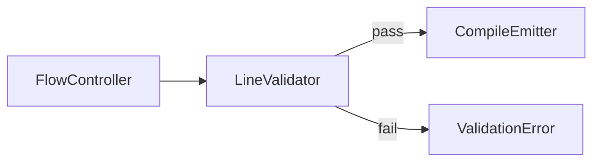
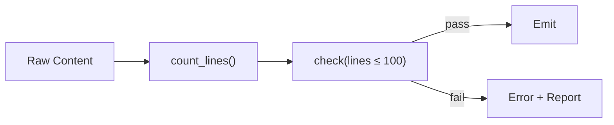

# 03 - Feature: Line Limit Enforcement

> Part of [Instruction System Optimization Blueprint](./00_index.md)

---

## 📖 The Story

### 😤 The Pain

```
Current Reality:
┌───────────────────────────────────────────────────────────────┐
│  Compiled agent  ──────►  💥 500+ LINES 💥                    │
│                                                               │
│  Because: No validation, no enforcement, silent bloat         │
└───────────────────────────────────────────────────────────────┘
```

| Who Hurts | Pain Level | Frequency |
|-----------|------------|-----------|
| AI Agent (context) | 🔥🔥🔥 High | Every request |
| Developer | 🔥🔥 Medium | On review |

### ✨ The Vision

```
After This Feature:
┌───────────────────────────────────────────────────────────────┐
│  Compile attempt  ──────►  Validator  ──────►  ✅/❌          │
│                                                               │
│  Flow: count_lines() → check(≤100) → emit OR fail            │
└───────────────────────────────────────────────────────────────┘
```

### 🎯 One-Liner

> Compiled agents must be ≤100 lines. Period. Validation at compile time, not runtime hope.

### 📊 Impact

| Metric | Before | After |
|--------|--------|-------|
| Agent line count | ❌ Unbounded (some 500+) | ✅ ≤100 enforced |
| Bloat detection | ❌ Manual review | ✅ Automated fail |

---

## 🔧 The Spec

---

## 🎯 Overview

Every compiled agent output must pass a line count validation during `instruction sync`. If an agent exceeds 100 lines, compilation fails with a clear error identifying the offending fragment(s).

**Priority:** P0  
**Difficulty:** `[KNOWN]`

---

## 📚 Prior Art

| Solution | Type | Relevance | Status |
|----------|------|-----------|--------|
| ESLint `max-lines` | Pattern | High | 🔧 Adapt concept |
| `wc -l` | Tool | Medium | ❌ Reject (no integration) |

**Build Justification:** Simple line counting is <50 lines. No external dep needed.

---

## 🗺️ System Context



---

## 📊 Data Flow



| Stage | Format | Example |
|-------|--------|---------|
| Input | Compiled markdown string | `"# Agent\n..."` |
| Output | ValidationResult | `{valid: false, lines: 127, limit: 100}` |

---

## [Custom] 🎨 Validation Logic

```python
# Pseudocode
def validate_line_limit(content: str, limit: int = 100) -> ValidationResult:
    lines = content.strip().split('\n')
    count = len(lines)
    return ValidationResult(
        valid=count <= limit,
        line_count=count,
        limit=limit,
        excess=max(0, count - limit)
    )
```

### Configuration

| Setting | Default | Override |
|---------|---------|----------|
| `line_limit` | 100 | `instruction_core.validation.line_limit` |
| `soft_warning` | 80 | Warn at 80%, fail at 100% |

---

## 👥 User Stories

### US-03.1: Compile-Time Validation

> **As a** developer compiling instructions  
> **I want** line limits enforced automatically  
> **So that** I catch bloat before it reaches production

**Acceptance Criteria:**
- [ ] `instruction sync` fails if any agent > 100 lines
- [ ] Error message shows agent name, line count, limit

### US-03.2: Warning Threshold

> **As a** developer  
> **I want** early warnings at 80 lines  
> **So that** I can proactively trim before hitting the hard limit

**Acceptance Criteria:**
- [ ] Warning logged when agent crosses 80 lines
- [ ] Compilation still succeeds (warning, not error)

---

## ✅ Acceptance Criteria

| ID | Criterion | Testable |
|----|-----------|----------|
| AC-03.1 | Agent > 100 lines → compilation fails | ✅ |
| AC-03.2 | Error message includes: agent name, actual count, limit | ✅ |
| AC-03.3 | Agent at exactly 100 lines → passes | ✅ |
| AC-03.4 | Warning at 80-99 lines, no failure | ✅ |
| AC-03.5 | Limit configurable via config_manager | ✅ |

---

## ⚠️ Edge Cases

| Case | Handling |
|------|----------|
| Empty content | Pass (0 lines ≤ 100) |
| Trailing newlines | Strip before count |
| Windows line endings (CRLF) | Normalize to LF first |
| Binary content | Reject with clear error |

---

## ❌ Out of Scope

| Exclusion | Reason |
|-----------|--------|
| Auto-fixing by removing content | Human judgment required |
| Per-agent custom limits | Keep it simple; one limit |
| Character limits | Lines are the metric |

---

## 🔗 Dependencies

| Dependency | Type | Required For |
|------------|------|--------------|
| `instruction_controller.py` | Modification | Hook validation into compile |
| `config_manager` | Read | Load limit from config |
| `logger_util` | Read | Warning/error logging |

---

**← Back to:** [Index](./00_index.md) | **Next:** [Token Budget Annotations](./04_feature_token_budget_annotations.md)
