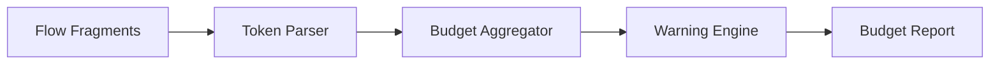
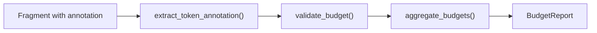

# 04 - Feature: Token Budget Annotations

> Part of [Instruction System Optimization Blueprint](./00_index.md)

---

## 📖 The Story

### 😤 The Pain

```
Current Reality:
┌───────────────────────────────────────────────────────────────┐
│  Fragments combine  ──────►  💥 CONTEXT OVERFLOW 💥           │
│                                                               │
│  Because: No one knows what each piece costs in tokens        │
└───────────────────────────────────────────────────────────────┘
```

| Who Hurts | Pain Level | Frequency |
|-----------|------------|-----------|
| AI Agent (out of context) | 🔥🔥🔥 High | When context full |
| Developer (debugging) | 🔥🔥🔥 High | Post-mortem |

### ✨ The Vision

```
After This Feature:
┌───────────────────────────────────────────────────────────────┐
│  <!-- tokens: ~150 -->  in every fragment                     │
│                                                               │
│  Budget engine: Σ(declared) → total cost → warning if > 70%  │
└───────────────────────────────────────────────────────────────┘
```

### 🎯 One-Liner

> Flow fragments and agents declare their token cost. Budget engine aggregates and warns before overflow.

### 📊 Impact

| Metric | Before | After |
|--------|--------|-------|
| Token cost visibility | ❌ Unknown | ✅ Every fragment annotated |
| Overflow prediction | ❌ Runtime surprise | ✅ Compile-time warning |

---

## 🔧 The Spec

---

## 🎯 Overview

Every flow fragment and instruction file declares its approximate token cost via a `<!-- tokens: ~N -->` annotation. The budget engine parses these, sums them during compilation, and emits warnings when thresholds are crossed.

**Priority:** P0  
**Difficulty:** `[KNOWN]`

---

## 📚 Prior Art

| Solution | Type | Relevance | Status |
|----------|------|-----------|--------|
| `tiktoken` | Library | High | ✅ Adopt for verification |
| Anthropic token counting | API | Medium | 🔧 Adapt for Claude |
| HTML comments | Pattern | High | ✅ Adopt for annotations |

**Using:** HTML comment annotation (`<!-- tokens: ~N -->`)  
**Why:** Non-intrusive, parseable, tool-agnostic

---

## 🗺️ System Context



---

## 📊 Data Flow



| Stage | Format | Example |
|-------|--------|---------|
| Input | `<!-- tokens: ~150 -->` | Embedded in fragment |
| Output | `BudgetReport` | `{total: 1250, threshold: 2000, status: OK}` |

---

## [Custom] 🎨 Annotation Syntax

### Format

```markdown
<!-- tokens: ~150 -->
```

### Rules

| Rule | Example | Notes |
|------|---------|-------|
| Must be first non-empty line OR within first 5 lines | Line 1-5 | Easy parsing |
| Tilde (`~`) required | `~150` not `150` | Signals approximation |
| Positive integer only | `~150` not `~150.5` | Simplicity |
| Missing annotation | `~0` assumed | Warning logged |

### Parsing Regex

```python
TOKEN_PATTERN = r'<!--\s*tokens:\s*~(\d+)\s*-->'
```

---

## [Custom] 📊 Budget Thresholds

```
┌─────────────────────────────────────────────────────────────┐
│  MODEL CONTEXT LIMITS (approximations)                      │
│                                                             │
│  Claude 3.5:   200K tokens context                         │
│  GPT-4o:       128K tokens context                         │
│                                                             │
│  THRESHOLDS:                                                │
│  • WARNING at 70% of context (e.g., 140K for Claude)       │
│  • ERROR at 90% of context (e.g., 180K for Claude)         │
│  • Buffer: 10% reserved for response generation            │
└─────────────────────────────────────────────────────────────┘
```

### Configuration

| Setting | Default | Override |
|---------|---------|----------|
| `context_limit` | 200000 | `instruction_core.budget.context_limit` |
| `warning_threshold` | 0.7 | `instruction_core.budget.warning_threshold` |
| `error_threshold` | 0.9 | `instruction_core.budget.error_threshold` |

---

## 👥 User Stories

### US-04.1: Declare Fragment Budget

> **As a** fragment author  
> **I want** to annotate token cost  
> **So that** the system can track cumulative usage

**Acceptance Criteria:**
- [ ] `<!-- tokens: ~150 -->` parsed from fragments
- [ ] Missing annotation logs warning, assumes `~0`

### US-04.2: Aggregate Budgets

> **As a** developer compiling an agent  
> **I want** total token cost calculated  
> **So that** I know if I'm approaching limits

**Acceptance Criteria:**
- [ ] All fragment budgets summed
- [ ] Total displayed in compilation output
- [ ] Warning at 70%, error at 90%

---

## ✅ Acceptance Criteria

| ID | Criterion | Testable |
|----|-----------|----------|
| AC-04.1 | Annotation parsed from first 5 lines | ✅ |
| AC-04.2 | Missing annotation → warning, `~0` assumed | ✅ |
| AC-04.3 | Total budget displayed in CLI output | ✅ |
| AC-04.4 | Warning at 70% threshold | ✅ |
| AC-04.5 | Error at 90% threshold | ✅ |
| AC-04.6 | Budget report exportable as JSON | ✅ |

---

## ⚠️ Edge Cases

| Case | Handling |
|------|----------|
| Multiple annotations | Use first, warn about duplicates |
| Invalid format (`tokens: 150`) | Treat as missing, warn |
| Negative number | Reject, error |
| annotations in YAML frontmatter | Parse from body, not frontmatter |

---

## ❌ Out of Scope

| Exclusion | Reason |
|-----------|--------|
| Auto-calculating tokens | Manual estimates; tiktoken for verification only |
| Per-model adjustment | Single estimate; model-specific comes later |
| Real-time tracking | Compile-time only for P0 |

---

## 🔗 Dependencies

| Dependency | Type | Required For |
|------------|------|--------------|
| `flow_core` | Read | Fragment parsing |
| `config_manager` | Read | Threshold config |
| `logger_util` | Read | Warning/error logging |
| `tiktoken` (optional) | Read | Verification only |

---

**← Back to:** [Index](./00_index.md) | **Next:** [VS Code Platform Profiles](./05_feature_vscode_platform_profiles.md)
